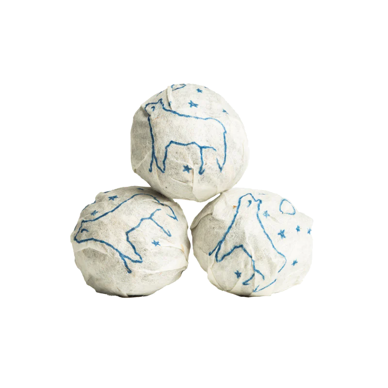

I recently tried the 2024 Moon Bear Minis from white2tea.

## Preparation

- **Temperature:** 205°F / 96°C
- **Time:** 15s, 25s, 30s, 40s, 45s, 60s
- **Tea Amount:** 7 g
- **Water Volume:** 3 oz / 100 mL

## Overview

The 2024 Moon Bear Minis started with light sweetness and citrusy notes but quickly turned overwhelmingly bitter, making it less enjoyable overall.

### Steepings

#### 1st Steep (205°F / 96°C, 15s)

Light but sweet, with some lemony undertones? Other than that, nothing too interesting about this first steep, very light color.

#### 2nd Steep (205°F / 96°C, 25s)

Nice and still, the citrusy taste is still pretty present. I admit this isn’t what I envisioned this to taste like.

#### 3rd Steep (205°F / 96°C, 30s)

Some mild bitterness is starting, but for now it’s not prevalent. The citrus notes now fuse with that bitterness, giving a well-dimensioned taste, although most is at the front.

#### 4th Steep (205°F / 96°C, 40s)

Not much difference to note.

#### 5th Steep (205°F / 96°C, 45s)

Now the bitterness is overwhelming, the citrus taste is gone.

#### 6th Steep (205°F / 96°C, 60s)

Completely bitter, gross.

## Overall Impression

The 2024 Moon Bear Minis began with an interesting citrusy sweetness but quickly devolved into overwhelming bitterness, making it a disappointing experience.

## Rating:

- **Flavor Complexity:** 5/30
- **Brewing Forgiveness:** 15/20
- **Quality Across Infusions:** 5/20
- **Overall Enjoyment:** 20/30

# 45/100

<mark>- yaro</mark>
