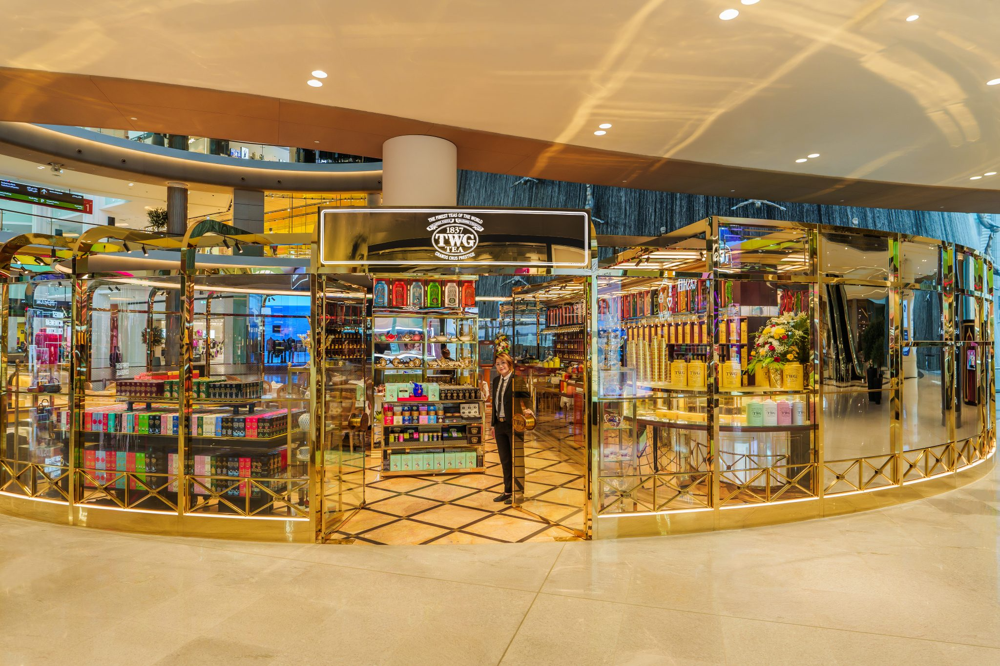
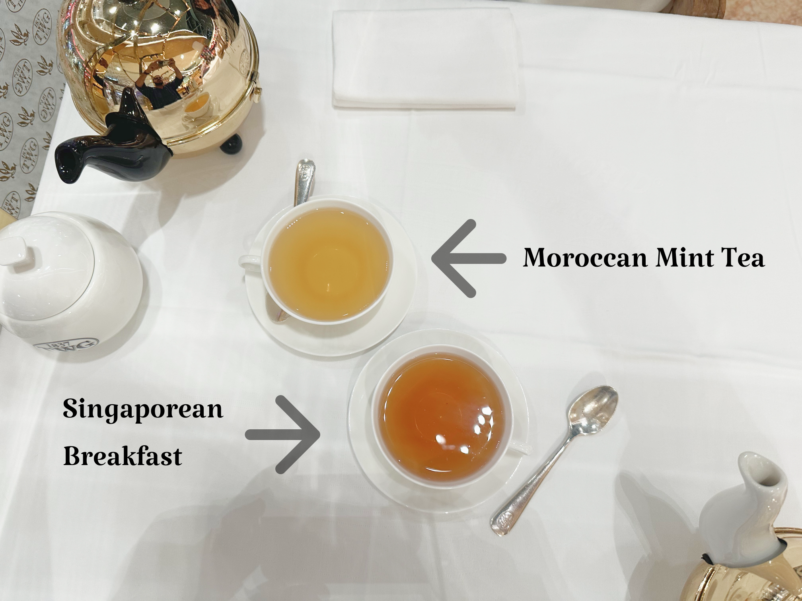
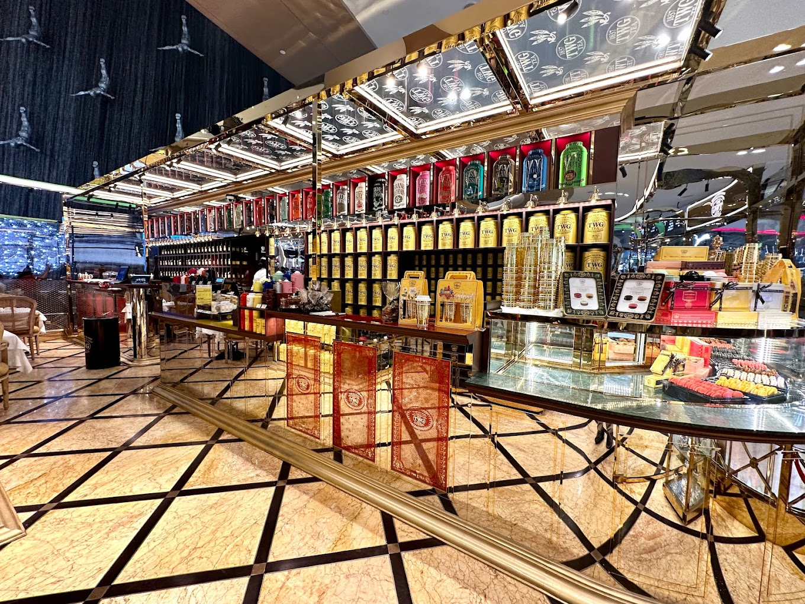

[TWG](https://twgtea.com), une marque de thé singapourienne, est souvent critiquée comme une imitation surévaluée de Mariage Frères. Certains amateurs de thé affirment que l'image luxueuse et les prétentions historiques de TWG sont exagérées. Bien que cette perspective ait du mérite, elle n'est pas entièrement exacte.

L'utilisation par [TWG](https://twgtea.com) de "1837" fait référence à l'ouverture du marché du commerce de Singapour, et non à la fondation de la marque en 2008. La ressemblance avec Mariage Frères, tant dans le langage que dans le design, est évidente, certains thés partageant même des noms (par exemple, [Sakura! Sakura!](https://www.reddit.com/r/tea/comments/1bzsg3x/whos_copying_who_now/)). De plus, les thés fortement parfumés de [TWG](https://twgtea.com) divisent souvent les opinions.

Fondée par [Manoj M. Murjani](https://www.linkedin.com/in/manoj-m-murjani-5010b098?originalSubdomain=sg), un Indien né à Hong Kong, et [Taha Bouqdib](https://www.linkedin.com/in/taha-bouqdib-a60856a/), un sommelier en thé franco-marocain, [TWG](https://twgtea.com) visait à combler une niche pour le thé de style français de luxe en Asie. L'identité diversifiée de Singapour et sa position stratégique en faisaient un lieu idéal.

[TWG](https://twgtea.com) se vante de sa réputation internationale, prétendant maîtriser les thés du monde entier. C'est une affirmation audacieuse, étant donné que de nombreuses maisons de thé asiatiques se spécialisent dans des types de thé spécifiques. Les marques européennes ayant des prétentions similaires m'ont souvent déçu. L'expression "Maître de rien" me vient à l'esprit en lisant leur longue liste de thés, me rappelant les thés excessivement artificiels du Palais des Thés — une expérience que je préfère ne pas revivre.

Avec cette réputation complexe en tête, ma première visite dans une boutique [TWG](https://twgtea.com) était teintée de faibles attentes. J'y suis allé avec ma copine, espérant qu'ils pourraient fournir une perspective impartiale sur le goût du thé.

## Arrivée à la Maison de Thé

J'ai visité la boutique de thé [TWG](https://twgtea.com) au [Dubai Mall](https://fr.wikipedia.org/wiki/Dubai_Mall), qui sert à la fois de maison de thé et de boutique. Les prix varient de 10 à 30 USD pour une théière de 400 mL. Après avoir été installés à côté de la fontaine, j'ai décidé de commander deux thés de manière stratégique, que je vais décrire dans ma critique.

## Premier Thé : Thé à la Menthe Marocaine

En tant que personne de la région, je connais bien le [thé marocain](https://blog.theteakitchen.com/tea-history-culture/the-history-of-moroccan-tea/). Ce thé servait de référence pour évaluer l'expertise de [TWG](https://twgtea.com).

La préparation traditionnelle du [thé marocain](https://blog.theteakitchen.com/tea-history-culture/the-history-of-moroccan-tea/) implique l'utilisation de [thé vert Gunpowder](https://fr.wikipedia.org/wiki/Th%C3%A9_Gunpowder) (ou [thé vert vietnamien](https://en.wikipedia.org/wiki/Vietnamese_tea) pour les thés royaux marocains), de menthe verte fraîche et d'une quantité importante de sucre. Le thé est infusé pendant longtemps, les feuilles étant d'abord lavées puis réinfusées avec de la menthe et du sucre. Le temps d'infusion varie de 5 à 15 minutes selon le thé et la région.

Verser le thé est également un processus complexe. Si le thé est trop chaud, il est versé d'une tasse à l'autre pour le refroidir.

L'idée du [thé marocain](https://blog.theteakitchen.com/tea-history-culture/the-history-of-moroccan-tea/) est d'être incroyablement rafraîchissant et sucré tout en maintenant un équilibre des saveurs. Maîtriser ce thé prend des années, surtout en tenant compte de la chaleur constante requise pendant l'infusion, difficile à reproduire sans outils spécialisés.

**Ma copine :** "C'est mentholé, avec juste une pointe de thé vert. Comme je ne suis pas fan du thé vert, je n'ai pas aimé l'amertume (probablement due à la base de Gunpowder). C'est correct mais pas exceptionnel."

**Moi :** Les notes de menthe dans ce thé étaient faibles, beaucoup plus subtiles que ce à quoi je suis habitué. Bien que le personnel ait initialement affirmé qu'il s'agissait de thé vert vietnamien, je soupçonnais qu'il s'agissait de Gunpowder classique, ce qui a été confirmé par la suite. Avec du sucre ajouté, le thé devenait plutôt intéressant. En tant que Marocain familier du thé à la menthe, j'ai trouvé la saveur un peu trop douce mais j'ai apprécié l'équilibre. La préparation était bien exécutée, bien que l'infusion ait été assez légère.

## Deuxième Thé : Singapore Breakfast

Le Singapore Breakfast est un incontournable de la gamme [TWG](https://twgtea.com), créé pour représenter l'identité diversifiée de la ville-état : malaise, indienne et chinoise, avec des notes d'épices, de malt et d'agrumes.

**Ma copine :** "C'est un thé noir avec le goût amer typique. Ce n'est pas génial, presque comme de la cannelle avec des épices. L'odeur est parfumée, mais je n'ai pas ressenti de vanille. Le thé ne reste pas longtemps en bouche — c'est juste un thé noir standard. Peut-être qu'il serait meilleur avec quelque chose de sucré à côté, puisque c'est un thé de petit déjeuner."

**Moi :** Ce thé avait un goût semblable à un thé noir Assam, avec une qualité parfumée rappelant celle du Palais des Thés. L'écorce d'agrumes et les épices apportaient du corps, accompagnés d'une légère note de fruit rouge. Je n'ai initialement pas détecté de cannelle ou de vanille, mais l'ajout de sucre (que je fais rarement) a fait ressortir la fruité du thé et a rendu la cannelle plus apparente.

C'est un thé déroutant mais assez unique. Les thés qui s'améliorent avec du sucre sont rares, et ces thés de [TWG](https://twgtea.com) se sont démarqués à cet égard — bien que pas nécessairement de manière positive.

## Thé en Vrac

Une grande partie du magasin était dédiée à la vente de thé en vrac avec un minimum de 50g. J'ai goûté un agréable thé à la réglisse pour environ 0,20 $/g, ainsi qu'un impressionnant [Da Hong Pao](https://fr.wikipedia.org/wiki/Da_Hong_Pao) (bien que trop cher). La garantie de son authenticité m'a convaincu, et dans l'ensemble, ce n'était pas une expérience excessivement coûteuse compte tenu de la [ville](https://fr.wikipedia.org/wiki/Duba%C3%AF).

## Conclusion

Dans l'ensemble, [TWG](https://twgtea.com) est une amélioration par rapport à Palais des Thés. Une marque qui prétend à la haute qualité et au luxe doit être jugée en conséquence.

Le thé était bon et bien équilibré, avec une préparation satisfaisante. L'eau n'était pas trop dure, et il n'y avait pas d'amertume excessive dans le thé, mais la saveur manquait de rondeur et était plus concentrée sur l'avant de la langue.

Une grande partie des saveurs, en particulier dans le thé Singapore Breakfast, nécessitait du sucre pour se révéler. Bien que cela soit généralement un inconvénient pour les thés de haute qualité, le sucre est souvent attendu dans les thés du petit déjeuner dans le monde occidental. Le [thé marocain](https://blog.theteakitchen.com/tea-history-culture/the-history-of-moroccan-tea/) était une agréable surprise, meilleur que dans de nombreux restaurants marocains que j'ai visités. Cela peut être attribué à l'expertise de [Taha Bouqdib](https://www.linkedin.com/in/taha-bouqdib-a60856a/), sommelier en thé franco-marocain, qui a probablement créé une recette permettant une infusion rapide tout en préservant le goût du [thé marocain](https://blog.theteakitchen.com/tea-history-culture/the-history-of-moroccan-tea/).

Ce fut une bonne expérience dans l'ensemble. L'atmosphère était agréable, et bien que les thés puissent être trop chers, ils ne l'étaient pas de manière injustifiée. J'ai payé 10 $ pour chaque thé, et je ne paierais pas plus.

Je n'ai pas encore essayé leurs thés purs, mais leurs mélanges pour le petit déjeuner étaient suffisamment impressionnants pour que je recommande cet endroit pour une petite pause matinale avant le travail. J'espère juste que [TWG](https://twgtea.com) pourra se construire une solide réputation sans s'appuyer trop fortement sur des comparaisons avec Mariage Frères.

Merci de m'avoir lu !

<mark>- yaro</mark>
