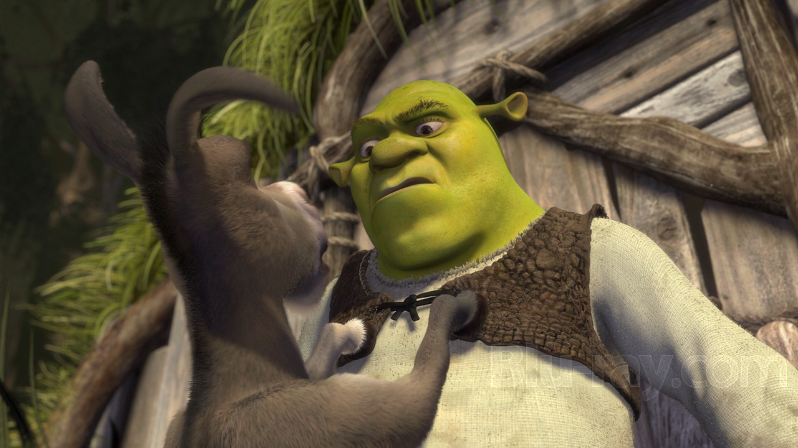
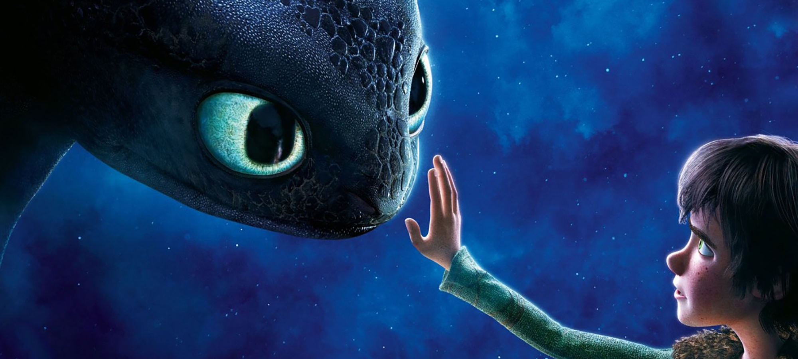
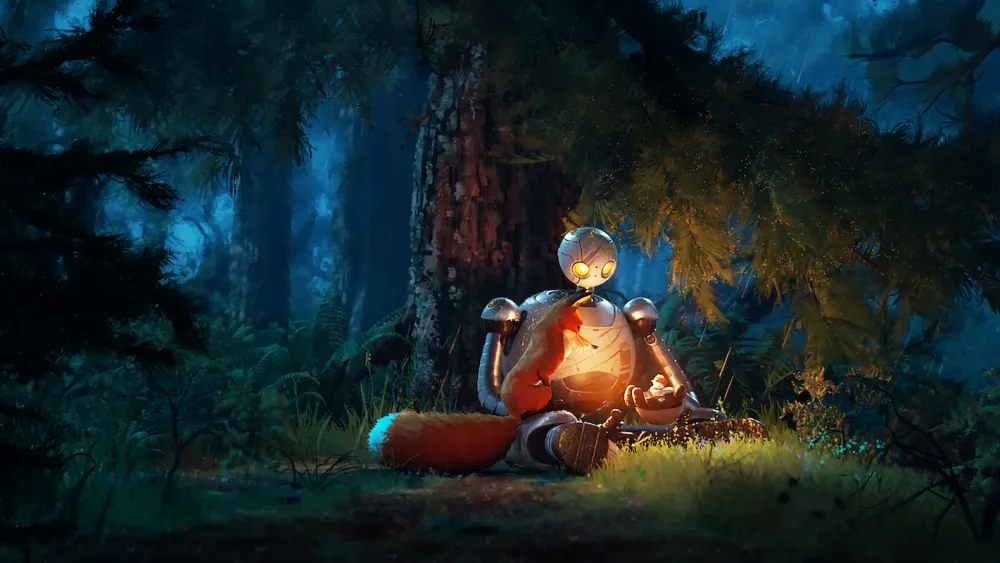
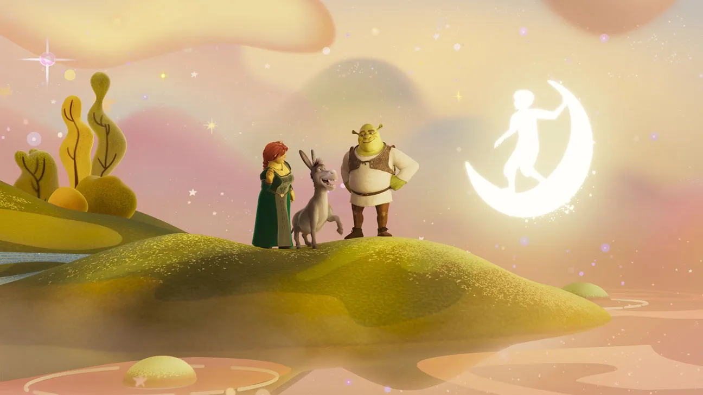

While [Disney](https://www.vulture.com/2019/07/disney-remakes-box-office-nostalgia.html) has sunk into the trap of nostalgia, churning out uninspired remakes, [DreamWorks](https://en.wikipedia.org/wiki/DreamWorks_Animation) has long been the industry’s rebel, breaking the rules. But can this rebellious streak still ignite innovation in an increasingly saturated market?

## The Anti-Hero: [Shrek](https://en.wikipedia.org/wiki/Shrek)  

In 2001, *[Shrek](https://en.wikipedia.org/wiki/Shrek)* didn’t just challenge Disney, it obliterated their formula. Gone were the neatly packaged princess tales. *Shrek* gleefully tore down these conventions, ridiculing them with a razor-sharp wit and a healthy dose of pop culture references. This wasn’t just a jab at Disney; it was a cultural revolution. The anti-hero took the crown, and the fairytale purity was forever tarnished.

But in toppling Disney, DreamWorks fell into its own trap: a formula just as easy to exploit. <mark>By flipping the script, *Shrek* inadvertently laid the foundation for the same lazy repetition it initially mocked.</mark> The sequels spiraled into redundancy, leaning heavily on pop culture gags and losing the bite of the original. DreamWorks shook Disney's castle walls, but at what cost? The bite of the ogre dulled with each new installment, sliding into commercial exploitation.

## Technical Brilliance: [*How to Train Your Dragon*](https://en.wikipedia.org/wiki/How_to_Train_Your_Dragon)  

With *[How to Train Your Dragon](https://en.wikipedia.org/wiki/How_to_Train_Your_Dragon)*, DreamWorks showed that it wasn't just about subversion, but could go toe-to-toe with Pixar in terms of technical mastery. The flight scenes didn’t just impress—they redefined what animation could achieve in terms of fluidity and emotional depth.

But as breathtaking as the visuals are, the film remains shackled to familiar tropes. <mark>Despite its stunning beauty, *Dragons* remains trapped by overused themes of self-acceptance and rebellion against authority.</mark> DreamWorks can push technical boundaries, but it struggles to break free from narratives we’ve seen before, limiting its emotional impact.

## Stylistic Reinvention: [The Last Wish](https://en.wikipedia.org/wiki/Puss_in_Boots:_The_Last_Wish)  

Let’s turn to *[Puss in Boots: The Last Wish](https://en.wikipedia.org/wiki/Puss_in_Boots:_The_Last_Wish)*. Far from being just another animated feature, it marks a turning point where DreamWorks proves it can embrace modern animation trends and surpass them. Some might say *The Last Wish* follows in the footsteps of *Spider-Man: Into the Spider-Verse*, but they fail to see just how much more DreamWorks is doing. The stylized, painterly animation is stunning, <mark>but it’s the writing that truly shines.</mark>

This is not your typical story. <mark>The film tackles weighty themes like mortality and vulnerability.</mark> The seamless blend of art and emotion signals DreamWorks’ maturation. The illustrative style doesn’t simply follow a trend, but serves to tell a story that dares to confront the passage of time, the burden of choices, and the fear of death. *The Last Wish* proves DreamWorks can still go toe-to-toe with the best of Western animation, both in technique and storytelling.

## Introspection: [The Wild Robot](https://en.wikipedia.org/wiki/The_Wild_Robot)  

With *[The Wild Robot](https://en.wikipedia.org/wiki/The_Wild_Robot)*, DreamWorks attempts something radically different, evoking the spirit of Pixar’s golden years. Originally conceived as a film without dialogue, entirely reliant on visual storytelling, it seemed poised to push the boundaries of cinematic language. But after test screenings, this bold ambition was sacrificed in favor of a safer, more conventional approach. <mark>The film exposes DreamWorks’ ongoing struggle between artistic audacity and commercial safety.</mark>

What could have been revolutionary is instead held back by caution. DreamWorks once again chose to play it safe, rather than fully commit to its most daring ideas. *The Wild Robot* is visually impressive, no doubt, but it’s a reminder that the studio has yet to fully embrace the creative risks necessary to reach the heights of its rivals.

## Conclusion: [DreamWorks](https://en.wikipedia.org/wiki/DreamWorks_Animation) and Its Future  

[DreamWorks](https://en.wikipedia.org/wiki/DreamWorks_Animation), despite its occasional missteps and periods of stagnation, has proven it can still produce films that leave a mark. But the question remains: does the studio have the will to continue pushing boundaries, or will it succumb to the very formulaic traps it once rebelled against? <mark>If DreamWorks is to survive and thrive, it must innovate not just in technique, but in its storytelling.</mark> Otherwise, it risks becoming the very machine of repetition it once sought to overthrow.

<mark>- yaro</mark>
