Un bruit statique, des câbles entrelacés comme des veines parcourant une ville vide. Un monde déconnecté, où <mark>réalité et virtualité</mark> se confondent, se superposent. Là, seule dans sa chambre, Lain observe. Chaque écran devient une fenêtre sur un espace où <mark>l’identité se fragmente</mark>, où la présence humaine se dilue. Elle se perd dans le Wired, où chaque connexion semble éroder un peu plus son existence.

La ville respire, ses structures <mark>froides et immenses</mark> se dressent comme des témoins silencieux de son errance. Dans chaque recoin, le réel devient flou, le familier se tord sous le poids de l’étrange. Les rues, autrefois passages, ne sont plus que des labyrinthes sans fin. <mark>Lain, une ombre dans ce paysage, se dissout.</mark>

Dans Serial Experiments Lain, chaque fil qui relie est aussi une corde qui étrangle. C’est un voyage vers une dissolution totale, où la quête d'identité se heurte à l’immensité d’un monde <mark>hyperconnecté mais vide</mark>, où chaque connexion éloigne un peu plus de soi-même.

## I. La ville comme espace d'aliénation et de confusion identitaire

### La dérive urbaine : Lain perdue dans son environnement

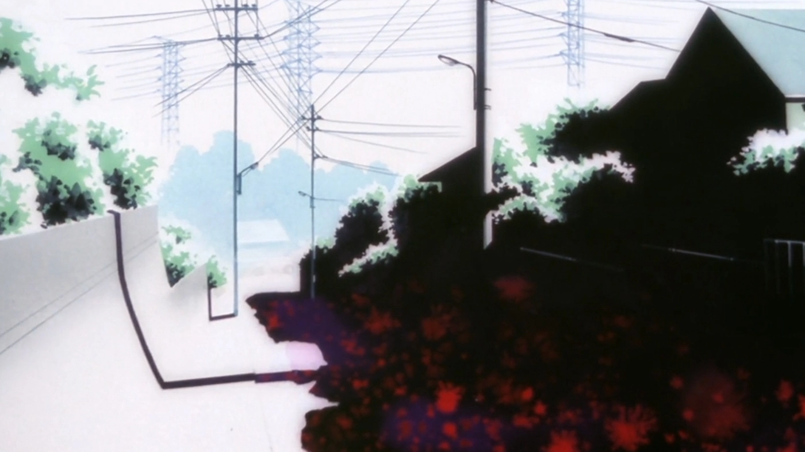

Lain évolue dans un environnement urbain profondément hostile et aliénant. Les rues désertes, les immeubles gigantesques, et l’absence presque totale de vie humaine créent un cadre où Lain, à la fois spectatrice et actrice, se dissout progressivement. Cette ville n’est pas simplement un décor ; elle agit comme une métaphore visuelle de la perte de repères, où Lain erre, sans jamais vraiment savoir où elle va ni qui elle est. <mark>La ville incarne une absence de lieu</mark>. Le caractère vide et silencieux de ces espaces crée une tension entre le réel et le virtuel, entre la vie humaine et une architecture devenue oppressante, où l’individu se sent de plus en plus étranger à lui-même.

Dans cet environnement, Lain n'est jamais connectée à un lieu particulier. Elle se déplace sans but, mais ces déplacements ne lui offrent aucune réconciliation avec elle-même. Ce phénomène est amplifié par l'esthétique visuelle de la série, qui joue avec des perspectives distordues, des angles de vue vertigineux et une palette de couleurs froides. Ces choix de mise en scène accentuent l’idée d’une ville qui dévore progressivement ceux qui s’y perdent, <mark>un espace de désorientation totale où l’identité se dissout</mark>.

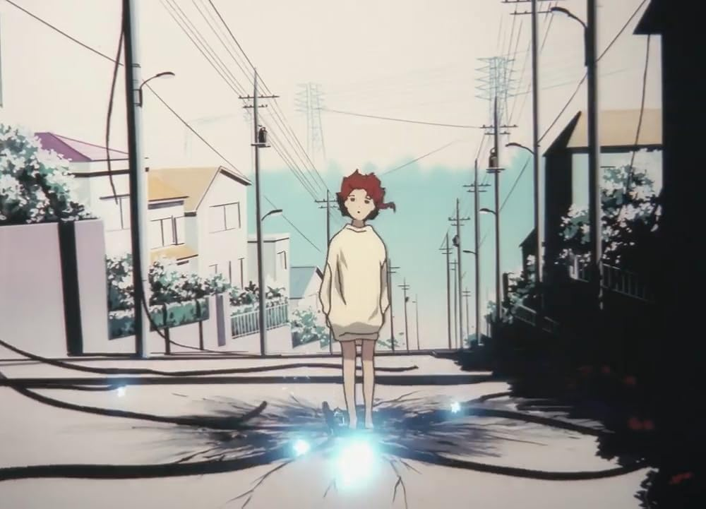

Ce processus d’errance urbaine correspond à une notion centrale en psychanalyse : le concept <mark>d’Unheimlich, l’étrangeté familière.</mark> La ville, pourtant un lieu commun et banal, devient pour Lain un espace étranger, menaçant, un espace où l’habituel se retourne contre elle et prend une dimension inquiétante. Cette dissociation se reflète dans la manière dont Lain perçoit son environnement. Plus elle s’immerge dans le Wired, plus la ville perd sa familiarité et devient un territoire d’angoisse, un non-lieu où le familier se déforme.

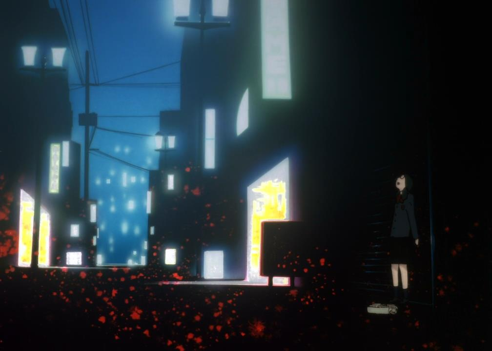
> <mark>"Qu'importe ou tu vas, tout le monde est connecté."</mark>

Freud décrit l’Unheimlich comme <mark>ce moment où ce qui devrait être intime et familier devient dérangeant, voire effrayant.</mark> C’est exactement ce que vit Lain dans la série : sa maison, sa chambre, et même les rues qu’elle parcourt deviennent des espaces où elle n’a plus de place. Elle n’a plus de cadre de référence stable, comme si l’espace physique lui-même l’expulsait. Ce déracinement spatial représente le début de sa désintégration identitaire, un processus dans lequel Lain ne se reconnaît plus dans le monde qui l'entoure, ni dans son propre reflet.

Ce lien omniprésent, qui est censé unir les êtres humains, devient pour Lain un fardeau. En dépit de la promesse de connexion offerte par la technologie, elle se retrouve plus déconnectée que jamais, tant de son environnement que d’elle-même.

### Le Wired comme miroir déformant de la réalité

Si la ville représente l’espace de l’errance physique, le Wired devient le miroir déformant de cette errance. Le Wired est autant un monde virtuel qu'un espace où Lain se confronte à des versions multiples et contradictoires d’elle-même. Ce n’est plus une question de lieu, mais une question de perception de soi. Dans le Wired, Lain n'est plus une mais plusieurs. Elle est à la fois elle-même et une entité omniprésente, ce qui fragmente son identité et la plonge dans une spirale d'auto-questionnement.

<mark>Le Wired est, en un sens, un prolongement de la ville.</mark> Tout comme la ville aliénante dans laquelle elle se perd, le Wired est un espace où l'identité est fluidifiée, déformée, incapable de rester intacte. Pour Lain, l'entrée dans le Wired n’est pas une simple immersion dans un autre monde ; c’est une confrontation directe avec la désintégration psychologique. Elle se voit confrontée à des versions de plus en plus dérangeantes d’elle-même, qui ne cessent de révéler à quel point son moi est fragmenté. Cette dissolution du moi rappelle les théories psychanalytiques de Jacques Lacan, notamment l’idée que l’ego se construit à travers des miroirs déformants — ici, le Wired devient ce miroir.

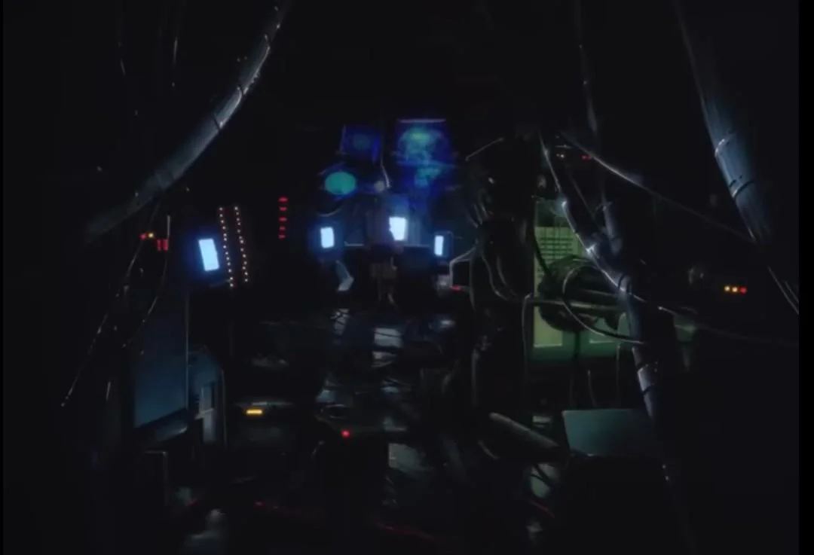

Lain est ainsi prise dans un double processus d'effacement. Dans la ville, elle se perd physiquement, et dans le Wired, elle se perd mentalement. Les deux espaces se répondent, formant un cycle où la perte de repères et la dissolution de l'identité deviennent inévitables. Ce que le Wired révèle, c'est l'incapacité de Lain à trouver une stabilité dans son propre moi, une crise existentielle qui trouve son apogée dans sa confrontation avec ses avatars multiples.

Le Wired agit comme une projection de l’inconscient de Lain. Dans cet espace virtuel, ses peurs, ses désirs et ses contradictions refont surface, non pas sous forme de symboles, mais de réalités tangibles et interactives. <mark>Ce qui devrait rester caché ou intériorisé dans l’inconscient s'extériorise brutalement dans le Wired, brouillant définitivement la frontière entre intérieur et extérieur, réel et imaginaire.</mark>

## II. Dépersonnalisation et dissolution du moi

### La fragmentation de l'identité

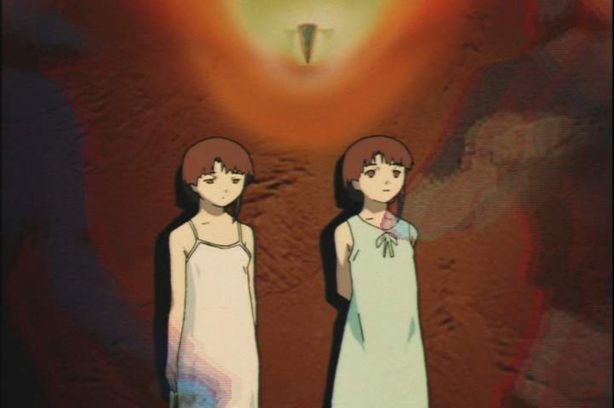

Dans Serial Experiments Lain, Lain ne subit une véritable fragmentation quantifiable de son identité. Cette fragmentation s’exprime à travers ses interactions dans le Wired, où elle rencontre diverses versions d’elle-même. Chaque version représente une facette différente de son moi : la Lain timide, la Lain omnisciente du Wired, la Lain sociale. Ce processus est autant technologique que psychologique. <mark>L’identité de Lain ne cesse de se déconstruire</mark> au fur et à mesure qu’elle plonge dans cet univers numérique.

Lacan définit l’identité à travers le concept de "stade du miroir", où l’individu se forme en fonction de la perception qu’il a de lui-même dans le regard des autres ou à travers des représentations extérieures. Dans le cas de Lain, ce miroir est déformé par le Wired, un espace où elle est confrontée à des "reflets" d’elle-même qui ne lui appartiennent plus. La dissolution du moi devient alors inévitable : Lain perd tout point d’ancrage dans la réalité et son identité se fragmente en une série de représentations floues et contradictoires.

> <mark>"Qui es-tu? Qui suis-je?"</mark>

Cette interrogation répétée de Lain tout au long de la série est l’expression ultime de cette perte d’identité. Elle n’arrive plus à se reconnaître, ni dans le monde réel ni dans le Wired, ce qui symbolise une déconnexion totale entre son moi interne et le monde extérieur​

Dans le Wired, Lain devient un objet de manipulation. Sa réalité et son identité ne sont plus sous son contrôle ; elles sont reconfigurées par les règles du Wired et par les autres entités qui peuplent cet univers numérique. Chaque nouvelle interaction avec ce monde renforce sa désorientation, et elle n’a plus la possibilité de maintenir une continuité dans son identité. Cet éclatement progressif peut être interprété comme un reflet du phénomène de <mark>"désintégration psychique"</mark>, où l'individu perd la cohérence de son être face à des forces qui le dépassent.

### La dépersonnalisation comme méchaniisme de défense

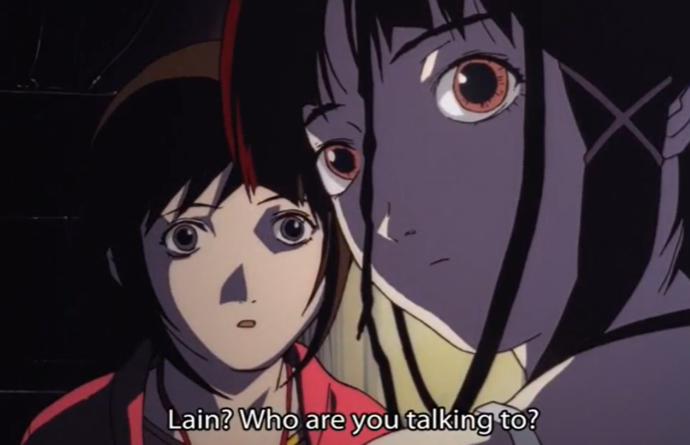

À mesure que Lain se confronte à ces versions éclatées d’elle-même, elle développe un état de dépersonnalisation. Cette condition, souvent liée à des traumatismes ou à des expériences psychologiques extrêmes, se manifeste par une sensation d’éloignement de soi-même et une dissociation entre le moi et la réalité. Pour Lain, cet état de dépersonnalisation apparaît comme une réponse à la pression écrasante de l’immersion dans le Wired et de la perte de son identité unique.

La dépersonnalisation de Lain pourrait être interprétée comme un mécanisme de défense. Face à la confusion de son moi et à l’incapacité de contrôler son existence dans le Wired, elle se détache émotionnellement et psychologiquement de ce qui lui arrive. En perdant de vue son propre corps, ses émotions, et même ses relations avec les autres, <mark>elle adopte une position de retrait, une sorte de protection contre l’effondrement total de son psychisme.</mark>

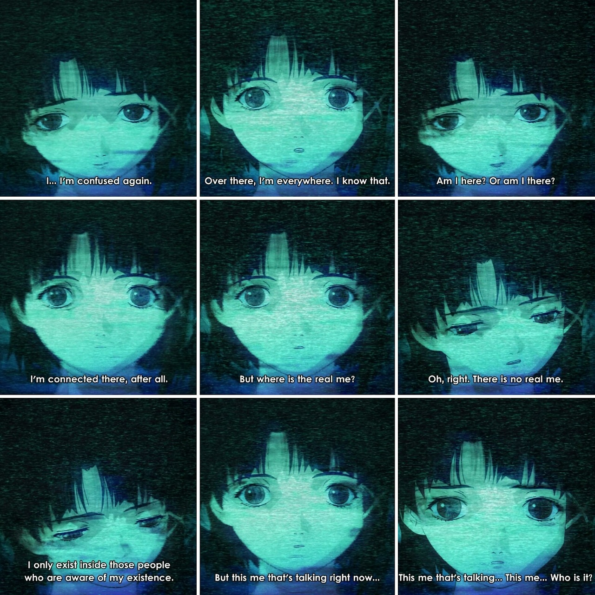

Dans cette dépersonnalisation, on retrouve des éléments qui rappellent les symptômes de "déréalisation", où l’individu perd tout contact avec la réalité. Lain ne ressent plus le monde qui l’entoure comme tangible. <mark>Le Wired devient son seul point de référence, mais même cet espace est instable, fluctuant.</mark> Ce processus la conduit à une isolation psychique complète.

## Transcendance et annihilation de l’identité

### Une figure transcendance numérique ou de deconstruction de soi ?

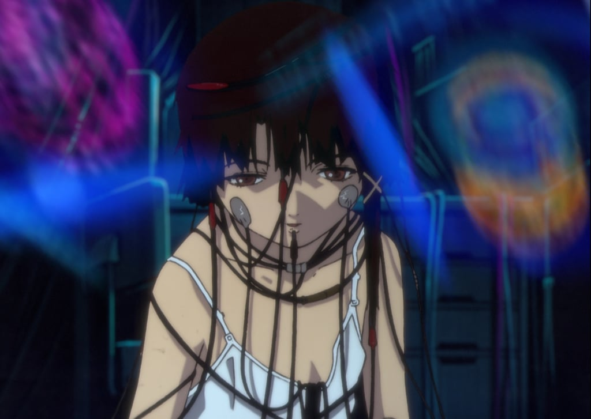

L’apogée de la transformation de Lain survient lorsqu’elle devient une entité omniprésente dans le Wired, capable de transcender les limites du corps physique et de manipuler la réalité. Ce passage à un état quasi-divin pose une question centrale : s’agit-il d’une véritable transcendance, ou est-ce en réalité une forme ultime de destruction du soi ?

La transcendance numérique de Lain pourrait être vue comme une version déformée du concept d’individuation chez Jung, où l’individu, au lieu d’atteindre un état de conscience supérieure et d’accomplissement de soi, se dissout dans un espace collectif où son individualité se perd. Le Wired, en tant qu’espace d’interconnexion, devient une sorte de toile dans laquelle l’identité de Lain se dissout, ne laissant plus qu’une entité omniprésente, mais vide de toute humanité.

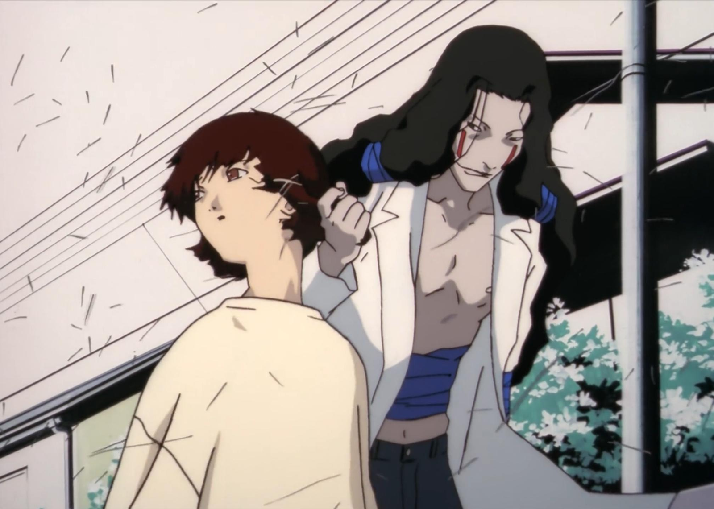
> <mark>"Dieu est ici."</mark>

Cette phrase, répétée tout au long de la série, met en lumière l’ambiguïté de la transcendance de Lain. Si elle semble atteindre un état supérieur, son humanité et son individualité disparaissent complètement​.

Ce processus rappelle également les concepts liés au "pulsion de mort". Face à une crise existentielle et à une incapacité à maintenir son identité stable, Lain choisit l’annihilation de son moi. Ce passage à un état transcendant est, en réalité, l’aboutissement d’un désir de mort, où Lain, ne trouvant plus de place dans le monde réel, préfère une existence immatérielle, sans souffrance ni individualité.

### La negation de l'existence: un effacement de la mémoire collective.

Le choix final de Lain, qui décide d’effacer son existence de la mémoire de ses proches, est l’acte ultime de dépersonnalisation. En se retirant de la conscience collective, elle nie son propre passé, son corps et son existence même. Ce choix reflète une profonde désintégration de l’individu, où la quête d’identité échoue dans un processus d’auto-annihilation.

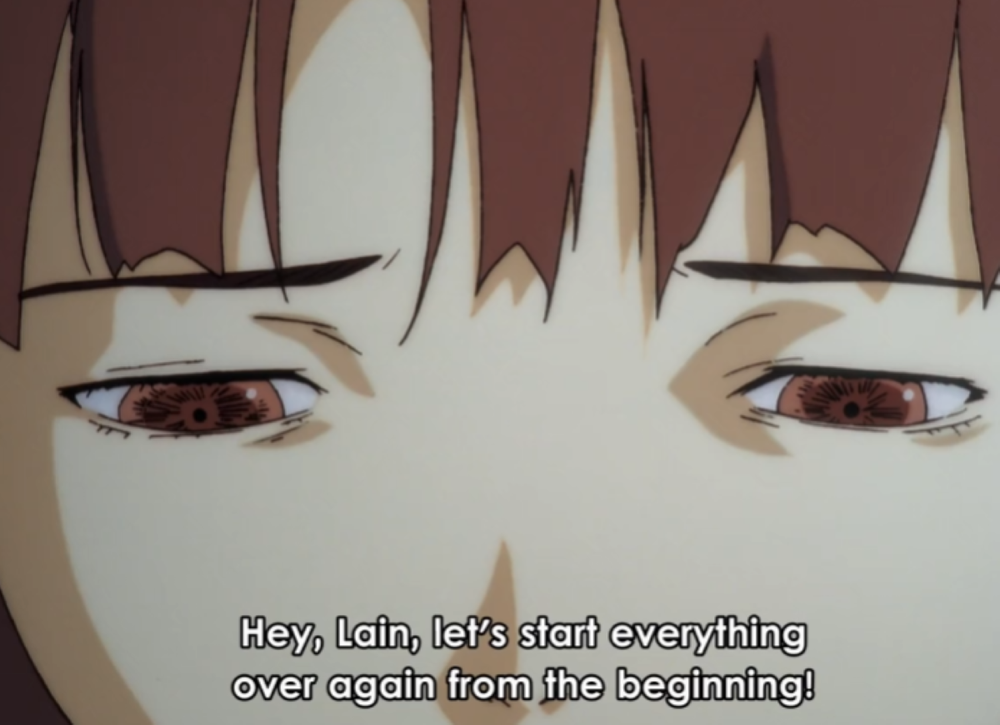

L’effacement de la mémoire n’est pas un simple oubli ; c’est une <mark>négation ontologique.</mark> Lain cesse d’exister autant en tant que corps physique qu'en tant qu’entité mentale. Cette dissolution complète est la conclusion logique d’un processus de fragmentation qui a débuté dès son entrée dans le Wired. <mark>Lain devient une entité sans passé, sans identité, sans futur.</mark>

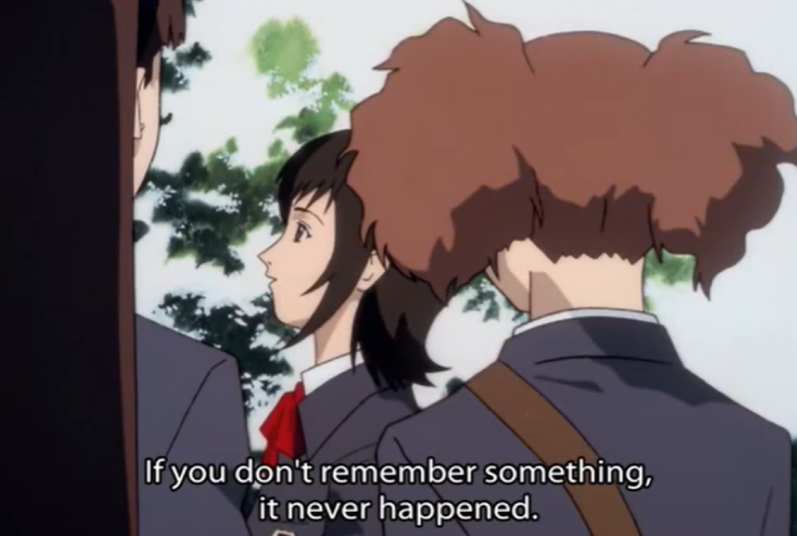
> <mark>"Si on ne se souvient pas de toi, alors tu n'as jamais existé."</mark>

En effaçant les souvenirs des autres, Lain accepte l’idée que son existence même n’a jamais été réelle. Cette phrase souligne le lien entre l’identité et la mémoire, et met en lumière la fragilité de l’existence humaine dans un monde où tout peut être effacé​.

## Conclusion

À travers l’errance de Lain dans la ville et dans le Wired, Serial Experiments Lain met en lumière un processus de dépersonnalisation totale. Lain se dissout progressivement, perdant non seulement ses repères dans la réalité, mais également tout sens d'identité. Son immersion dans cet univers virtuel expose un <mark>effondrement psychologique</mark>, où chaque tentative de stabiliser son moi échoue dans un processus d’autodestruction. <mark>Le Wired devient le miroir de son éclatement identitaire,</mark> un espace où elle se confronte à des reflets déformés de sa propre psyché, jusqu'à l'annihilation complète.

En fin de compte, la série nous montre que la quête d’une identité stable, face à la modernité et à la technologie omniprésente, peut mener à une fragmentation irréversible du moi. Lain incarne ce cheminement vers une forme de transcendance, qui n’est qu’un masque pour une dissolution ultime de l'individualité.