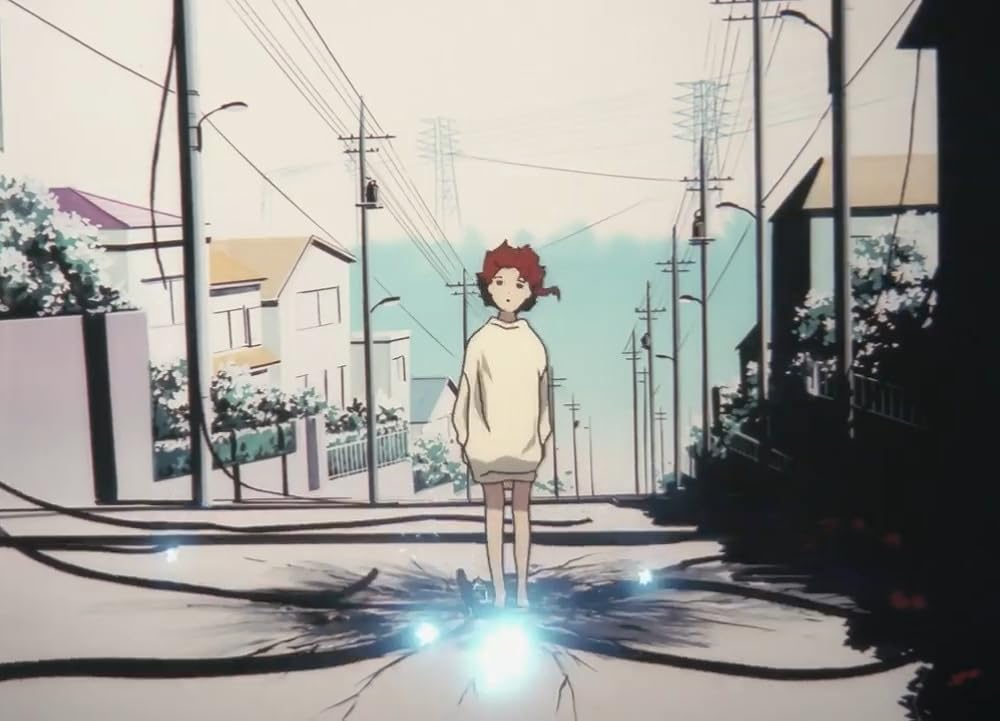
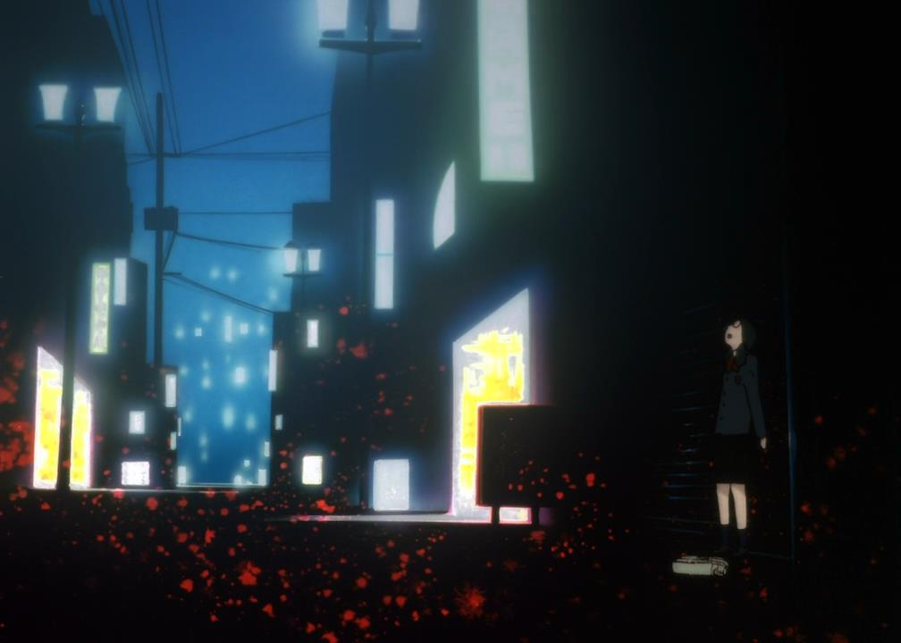
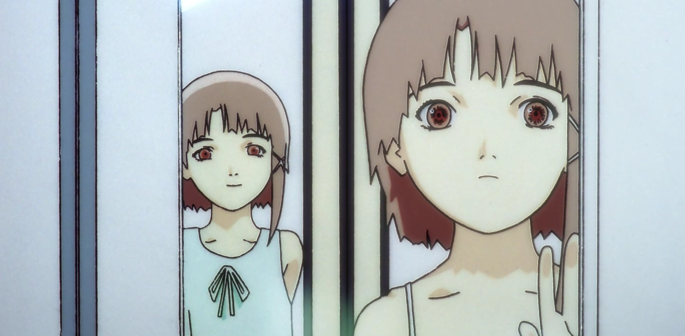
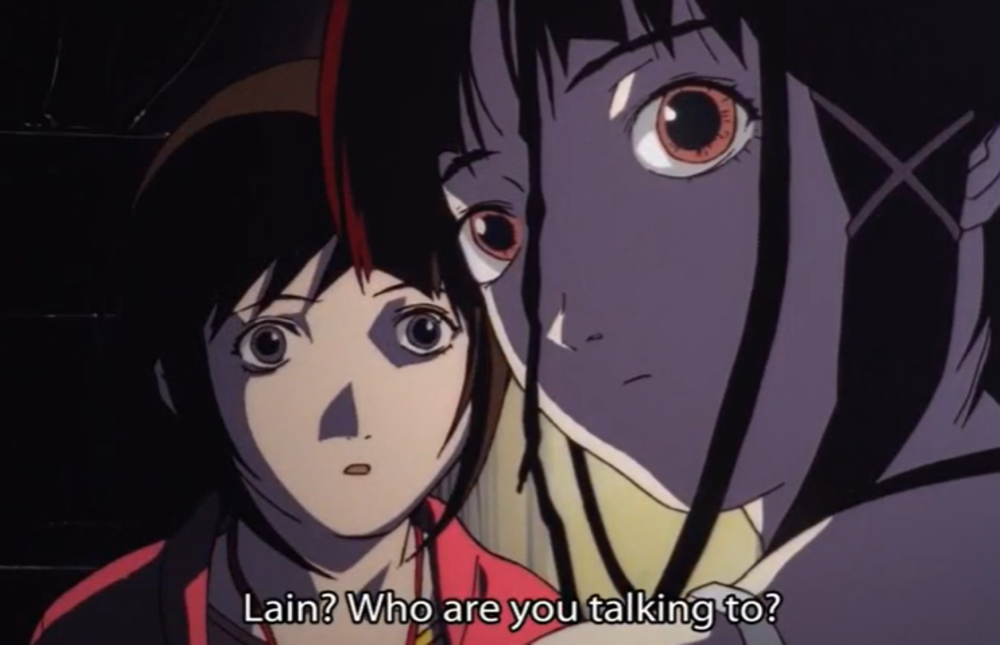

Static noise, cables intertwined like veins running through an empty city. A disconnected world, where <mark>reality and virtuality</mark> blur and overlap. There, alone in her room, Lain watches. Each screen becomes a window into a space where <mark>identity fragments</mark>, and human presence dissolves. She gets lost in the Wired, where each connection seems to erode her existence a little more.

The city breathes, its <mark>cold and immense</mark> structures standing like silent witnesses to her wandering. In every corner, reality becomes fuzzy, the familiar twists under the weight of the strange. The streets, once pathways, are now endless labyrinths. <mark>Lain, a shadow in this landscape, fades away.</mark>

In *Serial Experiments Lain*, every thread that connects is also a noose that strangles. It is a journey toward total dissolution, where the search for identity clashes with the vastness of a <mark>hyperconnected but empty</mark> world, where each connection drives one further from oneself.

## I. The City as a Space of Alienation and Identity Confusion

### Urban Drift: Lain Lost in Her Environment

Lain moves through a profoundly hostile and alienating urban environment. The deserted streets, towering buildings, and near-total absence of human life create a setting where Lain, both observer and actor, gradually dissolves. This city isn’t just a backdrop; it acts as a visual metaphor for the loss of bearings, where Lain wanders without ever truly knowing where she’s going or who she is. <mark>The city embodies an absence of place</mark>. The emptiness and silence of these spaces create a tension between the real and the virtual, between human life and an architecture that has become oppressive, where the individual feels increasingly estranged from themselves.

In this environment, Lain is never connected to a specific place. She moves aimlessly, but these movements offer no reconciliation with herself. This phenomenon is amplified by the visual aesthetics of the series, which play with distorted perspectives, dizzying angles, and a cold color palette. These directorial choices enhance the idea of a city that gradually devours those who get lost in it, <mark>a space of total disorientation where identity dissolves.</mark>

This process of urban drifting corresponds to a central notion in psychoanalysis: the concept of <mark>Unheimlich, the uncanny.</mark> The city, though common and mundane, becomes for Lain a strange, threatening space, where the familiar turns against her and takes on an unsettling dimension. This dissociation is reflected in how Lain perceives her environment. The more she immerses herself in the Wired, the more the city loses its familiarity and becomes a territory of anxiety, a non-place where the familiar distorts.

> <mark>"No matter where you go, everyone is connected."</mark>

Freud describes the uncanny as <mark>that moment when what should be intimate and familiar becomes disturbing, even frightening.</mark> This is exactly what Lain experiences in the series: her home, her room, and even the streets she walks become spaces where she no longer fits. She has no stable frame of reference, as if the physical space itself is expelling her. This spatial dislocation represents the beginning of her identity’s disintegration, a process in which Lain no longer recognizes herself in the world around her, nor in her own reflection.

This omnipresent connection, meant to unite human beings, becomes a burden for Lain. Despite the promise of connection offered by technology, she finds herself more disconnected than ever, both from her environment and from herself.

### The Wired as a Distorted Mirror of Reality

If the city represents the space of physical wandering, the Wired becomes the distorted mirror of that wandering. The Wired is as much a virtual world as a space where Lain confronts multiple and contradictory versions of herself. It is no longer a matter of place, but a question of self-perception. In the Wired, Lain is no longer one but many. She is both herself and an omnipresent entity, which fragments her identity and plunges her into a spiral of self-questioning.

<mark>The Wired is, in a sense, an extension of the city.</mark> Just as the alienating city in which she gets lost, the Wired is a space where identity is fluid, deformed, incapable of remaining intact. For Lain, entering the Wired is not merely an immersion into another world; it is a direct confrontation with psychological disintegration. She is confronted with increasingly disturbing versions of herself, constantly revealing how fragmented her self has become. This dissolution of the self echoes the psychoanalytic theories of Jacques Lacan, particularly the idea that the ego is constructed through distorted mirrors—here, the Wired becomes that mirror.

Thus, Lain is caught in a dual process of erasure. In the city, she physically loses herself, and in the Wired, she mentally disintegrates. The two spaces mirror each other, forming a cycle where the loss of bearings and identity dissolution become inevitable. What the Wired reveals is Lain’s inability to find stability in her own self, an existential crisis that culminates in her confrontation with her multiple avatars.

The Wired acts as a projection of Lain’s unconscious. In this virtual space, her fears, desires, and contradictions resurface, not as symbols, but as tangible and interactive realities. <mark>What should remain hidden or internalized in the unconscious violently externalizes in the Wired, permanently blurring the line between inner and outer, real and imaginary.</mark>

## II. Depersonalization and Self-Dissolution

### The Fragmentation of Identity

In *Serial Experiments Lain*, Lain undergoes a quantifiable fragmentation of her identity. This fragmentation is expressed through her interactions in the Wired, where she encounters various versions of herself. Each version represents a different facet of her self: the shy Lain, the omniscient Wired Lain, the social Lain. This process is as much technological as it is psychological. <mark>Lain’s identity continues to deconstruct</mark> as she delves deeper into this digital universe.

Lacan defines identity through the concept of the "mirror stage," where the individual forms in relation to how they perceive themselves in the gaze of others or through external representations. In Lain’s case, this mirror is distorted by the Wired, a space where she is confronted with "reflections" of herself that no longer belong to her. The dissolution of the self then becomes inevitable: Lain loses any anchor point in reality, and her identity fragments into a series of blurred and contradictory representations.

> <mark>"Who are you? Who am I?"</mark>

This repeated questioning by Lain throughout the series is the ultimate expression of this loss of identity. She can no longer recognize herself, neither in the real world nor in the Wired, symbolizing a total disconnection between her internal self and the outside world.

In the Wired, Lain becomes an object of manipulation. Her reality and identity are no longer under her control; they are reconfigured by the rules of the Wired and the other entities that inhabit this digital universe. Each new interaction with this world reinforces her disorientation, leaving her unable to maintain any continuity in her identity. This gradual fragmentation can be interpreted as a reflection of the phenomenon of <mark>"psychic disintegration,"</mark> where the individual loses the coherence of their being in the face of overwhelming forces.

### Depersonalization as a Defense Mechanism

As Lain confronts these shattered versions of herself, she develops a state of depersonalization. This condition, often linked to trauma or extreme psychological experiences, manifests as a sense of detachment from oneself and a dissociation between the self and reality. For Lain, this state of depersonalization appears as a response to the overwhelming pressure of immersion in the Wired and the loss of her unique identity.

Lain’s depersonalization could be interpreted as a defense mechanism. Faced with the confusion of her self and the inability to control her existence in the Wired, she emotionally and psychologically distances herself from what is happening. By losing touch with her body, her emotions, and even her relationships with others, <mark>she adopts a position of withdrawal, a kind of protection against the total collapse of her psyche.</mark>

In this depersonalization, we find elements reminiscent of the symptoms of "derealization," where the individual loses all contact with reality. Lain no longer feels the world around her as tangible. <mark>The Wired becomes her only point of reference, but even this space is unstable, fluctuating.</mark> This process leads her to complete psychic isolation.

## Transcendence and Identity Annihilation

### A Figure of Digital Transcendence or Self-Destruction?

The apex of Lain’s transformation occurs when she becomes an omnipresent entity in the Wired, able to transcend the limits of her physical body and manipulate reality. This passage to a quasi-divine state raises a central question: is this true transcendence, or is it actually the ultimate form of self-destruction?

Lain’s digital transcendence could be seen as a distorted version of Jung’s concept of individuation, where the individual, instead of achieving a state of higher consciousness and self-fulfillment, dissolves into a collective space where her individuality is lost. The Wired, as a space of interconnection, becomes a kind of web in which Lain’s identity dissolves, leaving behind only an omnipresent entity, empty of all humanity.

> <mark>"God is here."</mark>

This phrase, repeated throughout the series, highlights the ambiguity of Lain’s transcendence. Though she seems to reach a higher state, her humanity and individuality disappear entirely.

This process also recalls the concepts associated with the "death drive." Faced with an existential crisis and an inability to maintain her stable identity, Lain chooses the annihilation of her self. This passage to a transcendent state is, in reality, the culmination of a death wish, where Lain, finding no place in the real world, opts for an immaterial existence, without suffering or individuality.

### The Negation of Existence: An Erasure from Collective Memory

Lain’s final choice, to erase her existence from the memory of her loved ones, is the ultimate act of depersonalization. By withdrawing from collective consciousness, she denies her own past, her body, and her very existence. This choice reflects a profound disintegration of the individual, where the search for identity fails in a process of self-annihilation.

The erasure of memory is not a simple forgetfulness; it is an <mark>ontological negation.</mark> Lain ceases to exist as both a physical body and a mental entity. This complete dissolution is the logical conclusion of a fragmentation process that began with her entry into the Wired. <mark>Lain becomes an entity without a past, without identity, without a future.</mark>

> <mark>"If no one remembers you, then you never existed."</mark>

By erasing the memories of others, Lain accepts the idea that her very existence was never real. This phrase underscores the link between identity and memory, highlighting the fragility of human existence in a world where everything can be erased.

## Conclusion

Through Lain’s wandering in the city and the Wired, *Serial Experiments Lain* highlights a process of total depersonalization. Lain progressively dissolves, losing not only her bearings in reality but also any sense of identity. Her immersion in this virtual universe exposes a <mark>psychological collapse</mark>, where every attempt to stabilize her self ends in self-destruction. <mark>The Wired becomes the mirror of her fragmented identity,</mark> a space where she confronts distorted reflections of her psyche, culminating in complete annihilation.

Ultimately, the series shows us that the quest for a stable identity, in the face of modernity and omnipresent technology, can lead to an irreversible fragmentation of the self. Lain embodies this journey toward a form of transcendence, which is nothing but a mask for the ultimate dissolution of individuality.
