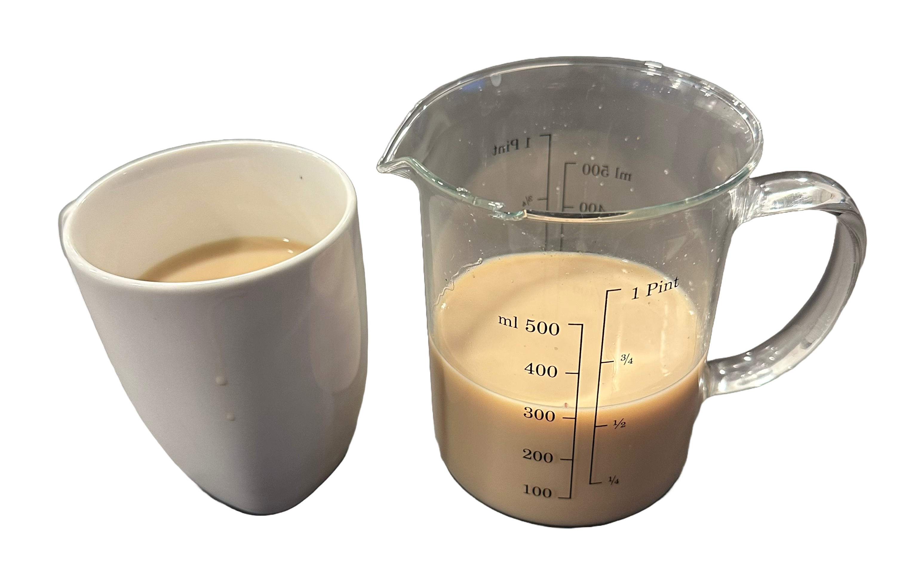

Il est 6h du matin, je me fais un Chai Latte et je réfléchis à la quête éternelle du succès.  
Ou du moins, je réfléchis à ma propre quête. Je n'ai jamais été très doué en "philosophie", mais j'aime bien partager quelques expériences personnelles de temps en temps, et comme je n'avais jamais eu de plateforme pour le faire, j'ai décidé de créer la mienne.

Alors attachez votre ceinture et faites-vous aussi un Chai Latte si vous en avez encore, parce qu'on va parler de succès, et de comment ce n'est pas toujours ce qu'il semble être.

## Comment tout commence, et comment cela ne finit jamais

Eh bien, nous semblons être assez constants, n'est-ce pas ?  
Nous sommes des créatures qui cherchent des motifs, et nous aimons penser que nous pouvons prédire l'avenir en nous basant sur le passé.  
Nous pensons toujours en termes de statistiques, nous catégorisons toujours les choses. De jolies petites boîtes, avec de jolies petites étiquettes.  
Tout ce que je dis là n'est nouveau pour personne, mais il est toujours bon de se rappeler que nous ne sommes pas seuls dans ce monde, et que nous ne sommes pas les seuls à penser à ces choses.

Alors comment ça commence ?  
Eh bien, plus souvent qu'autrement, ça commence avec un rêve, une vision, un objectif.  
Nous voyons l'état des choses, et un jour, nous nous réveillons d'un sommeil éternel, et décidons que les choses doivent changer.  
La quête éternelle du succès commence, le mouvement constant, la destruction du confort éphémère, la création d'un nouveau monde.

Comment cela se termine-t-il ?  
Quand cela se termine-t-il ?  
Cela se termine-t-il ?

Je ne sais pas, et je ne pense pas que quelqu'un le sache.  
Ce que je sais, c'est que peu importe combien tu réalises, peu importe combien tu réussis, il y a toujours quelque chose de plus à faire, quelque chose de plus à accomplir, quelque chose de plus à réussir.

## La quête éternelle du succès

"Parle moins, fais plus", disent-ils, "Fais semblant jusqu'à ce que tu réussisses", disent-ils.  
Des phrases tellement populaires, toutes aussi absurdes qu'inutiles.

La quête éternelle du succès ne consiste pas à parler moins, ni à faire plus.  
Il s'agit de faire les bonnes choses, au bon moment, pour les bonnes raisons.

Nous semblons souvent vouloir porter le monde sur nos épaules, en faisant cela, nous nous rassurons en nous disant que nous faisons quelque chose, que nous avançons.  
Nous aimons le contrôle, l'idée d'être ceux qui sont aux commandes, nous détestons voir le temps passer, nous détestons être rappelés à notre mortalité.  
Nous aimons détruire la seule chose que nous ne pouvons pas contrôler, le temps.

La quête éternelle du succès nous donne quelque chose que nous savons ne pas avoir de fin, elle nous permet de garder les racines de l'existence en place, de ne jamais les remettre en question.

## Que signifie tout cela ?

Encore un Chai Masala dans ma tasse, encore une pensée dans mon esprit.

Est-ce que vous avez déjà joué au jeu Coffee Talk ?

C'est un jeu où vous incarnez un barista, et vous écoutez les histoires des gens, leurs luttes, leurs réussites.  
C'est un jeu qui parle d'empathie, de compréhension, d'écoute.

Son créateur, un Indonésien du nom de Mohammad Fahmi, disait qu'il voulait faire un jeu qui rendrait les gens heureux, qui leur donnerait l'impression de ne pas être seuls dans ce monde.

Malheureusement, il est décédé récemment, que Dieu bénisse son âme, c'était un grand homme.

Je pense beaucoup à lui, à son jeu, à sa philosophie.  
Comme lui, mon rêve était de devenir un développeur qui faisait tout tout seul.  
Toby Fox, Eric Barone, tous ces gens qui ont fait des jeux tout seuls, c'étaient mes héros.

Je n'ai cessé de coder, encore et encore, et puis quelque chose d'étrange s'est produit.

Quelque chose a... craqué.  
Comme la rambarde de sécurité d'un pont que l'on pensait toujours sûr.  
Comme la main que l'on pensait pouvoir toujours tenir.

Cette main, elle a juste... lâché.

Et je suis tombé.

Je ne pouvais pas y croire, ni arrêter que ça arrive.  
J'ai dû lâcher prise, j'ai dû me laisser tomber.

Et je suis tombé, encore et encore.  
Je pense que cela n'a jamais vraiment cessé depuis, je n'ai jamais vraiment arrêté de tomber.  
Mais je pense que ça me va.

Je pense que ça me va de tomber, d'échouer, de ne pas être le meilleur.  
Je veux accepter le fait qu'il y a une fin, je pense que c'est bien que la quête éternelle du succès n'ait pas à être éternelle.

Je pense que ça me va.

## Promesses vides, rêves inachevés

Comme un chant que je me répète sans cesse, comme un mantra que je chuchote toujours dans le noir.  
Mes yeux toujours fermés, pour ne pas voir le sol sous mes pieds.

Dans toutes nos entreprises, nous oublions la chute, nous oublions la fin.  
J'aimerais pouvoir te dire que tout ira bien, que tu vas y arriver, que tu vas réussir.  
Et alors que je t'écris ceci, mes amis, d'ici un mois ou deux, je saurai si ma vie peut continuer, si mes rêves peuvent être accomplis, ou si je vais enfin regarder le sol s'approcher rapidement de mes yeux scellés.

Mes amis, tout va toujours bien, et tout ira toujours bien.  
Si ce n'est pour les mensonges que nous transformons lentement en vérités, aucun encouragement ne suffirait à nous faire briser l'éphémère.

Quand il ne reste plus de pont à traverser, plus de main à tenir, plus de lumière à suivre, nous devons nous rappeler que nous sommes ceux qui doivent faire le premier pas.

Nous devons ouvrir les yeux vers le ciel toujours en chute, et nous devons faire ce saut de foi.

Mes amis, je vous souhaite tout le meilleur, et j'espère que vous trouverez ce que vous cherchez.  
Je vous aime tous, peu importe qui vous êtes, peu importe où vous êtes, peu importe ce que vous faites.

Merci d'avoir laissé mon cœur ouvert vous parler, merci d'être les oreilles qui écoutent mes paroles.

Merci d'être, même pour un instant, une partie de ma vie.

Vous êtes vous.  
Vous êtes aimé(e).

Vous pouvez ouvrir les yeux quand vous tombez,  
Vous pouvez vous réveiller du rêve du Divin,  
Même en tombant,  
Surtout en tombant,

Vous direz un jour que vous avez volé.

*- yaro*
