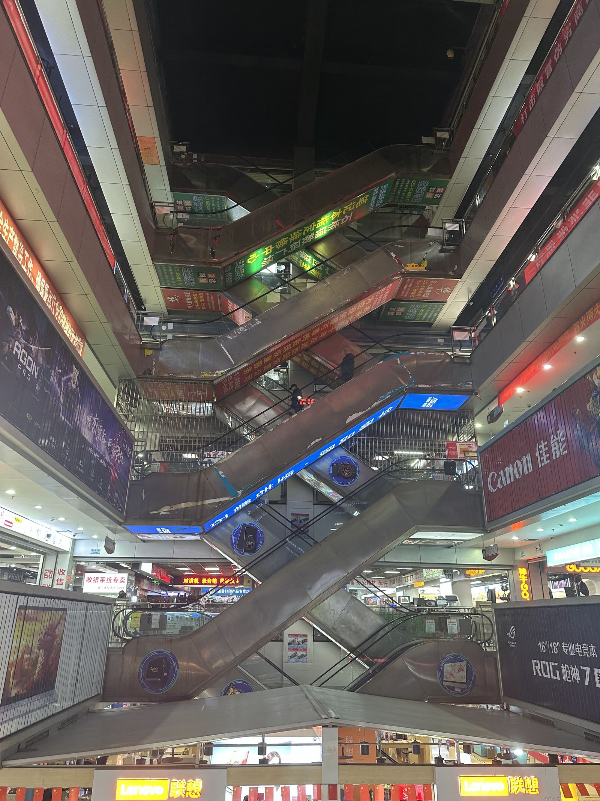

All my trips start in the same way.
I learn more and more about a specific place after stumbling upon it by chance in a book or article, I fight very hard not to check flight prices every day before losing the battle against my weak will.

I consider it essential to learn as much as possible about the culture of the place I am visiting. My preliminary research takes weeks, and if possible, I try to fully understand the basics of the language or historical facts before I can depart for my chosen destination.

However, for the first time in my life, I was forced to ignore my own principles. I learned a few days before my exam period that a perfectly free week awaited me after it.

I hadn't quite recovered from having to stay at home to watch my cat for three uninterrupted weeks, and I quickly packed my bags, finished my exams, and set off for the city that was forcibly suggested to me by my TikTok algorithm, the _Mountain City_ (山城): [Chóngqìng](https://wikipedia.org/wiki/Chongqing).

## Wuhan, then Chongqing.

A stopover leads me to [Wǔhàn](https://wikipedia.org/wiki/Wuhan) (武汉), the capital of the [Húběi](https://wikipedia.org/wiki/Hubei) (湖北) province, the Province of a Thousand Lakes, where the [1911 Revolution](https://en.wikipedia.org/wiki/Wuchang_Uprising) that dealt the final blow to the Qing Dynasty began.

Unfortunately, and like my return stopover, I wouldn’t have time to explore this fascinating city.

After resuming my journey to Chongqing aboard the [Comac ARJ21](https://wikipedia.org/wiki/Comac_ARJ21) (also known as C909), one of the new Chinese airplanes I was eager to try, it was an hour and forty minutes to the Sichuan city. 

My arrival in Chongqing was quick, with the city just 30 minutes from the airport. I stayed in the downtown area of [Jiěfàngbēi](https://en.wikipedia.org/wiki/Jiefangbei_CBD)(解放碑) during this trip, more precisely in a small Muslim corner of the district, near the [Chongqing Mosque Administrative Committee](https://maps.app.goo.gl/dcncwjQhg3WisDNr9).

The main advantage was that I could now eat Hotpot (火锅) without fear, and my God, it was so delicious. It was the first thing I did after dropping off my things at the hotel. Right at the foot of the building (surprisingly smoky), the smell of sautéed chili naturally opens the appetite, but I didn’t yet have the mental strength to go for the spicy hotpot, so I ordered without!

After this meal, full of energy, I went for a little walk to help digest it all (God knows how necessary that is after such a stomach workout).

A bit of walking showed me one of the many small corners of [Jiěfàngbēi](https://en.wikipedia.org/wiki/Jiefangbei_CBD)(解放碑). Fatigue hit me strongly enough that I started walking back to the hotel, but I didn’t expect to get so lost...

I eventually arrived at one of the many parts of the [Yúzhōng District](https://en.wikipedia.org/wiki/Yuzhong,_Chongqing) (渝中区), more specifically towards the banks of the [Jīalíng](https://en.wikipedia.org/wiki/Jialing_River) (嘉陵江), a tributary of the Yangtze River, the [Yángzǐ](https://wikipedia.org/wiki/Yangtze) (扬子江).

There, fishermen were quietly enjoying themselves, with a beautiful view of the [Shíbǎnpō](https://en.wikipedia.org/wiki/Shibanpo_Yangtze_River_Bridge) Bridge, known for... well, I think you’ll find out with a quick search. Anyway, it was magnificent! I finally had to take a taxi to get back...

## Lǐzǐbà and Cíqìkǒu.

The next morning, I decided to take another route through [Jiěfàngbēi](https://en.wikipedia.org/wiki/Jiefangbei_CBD)(解放碑) to reach the [Chongqing Liberation Monument](https://en.wikipedia.org/wiki/Liberation_Monument_in_Chongqing), where I found a really interesting shop, _"A shop where even the owner doesn’t know what’s being sold."_

I probably went a bit overboard in the shop, leaving with 150元 (~$20) worth of trinkets. Before heading to the monument square, I found myself in one of the (many) shopping malls of the city, where one of the (again) many Apple Stores was located.

The [Chongqing Liberation Monument](https://en.wikipedia.org/wiki/Liberation_Monument_in_Chongqing) stood at one of the mall exits, and the place was packed with people. It’s one of the strongest symbols of the city, erected after the [Anti-Japanese War](https://en.wikipedia.org/wiki/Bombing_of_Chongqing) fought by Chongqing's Resistance.

After all this, I went to the [Lǐzǐbà](https://wikipedia.org/wiki/Liziba) (李子坝) metro station, just minutes from the square, to see a monorail running through a building! It was really impressive to watch, and it was also one of the few times I saw so many tourists in one place. Throughout my trip, I saw only two others besides myself, which is probably due to the fact I traveled in winter.

At that moment, I realized my total lack of planning. I had gone to this city without familiarizing myself with its landmarks, and I had truly stumbled upon this station by chance. It turned out, amusingly, that this was the case for many of the places I visited randomly.

I found myself at the _Porcelain Port_, [Cíqìkǒu](https://en.wikipedia.org/wiki/Ciqikou,_Chongqing), by sheer luck. Also called _Little Chongqing_ or _Lóngyǐn Village_, this impressive blend of traditional architecture was built under the [Emperor Zhēnzōng](https://wikipedia.org/wiki/Song_Zhenzong) of the [Song Dynasty](https://wikipedia.org/wiki/Song_Dynasty), before becoming a major commercial port under the [Ming Dynasty](https://wikipedia.org/wiki/Ming_Dynasty).

The place was fascinating, and it also hosts a memorial to the [Bombing of Chongqing](ttps://en.wikipedia.org/wiki/Bombing_of_Chongqing), as the city bears permanent traces of this event, being one of the cities most affected by Japanese aggression.

## Shibati and Raffles City

Only a few steps from my hotel was Shibati (十八梯), literally "18 steps", a 300m cascade of consecutive stairs leading to a large plateau of traditional shops.

The beauty of Shibati lies not only in the overlapping roofs but also in the constant flow of people climbing its stairs, day and night.

The large plateau suddenly presented itself to me, and as I wandered deeper, I found myself in front of a taxi, with a strong desire to find a bookstore to buy books in Chinese.

The taxi took me to a shopping center under renovation, where a bookstore was supposed to be, but even with the help of some friendly locals, we realized the place had been closed.

A metro ride later, I begin to remember what a friend who had visited the city before told me. I was familiar with [Marina Bay Sands](https://en.wikipedia.org/wiki/Marina_Bay_Sands) in Singapore, where my friend had also lived. He told me that Chongqing had a [Raffles City](https://www.capitaland.com/sg/malls/rafflescity/en.html) shopping center, a Singaporean mall chain, that looked almost identical to Marina Bay Sands.

This huge complex is one of the most impressive shopping centers in the city. After quite a bit of walking, I decide to head back, passing through Shibati once again to see it at night!

It’s at night that you truly see Chongqing in its best light. Dawn was breaking when I finally reached the street with the 18 steps, having taken a different path this time. After the plateau, I found another nearby shopping street.

## Anime Stores and Jiangbei

A tradition I never miss when I go to China is to play gachas and watch fellow weebs have fun cosplaying!

So, off I go to the Jiangbei District 江北区, where a vast underground space is where anime fans of all kinds gather. Honestly, I came back here several times during my trip to Chongqing; I was like... drawn to the place.

Of course, such places exist in Beijing and probably in most major Chinese cities, but the scale in Chongqing is pretty impressive. Like everything in this city, everything seems huge.

I admit I spent way too much money on the numerous gachas; I was shocked by the franchises that seemed to be close to the hearts of the Chinese: Suzumiya Haruhi, Detective Conan, Evangelion, Nichijou. They aren’t necessarily niche franchises at all, but they aren’t the ones you find in the West, like the ultra-popular mainstream shonens with fast-paced animations. This is what we call based tastes.

At the exit, a beautiful view of skyscrapers awaited me. It was now time to head back.

Heading back toward the Memorial,

I came face to face with one of Chongqing’s iconic spots: Hongya Cave.

Usually, if you get there early enough, many red lights illuminate the valley, but I went way too late. Honestly, it didn’t bother me too much, I love walking in Chongqing at night when the lights start to turn off; I find it much more beautiful.

## Chongqing1949 and the Hospital

In Hongyuan, 30 minutes from downtown, there is a musical in a 360-degree rotating auditorium that reenacts post-war China in 1949. This auditorium was custom-built just to make this show possible. Since 2021, it has received nothing but praise, with nearly 1500 people attending every day.

[

So I wake up with this show in mind, knowing exactly where to go, and it's right next to Ciqikou.

I head toward the Chongqing Grand Theatre (Unfortunately, I forgot to take a photo of it!)

If I had permission to film, believe me, I would have. It was a real shock; I don’t think I’ve ever experienced anything like it before. My weak little HSKs (Chinese Proficiency Exams) were definitely not up to the task, so I watched with an automatic translator on my phone.

After a little detour through Ciqikou, I head toward the Yuzhong District, where I stayed, for a crazy view that puts into perspective the contrasting relief of Chongqing. I walk past the Memorial again.

And on top of a public hospital in Chongqing -- quite literally on its roof -- is the incredible view.

As they say, a video is worth a thousand words.

    <iframe 
        src="https://drive.google.com/file/d/1fW9I28D32eUM3TpIa22Zzc3dqoKnyaN_/preview" 
        frameborder="0" 
        allow="autoplay" 
        style="position: absolute; top: 0; left: 0; width: 100%; height: 100%; border: none;">
    </iframe>

I walked a lot from here; I admit I didn’t let myself sleep.
I wouldn’t be able to say why, I think I didn’t feel particularly well, so a walk was going to wake me up!

Honestly, I don’t think there’s a more beautiful city at night, or a better city to walk in. The reliefs are huge, but never uncomfortable, this sort of endless cascade of buildings, the bluish lights that turn into red once the historical districts are reached -- Magical.

## Phones and Imix Park

New day, new goal.
Another age-old tradition I stick to (no pun intended) during every trip to China: the eternal phone hunt!

I talked a lot about it in my article _[Beijing: 10 Days of Stories and Tea](https://skoomaden.me/en/posts/beijing-logbook)_ when I went to _Zhōngguāncūn_ (中关村), Beijing’s tech hub.

Here, nothing special, shopping here and there, I mostly found lots of diagnostic and repair equipment!

Just next to where the anime stores were, there’s a chain of huge shopping malls. For the rest of the day, I tried to make my way through just one of them.

After arriving by bus, it was time for even more shopping!
Here’s a video of the place!

    <iframe 
        src="https://drive.google.com/file/d/1lBPyLO5pB6ikG1ozrVIGszbJBQyZqhoC/preview" 
        frameborder="0" 
        allow="autoplay" 
        style="position: absolute; top: 0; left: 0; width: 100%; height: 100%; border: none;">
    </iframe>

After a lot of walking, and eating things from my hometown (cc DXB)! I went for an iced tea and bought some Pingu merch! (noot noot)

The tea was honestly exceptional but way too expensive, I much prefer what _Mìxuě_ makes!

## Húguǎng Huìguǎn

Well, it’s time to talk a bit of history, and this time we’ll need to hold on.

I wanted to save the best for last. Being in love with history, I found myself face to face with what I consider one of the most fascinating places in Chongqing on this last day.

The Huguang Guildhouse, or Húguǎng Huìguǎn (湖广会馆), is a historic building in Chongqing erected in 1759 at the beginning of the Qing Dynasty, right under the reign of the famous Emperor Qianlong.

Between natural disasters and epidemics, the Sichuan region lost a significant part of its population -- So the government strongly encouraged immigration to the region. The Yangtze (Blue River) being the main access route, Chongqing became the major entry point, with a population reaching 2.3 million in 1812, 85% of which were migrants, contributing to the multicultural growth of the city.

The entire complex of the Huguang Guildhouse reflects this history, in a quadrangular courtyard where newcomers gathered upon arriving in the city.

First of all, we find a statue of Da Yu (大禹), a legendary figure in Chinese history. He is famous for founding the Xia Dynasty (夏朝), the first dynasty in China according to tradition, and especially for his role in flood control -- This is the Temple of King Yu, _Yǔ Wáng Gōng_ (禹王宮).

After a little walking, we also come across a magnificent library (well, I imagine so, I couldn’t find more information on it, but the text says 藏書閣/藏书阁, and I don't recognize the first character).

Nearby, there is an adjacent courtyard, which clings to a large imperial yellow wall.

On the other side of the courtyard, we see a massive door, on which is written 广东公所 in traditional characters, _Guǎngdōng Gōngsuǒ_, a place named after the Guangdong province.

Inside, a stone stele explains a little more about its history.

"The Guangdong Office (广东公所), also known as Nanhua Palace (南华宫) or the Guangdong Guild (广东会馆), was a social organization founded by natives of Guangdong who resided in Chongqing. It was a popular association dedicated to charitable works for people from the same province. Located near the Huguang Huiguan and the Qi’an Office, it was built between the 25th year (1760) and the 51st year (1786) of the reign of Emperor Qianlong, and was renovated several times.

The current main structure follows a quadrangular courtyard layout (siheyuan), surrounded by high walls. The complex measures 30.5 meters in length from north to south and 25 meters in width from east to west. Except for the inner courtyard, the current built-up area is 711 square meters.

The main building of the courtyard is a theater, constructed in wood and with a hipped roof style (xiēshān, 歇山). The stage is 9 meters wide, 8.4 meters deep, and 2.8 meters high. It is accompanied by spectator rooms in the front and back, as well as wings on both sides.

The spectator rooms are divided into two parts, one in front and one in the back. They are 9 meters deep, 12 meters wide, and rise more than 10 meters high, accommodating up to 300 spectators.

Inside the courtyard, the stone and wooden sculptures depicting characters and deities are exquisitely crafted, showing the exceptional skill of artisans from the Qing Dynasty.

The Guangdong Office was dedicated to the worship of the sixth patriarch of Chan Buddhism, Huineng (慧能, 638-713). During the Qing Dynasty, its main hall housed a statue of Huineng, flanked on the left and right by statues of Prince Zhenjiang and the God of Wealth and Prosperity.

After the liberation (1949), the main hall was demolished. Huineng, originally from Xinxing, Nanhai (now Guangdong), still rests today at the Nanhua Temple (曹溪南华寺) in this province. This is why the Guangdong Guild was also called Nanhua Palace (南华宫).

On the architrave above the main door of the Guangdong Office, the inscription 'View of the Nanling Mountains' (南岭观瞻) can be read, affirming its Cantonese identity and connection to Guangdong Province."

Before leaving the building, several small scenes were set up before our eyes to recreate the everyday life of immigrants!

Before I leave, I say one last hello to a beautiful artwork depicting a Chinese opera singer, then I’m off!

I take a big bridge to walk back to downtown, rushing because I’m trying to get to a Sichuan opera show, one of my favorite operas in China!

When I finally arrive, I had the chance to see just how impressive the show was! Excuse my shouting, I was really blown away!

    <iframe 
        src="https://drive.google.com/file/d/1j7j6Inpa9JC0RP8kxy4F0AdX4AiDgMZc/preview" 
        frameborder="0" 
        allow="autoplay" 
        style="position: absolute; top: 0; left: 0; width: 100%; height: 100%; border: none;">
    </iframe>

And just after this show, it was finally time for me to head home!
## Return and Final Thoughts!

This adventure in Chongqing was an unexpected interlude, a break from my usual methodical travel habits. For the first time, I gave in to impulse rather than preparation, and perhaps that’s what made this experience so unique, even though I ended up missing some important spots in the city!

Every step in Jiěfàngbēi, Shibati, or Cíqìkǒu reminded me that Chongqing is a living narrative where the history of Qing migrations, anti-Japanese resistance, and contemporary innovations coexist. Between the _Chongqing1949_ performance with its rotating auditorium and Sichuan opera with its colorful masks, I saw a modern China proud of its past! Yet, it was in the simplest moments—a hotpot without chili, a lost night by the Jialing, or an iced tea after an embarrassingly weebish detour—that the city felt most authentic.

If I had to take one thing away from Chongqing, it would be this: sometimes, getting lost without a plan means letting the city itself become your guide. I loved how Chongqing made me walk, certainly, guided by its sparkling lights on the hills and its bridges defying the Yangtze.

<mark>- yaro</mark>