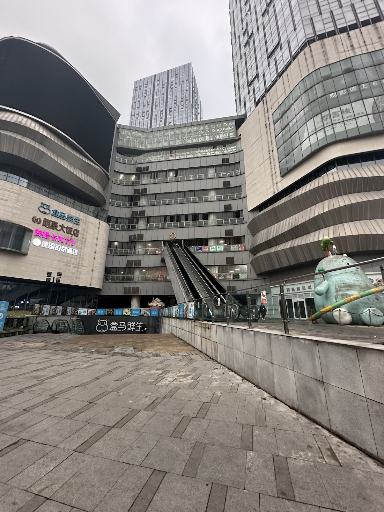
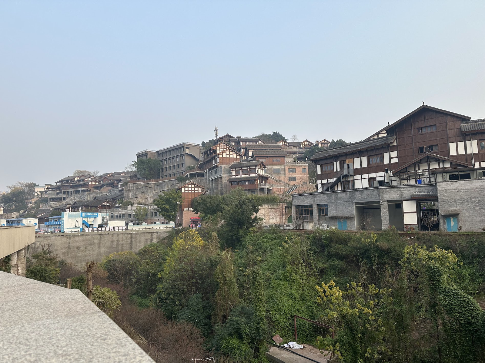
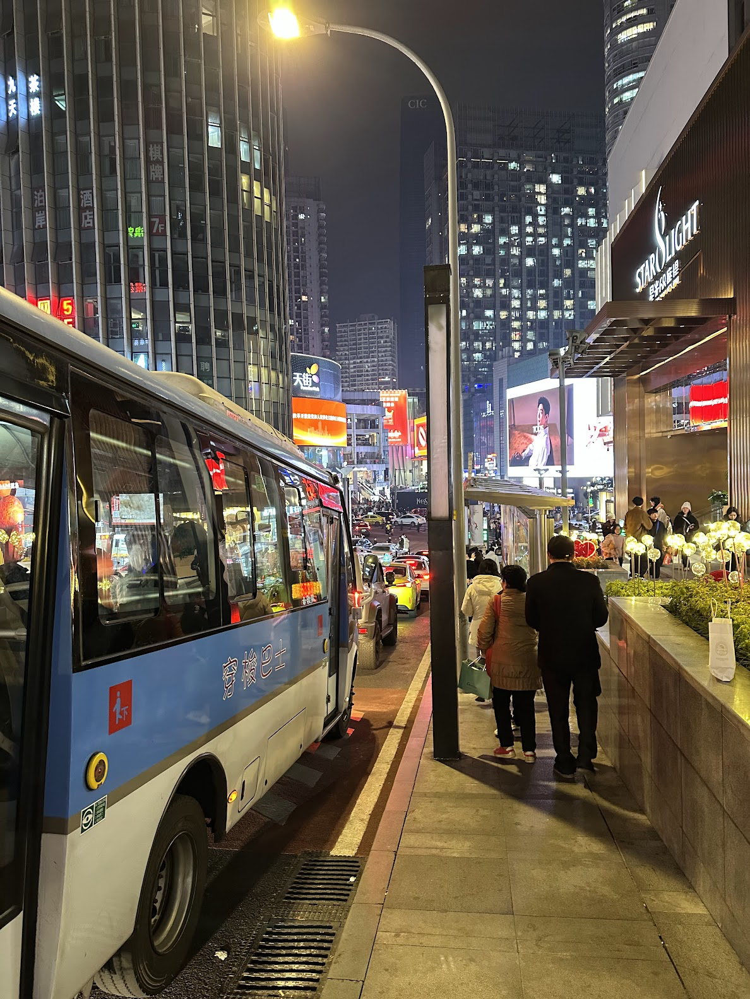

Tout mes voyages commencent de la même manière.
J'en apprends de plus en plus sur un lieu spécifique après être tombé dessus par hasard dans un livre ou un article quelconque, je me bats très fort pour ne pas regarder les prix des billets d'avions tout les jours avant de perdre le combat contre mon faible esprit.

Je considère primordial d'en apprendre le plus possible sur la culture du lieu visité, mes recherches préliminaires prennent des semaines, et si possible, la base de la langue ou des faits historiques doivent être comprises tout à fait avant que je puisse décoller vers la destination choisie.

Pour la première fois de ma vie cependant, j'ai été cette fois-ci contraint à ignorer mes propres principes, j'ai appris quelques jours avant ma période d'examens qu'une semaine parfaitement libre se présentait à moi après ces derniers.

Je n'avais pas réussi à me remettre d'avoir eu a rester chez moi pour surveiller mon chat 3 semaines ininterrompues, et me suis empressé de prendre mes valises, finir mes examens, et partir pour la ville qui m'a été suggéré de force par mon algorithme TikTok, la _Ville Montagne_ (山城): [Chóngqìng](https://fr.wikipedia.org/wiki/Chongqing).

## Wuhan, puis Chongqing.

Une escale me propulse à [Wǔhàn](https://fr.wikipedia.org/wiki/Wuhan) (武汉), la capitale de la province de [Húběi](https://fr.wikipedia.org/wiki/Hubei) (湖北) -- la Province aux Milles Lacs, d'où a commencé la [Révolution de 1911](https://fr.wikipedia.org/wiki/Soulèvement_de_Wuchang) qui donnera le coup de grâce à la Dynastie Qing.

![(Pasted image 20250121184811.png)]

Malheursement, et comme mon escale au retour, je n'aurais pas le temps d'explorer cette ville passionante.

Après avoir repris la route vers Chongqing à bord du [Comac ARJ21](https://fr.wikipedia.org/wiki/Comac_ARJ21) (aussi appellé C909), l'un des nouveaux avions Chinois que j'avais follement envie d'essayer, une heure et quarante minute me séparait de la ville sichuanaise. 

Mon arrivée à Chongqing était expéditive, à 30min de l'Aéroport se trouve la ville, j'habite alors la zone du centre-ville [Jiěfàngbēi](https://en.wikipedia.org/wiki/Jiefangbei_CBD)(解放碑) durant ce voyage, plus précisement dans un petit carré musulman du quartier, près du [Comité Administratif de la Mosquée de Chongqing](https://maps.app.goo.gl/dcncwjQhg3WisDNr9).

L'avantage principal est que je pouvais à présent manger au [Hotpot](https://fr.wikipedia.org/wiki/Fondue_chinoise) (火锅) sans crainte, et mon Dieu qu'est-ce que c'était bon, c'est d'ailleurs la première chose que après avoir déposé mes affaires à l'Hotel. Au pied même de l'édifice (étonnamment fumeur), l'odeur de piment sauté amène naturellement l'appétit à s'ouvrir, mais je n'avais pas encore la force mentale pour prendre le hotpot pimenté, donc j'ai pris sans !

Après ce repas, plein d'énergie je me permet une petite virée pour digérer un petit peu tout ça (Dieu seul sait à quel point c'est nécessaire après un tel exercice stomatique)

Un peu de marche m'a montré un des nombreux petits coins de [Jiěfàngbēi](https://en.wikipedia.org/wiki/Jiefangbei_CBD)(解放碑). La fatigue m'a frappé assez fortement pour que je me mette à remarcher vers l'Hotel, mais je ne m'attendais pas à me perdre autant...

J'ai fini par arriver vers une des nombreuses parties du [District de Yúzhōng](https://fr.wikipedia.org/wiki/District_de_Yuzhong) (渝中区), plus précisément vers la côte du [Jīalíng](https://fr.wikipedia.org/wiki/Jialing_(affluent_du_Yangzi_Jiang)) (嘉陵江), un affluant du Fleuve Bleu, le [Yángzǐ](https://fr.wikipedia.org/wiki/Yangtsé) (扬子江).

Là-bas, des pêcheurs s'amusaient silencieusement, un vue magnifique sur le pont [Shíbǎnpō](https://en.wikipedia.org/wiki/Shibanpo_Yangtze_River_Bridge), connu pour... bon je pense qu'il vous suffira de faire quelques recherches. En tout cas, c'était magnifique ! J'ai finalement eu a prendre un taxi pour rentrer chez moi...
## Lǐzǐbà et Cíqìkǒu.

Le lendemain matin, j'ai décidé de passer par un autre côté de [Jiěfàngbēi](https://en.wikipedia.org/wiki/Jiefangbei_CBD)(解放碑)  afin d'atteindre le [Monument de la Libération de Chóngqìng](https://fr.wikipedia.org/wiki/Monument_de_la_libération_de_Chongqing) , j'ai trouvé un magasin super intéressant, _"Un Magasin ou même le patron ne sait pas ce que l'on y vends."_ 

J'ai probablement un peu abusé dans le magasin, je suis sorti avec 150元 (~20$) de bibelots en tout genre. Avant de me déplacer vers la place du monument, je me suis retrouvé dans un des (très) nombreux centre commerciaux de la ville, où l'un des (encore une fois) très nombreux Apple Store se trouvait.

Le [Monument de la Libération de Chóngqìng](https://fr.wikipedia.org/wiki/Monument_de_la_libération_de_Chongqing) se trouvait à l'une des sorties du centre commercial, l'endroit était bondé de monde, c'est l'un des symboles les plus forts de la ville, érigé suite à l'[Anti-Guerre Japonaise](https://fr.wikipedia.org/wiki/Bombardement_de_Chongqing) menée par la Résistance de Chongqing. 

Après tout ça je suis parti à la station de [Lǐzǐbà](https://fr.wikipedia.org/wiki/Liziba_(métro_de_Chongqing)) (李子坝), à quelques minutes de la place en métro, pour voir un monorail s'encastrer dans un bâtiment ! C'était vraiment impressionant à voir, cela devait aussi être l'une des seules fois ou j'ai vu autant de touristes dans un même endroit. Durant tout mon voyage, je n'en ai vu que deux autres que moi en dehors de ce cas spécifique, ce qui peut probablement s'expliquer par le fait que je sois parti en hiver.

À cet instant, je pense m'être rendu compte de mon manque de planing total, j'étais parti dans cette ville sans m'être approprié ses repères, et je suis vraiment tombé par hasard sur cette station. Ce fut d'ailleurs, de manière plutôt amusante, le cas de beaucoup d'endroits que j'ai ainsi visité par tout hasard.

Je me suis ainsi retrouvé au _Port de Porcelaine_, [Cíqìkǒu](https://en.wikipedia.org/wiki/Ciqikou,_Chongqing), par tout hasard. Aussi appellé _Petit Chongqing_ ou _Village Lóngyǐn_, cette impressionant amalgamat d'architecture traditionnelle a été construit sous l'[Empereur Zhēnzōng](https://fr.wikipedia.org/wiki/Song_Zhenzong) de la [Dynastie Sòng](https://fr.wikipedia.org/wiki/Dynastie_Song), avant qu'il ne devienne un port commercial majeur sous la [Dynastie Míng](https://fr.wikipedia.org/wiki/Dynastie_Ming).

L'endroit était fascinant, il abrite par ailleurs un mémorial du [Bombardement de Chongqing](https://fr.wikipedia.org/wiki/Bombardement_de_Chongqing), la ville garde des traces permanentes de cet évènement, étant l'une des villes ayant le plus subis les conséquences de l'agression Japonaise.

## Shibati et Raffles City

À quelques pas seulement de mon hotel se trouve Shibati (十八梯), littéralement "18 pas", 300m de marches consécutives qui cascadent vers un large plateau de magasins traditionnels.

La beauté de Shibati réside non seulement dans cet amalgame de toits se chevauchants, mais aussi dans la masse constante de personnes empruntant ses marches, de nuit comme de jour.

Le large plateau se présente à moi soudainement, en me perdant plus profondément je me retrouve face à un taxi, et une envie pressante de trouver une librairie pour acheter des livres en chinois.

Le taxi m'emmène jusqu'a ce centre commercial en rénovation, une librairie était censée s'y trouver mais même avec l'aide agréable de jeunes se trouvant à côté, nous avions compris que l'établissement était désormais fermé.

Un trajet de metro plus tard, je commence à me souvenir de ce qu'un ami ayant déjà visité la ville auparavant m'avait dit. Je connaissais bien [Marina Bay Sands](https://en.wikipedia.org/wiki/Marina_Bay_Sands), à Singapour, mon ami y avait par ailleurs déjà vécu. Il m'a dit que Chongqing avait un centre commercial de [Raffles City](https://www.capitaland.com/sg/malls/rafflescity/en.html), une chaine de malls Singapouréene, qui ressemblait à deux gouttes d'eau à Marina Bay Sands.

Ce complexe énorme est l'un des centres commerciaux les plus impressionants de la ville. Après avoir pas mal marché, je décide de rentrer en passant par Shibati une seconde fois pour la voir de nuit !

C'est la nuit qu'on voit vraiment Chongqing sous sa plus belle lumière. L'aube allait se lever lorsque j'ai enfin rejoins la rue aux 18 pas, j'ai emprunté un chemin différent à ma deuxième cette fois-ci, et après le plateau j'ai retrouvé une autre rue marchande avoisinante.

## Magasins d'Anime et Jiangbei

Une tradition à laquelle je ne manque jamais lorsque je vais en Chine est d'aller jouer aux gachas et de voir les confrères weebs s'amuser à Cosplayer !

Donc direction le district de Jiangbei 江北区, ou un large sous-terrain où des fans d'anime en tout genre se rejoignent. Sans vous mentir, je suis revenu ici plusieurs fois durant mon voyage à Chongqing, j'ai été comme... happé par l'endroit.

Bien sûr, ce genre d'endroits existent à Pékin et probablement dans la vaste majorité des grandes villes chinoises, mais l'échelle à Chongqing est plutôt impressionante. Comme tout dans cette ville, tout semble énorme.

J'avoue avoir dépensé beaucoup trop d'argent dans les nombreux gatchas, j'ai été choqué par les franchises qui semblaient dans les cœurs des Chinois: Suzumiya Haruhi, Detective Conan, Evangelion, Nichijou. Ce ne sont pas nécessairement des franchises de niche du tout, mais ce ne sont pas celles qu'on retrouve en occident, comme les shonens mainstream ultra populaire avec des animations rapides. C'est ce qu'on appelle des gouts basés.

À la sortie, une belle vue de gratte-ciels m'attendait. Il était maintenant temps de renter.

En reprendant la route du Mémorial,

Je tombe nez-à-nez avec un des endroits emblématiques de Chongqing: Hongya Cave.

Habituellement, si on y va assez tôt, de nombreuses lumières rouges illuminent la vallée, mais j'y suis allé bien trop tard. Ça ne me dérange honnêtement pas tant que ça, j'aime marcher à Chongqing la nuit lorsque les lumières commencent à s'éteindre, je trouve ça bien plus beau.

## Chongqing1949 et Hôpital

À Hongyuan, à 30min du centre-ville, se trouve un musical dans un auditorium rotatif à 360 degrés, il reprends l'histoire de la Chine d'après-guerre, en 1949. Cet auditorium à été construit sur mesure uniquement pour permettre à ce show d'exister. Depuis 2021, il n'a eu que d'éloges, et près de 1500 personnes se retrouvent tout les jours pour y assister.

[

Je me lève donc avec ce spectacle en tête, je sais exactement où aller, et c'est juste à côté de Ciqikou.

Je me dirige vers le Grand Théatre de Chongqing (Malheuresement, j'ai oublié d'en prendre une photo !) 

Si j'avais le droit de filmer, croyez-moi je l'aurais fait. C'était une vraie claque, je pense simplement ne jamais avoir vécu quelque chose comme ça avant. Mes faibles petits HSKs (Examens de Chinois Standards) n'étaient clairement pas au niveau, donc j'ai regardé avec un traducteur automatique sur mon téléphone.

Après un nouveau petit tour à Ciqikou, direction le district de Yuzhong, là ou j'ai séjourné, pour une vue folle qui met en perspective le relief contrasté de Chongqing. J'avance après le Mémorial encore une fois.

Et au dessus d'un Hopital Public de Chongqing -- très litéralement sur son toit -- se trouve la vue folle.

Comme on dit, un gif vaut mieux que mille mots.

Je me suis beaucoup baladé à partir de là, j'avoue que je ne me suis pas laissé dormir.
Je ne saurais pas dire pourquoi, je pense que je ne me sentais pas particulièrement bien, alors une marche allais me réveiller !

Honnêtement, je ne pense pas qu'il y'a plus belle ville de nuit, ou meilleure ville ou marcher. Les reliefs sont énormes, mais jamais désagréables, cette sorte de cascade incessante de bâtiments, les lumières bleuâtres qui se fondent en rouge une fois les quartiers historiques entamés -- Magique.

## Téléphones et Imix Park

Nouvelle journée, nouvel objectif.
Une autre tradition ancestrale à laquelle je me cantonne (sans mauvais jeu de mot) à chaque voyage en Chine, l'éternel chasse aux téléphones !

J'en parlais beaucoup dans mon article _[Pékin: 10 Jours d'Histoires et de Thé](https://skoomaden.me/fr/posts/beijing-logbook)_ lorsque je suis allé à _Zhōngguāncūn_ (中关村), la technopôle pékinoise. 

Ici rien de bien spécial, des emplettes ici et là, j'ai surtout dégotté beaucoup d'équipement de diagnostique et de réparation !

Juste à coté de la où se trouvait les magasins d'anime se trouve un enchaînement de centre commerciaux énormes, pendant le reste de la journée, j'ai essayé d'arriver à bout de seul _un_ d'entre eux.

Après mon arrivée en bus, il était l'heure pour encore plus d'emplettes !
Voici une vidéo de l'endroit !

    <iframe 
        src="https://photos.app.goo.gl/mBrEZT4oDaKtLYdUA" 
        frameborder="0" 
        allowfullscreen 
        style="position: absolute; top: 0; left: 0; width: 100%; height: 100%; border: none;">
    </iframe>

Après avoir beaucoup marché, et mangé des trucs de chez moi (cc DXB) ! Je suis allé me prendre un thé glacé et acheté du merch Pingu ! (noot noot)

Le thé était franchement exceptionnel mais bcp trop cher, je préfère largement ce que fait _Mìxuě_ !

## Húguǎng Huìguǎn

Bon, il est l'heure de parler un peu histoire, et cette fois-ci va falloir tenir un peu bon.

J'ai souhaité laisser le meilleur pour la fin, était amoureux d'histoire, je me suis trouvé nez-à-nez avec ce que je considère l'un des endroits les plus passionants de Chonqing pour ce dernier jour.

La Maison de la Guilde Hugang, ou Húguǎng Huìguǎn (湖广会馆), est un bâtiment histoirique de Chongqing errigé en 1759 aux débuts de la Dynastie Qing, donc pile poil sous le reigne du très célèbre Empreur Qianlong.

Entre catastrophes naturelles et épidemies, la région du Sichuan a perdu une partie non-négligable de sa population -- Alors le gouvernement a decidé d'encourager très fortement l'immigration de populations vers la région. Le Yangtsé (Fleuve Bleu) étant la principale voie d’accès, Chongqing est devenue le point d’entrée majeur, avec une population atteignant 2,3 millions d’habitants en 1812, dont 85 % étaient des migrants, participant à l'essort pluriculturel de la ville.

Tout le complexe de la Guilde Hugang reflète donc cette histoire, dans une cour quadrangulaire les nouveaux arrivants se retrouvaient dans la ville.

Tout d'abord, on trouve une statue de Da Yu (大禹). Une figure légendaire de l’histoire chinoise. Il est célèbre pour avoir fondé la Dynastie Xia (夏朝), la première dynastie de Chine selon la tradition, et surtout pour son rôle dans le contrôle des inondations -- Il s'agit du Temple du Roi Yu, _Yǔ Wáng Gōng_ (禹王宮).

Après un peu de marche, on retrouve également une magnifique bibliothèque (enfin, j'imagine, je n'ai pas réussi à trouver plus d'informations dessus mais le texte dit 藏書閣/藏书阁 et je ne reconnais pas le premier charactère).

Près d'elle se trouve une cour adjacente, qui s'accroche à une grande muraille en jaune impérial.

L'autre côté de la cour révelle une énorme porte, sur laquelle est écrit 广东公所 en traditionnel, _Guǎngdōng Gōngsuǒ_, un lieu nommé après la province du Guangdong.

À l'Interieur, une stelle en pierre nous explique un peu plus son histoire.

"Le Bureau du Guangdong (广东公所), également connu sous le nom de Palais Nanhua (南华宫) ou Guilde du Guangdong (广东会馆), était une organisation sociale fondée par les habitants originaires du Guangdong résidant à Chongqing. Il s’agissait d’une association populaire dédiée aux œuvres de bienfaisance pour les compatriotes de la même province. Situé à proximité du Huguang Huiguan et du Bureau de Qi’an, il fut construit entre la 25ᵉ année (1760) et la 51ᵉ année (1786) du règne de l’empereur Qianlong, avant d’être rénové à plusieurs reprises.

La structure principale actuelle adopte une disposition en cour quadrangulaire (siheyuan), entourée de hautes murailles. Le complexe mesure 30,5 mètres de long du nord au sud et 25 mètres de large d’est en ouest. À l’exception de la cour intérieure, la superficie bâtie actuelle est de 711 mètres carrés.

Le bâtiment principal de la cour est un théâtre, construit en bois et dans le style à toit en croupe (xiēshān, 歇山). La scène mesure 9 mètres de large, 8,4 mètres de profondeur et 2,8 mètres de hauteur. Elle est accompagnée de salles de spectateurs avant et arrière, ainsi que d’ailes latérales sur les deux côtés.

Les salles de spectateurs sont divisées en deux parties, l’une devant et l’autre derrière. Elles mesurent 9 mètres de profondeur, 12 mètres de largeur, et s’élèvent à plus de 10 mètres de hauteur, pouvant accueillir 300 spectateurs.

À l’intérieur de la cour, les sculptures en pierre et en bois représentant des personnages et des divinités sont d’une grande finesse et vivacité, témoignant du talent exceptionnel des artisans de la dynastie Qing.

Le Bureau du Guangdong était dédié au culte du sixième patriarche du bouddhisme Chan, Huineng (慧能, 638-713). À l’époque Qing, son grand hall principal abritait une statue de Huineng, flanquée à gauche et à droite de celles du Prince Zhenjiang et du Dieu de la richesse et de la prospérité.

Après la libération (1949), le grand hall fut démoli. Huineng, originaire de Xinxing, Nanhai (actuel Guangdong), repose encore aujourd’hui au temple Nanhua (曹溪南华寺) dans cette province. C’est pourquoi la Guilde du Guangdong était aussi appelée Palais Nanhua (南华宫).

Sur l’architrave au-dessus de la porte principale du Bureau du Guangdong, on peut lire l’inscription “Vue sur les monts Nanling” (南岭观瞻), affirmant ainsi son identité cantonaises et son lien avec la province du Guangdong."

Avant de sortir de l'édifice, plusieurs scénettes étaient construites devant nos yeux pour reproduire la vide de tout les jours des immigrés !

Avant de sortir, je passe un dernier bonjour à une très belle œuvre représentant une chanteuse d'opéra chinois, puis je file !

Je prends un grand pont pour rejoindre le centre-ville à la marche, et je m'empresse car j'essaie d'arriver à temps pour un spectacle d'opéra sichuanais, l'un de mes opéras préféré de Chine !

Lorsque j'y suis enfin arrivé, j'ai eu l'occasion de voir ce à quel point le spectacle était impressionant ! Excusez-moi pour mes cris, j'étais vraiment impressionné ! 

    <iframe 
        src="https://photos.app.goo.gl/pK8gyMmho1PnL5yu8"
        frameborder="0" 
        allowfullscreen 
        style="position: absolute; top: 0; left: 0; width: 100%; height: 100%; border: none;">
    </iframe>

Et juste après ce spectacle, il était enfin temps pour moi de rentrer chez moi !
## Retour et derniers mots !

Cette aventure à Chongqing aura été une parenthèse inattendue, une rupture avec mes habitudes de voyageur méthodique. Pour la première fois, j’ai cédé à l’impulsion plutôt qu’à la préparation, et c’est peut-être ce qui a rendu cette expérience si unique, même si j'ai fini par ne pas voir des endroits très importants dans la ville !

Chaque pas dans Jiěfàngbēi, Shibati, ou Cíqìkǒu m’a rappelé que Chongqing est un récit vivant où l’histoire des migrations Qing, des résistances antijaponaises, et des innovations contemporaines se côtoient. Entre le spectacle _Chongqing1949_ avec son auditorium rotatif et l’opéra du Sichuan et ses masques colorés, c'est une Chine moderne et fière de son passé que j'ai vu ! Et pourtant, c’est dans les moments les plus simples—un hotpot sans piment, une nuit perdue au bord du Jialing, ou un thé glacé après une virée honteusement weeb—que la ville m’a semblé la plus authentique.

Si je devais retenir une chose de Chongqing, ce serait ceci : parfois, se perdre sans plan, c’est laisser la ville _elle-même_ devenir votre guide. J'ai adoré combien chongqing m'a fait marcher, certes, guidé par ses lumières scintillantes accrochées aux collines et ses ponts qui défient le Yangtsé.

<mark>- yaro</mark>
