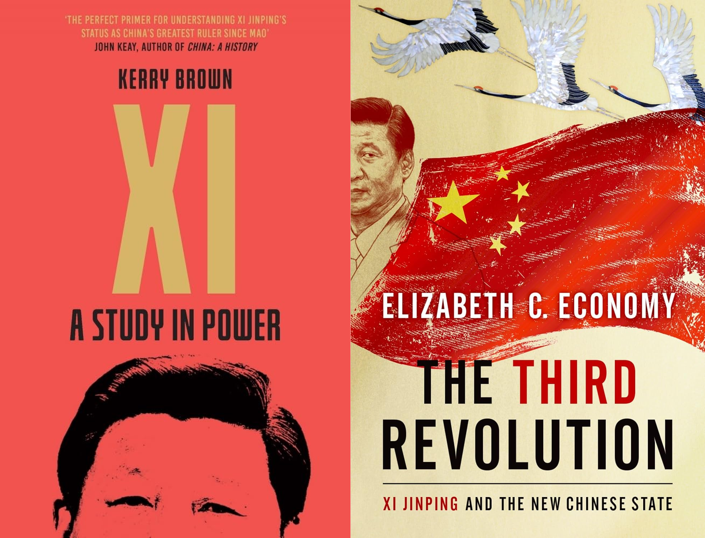

## À propos de la légitimité...

Avant tout, je tiens à clarifier certains points et préjugés que j'ai concernant ces ouvrages, dans un souci de transparence.

Ma connaissance des affaires internes chinoises est bien plus limitée que mon expérience directe avec leurs politiques étrangères, un trait que ces deux auteurs ne partagent certainement pas avec moi, puisqu'ils sont tous deux experts dans leur domaine et traitent des affaires chinoises depuis longtemps.

Mon approche pour cette critique sera à la fois celle d'un homme passionné qui fait de son mieux pour se tenir informé et exprimer son opinion sur les affaires actuelles, et celle de quelqu'un ayant une expérience directe avec les institutions étrangères de la Chine et leurs efforts pour, selon les mots de l'actuel secrétaire général [Xi Jinping](https://fr.wikipedia.org/wiki/Xi_Jinping), "ouvrir les portes de la Chine plus largement" ([discours au 19e Congrès national](http://www.xinhuanet.com/english/special/19cpcnc/documents.htm)).

Il s'agit donc à la fois d'un article d'opinion et d'une critique conjointe des ouvrages [Xi: A Study in Power](https://www.amazon.com/Xi-Study-Power/dp/1785788086) de [Kerry Brown](https://www.kcl.ac.uk/people/kerry-brown) et [The Third Revolution: Xi Jinping and the New Chinese State](https://www.amazon.com/Third-Revolution-Jinping-Chinese-State/dp/0190866071) d'[Elizabeth C. Economy](https://www.hoover.org/profiles/elizabeth-economy). Je comparerai directement les deux livres sur des points spécifiques avant de donner mon avis. Les points de vue du Dr. Brown et du Dr. Economy semblent souvent dessiner une image contrastée de la même vérité, ce qui sera très utile pour exprimer mes propres opinions comparativement.

## Leadership et Pouvoir

Dr. Brown décrit [Xi Jinping](https://fr.wikipedia.org/wiki/Xi_Jinping) comme un leader profondément concentré sur la consolidation du pouvoir au sein du [PCC](https://fr.wikipedia.org/wiki/Parti_communiste_chinois) et à travers toute la Chine. Il le décrit comme le dirigeant le plus puissant depuis Mao, en insistant sur les techniques employées pour maintenir la loyauté au sein du Parti :

> "Xi Jinping n'a pas seulement accumulé plus de pouvoir que tout autre dirigeant chinois depuis Mao, il l'a aussi fait plus rapidement et avec plus d'assurance dans sa propre direction."
 (<mark>Xi: A Study in Power</mark>, p. 38).

Brown soutient que la capacité de Xi à créer un pouvoir durable réside dans un mélange de nominations stratégiques au sein du Parti et de l'édification d'une influence quasi-cultuelle, utilisant la campagne anti-corruption presque exclusivement comme un moyen de détruire l'opposition.

Cependant, cette idée même est strictement réfutée par son contemporain, Dr. Economy, lors de sa [présentation à l'Université Victoria de Wellington](https://www.youtube.com/watch?v=OnBBJ6dXsu4&list=LL&index=1).

> "Les gens demandent souvent si la campagne anti-corruption de Xi Jinping est vraiment juste un mécanisme pour éliminer ses ennemis politiques ou si elle est légitime, et je pense qu'il est clair que c'est les deux... Xi Jinping n'a pas 620 000 ennemis politiques ; il s'agit d'un effort légitime pour nettoyer le Parti communiste."
 (<mark>[Economy](https://www.hoover.org/profiles/elizabeth-economy)</mark>, 2019).

**Mon avis :** [Xi Jinping](https://fr.wikipedia.org/wiki/Xi_Jinping) utilise continuellement la métaphore d'une course de relais, un prédécesseur doit préparer le bâton correctement avant de le transmettre à un autre. [La pensée de Xi Jinping](https://fr.wikipedia.org/wiki/Pensée_de_Xi_Jinping) est donc simplement la continuation logique de ce que [Deng Xiaoping](https://fr.wikipedia.org/wiki/Deng_Xiaoping) et [Hu Jintao](https://fr.wikipedia.org/wiki/Hu_Jintao) ont bâti avant lui. Ils n'ont bien sûr pas réussi à compléter le [socialisme aux caractéristiques chinoises](https://fr.wikipedia.org/wiki/Socialisme_aux_caract%C3%A9ristiques_chinoises), mais Xi leur rend hommage dans le premier volume de [La Gouvernance de la Chine](https://fr.wikipedia.org/wiki/La_Gouvernance_de_la_Chine), les qualifiant de porteurs légitimes de ce bâton métaphorique.

Bien que le récit puisse être remis en question, Dr. Economy elle-même soutient qu'elle ne croit pas que nous assistons actuellement à la formation d'une règle à vie :

> "Il peut désormais occuper à vie les trois postes les plus importants — Secrétaire général du Parti communiste, Président du pays et Président de la Commission militaire centrale —, bien que je ne m'attende pas à ce qu'il le fasse."
 (<mark>[Economy](https://www.hoover.org/profiles/elizabeth-economy)</mark>, 2019).

Je pense que Brown, avec sa profonde expérience des affaires internes chinoises, exagère peut-être l'étendue de l'influence de Xi, en établissant des parallèles malheureux avec Mao. En revanche, Economy dresse un tableau plus nuancé, reliant les affaires étrangères et internes pour construire ce qui ressemble à la perception interne des Chinois quant au régime de Xi.

## Contrôle domestique vs Ambition mondiale

Dr. Brown poursuit son analyse de [Xi Jinping](https://fr.wikipedia.org/wiki/Xi_Jinping) en se concentrant sur la manière dont Xi utilise son immense pouvoir pour assurer la stabilité interne de la Chine. Les politiques intérieures de Xi, telles que la campagne anti-corruption et son insistance sur le contrôle via le Parti, visent en fin de compte à préserver la domination du [Parti communiste](https://fr.wikipedia.org/wiki/Parti_communiste_chinois) en Chine.

> "La consolidation du pouvoir par Xi vise à garantir que le Parti communiste reste incontesté en Chine, même si cela doit se faire au détriment des libertés individuelles."
 (<mark>Xi: A Study in Power</mark>, p. 45).

Brown voit Xi comme un leader qui priorise la survie du Parti, même si cela implique de restreindre les libertés individuelles. Les dynamiques internes de la Chine, selon lui, concernent fondamentalement la préservation de ce statu quo de contrôle pour empêcher toute perturbation susceptible d'affaiblir la mainmise du Parti.

D'un autre côté, Dr. Economy se concentre davantage sur les ambitions mondiales de Xi et comment sa consolidation du pouvoir en Chine constitue un tremplin pour projeter l'influence de la Chine à l'étranger. Selon Economy, les politiques de Xi concernent autant l'exportation du modèle chinois que la préservation de la stabilité interne.

> "Xi Jinping a clairement indiqué que sa vision pour la Chine va au-delà de ses frontières... Il cherche à projeter le modèle de développement politique et économique actuel de la Chine à l'échelle mondiale."
 (<mark>[The Third Revolution](https://www.amazon.com/Third-Revolution-Jinping-Chinese-State/dp/0190866071)</mark>, p. 112).

Economy souligne que le contrôle domestique de Xi constitue la base de ses aspirations mondiales, des initiatives comme la [Belt and Road](https://fr.wikipedia.org/wiki/Initiative_des_Nouvelles_Routes_de_la_soie) au rôle croissant de la Chine dans les institutions internationales. L'ambition de Xi est de redéfinir les normes mondiales et de présenter la Chine comme une alternative aux démocraties libérales occidentales.

**Mon avis :** En se basant sur ma compréhension de la [pensée de Xi Jinping](https://fr.wikipedia.org/wiki/Pens%C3%A9e_de_Xi_Jinping) et sur la trajectoire de son leadership, il est évident que la consolidation du pouvoir par Xi sert un double objectif. Sur le plan intérieur, elle assure la stabilité et la continuité au sein du Parti communiste, poursuivant le travail commencé par [Deng Xiaoping](https://fr.wikipedia.org/wiki/Deng_Xiaoping) et [Hu Jintao](https://fr.wikipedia.org/wiki/Hu_Jintao). L'accent mis sur l'unité et la centralisation de l'autorité reflète non seulement un effort pour maintenir le pouvoir, mais aussi pour faire progresser les objectifs de développement à long terme de la Chine, notamment par le biais du [socialisme aux caractéristiques chinoises](https://fr.wikipedia.org/wiki/Socialisme_aux_caract%C3%A9ristiques_chinoises).

D'une perspective plus large, les ambitions de Xi vont clairement au-delà des frontières de la Chine. Ses initiatives mondiales, en particulier la [Belt and Road](https://fr.wikipedia.org/wiki/Initiative_des_Nouvelles_Routes_de_la_soie), ne sont pas uniquement économiques, mais s'inscrivent dans un effort stratégique visant à positionner la Chine comme acteur central dans l'ordre mondial.

## Réforme et Continuité

Dr. Brown dépeint [Xi Jinping](https://fr.wikipedia.org/wiki/Xi_Jinping) comme un leader plus préoccupé par la préservation du statu quo que par la mise en place de réformes radicales. Selon lui, la direction de Xi consiste à assurer la dominance du Parti tout en effectuant des ajustements calculés pour maintenir la stabilité et le pouvoir.

> "Xi n'est pas un réformateur au sens où il transformerait fondamentalement le système. Ses réformes visent plutôt à maintenir la mainmise du Parti sur le pouvoir et à assurer la pérennité du système."
 (<mark>Xi: A Study in Power</mark>, p. 65).

Brown souligne que, bien que Xi parle le langage de la réforme, ses politiques reflètent une approche plus conservatrice axée sur le renforcement du contrôle du Parti plutôt que sur une véritable modernisation de la Chine.

En revanche, Dr. Economy soutient que le leadership de [Xi Jinping](https://fr.wikipedia.org/wiki/Xi_Jinping) représente une nouvelle forme de réforme. Elle souligne comment les politiques de Xi transforment les paysages intérieurs et extérieurs de la Chine, rompant avec le mantra de [Deng Xiaoping](https://fr.wikipedia.org/wiki/Deng_Xiaoping) consistant à "garder un profil bas".

> "La Troisième Révolution de Xi représente une rupture significative avec le passé... Il cherche à créer une Chine plus affirmée et expansive, de plus en plus autoritaire à l'intérieur, mais aussi plus engagée à façonner l'ordre mondial."
 (<mark>[The Third Revolution](https://www.amazon.com/Third-Revolution-Jinping-Chinese-State/dp/0190866071)</mark>, p. 150).

Economy affirme que les réformes de Xi visent à créer un État plus fort et plus centralisé, capable de rivaliser sur la scène mondiale. Bien que ses politiques renforcent le contrôle du Parti sur le plan intérieur, elles reflètent également une vision plus large du rôle de la Chine dans le monde.

**Mon avis :** Le leadership de [Xi Jinping](https://fr.wikipedia.org/wiki/Xi_Jinping) semble concilier à la fois réforme et continuité. Bien que ses politiques renforcent le contrôle du Parti, je pense qu'elles jettent également les bases de changements structurels à long terme qui s'alignent sur le [socialisme aux caractéristiques chinoises](https://fr.wikipedia.org/wiki/Socialisme_aux_caract%C3%A9ristiques_chinoises). Son accent mis sur la modernisation économique et l'innovation technologique montre que Xi pousse à la réforme dans des domaines clés qui permettront à la Chine de s'imposer comme puissance mondiale.

Cela dit, les réformes de Xi ne concernent pas la démocratisation ou la libéralisation, mais le renforcement du système chinois d'une manière qui soutient la domination continue du Parti. C'est pourquoi je trouve l'interprétation de la "[Troisième Révolution](https://www.amazon.com/Third-Revolution-Jinping-Chinese-State/dp/0190866071)" du Dr. Economy convaincante : elle souligne que ces changements sont significatifs, même s'ils ne correspondent pas aux concepts occidentaux de réforme. Les réformes peuvent être autoritaires, mais elles reflètent une approche pragmatique du gouvernement qui positionne la Chine pour l'avenir.

## Conclusion

Les ouvrages de [Kerry Brown](https://www.kcl.ac.uk/people/kerry-brown) et d'[Elizabeth Economy](https://www.hoover.org/profiles/elizabeth-economy) offrent tous deux des éclairages précieux sur la nature complexe et multiforme du leadership de [Xi Jinping](https://fr.wikipedia.org/wiki/Xi_Jinping). Brown fournit une analyse détaillée des efforts de Xi pour consolider le pouvoir en Chine, le décrivant comme un leader axé principalement sur la stabilité interne et le maintien de la domination du Parti. Son travail met en avant les aspects plus conservateurs du leadership de Xi, soulignant la continuité plutôt que la réforme radicale.

En revanche, l'analyse d'Economy présente Xi comme une figure transformatrice, dont le leadership dépasse les frontières de la Chine. Elle montre comment Xi, par le biais de sa "[Troisième Révolution](https://www.amazon.com/Third-Revolution-Jinping-Chinese-State/dp/0190866071)", cherche à redéfinir l'ordre mondial, en utilisant à la fois le pouvoir économique et politique pour exporter le modèle chinois et influencer les normes internationales.

Finalement, je crois que les deux auteurs, [Brown](https://www.kcl.ac.uk/people/kerry-brown) et [Economy](https://www.hoover.org/profiles/elizabeth-economy), capturent des aspects essentiels du leadership de Xi. L'accent mis par Brown sur le contrôle intérieur souligne l'importance de la stabilité dans l'approche de Xi, tandis que l'emphase d'Economy sur l'ambition mondiale reflète la portée plus large des politiques de Xi sur la scène internationale. Le leadership de Xi consiste à équilibrer ces deux forces, assurant que la Chine reste stable et puissante chez elle tout en se positionnant comme leader mondial.

De mon point de vue, [Xi Jinping](https://fr.wikipedia.org/wiki/Xi_Jinping) représente une continuation de la trajectoire historique de la Chine, mélangeant à la fois réforme et continuité. Son accent sur la stabilité et la centralisation reflète une profonde compréhension des besoins politiques de la Chine, tandis que ses ambitions mondiales poussent la Chine vers un rôle plus affirmé dans l'ordre international. Les analyses des deux auteurs offrent des perspectives complémentaires qui aident à dresser un portrait plus complet du leadership complexe et dynamique de Xi Jinping.

P.S. : Il me semble que, bien que les deux auteurs soient des experts de la question des politiques chinoises, ils adoptent une perspective très centrée sur la politique étrangère américaine. Il serait rafraîchissant de voir ces auteurs sortir des sentiers battus et adopter une posture plus indépendante, en particulier pour [Dr. Economy](https://www.hoover.org/profiles/elizabeth-economy)'s Third Revolution.

<mark>- yaro</mark>
