Dans une bataille juridique se déroulant dans le Japon de l'ère Meiji et la Grande-Bretagne victorienne, [Dai Gyakuten Saiban](https://www.ace-attorney.com/great1-2/us/) apporte un souffle nouveau à la franchise [Ace Attorney](https://www.ace-attorney.com) qui en avait bien besoin.

Avant sa localisation officielle, [Dai Gyakuten Saiban](https://www.ace-attorney.com/great1-2/us/) était un jeu que de nombreux fans hors du Japon (moi y compris) rêvaient seulement de pouvoir essayer. Je me souviens très bien d’avoir passé d'innombrables heures à travailler sur la traduction française avec d'autres fans passionnés, afin de faire découvrir les mystères de *The Great Ace Attorney* à de nouveaux publics bien avant sa sortie en Occident.

Aujourd'hui, je prends un moment pour réfléchir à mon parcours avec ce jeu, mais aussi à l'évolution incroyable de la franchise [Ace Attorney](https://www.ace-attorney.com) et à la manière dont cet opus a marqué à la fois moi-même et le monde du jeu vidéo.

## La Nouvelle Ère de [Ace Attorney](https://www.ace-attorney.com)

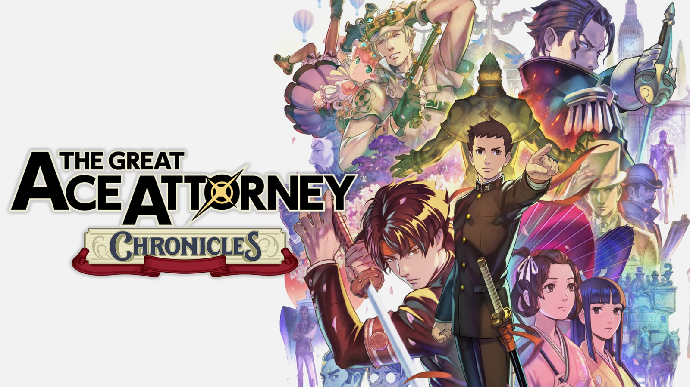

[Dai Gyakuten Saiban](https://www.ace-attorney.com/great1-2/us/) introduit une narration plus lente et plus complexe que ses prédécesseurs. Composé de deux titres interconnectés, *Adventures* et *Resolve*, le jeu raconte une histoire continue qui nécessite environ 80 heures pour être complétée. Contrairement aux épisodes précédents, où les affaires étaient plus indépendantes, [Dai Gyakuten Saiban](https://www.ace-attorney.com/great1-2/us/) adopte une trame narrative continue, exploitant pleinement son format de [Roman Visuel](https://wikipedia.org/wiki/Visual_Novel).  

Le rythme est un départ notable par rapport aux jeux [Phoenix Wright](https://www.ace-attorney.com). Les affaires étaient souvent résolues rapidement, offrant une satisfaction immédiate mais éphémère, et certaines phases d'enquête devenaient ennuyeuses. La création de cette série dérivée a permis aux scénaristes de se libérer et de prendre leur temps : étirer les affaires sur plusieurs sessions de tribunal, approfondir les enquêtes et le développement des personnages, et interconnecter les affaires entre les deux jeux. Cette narration plus lente permet de révéler progressivement des rebondissements plus profonds et des arcs narratifs plus riches à chaque procès. Bien que ce rythme volontaire puisse sembler long, notamment dans *Adventures*, il est récompensé par une narration plus riche et une profondeur émotionnelle plus prononcée.

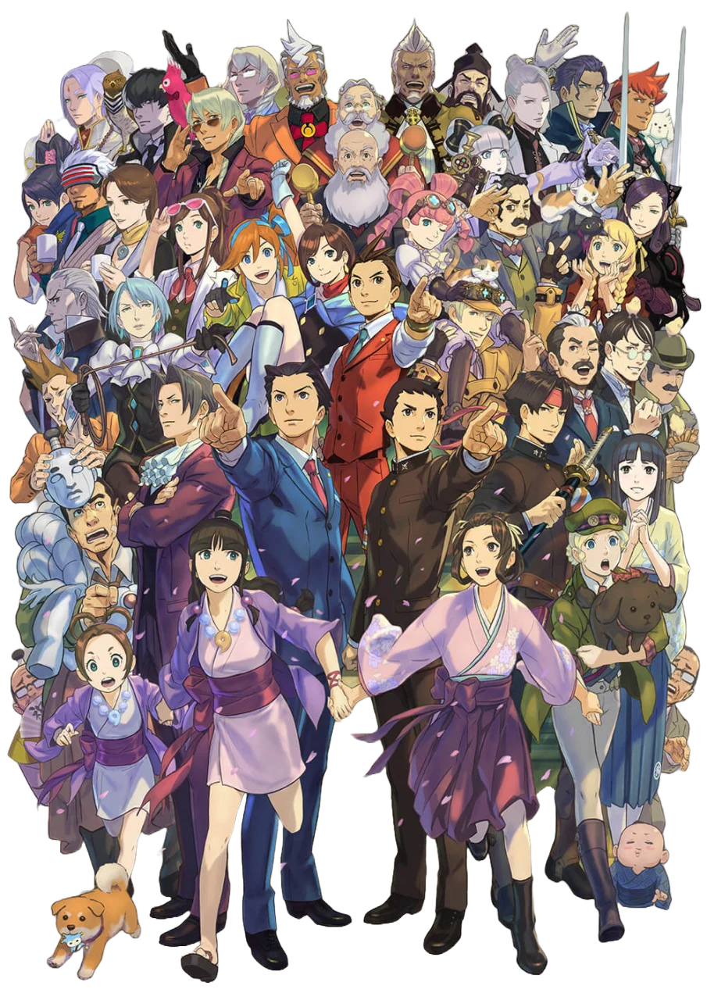

## Synopsis

Ryūnosuke Naruhodō, l'un des ancêtres de [Phoenix Wright](https://aceattorney.fandom.com/wiki/Phoenix_Wright), est contraint de se rendre de manière inattendue au Royaume-Uni pour devenir avocat de la défense. Dans l'espoir de mieux comprendre le système juridique japonais encore en développement, notre protagoniste deviendra progressivement un avocat aguerri, avec une profonde compréhension non seulement du droit, mais aussi des paradigmes culturels qui s'affrontent.

Avec l'aide de son assistante juridique Susato Mikotoba, Naruhodō devra se poser des questions éthiques difficiles sur la moralité de ses objectifs et sur les sacrifices qu'il est prêt à faire pour les atteindre.

## Immersion

Le passage des décors modernes aux environnements du XIXe siècle, entre le Japon et la Grande-Bretagne, confère au jeu une esthétique unique, mélangeant réalisme historique et le style dramatique caractéristique de la série. Les environnements — des salles de tribunal britanniques grandioses aux rues animées du Japon de l’ère Meiji — sont méticuleusement conçus, créant un monde authentique et immersif.   

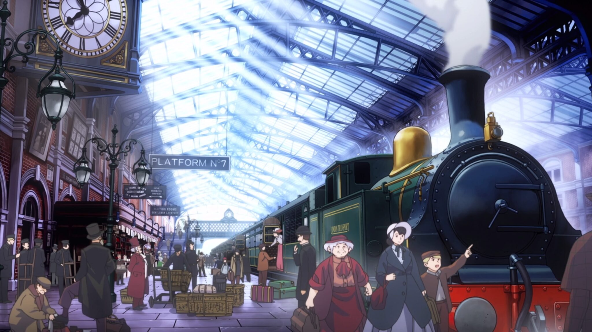

Chaque lieu est bien plus qu'un simple décor. Le contexte culturel et historique du Japon de l'ère Meiji et de la Grande-Bretagne victorienne ajoute de nouveaux enjeux aux affaires, où le choc entre les philosophies juridiques occidentales et orientales est non seulement présent dans les intrigues, mais se reflète également dans les procédures judiciaires. Le statut d'étranger de Ryūnosuke en Grande-Bretagne ajoute une couche de tension constante, et sa quête de justice est empreinte d'un sentiment profond d'identité culturelle et d'appartenance.

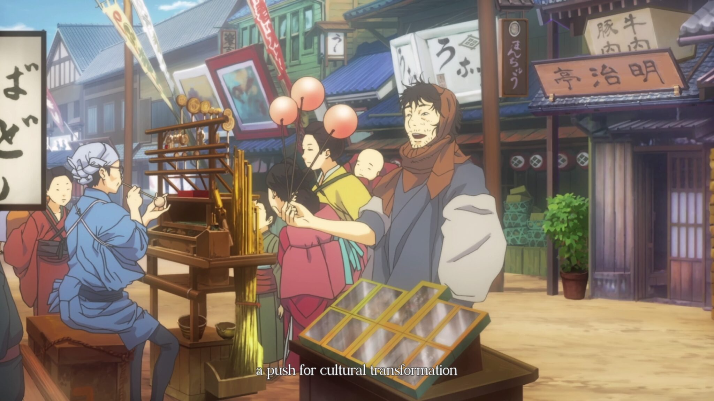

Le rythme plus lent permet aux joueurs d’absorber les nuances culturelles de chaque lieu, faisant des batailles judiciaires bien plus que de simples disputes légales — ce sont des affrontements entre empires, idéologies et époques. Cette construction du monde enrichit la narration, augmentant l'enjeu de chaque affaire.

## Personnages

Au cœur de [Dai Gyakuten Saiban](https://www.ace-attorney.com/great1-2/us/), on trouve des personnages richement développés. La transformation de Ryūnosuke, passant de novice hésitant à avocat de la défense confiant, reflète en partie le parcours de [Phoenix Wright](https://aceattorney.fandom.com/wiki/Phoenix_Wright), mais celui de Ryūnosuke est plus méthodique et ancré dans la culture. Le jeu met en lumière la tension entre Japonais et Britanniques, n'hésitant pas à aborder les termes racistes employés à tout-va, que ce soit par les roturiers britanniques ou par les représentants de la [Couronne](https://www.merriam-webster.com/dictionary/the%20crown).

[Kazuma Asogi](https://aceattorney.fandom.com/wiki/Kazuma_Asogi), le charismatique meilleur ami de Ryūnosuke, maniant son katana avec dextérité, apporte à la fois du poids émotionnel et narratif. Sa croyance en les capacités de Ryūnosuke pousse ce dernier à grandir et crée une dynamique oscillant entre amitié et rivalité profonde. Les nobles objectifs de Kazuma et sa présence dramatique en font un point d'ancrage émotionnel essentiel pour le joueur. Son arc se distingue comme l'un des plus marquants de la franchise [Ace Attorney](https://www.ace-attorney.com), bien qu'il soit inutile de dire que la relation entre Naruhodō et Kazuma est très différente de celle entre [Edgeworth](https://aceattorney.fandom.com/wiki/Miles_Edgeworth) et [Phoenix](https://aceattorney.fandom.com/wiki/Phoenix_Wright)... 😳

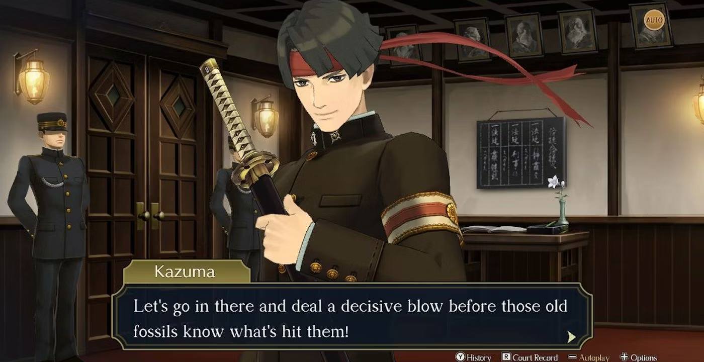

[Herlock Sholmes](https://aceattorney.fandom.com/wiki/Herlock_Sholmes), la version excentrique et juridiquement douteuse de Sherlock Holmes proposée par Capcom, est l’un des points forts du jeu. Herlock est un personnage extravagant, dont la "Danse de la Déduction" apporte une touche d'humour bienvenue dans les phases d'investigation. Son génie imparfait et ses conclusions ridicules permettent à Ryūnosuke d’intervenir et de le corriger, tandis que sa relation presque paternelle avec [Iris Wilson](https://aceattorney.fandom.com/wiki/Iris_Wilson), une enfant prodige qui l’assiste, est incroyablement attachante.

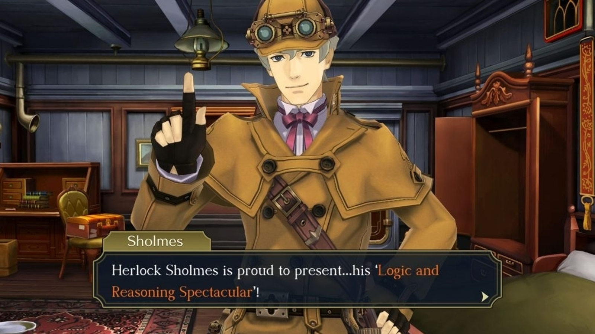

Le casting secondaire n'est pas en reste. Le Lord Chief Justice [Mael Stronghart](https://aceattorney.fandom.com/wiki/Mael_Stronghart) domine le monde judiciaire de sa présence imposante. Toujours en retard, jamais parfait, mais bien plus imposant que Ryūnosuke ne semble pouvoir l’être. De même, l'inspecteur [Tobias Gregson](https://aceattorney.fandom.com/wiki/Tobias_Gregson), l'enquêteur chevronné de [Scotland Yard](https://aceattorney.fandom.com/wiki/Metropolitan_Police_Service), apporte une touche de réalisme et de rigueur aux séquences d'investigation. Son approche directe et sans détour contraste merveilleusement avec l’excentricité de Sholmes.

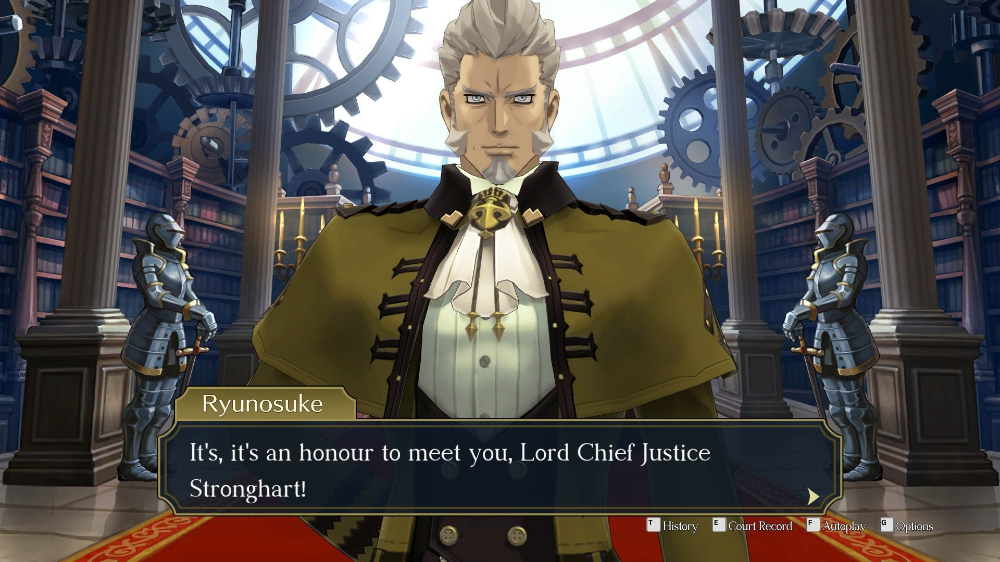

Les personnages, en particulier les procureurs, sont aussi bien écrits que visuellement marquants. [Barok van Zieks](https://www.google.com/search?client=safari&rls=en&q=barok+van+zieks&ie=UTF-8&oe=UTF-8), le procureur préféré de tout le monde, avec son mystérieux caractère, son humour noir et sa réputation terrifiante, incarne cela à la perfection. Sa rivalité avec Ryūnosuke est alimentée par son mépris pour ce qu'il appelle les "Nippons". Mais à mesure que l’histoire avance, des aspects plus profonds de son personnage sont révélés, en faisant, à mon avis, le procureur le plus fascinant de la série.

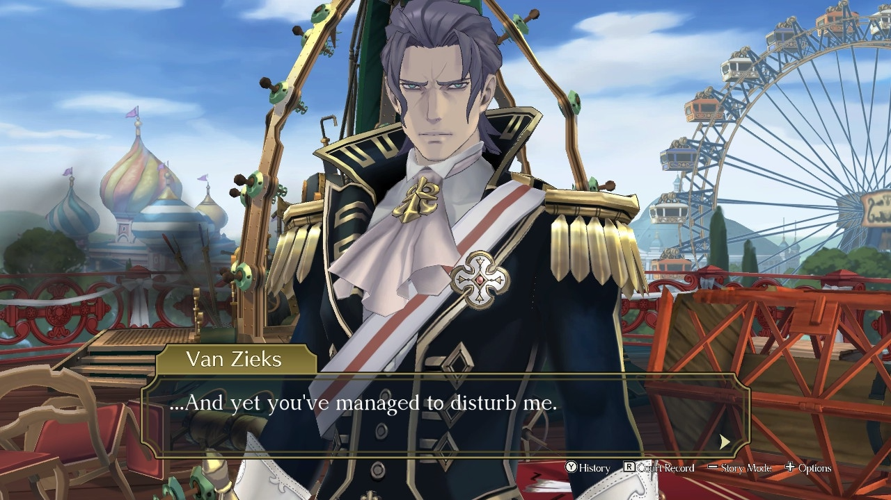

## La Vision de [Shu Takumi](https://en.wikipedia.org/wiki/Shu_Takumi)

Derrière cette riche tapisserie de personnages se trouve nul autre que [Shu Takumi](https://en.wikipedia.org/wiki/Shu_Takumi), le créateur visionnaire de la série [Ace Attorney](https://www.ace-attorney.com).    

Son expérience avec *[Professeur Layton vs. Phoenix Wright: Ace Attorney](https://en.wikipedia.org/wiki/Professor_Layton_vs._Phoenix_Wright:_Ace_Attorney)* a clairement inspiré ce jeu. Entre une expérience narrative plus fluide, un cadre historique, les interactions entre les personnages et l’humour omniprésent, Takumi avait visiblement une idée précise en tête lorsqu'il a entrepris de travailler sur cette série dérivée.

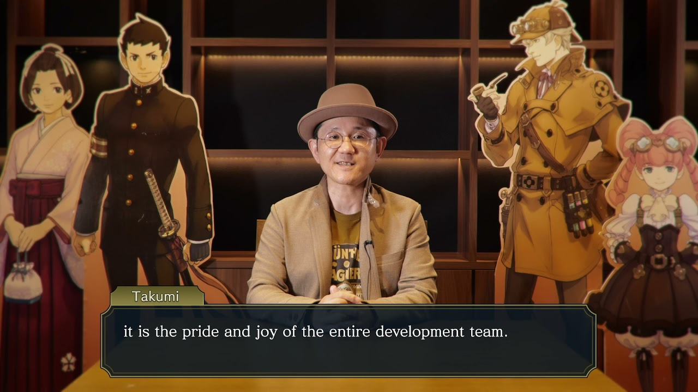

Le style d'écriture de Takumi est immédiatement reconnaissable — incisif, plein d'esprit, et riche en rebondissements. Sa capacité à créer des personnages à la fois exagérés et émotionnellement ancrés rend la narration captivante. Sous sa direction, [Dai Gyakuten Saiban](https://www.ace-attorney.com/great1-2/us/) équilibre les batailles juridiques intenses avec des interactions pleines de verve. Chaque personnage, aussi secondaire soit-il, possède une personnalité marquée et un design unique, garantissant qu'ils laissent une impression bien après la fin du procès.

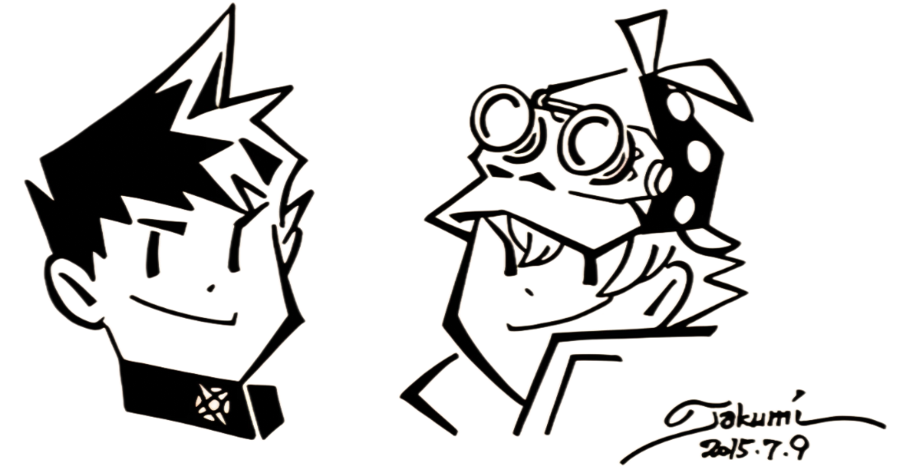

La vision unique de [Shu Takumi](https://en.wikipedia.org/wiki/Shu_Takumi) et son dévouement à l’art de la narration font de [Dai Gyakuten Saiban](https://www.ace-attorney.com/great1-2/us/) non seulement un chef-d'œuvre dans la série [Ace Attorney](https://www.ace-attorney.com), mais aussi une œuvre majeure qui permet au genre du roman visuel de toucher un public plus large.

## Le Tribunal

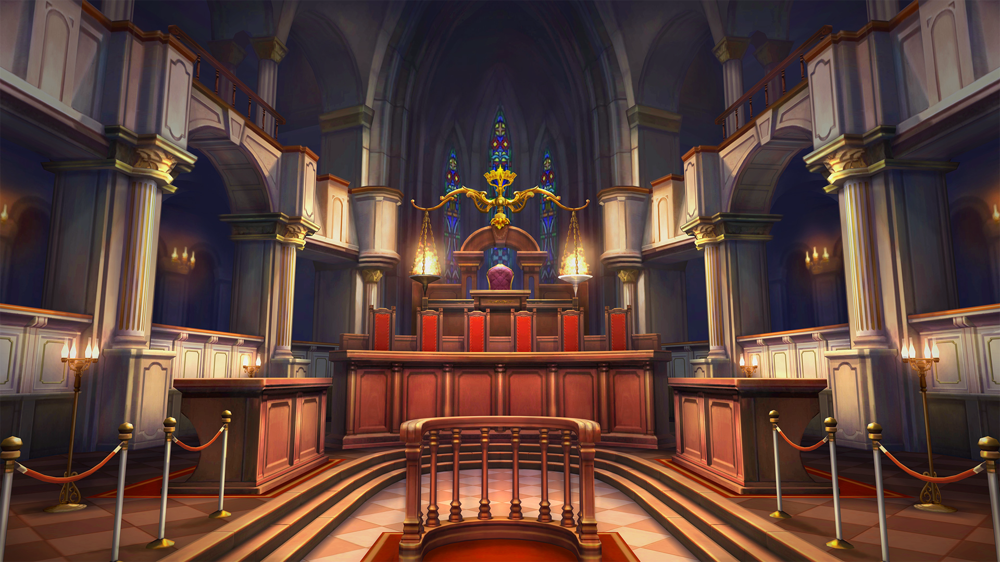

[Dai Gyakuten Saiban](https://www.ace-attorney.com/great1-2/us/) reprend la formule établie par [Ace Attorney](https://www.ace-attorney.com), puis continue de la construire pour créer un tout nouveau système. L’ajout le plus notable est sans aucun doute le système de jury — les tribunaux britanniques présentent désormais un panel de jurés, obligeant les joueurs à s'engager dans l'« [Examen des Délibérations](https://aceattorney.fandom.com/wiki/Jury#Summation_examination) ». Cette fonctionnalité vous permet de confronter les préjugés et les contradictions des jurés en temps réel, vous forçant à réfléchir de manière critique à chaque perspective et à manipuler leur décision collective.  

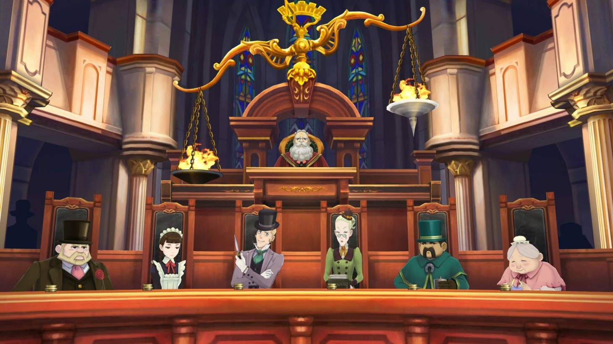

L’ambition de [Shu Takumi](https://en.wikipedia.org/wiki/Shu_Takumi) de bouleverser le format traditionnel de [Ace Attorney](https://www.ace-attorney.com) est indéniable. Outre le système de jury, la gestion des preuves a été perfectionnée. Dans les anciens jeux, les joueurs se retrouvaient souvent face à des situations où ils connaissaient la solution mais avaient du mal à présenter l’élément exact requis par le jeu. [Dai Gyakuten Saiban](https://www.ace-attorney.com/great1-2/us/) atténue ce problème en offrant plus de flexibilité dans l’utilisation des preuves.

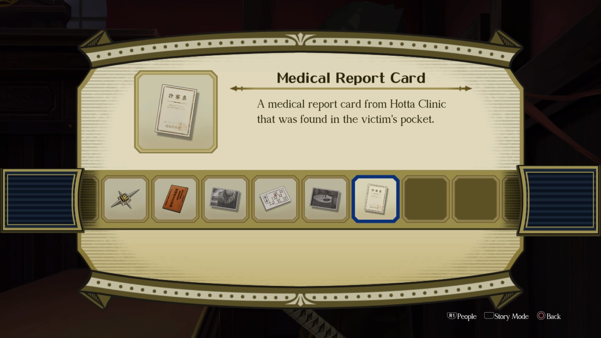

Les procès sont plus imprévisibles et intellectuellement stimulants. L’interaction entre Ryūnosuke, les jurés aux personnalités uniques et le juge présidant rend chaque bataille judiciaire plus stratégique, ajoutant des couches d’engagement bien au-delà de ce que les [jeux précédents](https://www.ace-attorney.com) pouvaient offrir.

## Musique

La musique de [Dai Gyakuten Saiban](https://www.ace-attorney.com/great1-2/us/) joue un rôle essentiel dans l’établissement de l’ambiance tout au long du jeu. Composée par [Yasumasa Kitagawa](https://aceattorney.fandom.com/wiki/Yasumasa_Kitagawa), la bande originale mélange habilement des orchestrations appropriées à l'époque avec la tension dramatique caractéristique de la série [Ace Attorney](https://www.ace-attorney.com). Les compositions comme "[Court Begins](https://www.youtube.com/watch?v=hBJPnEBpdkg)" et "[Cross-Examination](https://www.youtube.com/watch?v=r2V8u9IUAuI)" injectent de l'urgence et du suspense dans les procès.   

<iframe src="https://www.youtube.com/embed/oLZ96kPl0Ew?si=JmECVmdxMetGsCXY" 
        title="Lecteur vidéo YouTube" 
        frameborder="0" 
        allow="accéléromètre; lecture automatique; bloc-notes; médias cryptés; gyroscope; image dans l'image; partage Web" 
        referrerpolicy="strict-origin-when-cross-origin" 
        allowfullscreen 
        style="width: 100%; height: 472.5px">
</iframe>

Les critiques ont salué la façon dont la musique améliore à la fois la narration et le contexte historique, mêlant des thèmes orchestraux reflétant les époques victorienne et Meiji tout en conservant l'énergie ludique et intense que les fans attendent de la série. Le thème de [Herlock Sholmes](https://aceattorney.fandom.com/wiki/Herlock_Sholmes), en particulier, ajoute une touche légère et brillante à ses déductions, complétant l'humour et l'excentricité de son personnage.

## Réception Critique et Héritage

Depuis sa sortie officielle en Occident, [Dai Gyakuten Saiban](https://www.ace-attorney.com/great1-2/us/) a reçu un accueil très positif. Les critiques et les joueurs ont salué le jeu pour sa narration captivante, le développement complexe de ses personnages et ses mécaniques de gameplay innovantes. Beaucoup le considèrent comme l’un des meilleurs volets de la série.

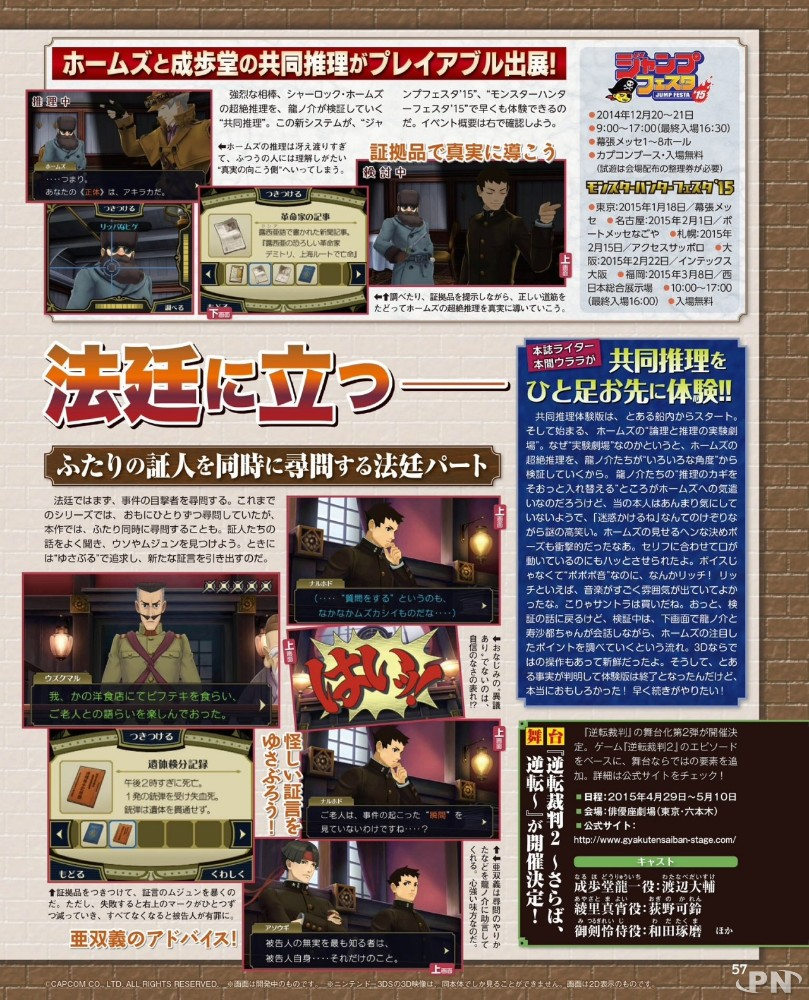

Cependant, cela n'est pas nécessairement vrai au Japon ou pour une partie de la presse occidentale. Bien que [Famitsu](https://www.famitsu.com) ait attribué une note de 35/40 à DGS, certains critiques plus chevronnés ont noté que le rythme, en particulier dans les premières phases, était plus lent que dans les épisodes précédents, ce qui pouvait être un défi pour certains joueurs.

[IGN](https://me.ign.com/fr) (sachant combien leurs avis comptent, lol) a qualifié le rythme de "glacial", [Nintendo Life](https://www.nintendolife.com) n'a pas apprécié les "dialogues trop longs", et [Destructoid](https://www.destructoid.com) a décrit certaines phases d'investigation comme "gadgetisées". Malgré tout, la narration et les arcs des personnages ont été largement salués, en particulier l'évolution de Ryūnosuke et ses interactions avec Sholmes.

## L'Influence de *Phoenix Wright X Layton*

L'influence de *[Professeur Layton vs. Phoenix Wright: Ace Attorney](https://en.wikipedia.org/wiki/Professor_Layton_vs._Phoenix_Wright:_Ace_Attorney)* est évidente dans l'approche de [Shu Takumi](https://en.wikipedia.org/wiki/Shu_Takumi) pour [Dai Gyakuten Saiban](https://www.ace-attorney.com/great1-2/us/). Dans des interviews, Takumi a mentionné que son travail sur le crossover lui a permis d'explorer la narration dans un contexte historique, mélangeant résolution d'énigmes et drame juridique. Cette expérience a contribué à façonner sa vision pour [Dai Gyakuten Saiban](https://www.ace-attorney.com/great1-2/us/), où il a intégré des énigmes et des déductions plus élaborées dans le cadre juridique.

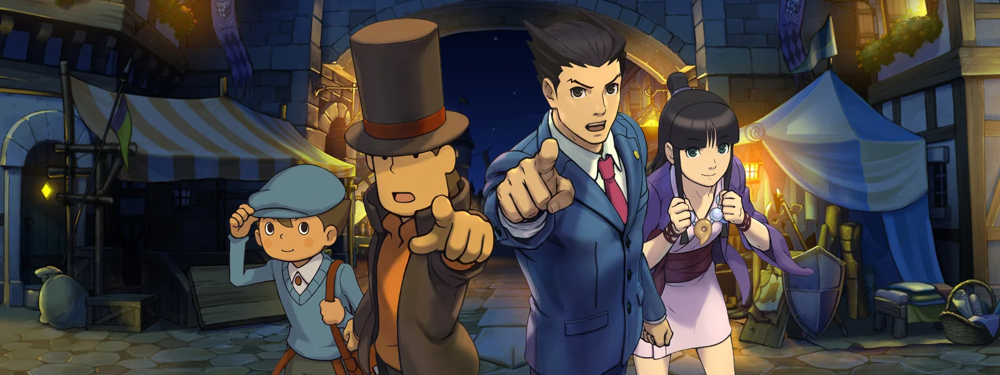

Cette combinaison de résolution de mystères et de batailles judiciaires élève le gameplay au-delà de ce que nous avions vu dans les précédents épisodes. Le résultat est un jeu qui se présente à la fois comme une évolution de la formule [Ace Attorney](https://www.ace-attorney.com) et une lettre d'amour aux influences narratives plus larges de Takumi.

## Conclusion

Dès que vous commencez [Dai Gyakuten Saiban](https://www.ace-attorney.com/great1-2/us/), il y a une sensation indéniable de grandeur. Le cadre historique, la musique majestueuse, et la dynamique complexe des personnages contribuent à un voyage émotionnel à la fois personnel et épique. Chaque procès ressemble à une bataille à enjeux élevés — non seulement pour la justice, mais aussi pour la compréhension entre cultures, entre systèmes, et entre personnes.

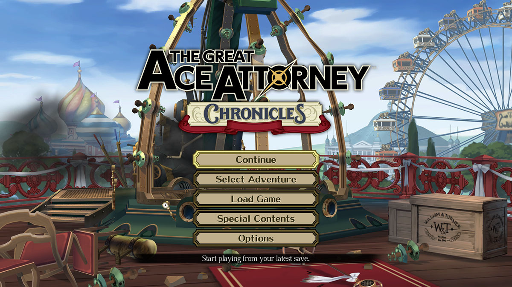

Au fur et à mesure que le jeu se déploie, la relation croissante entre Ryūnosuke et ses alliés, en particulier Susato et Herlock, ajoute une profondeur émotionnelle. Vous ressentez une connexion profonde à leurs luttes et triomphes, un peu comme dans les anciens jeux [Ace Attorney](https://www.ace-attorney.com), mais ici, c'est imprégné de la complexité culturelle et historique. L'incertitude de la position de Ryūnosuke en tant que nouvel arrivant dans le droit britannique amplifie la tension, rendant chaque victoire précieuse et chaque défaite un moment d'introspection.

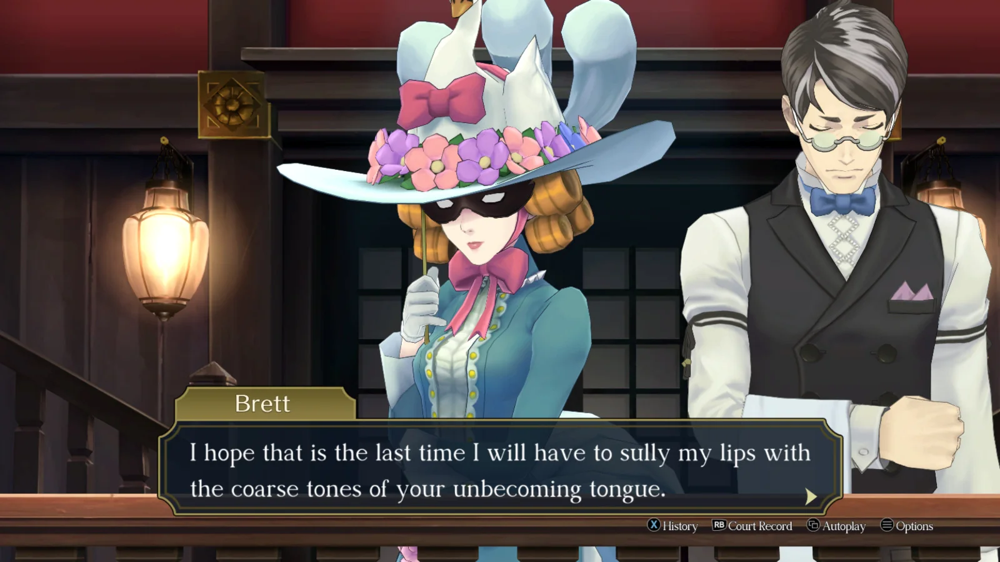

[Dai Gyakuten Saiban](https://www.ace-attorney.com/great1-2/us/) offre une immense satisfaction. Que ce soit l'excitation de démêler un mystère complexe, la joie de surpasser le jury, ou les moments sincères entre les personnages, ce jeu ne cesse de surprendre et d'émouvoir.

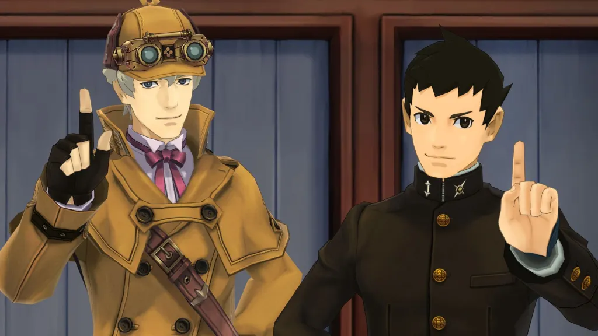

Pour moi, ayant participé au travail de traduction pour amener ce jeu à un public plus large, sa sortie officielle est une véritable victoire personnelle. C'est un jeu qui non seulement honore l'héritage de la série, mais qui fixe également de nouvelles normes pour ce que peut être un drame juridique.

Que vous soyez un fan de longue date ou un nouveau venu dans la série, [Dai Gyakuten Saiban](https://www.ace-attorney.com/great1-2/us/) offre une expérience riche et immersive, remplie d'intrigues historiques, de conflits culturels et de personnages inoubliables.

*- yaro*
