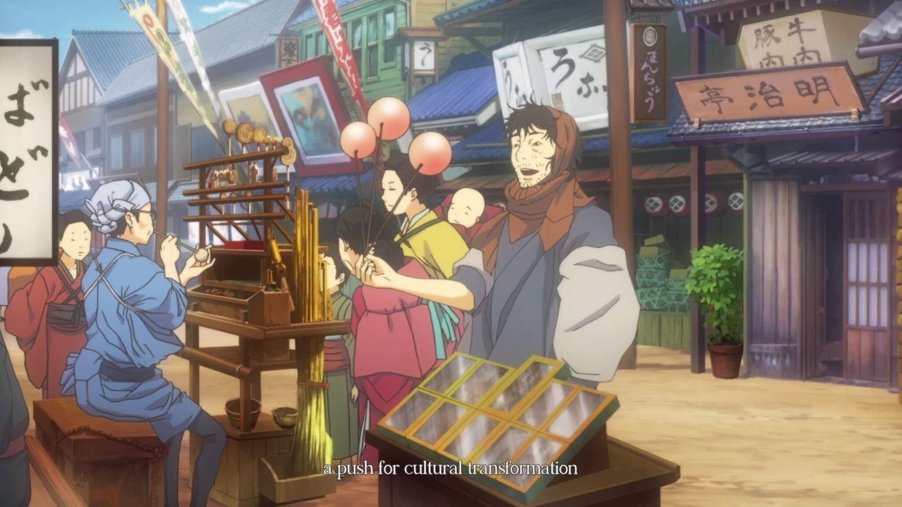
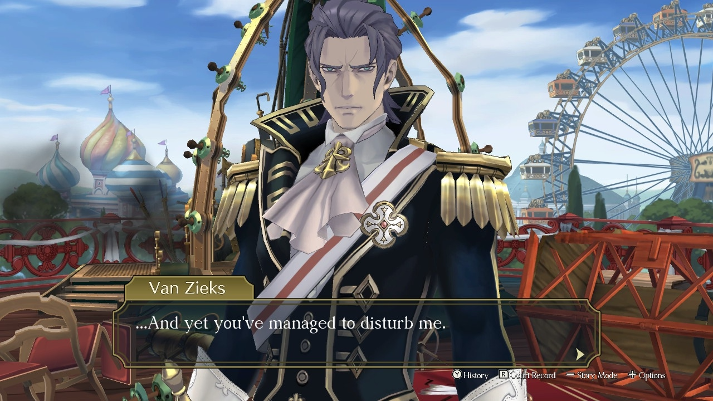

title: "Dai Gyakuten Saiban: An Odyssey of Justice Across Empires."
date: 2024-09-27
tags: ['Multimedia', 'Games']
description: "Thank you, Shu Takumi."
cover: "/covers/cover-dgs.png"
---

In a legal battle set between Meiji-era Japan and Victorian Great Britain, [Dai Gyakuten Saiban](https://www.ace-attorney.com/great1-2/us/) achieves the feat of reviving a franchise that was seriously starting to stagnate. It took a return to the past for the series to regain some of its lost breath.

Before its official localization, *Dai Gyakuten Saiban* was nothing but an inaccessible dream for Western fans (including myself). After countless hours spent bleeding over translating the game into French with other passionate fans, Capcom finally realized this game deserved to be released outside of Japan. Kudos for the belated enlightenment.

Now, it's time to revisit this game and understand its importance in a series that was in dire need of it.

## A New Era for [Ace Attorney](https://www.ace-attorney.com)

[Dai Gyakuten Saiban](https://www.ace-attorney.com/great1-2/us/) bets on a slow, even laborious narrative compared to its predecessors. Comprising two interconnected titles (*Adventures* and *Resolve*), the story stretches across 80 hours, and you’ll definitely feel them. Gone are the small cases you could wrap up in one or two sessions. Here, each trial drags on, each investigation lingers, and you must be ready to plunge deep into this seemingly endless narrative. For some, it will be a profound journey. For others, a slow march.

<mark>Where *Phoenix Wright* games offered quick, satisfying resolutions, *Dai Gyakuten Saiban* revels in taking its time.</mark> The writers clearly decided it was time to slow down and focus on the very slow, deliberate construction of the plot. Fortunately, all this stretching isn't in vain: richer narrative arcs, sharper twists, and deeper emotional depth unfold if you have the patience to stick with it.

## Synopsis

Ryūnosuke Naruhodō, an ancestor of [Phoenix Wright](https://aceattorney.fandom.com/wiki/Phoenix_Wright), finds himself catapulted to the United Kingdom to become a defense attorney. Brilliant idea. A young Japanese lawyer, in the middle of an elitist and racist British legal system. Dream scenario. But our hero will learn to navigate between two worlds while confronting ethical dilemmas that will often make him falter. And all this with his assistant [Susato Mikotoba](https://aceattorney.fandom.com/wiki/Susato_Mikotoba), who’s there to remind us that even the best intentions can be sabotaged by reality.

## Immersion

Set in the 19th century, between a modernizing Japan and an imperialist Great Britain, the game offers an aesthetic distinct from previous titles. Finally, some fresh air. But beyond the setting, it's the clash of thought systems, cultures, and national egos that gives each trial particular weight.

As an outsider, Ryūnosuke is met with disdain everywhere he goes. This constant tension, this latent discomfort, permeates every interaction. <mark>The game delves into a kind of ideological battle, with each country trying to prove its moral and legal superiority.</mark> A judicial cold war.

The slower pace allows players to absorb these cultural nuances. But let's be honest, some will find the pacing about as thrilling as a snail race. Each battle isn't just about the law, it's a struggle for influence between two empires.

## Characters

[Dai Gyakuten Saiban](https://www.ace-attorney.com/great1-2/us/) shines through its characters, far more than its sometimes interminable trials. Ryūnosuke's transformation from hesitant novice to seasoned defense attorney follows a familiar arc, but here it's done with a subtlety the franchise may have forgotten. The tense relationship between Japan and Great Britain is palpable, and it’s not just surface tension — you get pulled deep into it.

[Kazuma Asogi](https://aceattorney.fandom.com/wiki/Kazuma_Asogi), the charismatic friend, is the force that drives Ryūnosuke forward. But let's be honest, his role is far more predictable than they’d have us believe. Despite that, he’s an emotional anchor, even if his arc doesn’t reach the heights one might hope.

Then there’s [Herlock Sholmes](https://aceattorney.fandom.com/wiki/Herlock_Sholmes). A character as ridiculous as he is essential. Capcom dared to reinvent Sherlock Holmes into a walking parody, and against all odds, it works. His failed deductions and humor erupt in the middle of the game’s sometimes overly serious atmosphere.

But the real gem is [Barok van Zieks](https://aceattorney.fandom.com/wiki/Barok_van_Zieks). This prosecutor is an imposing figure, with his blatant racism and dark humor. Every interaction with him reminds Ryūnosuke that he doesn’t belong, and that he’s constantly judged before even stepping into the courtroom. Van Zieks is perhaps one of the most fascinating prosecutors in the entire franchise, and trust me, there have been some big ones.

## [Shu Takumi](https://en.wikipedia.org/wiki/Shu_Takumi)'s Vision

Behind it all is, of course, [Shu Takumi](https://en.wikipedia.org/wiki/Shu_Takumi), the genius behind the series, whose signature is recognizable a mile away. After having fun with *Professor Layton vs. Phoenix Wright*, he took everything that worked and decided to go all-in with *Dai Gyakuten Saiban*. Between the humor, the complexity of the characters, and the narrative twists, he proves once again that he’s not here to play by established rules.

The game blends historical tensions and legal battles with a depth that some recent installments lacked. <mark>*Dai Gyakuten Saiban* isn’t just a spin-off, it’s a reminder that Takumi still knows how to build tension without blowing his players' nerves (well, maybe...).</mark>

## The Courtroom

The jury system is undoubtedly one of the game’s best innovations. The "[Summation Examination](https://aceattorney.fandom.com/wiki/Jury#Summation_examination)" injects fresh life into the courtroom. You’re tasked with dismantling the biases of jurors, and if some seem completely stubborn, it’s the complexity of the system that’s really brought to light. This addition transforms what could have been a simple rehash into something fresh and engaging.

Add to that a more flexible handling of evidence. Gone are the frustrating situations where you know the solution but the game refuses to let you present it. Here, *Dai Gyakuten Saiban* shows that the writers (finally) understand that a little flexibility goes a long way.

## Music

The soundtrack of [Dai Gyakuten Saiban](https://www.ace-attorney.com/great1-2/us/), composed by [Yasumasa Kitagawa](https://aceattorney.fandom.com/wiki/Yasumasa_Kitagawa), perfectly accompanies the game’s tense atmosphere. The orchestration is subtle and reflects the Meiji and Victorian eras while maintaining the dramatic energy we’ve come to expect from the series.
  
<iframe src="https://www.youtube.com/embed/oLZ96kPl0Ew?si=JmECVmdxMetGsCXY" 
        title="Lecteur vidéo YouTube" 
        frameborder="0" 
        allow="accéléromètre; lecture automatique; bloc-notes; médias cryptés; gyroscope; image dans l'image; partage Web" 
        referrerpolicy="strict-origin-when-cross-origin" 
        allowfullscreen 
        style="width: 100%; height: 472.5px">
</iframe>

The critics have praised how the music enhances both the storytelling and the historical context, blending orchestral themes reflecting the Victorian and Meiji eras with the intense, playful energy fans expect. The theme of [Herlock Sholmes](https://aceattorney.fandom.com/wiki/Herlock_Sholmes), in particular, adds a light, brilliant touch to his deductions, complementing the humor and eccentricity of his character.

## Critical Reception and Legacy

Since its official release in the West, [Dai Gyakuten Saiban](https://www.ace-attorney.com/great1-2/us/) has received widespread praise. Critics and players alike have praised the game for its captivating storytelling, the complex development of its characters, and its innovative gameplay mechanics. Many consider it one of the best entries in the series.

However, this isn’t necessarily true in Japan or among parts of the Western press. While [Famitsu](https://www.famitsu.com) gave DGS a score of 35/40, some more seasoned critics noted that the pacing, particularly in the early stages, was slower than previous episodes, which might challenge some players.

[IGN](https://me.ign.com/fr) called the pace "glacial," [Nintendo Life](https://www.nintendolife.com) disliked the "overly long dialogues," and [Destructoid](https://www.destructoid.com) described certain investigation phases as "gimmicky." Nevertheless, the narrative and character arcs have been widely praised, particularly Ryūnosuke’s evolution and his interactions with Sholmes.

## Conclusion

[Dai Gyakuten Saiban](https://www.ace-attorney.com/great1-2/us/) manages to breathe new life into the *Ace Attorney* franchise, leaning on a complex historical backdrop and a narrative that takes its time. Though the slow pace may put off some players, the game uses this pacing to build deeply developed characters and dense plots, where every trial feels like a cultural and legal battle.

Between the palpable tension of Japan facing off against Great Britain, memorable characters like [Barok van Zieks](https://aceattorney.fandom.com/wiki/Barok_van_Zieks) and [Herlock Sholmes](https://aceattorney.fandom.com/wiki/Herlock_Sholmes), and innovations like the jury system, the game transcends the series' usual standards.

For those with the patience to immerse themselves in this blend of legal intrigue and cultural clashes, *Dai Gyakuten Saiban* proves to be a crucial addition to the franchise. [Shu Takumi](https://en.wikipedia.org/wiki/Shu_Takumi)'s work shows once again that he knows how to push the boundaries of the series without sacrificing emotional depth.

As someone who participated in the French translation before its official release, seeing this game finally accessible to a wider audience is a personal victory. Whether you're a long-time fan or new to the series, *Dai Gyakuten Saiban* offers a rich, captivating experience filled with mysteries, fascinating characters, and moments of introspection that will leave a lasting mark on the world of narrative-driven games.

<mark>- yaro</mark>
