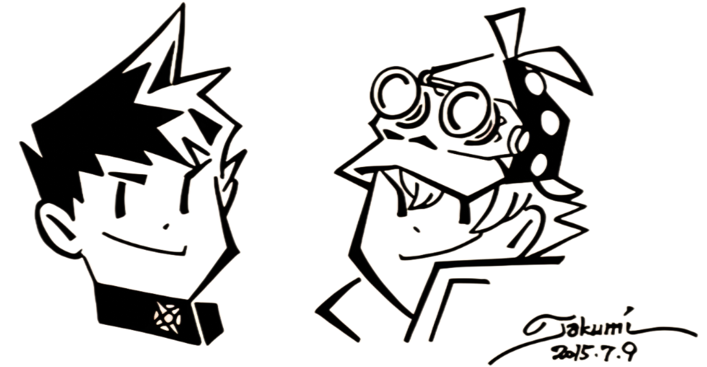

In a courtroom battle set against the backdrop of Meiji-era Japan and Victorian Britain, *Dai Gyakuten Saiban* brings fresh life to the *Ace Attorney* franchise. Ryūnosuke Naruhodō, beloved series protagonist Phoenix Wright's ancestor, embarks on a legal journey where international law, diplomacy, and justice intertwine.

Before its official localization, *Dai Gyakuten Saiban* was a game many fans outside Japan, like myself, only dreamed of experiencing. I spent countless hours working on the French translation alongside other passionate fans, bringing the mysteries of *The Great Ace Attorney* to new audiences long before it reached the West. Today, I reflect not only on my journey with this game but on the incredible evolution of the *Ace Attorney* franchise and how this installment has left its mark on me and the gaming world.

## The New Era of *Ace Attorney*

*Dai Gyakuten Saiban* introduces a slower and more intricate narrative than its predecessors. Spanning two interconnected titles, *Adventures* and *Resolve*, the game tells a continuous story that takes about 80 hours to complete. Unlike earlier entries, where cases were more self-contained, *Dai Gyakuten Saiban* immerses players in a richly detailed overarching plot, requiring patience as it unfolds layer by layer.  

The pacing is a notable departure from previous *Phoenix Wright* games. Earlier titles often resolved cases quickly, leading to immediate satisfaction, but here, cases are stretched across multiple court sessions, delving into more elaborate investigations and character developments. This slower narrative builds anticipation, revealing deeper twists and character arcs with each passing trial. While this deliberate pacing can feel prolonged, especially in *Adventures*, it pays off with richer storytelling and more profound emotional depth.  

The game’s structure mirrors Ryūnosuke’s journey from a novice lawyer, thrust into high-stakes legal battles across international borders, to a seasoned defense attorney with a deep understanding of not just the law, but of the clashing cultural paradigms. This thematic richness makes each case not just a matter of legal intricacies but of navigating the diplomatic tensions between Japan and Britain, further enriching the narrative tapestry of the game.

## Characters

At the heart of *Dai Gyakuten Saiban* are its richly developed characters, each bringing a unique flavor to the courtroom. Ryūnosuke Naruhodō’s transformation from a hesitant novice to a confident defense attorney mirrors the journey of Phoenix Wright, but Ryūnosuke’s path feels more methodical and culturally nuanced. The game highlights the tension between Japanese and British legal systems, with Ryūnosuke struggling not only with the law but also with the cultural barriers that come with practicing it in a foreign land.   

Kazuma Asogi, Ryūnosuke’s charismatic and sword-wielding best friend, provides both emotional and narrative weight. His belief in Ryūnosuke’s abilities propels the protagonist’s growth and creates a dynamic that balances between friendship and professional rivalry. Kazuma’s noble goals and dramatic presence make him a vital emotional anchor for the player. His arc stands out as one of the most significant in the *Ace Attorney* franchise, adding layers of drama and intrigue that permeate throughout both games.

Herlock Sholmes, Capcom’s eccentric take on Sherlock Holmes, is one of the game’s most memorable figures. Legally rebranded due to copyright constraints, Herlock is a playful, larger-than-life character whose “Dance of Deduction” segments inject humor into otherwise tense courtroom scenes. His flawed brilliance and ridiculous conclusions allow Ryūnosuke to step in and correct him, adding to the dynamic between the two. Sholmes embodies both genius and folly, serving as a delightful foil to Ryūnosuke’s more grounded nature.

The supporting cast is no less remarkable. Lord Chief Justice Mael Stronghart dominates the legal world with his imposing presence. His strict demeanor and morally ambiguous actions leave players constantly questioning his true motives, adding complexity to the overarching narrative. Similarly, Inspector Tobias Gregson, the seasoned investigator from Scotland Yard, brings a sense of realism and grit to the investigative sequences. His straightforward, no-nonsense approach contrasts wonderfully with Sholmes’ eccentricity, creating both tension and humor in their interactions.

The characters, especially the prosecutors, are as intricately written as they are visually striking. Barok van Zieks, known as "The Reaper of the Bailey," exemplifies this with his enigmatic nature, dark wit, and fearsome reputation. His ongoing rivalry with Ryūnosuke is fueled by van Zieks’ disdain for the Japanese, yet as the game unfolds, deeper layers to his character are revealed, making him one of the most compelling prosecutors in the series. The game expertly unpacks his persona, revealing a depth and complexity that enrich the courtroom dynamics and adds further gravitas to each encounter.

## Shu Takumi’s Vision

Behind this rich tapestry of characters is none other than Shu Takumi, the visionary creator of the *Ace Attorney* series. Takumi’s storytelling mastery shines in *Dai Gyakuten Saiban*, where his love for blending humor, drama, and intricate legal puzzles takes center stage.    

His experience with *Professor Layton vs. Phoenix Wright: Ace Attorney* helped shape this game, particularly in how he combined puzzle-solving with legal drama, crafting a more narrative-driven experience. Takumi’s fascination with historical settings allowed him to explore new dynamics in *Dai Gyakuten Saiban*, infusing the legal drama with cultural and period-specific intricacies that were absent from previous games. 

Takumi’s writing style is instantly recognizable—sharp, witty, and full of twists. His ability to create characters that are simultaneously exaggerated yet emotionally grounded makes the narrative compelling. Under his direction, *Dai Gyakuten Saiban* balances intense courtroom battles with humorous interactions, delivering an experience that feels both fresh and familiar. Each character, no matter how minor, is imbued with personality, ensuring they leave an impression long after the trial ends.

Shu Takumi’s unique vision and dedication to storytelling make *Dai Gyakuten Saiban* not only a standout in the *Ace Attorney* series but also a masterpiece of the visual novel genre. His ambition to push the boundaries of the courtroom drama genre by setting it in a time of cultural transition and legal complexity is both bold and brilliantly executed.

## The Courtroom

*Dai Gyakuten Saiban* builds upon the established *Ace Attorney* formula, introducing fresh and complex mechanics that elevate courtroom drama. One of the most notable additions is the jury system, a completely new element for the series. British courtrooms now feature a panel of jurors, requiring players to engage in the “Summation Examination” mechanic. This feature allows you to pit jurors' biases and contradictions against each other in real time, forcing you to think critically about each juror’s perspective and how to manipulate their collective decision. This system adds a layer of complexity to trials, making them more dynamic compared to the straightforward cross-examinations of previous titles.  

The inclusion of the jury system, combined with the setting of Victorian-era Britain, reflects Shu Takumi’s ambition to shake up the traditional *Ace Attorney* format. His work on *Professor Layton vs. Phoenix Wright: Ace Attorney* heavily influenced this shift. In the crossover, Takumi experimented with puzzles and trial dynamics that played with deduction and logic, laying the groundwork for the more elaborate courtroom interactions seen in *Dai Gyakuten Saiban*. The way players must confront not just a single judge but an entire jury echoes the deduction-based puzzles from the crossover, where the player’s intellectual engagement is more active and multifaceted.

In addition to the jury system, the handling of evidence has been fine-tuned. In earlier games, players often faced the “one right piece of evidence” issue—where they knew the solution but struggled to present the exact item the game required. *Dai Gyakuten Saiban* alleviates this problem by offering more flexibility in how evidence is used. The game rewards players for understanding the nuances of a case, rather than punishing them for missteps in presenting evidence.

These changes enhance the immersion of the legal process, making the trials feel more unpredictable and intellectually satisfying. The interplay between Ryūnosuke, the jurors, and the presiding judge makes each courtroom battle feel more strategic, adding layers of engagement that go beyond what earlier *Ace Attorney* games offered.

## Immersion

The shift from modern-day settings to the 19th-century environments of Japan and Britain gives the game a unique aesthetic, blending historical realism with the series’ signature over-the-top drama. The environments—from grand British courtrooms to the bustling streets of Meiji Japan—are meticulously crafted, creating a world that feels authentic and immersive.   

Each setting is more than just a backdrop. The cultural and historical context of Meiji-era Japan and Victorian Britain adds new stakes to the cases, where the clash between Western and Eastern legal philosophies is not only present in the storylines but also reflected in the legal proceedings themselves. Ryūnosuke’s status as an outsider in Britain adds a constant layer of tension, and his quest for justice is tinged with a deeper sense of cultural identity and belonging.

The slower pacing allows players to absorb the cultural nuances of each location, making courtroom battles feel like more than just legal disputes—they're clashes between empires, ideologies, and eras. This rich world-building adds depth to the narrative, enhancing the stakes of each case.

## Writing and Conflict

What sets *Dai Gyakuten Saiban* apart is its balance between humor and emotional depth. While previous *Ace Attorney* games leaned heavily on dramatic plot twists and courtroom theatrics, this entry adds layers of introspection, examining cultural differences and societal norms. The writing is sharp; humor—often delivered through Herlock Sholmes—provides levity, but the game doesn't shy away from darker themes. Racism is a deep issue that is being quite directly adressed, it's incredibly refreshing to see the writing try and define without any shame what seems to be a well rooted issue in this universe's world.

The game’s focus on the tension between Japanese and British legal systems, as well as Ryūnosuke’s personal journey of growth, gives *Dai Gyakuten Saiban* a sense of gravitas that feels absent from earlier titles. Characters grapple not just with the law but with questions of identity, morality, and justice in a rapidly changing world. The game’s exploration of cross-cultural dynamics adds a richness to the courtroom battles, where legal decisions have far-reaching consequences that go beyond the immediate trial.

## Critical Reception and Legacy

Since its official release in the West, *Dai Gyakuten Saiban* has garnered widespread acclaim. Critics and players alike have praised the game for its compelling narrative, intricate character development, and innovative gameplay mechanics. Many consider it one of the strongest entries in the series. This however isn't necessarily true in Japan.

While Famitsu awarded DGS a score of 35/40. This score was based on individual ratings from four reviewers, who praised the game for its deep narrative, historical setting, and character development. Some more seasoned reviewers, however, noted that the pacing, especially in the early stages, felt slower than previous entries, which could be challenging for some players. Despite this, the overall storytelling and character arcs were lauded, with Ryūnosuke Naruhodō’s growth and his interactions with Sholmes really standing out.

## Tension and Triumph

The music of *Dai Gyakuten Saiban* plays a vital role in setting the tone throughout the game. Composed by Yasumasa Kitagawa, the soundtrack masterfully blends period-appropriate orchestration with the dramatic tension the *Ace Attorney* series is known for. The score elevates courtroom drama and investigative moments alike, with compositions like “Court Begins” and “Cross-Examination” injecting urgency and suspense into trials.   

<iframe width="840" height="472.5" src="https://www.youtube.com/embed/oLZ96kPl0Ew?si=JmECVmdxMetGsCXY" title="YouTube video player" frameborder="0" allow="accelerometer; autoplay; clipboard-write; encrypted-media; gyroscope; picture-in-picture; web-share" referrerpolicy="strict-origin-when-cross-origin" allowfullscreen></iframe>

Reviewers have praised how the music enhances both the narrative and historical context, blending orchestral themes that reflect the Victorian and Meiji eras while still maintaining the playful and intense energy fans expect from the series. Herlock Sholmes' theme, in particular, adds a lighthearted yet brilliant touch to his deductions, complementing the humor and eccentricity of his character.

## The *Phoenix Wright X Layton* Influence

The influence of *Phoenix Wright X Layton* is clear in Shu Takumi's approach to *Dai Gyakuten Saiban*. In interviews, Takumi has mentioned how working on the crossover allowed him to explore storytelling in a historical context, blending puzzle-solving with legal drama. This experience helped shape his vision for *Dai Gyakuten Saiban*, where he was able to integrate more elaborate puzzles and deductions into the legal framework.   

The dynamic between Herlock Sholmes and Ryūnosuke is reminiscent of the synergy between Phoenix Wright and Professor Layton, with one character offering brilliance and the other refining that brilliance into actionable conclusions. This combination of mystery-solving and courtroom battles elevates the gameplay beyond what we’ve seen in previous entries. The result is a game that feels like both an evolution of the *Ace Attorney* formula and a love letter to Takumi’s broader storytelling influences.

## The Payoff

From the moment you begin *Dai Gyakuten Saiban*, there’s an unmistakable sense of grandeur. The historical setting, the sweeping music, and the intricate character dynamics all contribute to an emotional journey that’s both personal and epic. Each trial feels like a high-stakes battle—not just for justice, but for understanding between cultures, between systems, and between people.   

As the game unfolds, the growing relationship between Ryūnosuke and his allies, particularly Susato and Kazuma, adds an emotional weight to the courtroom drama. You feel a deep connection to their struggles and triumphs, much like you would in the earlier *Ace Attorney* games, but here, it’s layered with the added complexity of cultural and historical stakes. The uncertainty of Ryūnosuke's position as a newcomer to British law amplifies the tension, making every victory feel earned and every defeat a moment of introspection.

The payoff in *Dai Gyakuten Saiban* is immense. From the thrill of unraveling a complex mystery, to satisfaction of outwitting the jury, or the heartfelt moments between characters, this game keeps on delivering.

## A New Standard for the *Ace Attorney* Series

*Dai Gyakuten Saiban* stands as a testament to how far the *Ace Attorney* franchise has evolved. It retains the core elements that fans love—intense cross-examinations, dramatic "Objections!", and humorous character interactions—while expanding with a sophisticated narrative and innovative gameplay mechanics. Its pacing may test your patience at times, but the reward is a legal epic that's as emotionally resonant as it is intellectually satisfying.   

For me, having been part of the journey to bring this game to a wider audience through fan translation, its official release feels like a personal triumph. It's a game that not only honors the legacy of the series but also sets a new benchmark for what a courtroom drama can be.

Whether you're a longtime fan or new to the series, *Dai Gyakuten Saiban* offers a rich, immersive experience filled with historical intrigue, cultural depth, and unforgettable characters.

*- yaro*
