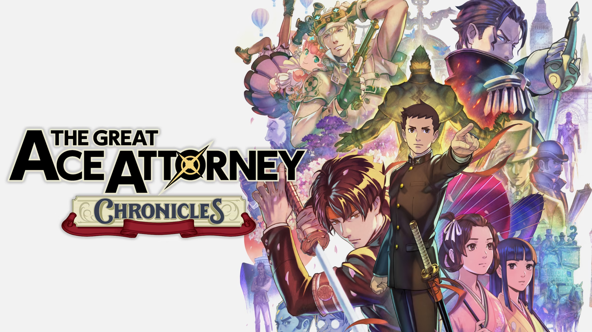
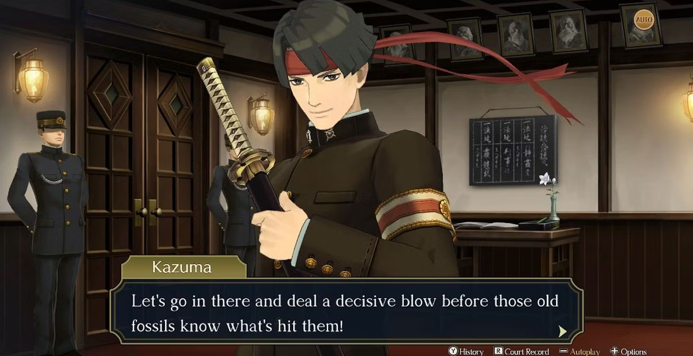
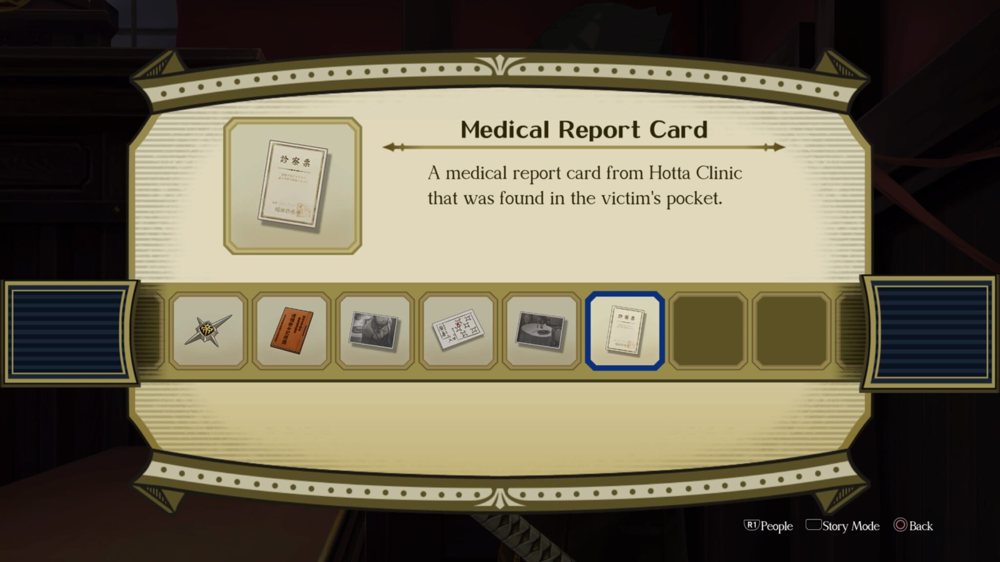

I can still see myself as a young romhacker, back when *Dai Gyakuten Saiban* was this elusive gem trapped in Japan. I had spent countless hours, alongside a passionate community, trying to translate it. <mark>Seeing it finally released in the West felt like a victory for all of us.</mark> As I think back on that journey now, I can’t help but marvel at how this game managed to breathe new life into a series that had begun to lose its spark.

Set against the backdrop of Meiji-era Japan and Victorian Britain, *Dai Gyakuten Saiban* is not just another *Ace Attorney* game—it’s an epic, weaving together history, courtroom intrigue, and a drive to push the boundaries of the genre. The game’s pace might take some by surprise, but for those ready to dive into its atmosphere, every moment is worth it.

## A New Era for [Ace Attorney](https://www.ace-attorney.com)

Playing *Dai Gyakuten Saiban* feels like a slow infusion—you can feel the reward approaching, but the wait is part of the journey. The game doesn’t aim to deliver short, simple cases. Every trial takes its time, allowing us to digest its complexities and feel the weight of each revelation. It’s not about instant gratification here; it’s a commitment, a real one.

<mark>Where games like Phoenix Wright thrive on quick resolutions, *Dai Gyakuten Saiban* invites us to slow down and appreciate each moment.</mark> Spanning across two titles (*Adventures* and *Resolve*), the story unfolds over 80 hours. Each case builds up emotions and revelations, culminating in finales that are both satisfying and intense. This is not a straightforward narrative—it’s a story that demands patience and immersion, rewarded with deeper character arcs and more impactful twists.

## Synopsis: Two Worlds, One Lawyer

Ryūnosuke Naruhodō, the ancestor of the legendary *Phoenix Wright*, finds himself thrust into the British legal system—elitist and unapologetically imperialist. A dream setting for courtroom drama. Ryūnosuke must navigate this foreign system, juggling ethical dilemmas that challenge him at every step.

Alongside him is Susato Mikotoba, his devoted assistant and anchor. Her presence reminds us that even the best intentions can be thwarted by a world that isn’t ready for them.

## Immersion: The Weight of Two Empires

Navigating *Dai Gyakuten Saiban* feels like being thrown into a battleground of ideals, far beyond simple courtroom theatrics. Set in the 19th century, between a rising Japan and an imperialist Britain, every trial becomes a power struggle between two worldviews, each trying to impose its morality and legal system.

<mark>Through Ryūnosuke’s eyes, you feel the disdain of British characters, the thinly veiled racism, and the constant reminder that you’re an outsider in this system.</mark> The game’s slower pace allows us to absorb these cultural tensions. Sure, the story drags at times, but even in these moments, there’s an undeniable depth to how it handles these ideological battles. It’s not just about winning cases here, but about grasping the complex gears of the system you’re up against.

## Characters: From Novice to Seasoned Attorney

One of *Dai Gyakuten Saiban*’s strongest points is its character development. Ryūnosuke’s arc—from hesitant beginner to confident attorney—may be familiar, but here it’s done with nuance. Watching him grow, case after case, feels like seeing a close friend gain confidence, while still holding onto their humanity.

Kazuma Asogi, Ryūnosuke’s charismatic friend, plays a key role in his development. His arc, though predictable at times, doesn’t lose its emotional weight. He serves as an emotional anchor, even if his story doesn’t always surprise.

Then, we have *Herlock Sholmes*. Yes, Capcom dared to reimagine Sherlock Holmes as a caricature of himself, and surprisingly, it works. <mark>Capcom took the bold risk of parodying Sherlock Holmes, and it works perfectly.</mark> His far-fetched deductions and quirky humor bring much-needed levity to a sometimes overly serious game. It’s absurd, but it fits perfectly into the narrative flow.

Barok van Zieks, the prosecutor, is without a doubt one of the most fascinating characters in the *Ace Attorney* series. His blatant racism and dark humor add palpable tension to every courtroom exchange. <mark>Every interaction with van Zieks reminds us that this is not just a fight for justice, but a fight for respect.</mark> His imposing presence turns each trial into a battle, and his complexity makes him one of the most memorable antagonists in the series.

## Shu Takumi’s Vision: Blending History with Drama

At the heart of *Dai Gyakuten Saiban*, we find Shu Takumi’s unmistakable touch. After his work on *Professor Layton vs. Phoenix Wright*, it’s clear that he went all-in on this series, bringing everything he’d learned along the way. His sharp humor, complex dynamics, and perfectly timed twists make this game stand out.

What truly elevates this game is how Takumi intertwines its historical context with courtroom drama. He seamlessly blends the tensions of the Meiji Restoration with Britain’s colonial ambitions. <mark>The ideological conflicts aren’t just a backdrop—they’re at the core of the story and its characters.</mark> The law here becomes more than just a tool for justice; it’s a weapon for influence and power. This theme gives *Dai Gyakuten Saiban* a resonance that feels particularly relevant today.

That said, there were moments when I felt the game could have gone further. The narrative hints at Japan’s identity struggle in the face of Western imperialism but doesn’t always delve deep enough into that theme. <mark>It’s a testament to Takumi’s storytelling that even with these missed opportunities, the game remains rich and immersive.</mark>

## The Courtroom: Innovation and Drama

Courtroom battles in *Dai Gyakuten Saiban* aren’t just about solving mysteries—they’re about confronting the biases of an entire system. <mark>One of the game’s standout innovations is the "Summation Examination," where you have to convince a jury by dismantling their biases one by one.</mark> This mechanic brings a new layer to the legal drama, making each trial feel like more than just a puzzle—it becomes a social battlefield.

There’s something incredibly satisfying about swaying a biased jury. These moments stand out, making you feel like you’re not just fighting for your client—you’re taking on an oppressive system head-on.

And then there’s the handling of evidence. Gone are the frustrating moments where you know the solution, but the game won’t let you present it. *Dai Gyakuten Saiban* introduces a welcome flexibility, allowing you to move forward more fluidly. The writers seem to have learned how to balance challenge with freedom, making each trial feel far more rewarding.

## Music: A Symphony of Tension

Of course, no *Ace Attorney* game would be complete without its soundtrack, and *Dai Gyakuten Saiban* is no exception. Composed by Yasumasa Kitagawa, the music perfectly captures the tension of courtroom scenes and the heavy atmosphere of the historical setting.

<mark>Every track feels carefully designed to pull you deeper into the story.</mark> Whether it’s the tense courtroom music or *Herlock Sholmes’* playful theme, every note adds to the game’s mood. These little musical touches add an extra layer to an already immersive experience.

## Critical Reception and Legacy: A Mixed Bag

Upon its Western release, *Dai Gyakuten Saiban* was rightfully praised. Critics and players alike celebrated its rich character development, storytelling, and innovative gameplay. It has earned its place as one of the strongest entries in the *Ace Attorney* series.

However, not everyone was sold. Some criticized the game’s slow pace, with *Famitsu* giving it a score of 35/40, and outlets like *IGN* describing it as “glacial.” Still, for those who are willing to invest the time, this slowness only enhances its charm.

<mark>Dai Gyakuten Saiban demands patience, but for those who invest in it, the slowness only adds to its charm.</mark>

## Conclusion: A Journey Worth Taking

At its core, *Dai Gyakuten Saiban* is a game that asks for real commitment. It’s not about instant gratification; it’s a deep story that will reward those who dedicate their time to it. With its captivating characters, intricate trials, and unforgettable moments, it delivers one of the richest courtroom experiences in the *Ace Attorney* franchise.

The depth of the story, the cultural clash between Japan and Britain, and characters like Ryūnosuke, *Herlock Sholmes*, and *Barok van Zieks* all come together to create an experience that lingers long after the credits roll.

For those who have the patience to sit through its quieter moments, *Dai Gyakuten Saiban* is a triumph. It’s a game that leaves you with not just memories of solved cases, but reflections on justice, power, and the systems that uphold them. Takumi has crafted something truly unique—a game that honors its legacy while carving out a space of its own.

<mark>- yaro</mark>
