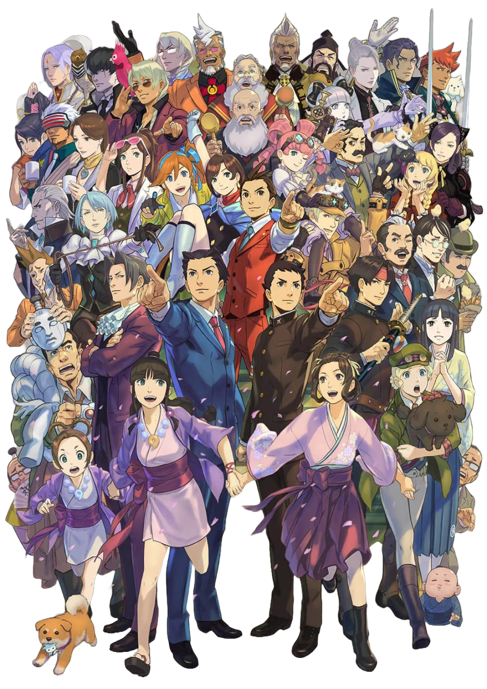
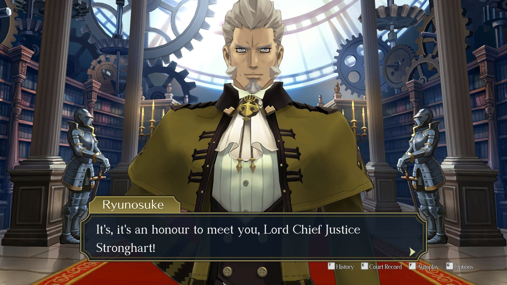
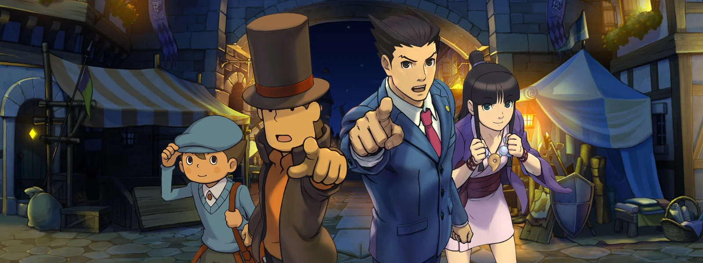

In a courtroom battle set against the backdrop of Meiji-era Japan and Victorian Britain, [Dai Gyakuten Saiban](https://www.ace-attorney.com/great1-2/us/) brings a breath of fresh air to the [Ace Attorney](https://www.ace-attorney.com) franchise that was long overdue.

Before its official localization, [Dai Gyakuten Saiban](https://www.ace-attorney.com/great1-2/us/) was a game many fans outside Japan (including me), only dreamed of getting our dirty little ace attorney fan hands on. I vividely remember spending countless hours working on the French translation alongside other passionate fans, bringing the mysteries of *The Great Ace Attorney* to new audiences long before it reached the West. 

Today, I reflect not only on my journey with this game but on the incredible evolution of the [Ace Attorney](https://www.ace-attorney.com) franchise and how this installment has left its mark on me and the gaming world.

## The New Era of [Ace Attorney](https://www.ace-attorney.com)

[Dai Gyakuten Saiban](https://www.ace-attorney.com/great1-2/us/) introduces a slower and more intricate narrative than its predecessors. Spanning two interconnected titles, *Adventures* and *Resolve*, the game tells a continuous story that takes about 80 hours to complete. Unlike earlier entries, where cases were more self-contained, [Dai Gyakuten Saiban](https://www.ace-attorney.com/great1-2/us/) decided on a continuous story line, assuming its [Visual Novel](https://wikipedia.org/wiki/Visual_Novel) nature.  

The pacing is a notable departure from previous [Phoenix Wright](https://www.ace-attorney.com) games. Cases were often quickly solved, leading to immediate, but short-lived satisfaction and some rather boring Investigation phases. Creating a new spin-off altogether gave the writers ample freedom to do whatever they wished to do: stretching cases across multiple court sessions, delving into more elaborate investigations and character developments and interconnecting cases between the two games together. This slower narrative builds anticipation, revealing deeper twists and character arcs with each passing trial. While this deliberate pacing can feel prolonged, especially in *Adventures*, it pays off with richer storytelling and more profound emotional depth.  

## Synopsis

Ryūnosuke Naruhodō’s, canonically one of [Phoenix Wright](https://aceattorney.fandom.com/wiki/Phoenix_Wright)'s ancestor, has unexpectedly been forced to journey from Japan to England taking the role of a defense attorney. In hopes of learning ways to better the still-developing Japanese legal system, our protagonist will slowly become a seasoned defense attorney with a deep understanding of not just the law, but of the clashing cultural paradigms.

With the help of his legal assistant Susato Mikotoba, Naruhodō's has to ask himself difficult ethical questions about the morality of his goals and to what extent is he able to push himself to achieve them.

## Immersion

The shift from modern-day settings to the 19th-century environments of Japan and Britain gives the game a unique aesthetic, blending historical realism with the series’ signature over-the-top drama. The environments—from grand British courtrooms to the bustling streets of Meiji Japan—are meticulously crafted, creating a world that feels authentic and immersive.   

Each setting is more than just a backdrop. The cultural and historical context of Meiji-era Japan and Victorian Britain adds new stakes to the cases, where the clash between Western and Eastern legal philosophies is not only present in the storylines but also reflected in the legal proceedings themselves. Ryūnosuke’s status as an outsider in Britain adds a constant layer of tension, and his quest for justice is tinged with a deeper sense of cultural identity and belonging.

The slower pacing allows players to absorb the cultural nuances of each location, making courtroom battles feel like more than just legal disputes—they're clashes between empires, ideologies, and eras. This rich world-building adds depth to the narrative, enhancing the stakes of each case.

## Characters

At the heart of [Dai Gyakuten Saiban](https://www.ace-attorney.com/great1-2/us/) are richly developed characters. Ryūnosuke’s transformation from a hesitant novice to a confident defense attorney mirrors the journey of [Phoenix Wright](https://aceattorney.fandom.com/wiki/Phoenix_Wright), but Ryūnosuke’s path feels more methodical and culturally nuanced. The game highlights the tension between Japanese and British, not shying away from the very crude and obviously racist terms spat around by everyone from the british commoner to representents of the [Crown](https://www.merriam-webster.com/dictionary/the%20crown).   

[Kazuma Asogi](https://aceattorney.fandom.com/wiki/Kazuma_Asogi), Ryūnosuke’s charismatic and sword-wielding best friend, provides both emotional and narrative weight. His belief in Ryūnosuke’s abilities propels the protagonist’s growth and creates a dynamic that balances between friendship and... deep rivalry. Kazuma’s noble goals and dramatic presence make him a vital emotional anchor for the player. His arc stands out as one of the most significant in the [Ace Attorney](https://www.ace-attorney.com) franchise, though it is needless to say that Naruhodō and Kazuma's relationship is much more different than [Edgeworth](https://aceattorney.fandom.com/wiki/Miles_Edgeworth) and [Phoenix](https://aceattorney.fandom.com/wiki/Phoenix_Wright)'s 😳 ...

[Herlock Sholmes](https://aceattorney.fandom.com/wiki/Herlock_Sholmes), Capcom’s legally dubious and eccentric take on Sherlock Holmes, is one of the game’s true strong point. Herlock is a playful, larger-than-life character whose “Dance of Deduction” definitely add some much needed fun into investigation sections. His flawed brilliance and ridiculous conclusions allow Ryūnosuke to step in and correct him, and his father-like relationship with [Iris Wilson](https://aceattorney.fandom.com/wiki/Iris_Wilson), a child prodigy that assists Herlock in his daily tasks, is incredibly charming.

The supporting cast is no less remarkable. Lord Chief Justice [Mael Stronghart](https://aceattorney.fandom.com/wiki/Mael_Stronghart) dominates the legal world with his imposing presence. Strict legalese speech, he only is seen inhabiting grand spaces that he dominates still by his sheer size and demeanor -- Always being late, never being perfect enough, yet still so much more than what Ryonosuke seems to be. Similarly, Inspector [Tobias Gregson](https://aceattorney.fandom.com/wiki/Tobias_Gregson), the seasoned investigator from [Scotland Yard](https://aceattorney.fandom.com/wiki/Metropolitan_Police_Service), brings a sense of realism and grit to the investigative sequences. His straightforward, no-nonsense approach contrasts wonderfully with Sholmes’ eccentricity.

The characters, especially the prosecutors, are as intricately written as they are visually striking. [Barok van Zieks](https://www.google.com/search?client=safari&rls=en&q=barok+van+zieks&ie=UTF-8&oe=UTF-8), everyone's favorite leg-smashing servant to the Crown exemplifies this with his enigmatic nature, dark wit, and fearsome reputation. His ongoing rivalry with Ryūnosuke is fueled by van Zieks’ disdain for what he calls the "Nipponese"; Yet as the game unfolds, deeper layers to his character are revealed, making him what I believe to be the most compelling prosecutor of the series.

## [Shu Takumi](https://en.wikipedia.org/wiki/Shu_Takumi)’s Vision

Behind this rich tapestry of characters is none other than [Shu Takumi](https://en.wikipedia.org/wiki/Shu_Takumi), the visionary creator of the [Ace Attorney](https://www.ace-attorney.com) series.    

His experience with *[Professor Layton vs. Phoenix Wright: Ace Attorney](https://en.wikipedia.org/wiki/Professor_Layton_vs._Phoenix_Wright:_Ace_Attorney)* most definitely inspired this game. Between the more narrative-driven experience with a single coherent story, the historical setting, the character interactions and the humor, Takumi most evidently had a specific idea in mind when he started working on this spin-off series.

Takumi’s writing style is instantly recognizable—sharp, witty, and full of twists. His ability to create characters that are simultaneously exaggerated yet emotionally grounded makes the narrative compelling. Under his direction, [Dai Gyakuten Saiban](https://www.ace-attorney.com/great1-2/us/) balances intense courtroom battles with snappy interactions. Each character, no matter how minor, is imbued with personality and has its own very unique design, ensuring they leave an impression long after the trial ends.

[Shu Takumi](https://en.wikipedia.org/wiki/Shu_Takumi)’s unique vision and dedication to storytelling makes [Dai Gyakuten Saiban](https://www.ace-attorney.com/great1-2/us/) not only a standout in the [Ace Attorney](https://www.ace-attorney.com) series but also a masterpiece that allows the visual novel genre to get attract a larger audience.

## The Courtroom

[Dai Gyakuten Saiban](https://www.ace-attorney.com/great1-2/us/) takes the established [Ace Attorney](https://www.ace-attorney.com) formula, and then it keeps on building and building and building a whole new system altogether. One of the most notable additions is the jury system -- British courtrooms now feature a panel of jurors, requiring players to engage in the “[Summation Examination](https://aceattorney.fandom.com/wiki/Jury#Summation_examination)” mechanic. This feature allows you to pit jurors' biases and contradictions against each other in real time, forcing you to think critically about each juror’s perspective and how to manipulate their collective decision.  

[Shu Takumi](https://en.wikipedia.org/wiki/Shu_Takumi)’s ambition to shake up the traditional [Ace Attorney](https://www.ace-attorney.com) format is undeniable. In addition to the jury system, the handling of evidence has been fine-tuned. In earlier games, players often faced the “one right piece of evidence” issue—where they knew the solution but struggled to present the exact item the game required. [Dai Gyakuten Saiban](https://www.ace-attorney.com/great1-2/us/) alleviates this problem by offering more flexibility in how evidence is used.

The trials feel more unpredictable and intellectually challenging. The interplay between Ryūnosuke, the jurors with their unique personality, and the presiding judge makes each courtroom battle feel more strategic, adding layers upon layers of engagement that go beyond what [earlier games](https://www.ace-attorney.com) games offered.

## Music

The music of [Dai Gyakuten Saiban](https://www.ace-attorney.com/great1-2/us/) plays a vital role in setting the tone throughout the game. Composed by [Yasumasa Kitagawa](https://aceattorney.fandom.com/wiki/Yasumasa_Kitagawa), the soundtrack masterfully blends period-appropriate orchestration with the dramatic tension the [Ace Attorney](https://www.ace-attorney.com) series is known for. The score elevates courtroom drama and investigative moments alike, with compositions like “[Court Begins](https://www.youtube.com/watch?v=hBJPnEBpdkg)” and “[Cross-Examination](https://www.youtube.com/watch?v=r2V8u9IUAuI)” injecting urgency and suspense into trials.   

<iframe src="https://www.youtube.com/embed/oLZ96kPl0Ew?si=JmECVmdxMetGsCXY" 
        title="YouTube video player" 
        frameborder="0" 
        allow="accelerometer; autoplay; clipboard-write; encrypted-media; gyroscope; picture-in-picture; web-share" 
        referrerpolicy="strict-origin-when-cross-origin" 
        allowfullscreen 
        style="width: 100%; height: 472.5px">
</iframe>

Reviewers have praised how the music enhances both the narrative and historical context, blending orchestral themes that reflect the Victorian and Meiji eras while still maintaining the playful and intense energy fans expect from the series. [Herlock Sholmes](https://aceattorney.fandom.com/wiki/Herlock_Sholmes)' theme, in particular, adds a lighthearted yet brilliant touch to his deductions, complementing the humor and eccentricity of his character.

## Critical Reception and Legacy

Since its official release in the West, [Dai Gyakuten Saiban](https://www.ace-attorney.com/great1-2/us/) has garnered widespread acclaim. Critics and players alike have praised the game for its compelling narrative, intricate character development, and innovative gameplay mechanics. Many consider it one of the strongest entries in the series. This however isn't necessarily true in Japan or for some of the press in the west.

While Famitsu awarded DGS a score of 35/40. This score was based on individual ratings from only four reviewers. Some more seasoned reviewers, however, noted that the pacing, especially in the early stages, felt slower than previous entries, which could be challenging for some players.

IGN (knowing how much value their opinions actually hold lol) called the pacing "glacial", Nintendo Life hated the "overlong dialogues" and Destructoid called some of the Investigation phases "gimmicky". Despite all this, the overall storytelling and character arcs were lauded, with Ryūnosuke Naruhodō’s growth and his interactions with Sholmes really standing out.

## The *Phoenix Wright X Layton* Influence

The influence of *Phoenix Wright X Layton* is clear in [Shu Takumi](https://en.wikipedia.org/wiki/Shu_Takumi)'s approach to [Dai Gyakuten Saiban](https://www.ace-attorney.com/great1-2/us/). In interviews, Takumi has mentioned how working on the crossover allowed him to explore storytelling in a historical context, blending puzzle-solving with legal drama. This experience helped shape his vision for [Dai Gyakuten Saiban](https://www.ace-attorney.com/great1-2/us/), where he was able to integrate more elaborate puzzles and deductions into the legal framework.   

This combination of mystery-solving and courtroom battles elevates the gameplay beyond what we’ve seen in previous entries. The result is a game that feels like both an evolution of the [Ace Attorney](https://www.ace-attorney.com) formula and a love letter to Takumi’s broader storytelling influences.

## Conclusion

From the moment you begin [Dai Gyakuten Saiban](https://www.ace-attorney.com/great1-2/us/), there’s an unmistakable sense of grandeur. The historical setting, the sweeping music, and the intricate character dynamics all contribute to an emotional journey that’s both personal and epic. Each trial feels like a high-stakes battle—not just for justice, but for understanding between cultures, between systems, and between people.   

As the game unfolds, the growing relationship between Ryūnosuke and his allies, particularly Susato and Herlock, adds an emotional weight to the game. You feel a deep connection to their struggles and triumphs, much like you would in the earlier [Ace Attorney](https://www.ace-attorney.com) games, but here, it’s layered with the added complexity of cultural and historical stakes. The uncertainty of Ryūnosuke's position as a newcomer to British law amplifies the tension, making every victory feel earned and every defeat a moment of introspection.

The payoff in [Dai Gyakuten Saiban](https://www.ace-attorney.com/great1-2/us/) is immense. From the thrill of unraveling a complex mystery, to satisfaction of outwitting the jury, or the heartfelt moments between characters, this game keeps on delivering.

For me, having been part of the journey to bring this game to a wider audience through fan translation, its official release feels like a personal triumph. It's a game that not only honors the legacy of the series but also sets a new benchmark for what a courtroom drama can be.

Whether you're a longtime fan or new to the series, [Dai Gyakuten Saiban](https://www.ace-attorney.com/great1-2/us/) offers a rich, immersive experience filled with historical intrigue, cultural depth, and unforgettable characters.

*- yaro*
