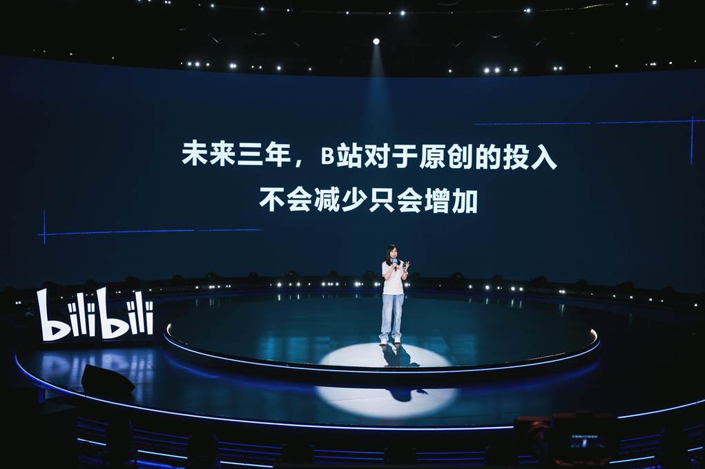
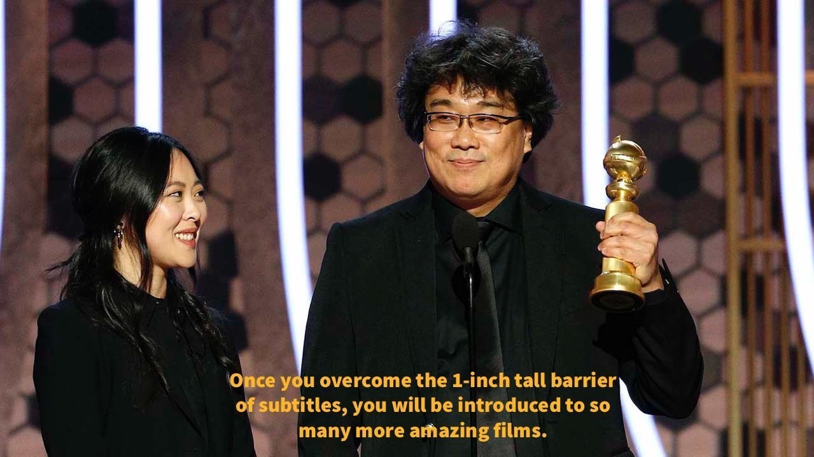
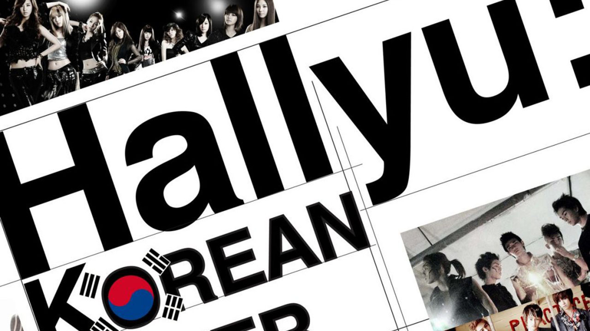

Dans un monde où la culture est devenue une arme économique, exporter une œuvre créative au-delà de ses frontières nationales relève souvent d’un jeu d’équilibriste. Entre l’authenticité locale et les attentes du marché global, les créateurs doivent naviguer dans des eaux troubles, oscillant entre fidélité à leur identité et adaptation stratégique. Si certains pays comme la Corée du Sud ou le Japon ont su transformer leurs industries culturelles en véritables locomotives économiques, d’autres peinent encore à trouver la bonne formule.

## Quésaco: Le Donghua moderne.

L’anime chinois *Link Click* (时光代理人) fait figure de succès à la croisée des cultures. Saluée comme « **très connue et encensée en Chine et au Japon** » [par la critique](https://www.allocine.fr/series/ficheserie-29267/critiques/), cette série Bilibili marie le récit fantastique chinois (voyages dans le temps) à un graphisme et un montage rappelant fortement l’animation japonaise dans sa rythmique. Dans un mouvement très révélateur, *Link Click* a dés le début bénéfiicié d’une version doublée en [japonais]((https://animecorner.me/link-click-gets-new-trailer-and-visual-ahead-of-japanese-dub-premiere/#:~:text=Link%20Click%2C%20popular%20donghua%20series%2C,in%20Japan%20on%20January%209)) pour le marché mondial, diffusée en janvier 2022.

Les affiches promotionnelles s'appuient d'ailleurs sur les acteurs de doublage japonaise elle est présentée aux côtés d’une bande-annonce dévoilant des comédiens japonais célèbres (Toyonaga, Sakurai, Koga) pour attirer le public autant local qu'international. Ainsi, malgré son origine chinoise, *Link Click* adopte tous les codes marketing de la japanimation pour séduire, contribuant au paradoxe d’un média chinois qui s’exporte sous un habillage typiquement japonais (on peut d'ailleurs voir ceci dans les productions Shanghaiaises typiques, comme chez Hoyoverse).

Le public est enthousiaste. En Chine, *Link Click* a rencontré un succès considérable (audiences élevées sur Bilibili) et des critiques positives saluent son scénario solide et son [animation originale](https://www.allocine.fr/series/ficheserie-29267/critiques/#:~:text=Il%20est%20édité%20pour%20Bilibili,rivaliser%20avec%20de%20bons%20thrillers). À l’étranger, la réception reste plus confidentielle : en France la série est peu médiatisée, mais les fans qui la découvrent restent conquis, regrettant que [*« la série ne soit pas plus connue en France »*](https://www.allocine.fr/series/ficheserie-29267/critiques/#:~:text=Cet%20animé%20chinois%20est%20une,de%20voyager%20dans%20le%20passé). Il y'a indubitablement un bloquage culturel profond qui semble freiner l'exportation de ces contenus, malgré leur qualité, mais leur découverte successive en occident suscite un intérêt croissant pour les productions de l'Empire du Milieu.

## Stratégies d’exportation des studios chinois.

Les studios comme Bilibili multiplient en effet les ponts culturels. Lors de son événement **« Anime Made by Bilibili »**, la plateforme a présenté 68 nouveaux titres chinois pour 2023-2024, certains clairement inspirés par le style anime (« [anime-inspired stories](https://www.anitrendz.com/news/2023/09/28/bilibili-unveils-68-chinese-animation-titles-at-industry-event#:~:text=During%20the%20ANIME%20MADE%20BY,Be%20Hero%20X%2C%20among%20others) »). Elle a même signé un partenariat avec Fuji TV pour créer B8station, une chaîne japonaise diffusant exclusivement de l’animation chinoise produite par [Bilibili](https://www.anitrendz.com/news/2023/09/28/bilibili-unveils-68-chinese-animation-titles-at-industry-event#). Bilibili vise ainsi à « introduire davantage d’animations chinoises auprès d’un [public global](https://www.anitrendz.com/news/2023/09/28/bilibili-unveils-68-chinese-animation-titles-at-industry-event#) ».

En pratique, la société distribue désormais près de 70 séries chinoises via des plateformes mondiales (Crunchyroll, Netflix, Rakuten Viki, etc.) et sa chaîne YouTube « MADEBYBILIBILI » compte déjà plus de [135 titres](https://www.anitrendz.com/news/2023/09/28/bilibili-unveils-68-chinese-animation-titles-at-industry-event#). Elle collabore aussi avec de grands noms de l’animation japonaise, comme Aniplex (Japon) ou des studios coréens, intégrant même des équipes étrangères dans la production (Funimation, Wakanime).
C'est donc un véritable effort de coopération internationale qui se met en place, mais si le bloquage ne viens pas de la qualité des productions, alors d'où viens-t-il ?

## Les obstacles culturels à l’export chinois.

Malgré ces efforts, l’exportation reste difficile. Les œuvres chinoises regorgent de références historiques et linguistiques très spécifiques : le wuxia (« arts martiaux » fantasmatiques), les légendes impériales, les idiomes chengyu, ou les nuances émotionnelles du mandarin. Ces éléments – fondamentaux pour un public chinois – sont souvent hermétiques aux non-initiés.

Au fait, [le wuxia est à la Chine ce que la fantasy Tolkienienne est à l’Occident](https://www.reddit.com/r/Fantasy/comments/q7gdl4/clarifying_wuxia_xianxia_and_related_chinese/?show=original), riche en dieux, démons et arts martiaux : ce genre majeur de la littérature chinoise ** n’a pas été exporté ** malgré son énorme popularité locale. Par ailleurs, la langue chinoise étant [très dense et contextuelle](https://www.researchgate.net/publication/368829582_HULAT_at_SemEval-2023_Task_9_Data_augmentation_for_pre-trained_transformers_applied_to_Multilingual_Tweet_Intimacy_Analysis), sa traduction et son doublage s’avèrent complexes.

De plus, de nombreux spectateurs internationaux rechignent face aux sous-titres, comme le rappelait Bong Joon-Ho lors des Golden Globes:
> <mark> [ **« Une fois que vous aurez franchi la barrière d’un pouce de sous-titres, vous découvrirez tant de films incroyables »**](https://www.dazeddigital.com/film-tv/article/47346/1/parasite-director-bong-joon-ho-golden-globes-subtitles-foreign-language-films#:~:text=“Once%20you%20overcome%20the%20one,acceptance%20speech%20mostly%20in%20Korean). </mark>

Voilà bien le désavantage pour les contenus chinois : leur diffusion se heurte à l’appréhension des spectateurs occidentaux face aux sous-titrages, un problème que la Corée du Sud, par exemple, a atténué en produisant beaucoup de versions doublées ou en encourageant la pratique des sous-titres. En Chine, c'est le doublage japonais ou le dub anglais qui prime, il est en effet parfois plus difficile de trouver le doublage chinois originel en ligne que de trouver le doublage japonais. Ceci a souvent poussé l'industrie chinoise à simplement investir dans des entreprises étrangères (Japonaises ou Coréennes) au lieu de supporter des production locales.

## Clair Obscur : jeu vidéo français pour le monde.

De manière symétrique, le jeu vidéo français *Clair Obscur : Expédition 33* se présente lui aussi comme un hybride d’identités. Visuellement, le titre est un JRPG-fantasy réussi — TechRadar le trouve « [**spectaculaire en tout point**](https://www.techradar.com/gaming/clair-obscur-expedition-33-review#:~:text=) ». Pourtant, cette création française revendiquée, développée à Montpellier par [Sandfall Interactive](https://www.sandfall.co), a principalement été conçue en anglais. Son édition anglaise a même mis à contribution des stars comme [Charlie Cox](https://en.wikipedia.org/wiki/Charlie_Cox) ou [Andy Serkis](https://en.wikipedia.org/wiki/Andy_Serkis) pour le [doublage](https://fr.wikipedia.org/wiki/Clair_Obscur:_Expedition_33#:~:text=Le%20soutien%20financier%20de%20l%27éditeur,9).

La synchronisation labiale du jeu est d’ailleurs calquée sur la [version anglaise](https://fr.wikipedia.org/wiki/Clair_Obscur:_Expedition_33#:~:text=La%20synchronisation%20labiale%20des%20personnages,10), ce qui relativise la place du français dans la production. En France, on note que ce choix a surpris et déplu à certains joueurs (« pourquoi pas de vraie voix française d’origine ? »), mais les développeurs l’expliquent par la volonté de viser directement le marché mondial anglophone – un positionnement de plus en plus courant dans l’industrie vidéoludique française. Les institutions françaises soutiennent certes le développement local (CNC, aides européennes, clusters « French Interactive »), mais celles-ci encouragent surtout l’innovation technique plutôt que l’« exportation » culturelle identitaire.

Dans le cas de *Clair Obscur*, la réussite ([plus d’un million d’exemplaires vendus en trois jours](https://www.radiotimes.com/technology/gaming/clair-obscur-expedition-33-sales-player-count/#:~:text=At%20the%20time%20of%20writing%2C,more%20than%201%20million%20copies)) montre que le pari d’une VO anglaise a porté ses fruits commercialement, ouvrant l’accès au jeu aux joueurs non francophones et sur des plateformes comme Game Pass.

## Fierté nationale et langage global.

Cette exportation linguistique n’est pas isolée. D'Ubisoft aux studios indépendants, le jeu-vidéo français adopte souvent l’anglais par défaut pour toucher un public global, et réserve le français aux sous-titres ou doublage secondaire. En animation, bien que moins présent à l’international que le jeu vidéo, le cinéma d’animation français (ex. *Persepolis*, *Tout en haut du monde*) a parfois adopté l’anglais comme VO pour séduire les marchés anglo-saxons.

Ce pragmatisme commercial suscite un dilemme : il rend les œuvres plus facilement exportables, mais fait craindre à certains que l’identité culturelle se dilue. Contrairement au **succès planétaire coréen**, porté par un fort soutien étatique et une stratégie multilingue, la France reste globalement moins présente dans les contenus « mainstream » mondiaux.

## Succès coréen et japonais en comparaison.

L’axe Paris-Beijing n’est pas le seul à montrer un tel paradoxe : on peut le comparer à l’« [Hallyu](https://en.wikipedia.org/wiki/Korean_Wave) » (vague coréenne) ou au [Cool Japan](https://fr.wikipedia.org/wiki/Cool_Japan). La Corée du Sud, par exemple, génère des retombées économiques colossales grâce à la K-pop et aux K-dramas, comme le souligne la revue Wesleyan Business Review : des groupes comme BTS ou Blackpink attirent « [des millions de fans et des milliards de dollars](https://www.wesleyanbusinessreview.com/issue-x-the-macroeconomy/blog-post-title-three-kh6nb#:~:text=entertainment%20industry%20lies%20at%20the,global%20success%20of%20Parasite%20and) », tandis que les plateformes (Netflix, YouTube) diffusent massivement leurs séries (« Squid Game », etc.).

Le Japon, de son côté, maintient une position de leader en animation : le gouvernement table sur [4,7 milliards de yens d’export](https://english.kyodonews.net/news/2024/06/476e1a0c184f-japan-aims-for-anime-games-sales-abroad-to-hit-20-tril-yen-by-2033.html#:~:text=According%20to%20the%20government%2C%20overseas,7%20trillion%20yen%20in%202022) de contenus (dont l’animation) en 2022, soit un chiffre comparable à l’export sidérurgique. Cet essor ne tient pas qu’aux moyens : les industries japonaise et coréenne ont réussi à rendre leur culture populaire accessible (barrages de sous-titres minimisés, voix anglophones ou sous-titres polies) et désirables mondialement. Leur expérience montre que l’innovation (musique pop hybride, animation universelle) peut vaincre la barrière de la langue, mais aussi qu’ils restent fiers de valoriser et financer ce qui leur est propre.

## Le paradoxe de la mondialisation culturelle.

L’analyse des productions culturelles globales révèle un paradoxe fondamental : pour exister à l’international, <mark>il faut se rendre méconnaissable à soi-même.</mark> Le succès mondial n’est permis qu’à condition d’adopter les codes narratifs, esthétiques et linguistiques dictés par les puissances hégémoniques, en tête desquelles l’Occident et le Japon.

La mondialisation impose en réalité des modèles issus des traditions dominantes. Les cultures périphériques ne franchissent les frontières qu’en se traduisant dans cette grammaire globale, souvent au prix de leurs spécificités. C’est une ouverture apparente fondée sur une fermeture symbolique : <mark>ce qu’on présente comme « universel » n’est qu’une norme située, héritée de siècles de domination culturelle.</mark>

Ce phénomène, déjà visible dans l’américanisation des années 1990, s’est aujourd’hui généralisé. Les donghua chinois ou les jeux français n’obtiennent reconnaissance qu’en se pliant aux attentes des marchés dominants. Derrière l’échange culturel se cache une hiérarchie implicite, où l’altérité ne survit qu’en se lissant ou en se folklorisant.

On peut espérer l’émergence d’une mondialisation véritablement plurielle. Mais pour l’heure, le paradoxe demeure : <mark>la reconnaissance passe par la dilution, et les créateurs naviguent entre fierté locale et impératifs commerciaux globaux.</mark>

  <mark>- yaro</mark>