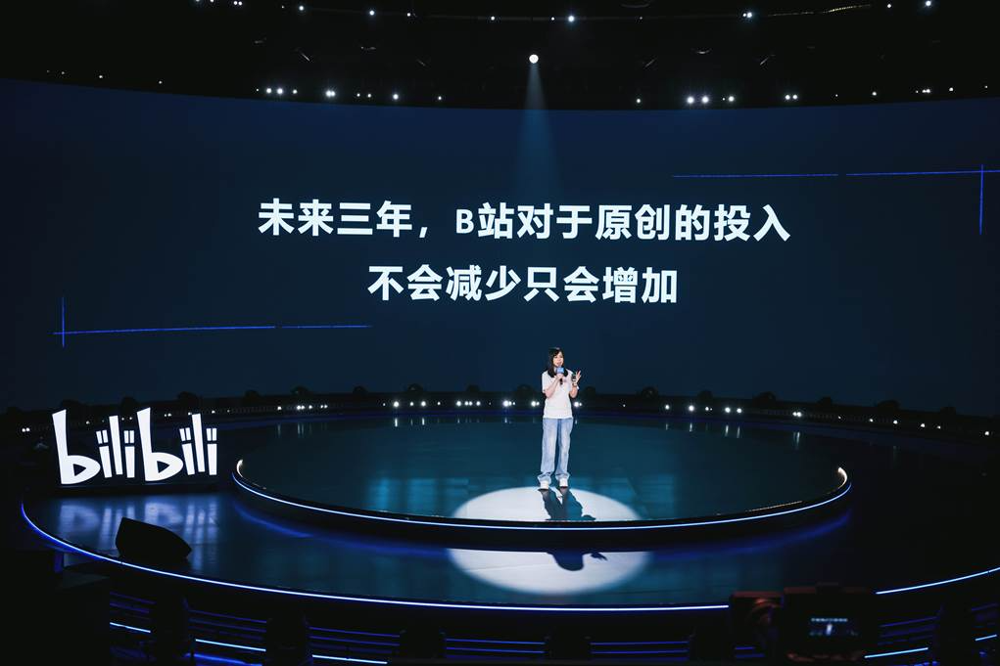

In a world where culture has become an economic weapon, exporting a creative work beyond national borders often feels like a tightrope act. Between local authenticity and the expectations of the global market, creators must navigate murky waters, oscillating between loyalty to their identity and strategic adaptation. While some countries like South Korea and Japan have managed to turn their cultural industries into genuine economic engines, others still struggle to find the right formula.

## What is Modern Donghua?

The Chinese Animation, or [Donghua](https://en.wikipedia.org/wiki/Chinese_animation#:~:text=In%20Chinese%2C%20donghua%20(simplified%20Chinese,to%20animation%20produced%20in%20China.) (动画) *Link Click* (时光代理人) stands as a cross-cultural success. Praised as "**well-known and acclaimed in both China and Japan**" [by critics](https://www.allocine.fr/series/ficheserie-29267/critiques/), this Bilibili series blends Chinese fantastical storytelling (time travel) with visuals and editing strongly reminiscent of Japanese animation pacing. In a very telling move, *Link Click* was released early on with a [Japanese dub](https://animecorner.me/link-click-gets-new-trailer-and-visual-ahead-of-japanese-dub-premiere/#:~:text=Link%20Click%2C%20popular%20donghua%20series%2C,in%20Japan%20on%20January%209) for the global market, broadcast in January 2022.

Its promotional posters leaned on the Japanese voice actors and it was unveiled alongside a trailer highlighting famous Japanese talents (Toyonaga, Sakurai, Koga) to draw both local and international audiences. Thus, despite being Chinese in origin, *Link Click* adopts all the marketing codes of Japanese anime to appeal to fans — contributing to the paradox of a Chinese medium exported under a distinctly Japanese aesthetic (a pattern also found in typical Shanghai-based productions, like those of Hoyoverse).

Audiences have been enthusiastic. In China, *Link Click* garnered impressive success (high viewership on Bilibili) and positive reviews for its solid storytelling and [original animation](https://www.allocine.fr/series/ficheserie-29267/critiques/#:~:text=Il%20est%20édité%20pour%20Bilibili,rivaliser%20avec%20de%20bons%20thrillers). Abroad, the reception has been quieter: in France, the series remains under the radar, but those who discover it are won over, lamenting that [*“this series isn’t better known in France”*](https://www.allocine.fr/series/ficheserie-29267/critiques/#:~:text=Cet%20animé%20chinois%20est%20une,de%20voyager%20dans%20le%20passé). There’s undeniably a deep cultural barrier hindering the export of these works despite their quality — though their gradual discovery in the West is sparking growing interest in productions from the Middle Kingdom.

## Export Strategies of Chinese Studios

Studios like Bilibili are multiplying cross-cultural bridges. During its **“Anime Made by Bilibili”** event, the platform unveiled 68 new Chinese titles for 2023–2024, some clearly inspired by anime style (“[anime-inspired stories](https://www.anitrendz.com/news/2023/09/28/bilibili-unveils-68-chinese-animation-titles-at-industry-event#:~:text=During%20the%20ANIME%20MADE%20BY,Be%20Hero%20X%2C%20among%20others)”). It even signed a partnership with Fuji TV to create B8station, a Japanese channel exclusively broadcasting [Bilibili-produced Chinese animation](https://www.anitrendz.com/news/2023/09/28/bilibili-unveils-68-chinese-animation-titles-at-industry-event#). Bilibili thus aims to “introduce more Chinese animation to a [global audience](https://www.anitrendz.com/news/2023/09/28/bilibili-unveils-68-chinese-animation-titles-at-industry-event#).”

In practice, the company now distributes nearly 70 Chinese series via global platforms (Crunchyroll, Netflix, Rakuten Viki, etc.), and its YouTube channel “MADEBYBILIBILI” already hosts over [135 titles](https://www.anitrendz.com/news/2023/09/28/bilibili-unveils-68-chinese-animation-titles-at-industry-event#). It also collaborates with major Japanese animation names, like Aniplex (Japan) and Korean studios, even integrating foreign teams into production (Funimation, Wakanime). A genuine effort of international cooperation is underway — but if the obstacle isn’t production quality, then where does it lie?

## Cultural Barriers to Chinese Exports

Despite these efforts, exporting remains difficult. Chinese works are packed with highly specific historical and linguistic references: wuxia (fantastical martial arts), imperial legends, chengyu idioms, or the emotional nuances of Mandarin. These elements — essential for Chinese audiences — are often opaque to the uninitiated.

In fact, [wuxia is to China what Tolkien-esque fantasy is to the West](https://www.reddit.com/r/Fantasy/comments/q7gdl4/clarifying_wuxia_xianxia_and_related_chinese/?show=original), rich in gods, demons, and martial arts: a major genre in Chinese literature **that has not been exported** despite massive local popularity. Additionally, the Chinese language being [very dense and contextual](https://www.researchgate.net/publication/368829582_HULAT_at_SemEval-2023_Task_9_Data_augmentation_for_pre-trained_transformers_applied_to_Multilingual_Tweet_Intimacy_Analysis), translation and dubbing remain complex.

Moreover, many international viewers shy away from subtitles, as Bong Joon-Ho reminded audiences at the Golden Globes:
> <mark> [**“Once you overcome the one-inch barrier of subtitles, you will be introduced to so many more amazing films.”**](https://www.dazeddigital.com/film-tv/article/47346/1/parasite-director-bong-joon-ho-golden-globes-subtitles-foreign-language-films#:~:text=“Once%20you%20overcome%20the%20one,acceptance%20speech%20mostly%20in%20Korean) </mark>

This is a key disadvantage for Chinese content: its distribution hits a wall with Western audiences hesitant about subtitles — a hurdle South Korea has mitigated by producing many dubbed versions or promoting subtitle use. In China, Japanese and English dubs often take precedence; at times it’s even easier to find a Japanese dub online than the original Chinese track. This has often pushed the Chinese industry to simply invest in foreign (Japanese or Korean) companies rather than bolster local production.

## Clair Obscur: A French Game for the World

In a mirrored situation, the French video game *Clair Obscur: Expedition 33* also presents as a hybrid of identities. Visually, the title is a successful JRPG-fantasy — TechRadar calls it “[**spectacular in every way**](https://www.techradar.com/gaming/clair-obscur-expedition-33-review#:~:text=).” Yet, this proudly French creation, developed in Montpellier by [Sandfall Interactive](https://www.sandfall.co), was primarily conceived in English. Its English edition even recruited stars like [Charlie Cox](https://en.wikipedia.org/wiki/Charlie_Cox) and [Andy Serkis](https://en.wikipedia.org/wiki/Andy_Serkis) for [voice work](https://fr.wikipedia.org/wiki/Clair_Obscur:_Expedition_33#:~:text=Le%20soutien%20financier%20de%20l%27éditeur,9).

The game’s lip-syncing is also based on the [English version](https://fr.wikipedia.org/wiki/Clair_Obscur:_Expedition_33#:~:text=La%20synchronisation%20labiale%20des%20personnages,10), somewhat sidelining French in the production. In France, this choice surprised and displeased some players (“why no authentic French voice acting?”), but developers explained this as a strategic move to directly target the global English-speaking market — an increasingly common stance in the French video game industry. French institutions do support local development (CNC, European grants, “French Interactive” clusters), but primarily encourage technical innovation over cultural export.

In the case of *Clair Obscur*, the bet on English paid off commercially, with [over one million copies sold in three days](https://www.radiotimes.com/technology/gaming/clair-obscur-expedition-33-sales-player-count/#:~:text=At%20the%20time%20of%20writing%2C,more%20than%201%20million%20copies), opening access to non-French-speaking players on platforms like Game Pass.

## National Pride and Global Language

This linguistic export isn’t isolated. From Ubisoft to indie studios, French video games often default to English to reach a global audience, reserving French for subtitles or secondary dubs. In animation, though less visible internationally than games, French animated films (*Persepolis*, *Long Way North*) have sometimes adopted English as the original language to woo Anglo markets.

This commercial pragmatism creates a dilemma: it makes works more exportable but raises fears of cultural identity dilution. Unlike the **planetary success of South Korea**, backed by strong state support and a multilingual strategy, France remains globally less prominent in mainstream entertainment.

## Korean and Japanese Success in Comparison.

The Paris-Beijing axis isn’t the only one to exhibit such a paradox: it can be compared to the [Hallyu](https://en.wikipedia.org/wiki/Korean_Wave) (Korean wave) or [Cool Japan](https://fr.wikipedia.org/wiki/Cool_Japan) initiatives. South Korea, for instance, generates massive economic returns thanks to K-pop and K-dramas, as highlighted by the *Wesleyan Business Review*: groups like BTS and Blackpink attract “[millions of fans and billions of dollars](https://www.wesleyanbusinessreview.com/issue-x-the-macroeconomy/blog-post-title-three-kh6nb#:~:text=entertainment%20industry%20lies%20at%20the,global%20success%20of%20Parasite%20and),” while platforms like Netflix and YouTube massively distribute their series (*Squid Game*, etc.).

Japan, for its part, has maintained a leading position in animation: the government is banking on [4.7 billion yen in content exports](https://english.kyodonews.net/news/2024/06/476e1a0c184f-japan-aims-for-anime-games-sales-abroad-to-hit-20-tril-yen-by-2033.html#:~:text=According%20to%20the%20government%2C%20overseas,7%20trillion%20yen%20in%202022) (including animation) in 2022 — a figure comparable to steel exports. This boom isn’t only a matter of resources: Japanese and Korean industries have succeeded in making their popular culture both accessible (with minimal subtitle barriers, polished English dubs or subtitles) and globally desirable. Their experience shows that innovation (hybrid pop music, universal animation) can overcome language barriers, while also taking pride in promoting and funding what is inherently their own.

## The Paradox of Cultural Globalization.

An analysis of global cultural productions reveals a fundamental paradox: in order to exist internationally, <mark>one must become unrecognizable to oneself.</mark> Global success is permitted only on the condition of adopting the narrative, aesthetic, and linguistic codes dictated by hegemonic powers — first and foremost, the West and Japan.

In practice, globalization imposes models derived from dominant traditions. Peripheral cultures only cross borders by translating themselves into this global grammar, often at the cost of their specificities. It’s an apparent openness based on symbolic closure: <mark>what is presented as “universal” is merely a situated norm, inherited from centuries of cultural domination.</mark>

This phenomenon, already visible in the Americanization of the 1990s, has now become widespread. Chinese *donghua* or French video games only gain recognition by conforming to the expectations of dominant markets. Beneath the veneer of cultural exchange lies an implicit hierarchy, where otherness survives only by smoothing itself out or becoming folklorized.

One can hope for the emergence of a truly plural globalization. But for now, the paradox remains: <mark>recognition comes through dilution, and creators navigate between local pride and global commercial imperatives.</mark>

<mark>- yaro</mark>
