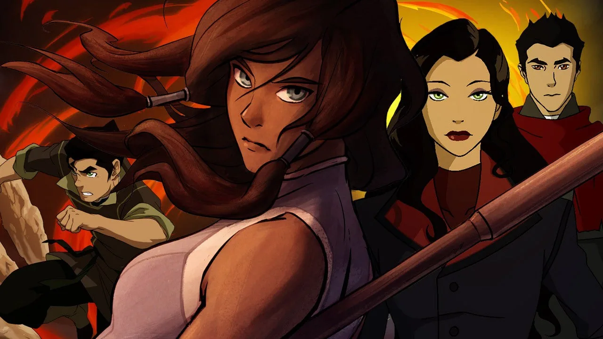
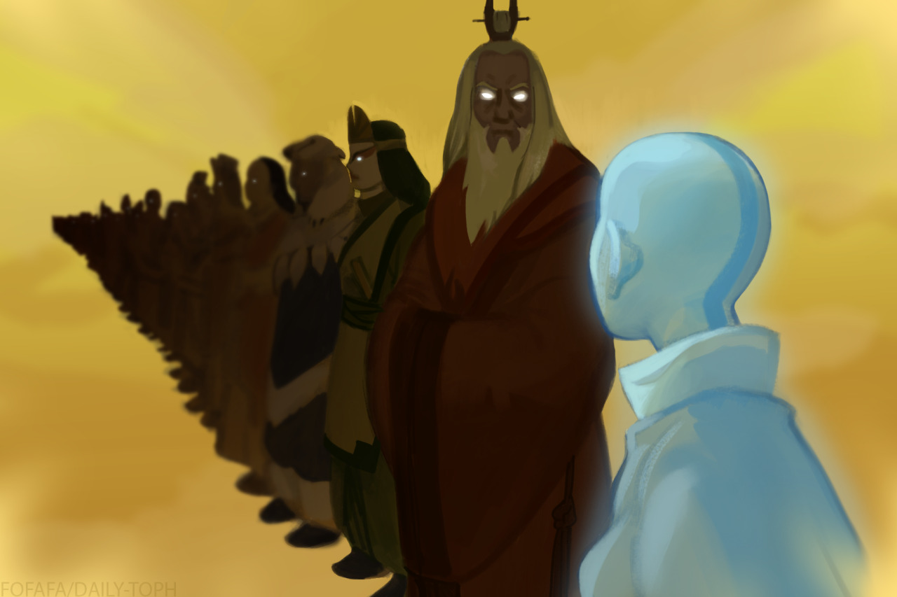

*Avatar : Le Dernier Maître de l'Air* (ATLA) maîtrisait l'équilibre entre aventures épisodiques, arcs de personnages complexes et une narration thématique profonde. Chaque épisode contribuait de manière significative à une narration plus large, créant un monde pleinement réalisé et des personnages qui se développaient de manière organique. *La Légende de Korra* (LoK), cependant, échoue à respecter cette norme. En abandonnant la structure épisodique de son prédécesseur au profit d'une approche sérialisée, LoK sacrifie la profondeur, la construction de son univers, et le développement nuancé des personnages qui faisaient le succès d'ATLA. Ce qui aurait dû être des choix narratifs audacieux aboutit finalement à des arcs précipités, des commentaires politiques superficiels, et un échec à bâtir sur l'héritage d'ATLA.

---

## Structure et narration

### La Brillance Épisodique d'ATLA

Le succès d’ATLA repose en grande partie sur sa nature épisodique. Le rythme délibéré permettait une croissance progressive des personnages et la construction d'un monde riche. Des épisodes indépendants comme "Les Contes de Ba Sing Se" et "Zuko Seul" contribuaient à l'histoire globale tout en ajoutant des couches de profondeur émotionnelle et philosophique. La série équilibrée habilement les moments légers avec des thèmes sérieux comme l'identité, la rédemption et la guerre.

En revanche, LoK abandonne le format épisodique au profit d’une sérialisation, condensant sa narration en saisons de 12 épisodes. Cette décision sacrifie la nuance cultivée par ATLA. Le rythme rapide de LoK entraîne des arcs de personnages tronqués et une exploration superficielle de ses thèmes. La série peine à développer ses idées politiques et dynamiques de personnages de manière significative, souvent en passant rapidement d’un point de l’intrigue à un autre sans leur donner le temps de résonner. La structure sérialisée de LoK limite sa capacité à offrir l’introspection et la construction d'univers qui faisaient la force d'ATLA.

---

## Récit Fragmenté et Incohérence Thématique dans LoK

La nature sérialisée de LoK engendre des problèmes narratifs significatifs. Chaque saison introduit de nouveaux personnages, thèmes et conflits, mais ces éléments ne reçoivent que rarement l'attention ou le temps nécessaires. Les saisons semblent souvent déconnectées les unes des autres, avec des intrigues qui sont rapidement introduites et résolues. Le manque de continuité entre les saisons crée une narration fragmentée qui n’arrive pas à construire de la tension ou des enjeux durables.

Là où ATLA développait soigneusement son intrigue globale et ses personnages à travers des aventures épisodiques qui se renforçaient mutuellement, l’approche de LoK aboutit à une narration désordonnée. Les tentatives de la série pour aborder des questions politiques sérieuses—telles que l’inégalité, l’autoritarisme et l’anarchisme—sont rendues inefficaces par cette structure fragmentée. Des idées complexes sont introduites mais ne sont jamais pleinement explorées, laissant derrière elles des récits qui manquent de cohérence ou d’impact durable.

---

## Continuité et Héritage : L'Héritage Brisé de Korra

### L'Héritage de l'Avatar Brisé

Crédit : [Daily-Toph](https://daily-toph.tumblr.com/post/627552236637159424/s2ep1-the-avatar-state-i-just-wanted-to-do-a)

Un élément crucial du succès d'ATLA était la connexion de l'Avatar avec ses vies antérieures. Cette connexion servait de symbole pour le cycle de l'équilibre entre les mondes physique et spirituel et donnait à l'Avatar la sagesse de ses prédécesseurs. La communion d'Aang avec les Avatars passés comme Roku et Kyoshi ajoutait de la profondeur à son parcours, ancrant ses décisions dans l'héritage de ceux qui l'ont précédé.

LoK coupe ce lien, à la fois symboliquement et factuellement, en séparant Korra de la lignée spirituelle de ses vies antérieures. Cette décision sape fondamentalement le mythe de l'Avatar et la continuité qui avait été au cœur des thèmes d'ATLA. En coupant Korra de ses prédécesseurs, la série élimine l'héritage de sagesse et d'expérience qui était essentiel au rôle de l'Avatar dans le maintien de l'équilibre. Les luttes personnelles de Korra se détachent de l'héritage plus large de l'Avatar, ce qui diminue encore plus la capacité de la série à se connecter aux thèmes de continuité et d'équilibre d'ATLA.

Le bris du cycle de l'Avatar symbolise l'incapacité de Korra à hériter de l'histoire riche de ses prédécesseurs, à la fois en tant que personnage et dans la structure narrative. Cet acte représente l'échec global de LoK à honorer et à construire sur l'héritage spirituel et thématique d'ATLA.

---

## Arcs des Méchants et Commentaire Politique Superficiel

### Amon (Mouvement Anti-Maîtrise)

LoK introduit plusieurs antagonistes, chacun avec le potentiel de représenter des idéologies complexes, mais échoue à les développer pleinement.

Amon dirige la révolution Égaliste, un mouvement qui aurait pu explorer l'inégalité systémique entre les maîtres et non-maîtres. Cependant, la révélation qu'Amon est secrètement un maître du sang sape les fondations idéologiques du mouvement. Le récit passe d’une critique légitime du privilège à un retournement de situation superficiel, invalidant les griefs des non-maîtres et réduisant Amon à un méchant hypocrite dont la révolution est vouée à l’échec dès le début.

### Unalaq (Extrémisme Spirituel)

Unalaq commence comme un personnage destiné à examiner la tension entre tradition et modernisation, en particulier à travers la spiritualité. Cependant, son arc dégénère rapidement en une quête de pouvoir, le réduisant à un méchant générique obsédé par le contrôle. L'opportunité d'explorer l'extrémisme spirituel dans le contexte de l'univers de l'Avatar est abandonnée au profit d'un antagoniste prévisible et sans profondeur.

### Zaheer (Anarchisme et Anti-Autorité)

La philosophie anarchiste de Zaheer remet en question le rôle de l'Avatar dans le maintien de l'ordre mondial, créant ce qui aurait pu être le conflit intellectuel le plus engageant de la série. Cependant, la série réduit Zaheer à un extrémiste, motivé par le chaos plutôt qu'une critique pleinement réalisée de l'autorité. Les vues anarchistes du personnage sont dépeintes comme violentes et destructrices, sans véritable exploration des mérites ou des défauts potentiels de son idéologie.

### Kuvira (Fascisme et Nationalisme)

Le régime autoritaire de Kuvira est une représentation à peine voilée du fascisme. Cependant, la série n'examine guère pourquoi de telles idéologies prennent racine ni comment les sociétés tombent sous l'emprise des leaders autoritaires. La montée de Kuvira est attribuée à son ambition personnelle, et les facteurs sociétaux qui lui permettent de consolider son pouvoir sont ignorés. Son arc est réduit à une autre représentation d'un dictateur avide de pouvoir, sans exploration de la façon dont les idéologies fascistes s'enracinent ou de l'attrait de l'autoritarisme.

Les antagonistes de LoK incarnent des idéologies politiques intéressantes, mais aucun d'entre eux ne reçoit le temps ou la profondeur nécessaires pour explorer pleinement ces idées. La série précipite chaque arc de méchant, les laissant comme des caricatures de leurs idéologies respectives. En ne s'engageant pas correctement avec ces thèmes, LoK réduit son commentaire politique à des platitudes superficielles.

---

## Conclusion : Un Échec de l'Hérédité

*La Légende de Korra* tente de se positionner comme un successeur plus mature et engagé politiquement à *Avatar : Le Dernier Maître de l'Air*. Cependant, en adoptant un format sérialisé et en coupant des éléments thématiques clés, la série échoue à hériter de la profondeur qui faisait le succès d'ATLA. Le rythme précipité de la narration de LoK sacrifie le développement des personnages et l'exploration des thèmes au profit du spectacle, tandis que sa structure narrative désordonnée empêche une continuité significative entre les saisons.

La rupture de Korra avec ses vies antérieures reflète l'incapacité de la série à hériter de l'héritage spirituel et narratif d'ATLA. Le traitement des thèmes politiques par LoK, de l'inégalité à l'autoritarisme, est tout aussi superficiel, chaque antagoniste étant présenté avec une promesse, mais rapidement réduit à des méchants simplistes. En fin de compte, les choix narratifs ambitieux de LoK sont sapés par leur exécution, laissant derrière eux une série qui, en tentant d'en faire trop, échoue à atteindre la profondeur ou la continuité qui ont fait de son prédécesseur un chef-d'œuvre.

<mark>- yaro</mark>
