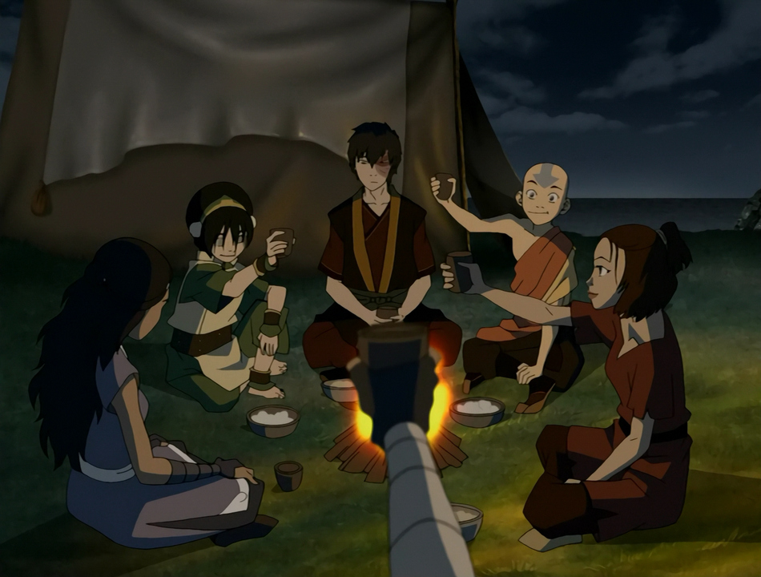
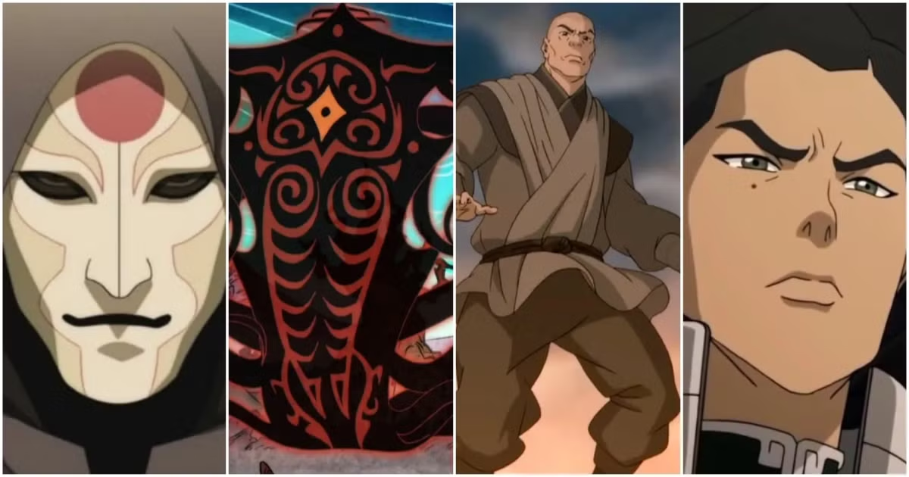
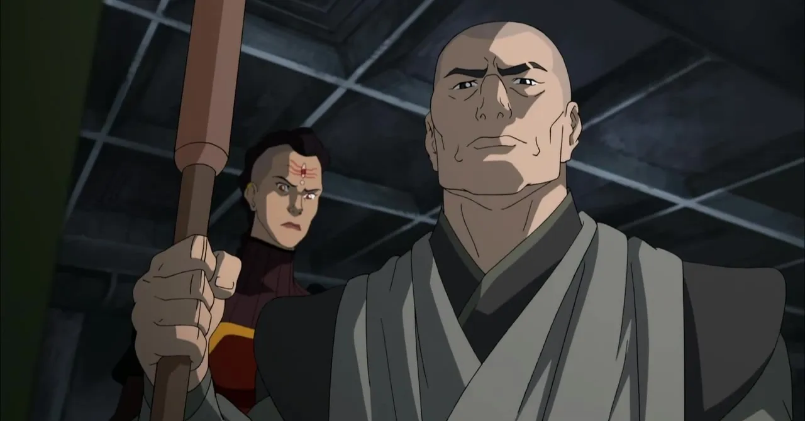

*Avatar : Le Dernier Maître de l'Air* (ATLA) a magistralement équilibré l’aventure épisodique, le développement complexe des personnages et une profondeur thématique impressionnante. Chaque épisode contribuait à un récit plus large, créant un monde organique où les personnages évoluaient de manière naturelle. *La Légende de Korra* (LoK), quant à elle, s'effondre sous le poids de ses propres ambitions.

LoK abandonne le format épisodique d'ATLA pour une structure sérialisée, un choix qui sacrifie la profondeur pour l’illusion de la complexité. Ce changement entraîne des arcs de personnages précipités, un commentaire politique superficiel, et l’incapacité d’hériter de la richesse de son prédécesseur. Ce qui aurait pu être des choix audacieux se résume à des tentatives superficielles de traiter des thèmes modernes.

## Structure et Narration

### La Brillance Épisodique d'ATLA

La nature épisodique d'ATLA était cruciale à son succès. Le rythme lent et délibéré permettait au public non seulement de voir les personnages grandir, mais aussi de comprendre les subtilités du monde. Des épisodes indépendants comme « Les Contes de Ba Sing Se » et « Zuko Seul » ajoutaient des couches de profondeur, façonnant les enjeux émotionnels du récit plus large.

ATLA parvenait à équilibrer légèreté et moments philosophiques, créant une rythmique narrative que *Korra* ne parvient absolument pas à répliquer. LoK, en revanche, ne propose aucune des introspections silencieuses qui permettaient aux grandes idées d'ATLA—identité, rédemption, et guerre—de résonner en profondeur.

La structure sérialisée de LoK semble forcée. Là où ATLA développait soigneusement ses personnages et son univers, *Korra* trébuche constamment. La décision de condenser de nouveaux antagonistes, systèmes politiques, et arcs de personnages en saisons de 12 épisodes laisse peu de place à l'exploration significative.

### La Nature Disparate de la Sérialisation de LoK

La structure sérialisée de LoK est son talon d’Achille. Le récit change constamment de direction, introduisant de nouveaux thèmes et personnages sans leur donner le temps ou l'attention qu'ils méritent. Chaque saison ressemble à une mini-série déconnectée, avec des arcs vaguement définis et des motivations de personnages superficielles. Au lieu de construire organiquement tension et enjeux, LoK traverse ses intrigues de manière maladroite, sacrifiant la substance pour le spectacle.

Là où la nature épisodique d’ATLA permettait un récit immersif et patient, la démarche sérialisée de LoK se traduit par des idées creuses, introduites et jetées sans laisser d'impact durable.

LoK tente de traiter des thèmes politiques sérieux—l’inégalité, l'autoritarisme, et l’anarchisme—mais cela se réduit à du pseudo-intellectualisme. Les idées sont lancées aux spectateurs sans la profondeur narrative nécessaire pour les soutenir, laissant un commentaire politique mal développé, qui se fait passer pour une narration mature.

---

## Continuité et Héritage : Le Cycle de l'Avatar Rompu

### L'Héritage de l'Avatar Brisé

Crédit : [Daily-Toph](https://daily-toph.tumblr.com/post/627552236637159424/s2ep1-the-avatar-state-i-just-wanted-to-do-a)

Une force majeure d'ATLA était la connexion de l’Avatar avec ses vies passées, symbolisant l'héritage de la sagesse et de l'expérience qui informe le présent. Ce lien donnait du poids à l'Avatar, reflétant le cycle perpétuel entre le monde physique et spirituel. La communion d'Aang avec Roku, Kyoshi et d'autres Avatars passés enrichissait le récit, en soulignant l'idée de continuité et d'équilibre.

*Korra* brise cette continuité. En coupant Korra de ses vies passées, la série lui enlève la sagesse et l'héritage qui donnaient à ATLA sa profondeur thématique. Ce qui aurait dû être une exploration réfléchie de Korra trouvant sa propre voie devient un raccourci narratif paresseux, privant la série de la richesse spirituelle qui rendait le cycle de l’Avatar si captivant.

Le résultat ? Une protagoniste sans ancrage dans son propre passé. Les luttes de Korra sont déconnectées du mythe plus large et plus significatif de l'Avatar. En coupant Korra de ses prédécesseurs, LoK sape sa propre tentative de raconter une histoire profonde.

### L’Échec à Développer le Monde d'ATLA

Là où ATLA construisait un monde riche de cultures, de traditions philosophiques et d'une longue histoire du bending, LoK réduit l’univers de l’Avatar à une ville industrialisée superficielle : Republic City. L’attention excessive portée à cette seule localisation réduit la portée de l’univers, privant la série de la richesse qu’ATLA avait explorée dans diverses nations et cultures de bending. Republic City manque de l’âme et de la signification de lieux comme Ba Sing Se ou la Tribu de l’Eau du Sud.

Le format sérialisé de LoK aggrave ce problème. Au lieu de prendre le temps de construire son monde, chaque saison introduit de nouvelles menaces sans explorer comment elles s’intègrent à l’univers plus vaste de l’Avatar. Le résultat est un monde fragmenté, déconnecté de la tapisserie riche qu'ATLA avait soigneusement tissée.

---

## Des Vilains Superficiels et des Caricatures Politiques

### Amon (Mouvement Anti-bending)

Les vilains de LoK sont l’exemple le plus flagrant des ambitions narratives superficielles de la série. La révolution Égaliste menée par Amon avait le potentiel d’explorer les inégalités systémiques et les dynamiques de pouvoir entre les benders et les non-benders. Au lieu de cela, l’intrigue s’effondre sous le poids d’un retournement paresseux : la révélation que Amon est un bloodbender en secret. Ce qui aurait pu être un examen nuancé du privilège et de la rébellion se transforme en un moment grotesque qui invalide le fondement même de la révolution.

L'hypocrisie d'Amon n'est pas une écriture audacieuse—c'est un abandon. Plutôt que de traiter les griefs légitimes des non-benders, LoK les écarte avec un méchant dont la révolution est vouée à l'échec dès le départ.

### Unalaq (Extrémisme Spirituel)

L’arc d’Unalaq est tout aussi décevant. Présenté initialement comme un commentaire possible sur le conflit entre tradition et progrès, Unalaq se transforme rapidement en un fanatique avide de pouvoir, avec un complot de méchant générique. Ses motivations se réduisent à une soif de contrôle, abandonnant toute exploration significative de la spiritualité ou de l'extrémisme religieux.

La dichotomie entre tradition et modernisation est complètement gâchée, laissant derrière elle un antagoniste creux, sans réelle profondeur.

### Zaheer (Anarchisme et Anti-autorité)

La philosophie anarchiste de Zaheer aurait pu offrir à LoK son conflit le plus intellectuellement stimulant. Sa position anti-autoritaire, qui remet en question le rôle de l'Avatar dans le maintien de l'ordre mondial, avait le potentiel de défier les principes fondamentaux de la série. Mais une fois de plus, LoK réduit cette idéologie à une violence gratuite. Zaheer n’est qu’une force destructrice, sans véritable examen des mérites ou des défauts de l'anarchisme.

Ce qui aurait pu être une critique puissante de l'autorité devient une caricature de l'extrémisme, sans la nuance qui aurait pu faire de Zaheer un antagoniste captivant.

### Kuvira (Fascisme et Nationalisme)

Le régime autoritaire de Kuvira est un parallèle à peine voilé avec les mouvements fascistes réels, mais LoK n’explore jamais pourquoi de telles idéologies prennent racine. L'ascension au pouvoir de Kuvira est dépeinte comme une simple ambition personnelle, ignorant les facteurs sociétaux et psychologiques qui permettent à des leaders autoritaires de s'imposer. Plutôt que d'examiner comment une société peut être séduite par des promesses d'ordre et de stabilité, Kuvira est simplement réduite à une dictatrice avide de pouvoir.

L’échec à explorer les implications plus larges de l'autoritarisme laisse l’arc de Kuvira sans profondeur, et peu convaincant.

---

## L'Écroulement des Arcs des Antagonistes

### Les Antagonistes Complexes d'ATLA

ATLA excellait dans la création de antagonistes qui étaient plus que de simples obstacles pour les héros. L'arc de rédemption de Zuko reste l'un des meilleurs exemples de développement de personnage dans les séries animées. Azula, elle aussi, avait des moments de vulnérabilité, équilibrant sa cruauté par une profondeur psychologique.

En prenant le temps d'explorer les motivations de ces personnages, ATLA a élevé ses antagonistes en individus pleinement réalisés, rendant leurs défaites émotionnellement percutantes.

### Les Opportunités Manquées de LoK

LoK, en revanche, précipite ses antagonistes sans leur accorder la même attention. Chaque méchant est introduit, leur idéologie esquissée en de larges traits, puis rapidement vaincu. Amon, Unalaq, Zaheer, et Kuvira représentent tous des idéologies complexes qui ne sont jamais vraiment explorées. Le résultat est une série de confrontations anticlimatiques, avec peu d’impact durable sur le monde ou le récit.

Le format sérialisé de LoK sacrifie la profondeur des personnages pour l'efficacité, laissant derrière lui des antagonistes creux qui auraient pu être tellement plus intéressants.

---

## Conclusion : Un Échec de l'Héritage

*La Légende de Korra* tente de se présenter comme une série plus mature, politiquement engagée, succédant à *Avatar : Le Dernier Maître de l'Air*, mais dans cette démarche, elle sacrifie la profondeur qui a fait la renommée d’ATLA. Le format sérialisé empêche la série d'explorer ses thèmes avec une réelle nuance, réduisant ses antagonistes à des caricatures et ses commentaires politiques à des platitudes superficielles.

La connexion rompue de Korra avec ses vies passées symbolise l'échec plus large de LoK : l’incapacité d’hériter et de développer l'héritage de son prédécesseur. Au lieu de construire sur la riche fondation laissée par ATLA, *La Légende de Korra* opte pour des récits creux, pseudo-profonds, qui échouent à engager la complexité des thèmes qu'ils introduisent.

En voulant trop en faire, LoK finit par ne rien faire de significatif. Ce qui aurait pu être une exploration audacieuse des politiques et idéologies modernes devient une série vide et précipitée, sans réelle continuité ni profondeur thématique. Le voyage de Korra, tout comme la série elle-même, est coupé de l'héritage qui aurait pu lui donner un sens véritable.
