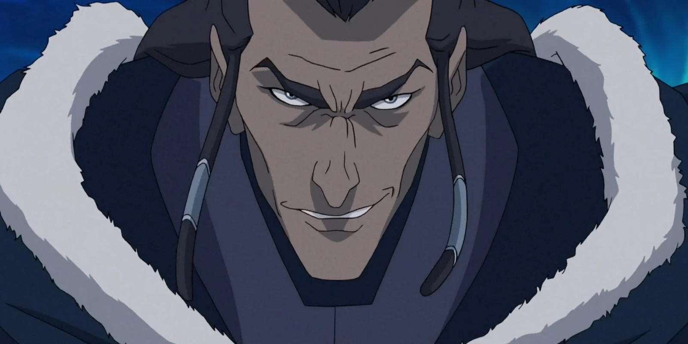

*Avatar : Le Dernier Maître de l'Air* (ATLA) a établi un standard élevé pour la narration animée, avec son équilibre entre aventures épisodiques, développement complexe des personnages, et une profondeur thématique saisissante. Il a habilement tissé une narration où chaque épisode s'appuyait sur le précédent, permettant aux personnages et au monde de croître de manière organique. *La Légende de Korra* (LoK), cependant, raconte une histoire différente — une histoire qui trébuche sous le poids de ses propres ambitions.

LoK a abandonné le format épisodique d'ATLA au profit d'une approche plus sérialisée, et bien que cela aurait pu être un choix audacieux, cela a finalement conduit à une série précipitée et décousue qui n'a pas su s'appuyer sur l'héritage de son prédécesseur. Au lieu d'enrichir le monde de l'Avatar, LoK a introduit des idées politiques superficielles, des personnages sous-développés et des méchants aux motivations thématiques incohérentes. La série essaie de traiter des thèmes complexes, mais la structure sérialisée ne lui laisse ni le temps ni la profondeur nécessaires pour aller au bout de ses idées.

Dans cet article, je soutiendrai que le format sérialisé de LoK sape directement son écriture, et que ce qui aurait dû être des choix narratifs audacieux et innovants apparaissent au final comme pseudo-profonds, manquant clairement la cible. Les méchants, en particulier, incarnent cet échec : ils sont des caricatures d'idéologies politiques, ce qui empêche toute exploration sérieuse des thèmes qu'ils représentent.

## Structure et narration

### Nature épisodique d'ATLA

Le passage de la structure épisodique d'ATLA à la structure sérialisée de LoK est à l'origine de nombreux problèmes de LoK. La nature épisodique d'ATLA permettait une narration patiente. Chaque épisode avait de l'espace pour respirer, offrant des moments de réflexion, de développement du monde et des personnages. La décision de LoK de sérialiser chaque saison, avec un nouvel antagoniste et une nouvelle intrigue en 12-14 épisodes, pousse la série à une exploration rapide et superficielle de ses thèmes et personnages, laissant peu de place pour le développement des idées de la série.

ATLA était un modèle de narration épisodique. Des épisodes comme "Les Contes de Ba Sing Se" et "Zuko seul" n'étaient pas essentiels à l'intrigue centrale, mais ils enrichissaient le monde et approfondissaient la compréhension des personnages par le public. Cette approche permettait à ATLA d'explorer de grandes idées — telles que la guerre, la rédemption et l'identité — à travers des histoires intimistes centrées sur les personnages. Le rythme était délibéré, et les thèmes se déployaient naturellement, donnant à la narration le temps de grandir et aux enjeux émotionnels de monter.

Le format épisodique aidait également ATLA à équilibrer les moments plus légers et comiques avec des moments plus lourds et philosophiques. Cet équilibre gardait la série ancrée, garantissant que ses thèmes profonds ne dominaient pas la narration ni ne paraissaient forcés.

### Nature sérialisée de LoK

Le format sérialisé de LoK, en revanche, est précipité et souvent superficiel. Chaque saison tente d'introduire un nouvel ensemble de personnages et des thèmes politiques complexes, mais il n'y a tout simplement pas assez de temps pour les explorer pleinement. Les méchants sont introduits, leurs motivations à peine esquissées, et ils sont rapidement vaincus avant que la série ne passe à l'intrigue suivante. Ce rythme effréné dépouille la narration de la profondeur qu'ATLA avait en abondance.

Le format sérialisé rend également LoK décousu. Alors que chaque saison d'ATLA faisait clairement partie d'une narration plus vaste et cohérente, LoK ressemble souvent à une collection d'histoires déconnectées. La série est tirée dans plusieurs directions, chaque saison cherchant à être sa propre histoire autonome tout en contribuant à la mythologie plus large de l'Avatar. En conséquence, LoK ne parvient pas à atteindre l'un ni l'autre de ces objectifs : ses arcs semblent précipités et incomplets, et la narration globale est fragmentée.

Ce qui aurait pu être une exploration audacieuse de thèmes complexes apparaît au final comme pseudo-intellectuel — des idées qui sont introduites sans être pleinement réalisées. La série aborde des questions comme l'inégalité, l'anarchisme et l'autoritarisme, mais elle ne s'engage pas avec elles de manière significative. Au lieu de proposer un commentaire politique approfondi, LoK présente des caricatures d'idéologies, réduisant les luttes du monde réel à des intrigues simplifiées.

---

## L'échec de la continuité dans LoK

### L'héritage de l'Avatar

Crédit : [Daily-Toph](https://daily-toph.tumblr.com/post/627552236637159424/s2ep1-the-avatar-state-i-just-wanted-to-do-a)

Dans ATLA, la connexion de l'Avatar à ses vies passées était un outil narratif puissant, soulignant la continuité et le poids du rôle de l'Avatar en tant que pont entre les mondes physique et spirituel. La connexion d'Aang avec des avatars passés comme Roku et Kyoshi symbolisait l'héritage de la sagesse et de l'expérience, renforçant l'idée d'un cycle continu où le passé éclaire le présent.

LoK échoue complètement à cet égard. La rupture de Korra avec les avatars passés était censée signaler son besoin de forger sa propre identité, mais en réalité, elle a brisé la continuité thématique qui rendait ATLA si captivant. Plutôt que d'apparaître comme un changement narratif réfléchi, cette décision ressemblait à une rupture brusque et inutile avec le cœur même de ce qui rendait le cycle de l'Avatar significatif.

En coupant Korra de la sagesse de ses prédécesseurs, LoK sape le poids de l'héritage de l'Avatar. Ce qui aurait dû être une série sur Korra trouvant sa propre voie dans un monde en changement devient une série sans ancrage dans sa propre mythologie. Le concept d' "hérédité" est mis de côté, et les luttes de Korra sont déconnectées du contexte spirituel et historique plus profond qui a donné tant de résonance au parcours d'Aang.

### L'échec à construire sur le monde d'ATLA

LoK échoue également à construire sur le riche univers établi dans ATLA. Alors qu'ATLA prenait le temps d'explorer différentes cultures, philosophies du bending, et histoires à travers les quatre nations, LoK réduit ce monde complexe à un décor. La ville de la République, bien que visuellement intéressante, devient le principal décor de la série, mais elle manque de la profondeur ou de la signification culturelle qui rendaient les divers lieux d'ATLA si mémorables.

Cette focalisation limitée réduit la portée de l'univers de l'Avatar. Le monde semble plus petit et moins dynamique car LoK ne prend pas le temps de l'explorer. Le format sérialisé exacerbe ce problème : avec chaque saison introduisant de nouvelles menaces et conflits, il n'y a pas d'opportunité pour construire de manière organique le monde ou la place des personnages en son sein. Le résultat est un monde déconnecté de sa propre histoire — où les personnages et cultures d'ATLA sont mentionnés mais pas véritablement intégrés à l'histoire.

---

## Des parallèles politiques superficiels

### Amon (Mouvement anti-bending)

Le plus grand échec de LoK réside dans ses méchants. La série tente d'introduire des antagonistes politiquement motivés, chacun représentant une idéologie du monde réel — Amon et l'égalité anti-bending, l'extrémisme spirituel d'Unalaq, l'anarchisme de Zaheer et l'autoritarisme de Kuvira — mais aucun de ces personnages ou de leurs idéologies n'est exploré avec une réelle profondeur. Au lieu de cela, ils sont réduits à des caricatures superficielles, et leurs positions politiques sont traitées de manière à banaliser les luttes réelles.

La révolution égaliste d'Amon avait le potentiel d'être une exploration complexe des dynamiques de pouvoir et d'inégalité dans un monde dominé par les benders. Mais la série sabote son propre message en révélant qu'Amon est secrètement un bloodbender, transformant ce qui aurait pu être une critique légitime du privilège des benders en farce. Au lieu d'aborder les questions d'inégalité de manière significative, le personnage d'Amon est exposé comme un hypocrite, et le mouvement qu'il dirige est balayé. Le message : les révolutions contre l'oppression systémique sont soit hypocrites soit vouées à l'échec.

Ce n'est pas une écriture audacieuse. C'est paresseux. Plutôt que de s'engager dans les complexités de l'inégalité, LoK les écarte complètement, réduisant le mouvement égaliste à un simple dispositif narratif temporaire sans impact durable sur le monde.

### Unalaq (Extrémisme spirituel)

L'arc d'Unalaq souffre de problèmes similaires. Au départ, il représente la tension entre tradition et modernisation, un thème qui aurait pu fournir un commentaire riche sur le rôle de la spiritualité dans un monde de plus en plus industrialisé. Mais LoK réduit rapidement le personnage d'Unalaq à un fanatique avide de pouvoir, plus intéressé à devenir le Dark Avatar qu'à explorer une véritable philosophie spirituelle.

Plutôt que de se plonger dans les complexités de l'extrémisme spirituel et des dangers de l'autorité religieuse incontrôlée, les motivations d'Unalaq sont réduites à une simple soif de pouvoir. Le potentiel d'exploration du dilemme entre traditionalisme et progrès est abandonné au profit d'une intrigue générique de "méchant".

### Zaheer (Anarchisme et anti-autorité)

La philosophie anarchiste de Zaheer aurait pu être l'aspect le plus intellectuellement engageant de LoK. Il plaide pour le démantèlement de toute autorité, remettant en cause le rôle même de l'Avatar dans le maintien de l'ordre. Cependant, une fois encore, la série tombe dans le piège de réduire cette idéologie complexe à du chaos pour le chaos. Plutôt que de s'engager avec les mérites ou les dangers de l'anarchisme, le personnage de Zaheer se dégrade rapidement en extrémisme violent.

Ce qui aurait pu être un examen réfléchi de la politique anti-autoritaire devient une autre intrigue superficielle, où les enjeux idéologiques ne sont jamais pleinement explorés. La série présente l'anarchisme comme synonyme de destruction et de violence, sans accorder à la philosophie de Zaheer l'attention qu'elle mérite.

### Kuvira (Fascisme et nationalisme)

Le régime autoritaire de Kuvira est un parallèle évident aux mouvements fascistes du monde réel, mais comme les autres méchants, son personnage manque de profondeur. La montée au pouvoir de Kuvira, fondée sur des promesses d'unité et d'ordre, reflète la manière dont les dirigeants autoritaires gagnent souvent un soutien populaire en temps de crise. Mais LoK n'explore pas les raisons psychologiques ou sociétales pour lesquelles les gens pourraient suivre un tel leader. Au lieu de cela, les motivations de Kuvira sont réduites à une ambition personnelle, et son autoritarisme est présenté comme rien de plus qu'un désir de contrôle.

Ce qui aurait pu être une exploration de la façon dont l'autoritarisme prend racine dans la société se transforme en une représentation unidimensionnelle d'une dictatrice. Kuvira est simplement une méchante à vaincre, et les implications plus larges de son idéologie sont laissées inexploitées.

---

## L'effondrement des arcs des méchants

### Les méchants dans ATLA

Les méchants d'ATLA étaient complexes et multi-couches, avec des motivations explorées progressivement au fil du temps. L'arc de rédemption de Zuko est l'un des meilleurs exemples de développement de personnage à long terme dans une narration animée. Son parcours d'antagoniste à héros n'a pas été précipité, et le format épisodique a permis à la série d'explorer en profondeur ses luttes avec l'identité, l'honneur et la rédemption.

Même Azula, qui est restée une antagoniste principale jusqu'à la fin, a eu des moments de vulnérabilité et de profondeur psychologique. Le format épisodique a permis à la série d'équilibrer sa cruauté terrifiante avec des aperçus de ses insécurités, en faisant un personnage pleinement réalisé plutôt qu'une simple méchante.

### Les occasions manquées dans LoK

En revanche, les méchants de LoK sont précipités à travers leurs arcs, sans jamais avoir le temps ou l'espace pour se développer en personnages complexes. Chaque méchant est introduit, son idéologie esquissée à grands traits, et ils sont rapidement vaincus, laissant peu de place à la nuance. C'est la faille fatale du format sérialisé de LoK : il privilégie l'efficacité à la profondeur, résultant en des méchants qui ne sont guère plus que des véhicules pour un commentaire politique superficiel.

Amon, Unalaq, Zaheer et Kuvira représentent tous des idéologies qui auraient pu être explorées avec soin et complexité, mais la série ne leur donne pas le temps nécessaire. Au lieu de cela, leurs défaites semblent souvent anticlimatiques, et les conséquences de leurs actions sont rapidement balayées. Le résultat est une série qui n'offre qu'un engagement superficiel avec les thèmes politiques et philosophiques qu'elle tente d'aborder.

---

## Conclusion : Un échec à hériter et à innover

*La Légende de Korra* tente d'être une série plus mature et politiquement engagée que *Avatar : Le Dernier Maître de l'Air*, mais en le faisant, elle sacrifie la profondeur et la nuance qui ont fait la renommée de son prédécesseur. Le format sérialisé a peut-être offert une approche plus rapide, axée sur l'intrigue, mais il a finalement sapé la capacité de la série à explorer ses thèmes et ses personnages avec une réelle profondeur.

Le concept d' "hérédité" — à la fois dans le monde de l'Avatar et en termes d'héritage narratif — est brisé dans LoK. La rupture de Korra avec ses vies passées symbolise l'échec plus large de la série à hériter de la résonance émotionnelle et thématique d'ATLA. Au lieu de s'appuyer sur la riche fondation de son prédécesseur, LoK opte pour des commentaires politiques pseudo-profonds et des arcs de personnages précipités.

Ce qui aurait pu être une exploration audacieuse des thèmes modernes et des idéologies politiques apparaît au final comme superficiel et sous-développé. Les méchants sont réduits à des caricatures, et le format sérialisé ne laisse pas à la série la place dont elle a besoin pour grandir. En essayant d'en faire trop, LoK échoue finalement à rendre justice au monde de l'Avatar ou aux idées ambitieuses qu'elle tente d'aborder.
