*Avatar: The Last Airbender* (ATLA) set a high standard for animated storytelling, with its balance of episodic adventure, complex character development, and profound thematic depth. It masterfully wove a narrative where each episode built upon the last, with characters and the world growing organically. *The Legend of Korra* (LoK), however, is a different story—one that stumbled under the weight of its own ambitions.

LoK shifted from ATLA’s episodic format to a more serialized approach, and while that could have been a bold choice, it ultimately resulted in a rushed, disjointed series that failed to build on the legacy of its predecessor. Instead of enriching the Avatar world, LoK introduced shallow political ideas, underdeveloped characters, and thematically inconsistent villains. The show tries to tackle complex themes, but the serialized structure does not allow it the time or depth to follow through.

In this article, I will argue that LoK’s serialized format directly undermines its writing, and that what should have been bold and innovative narrative choices instead come across as pseudo-deep, ultimately missing the mark. The villains, in particular, represent this failure: they are caricatures of political ideologies, undercutting any serious exploration of the themes they represent.

## Structure and Storytelling

### Episodic Nature of ATLA

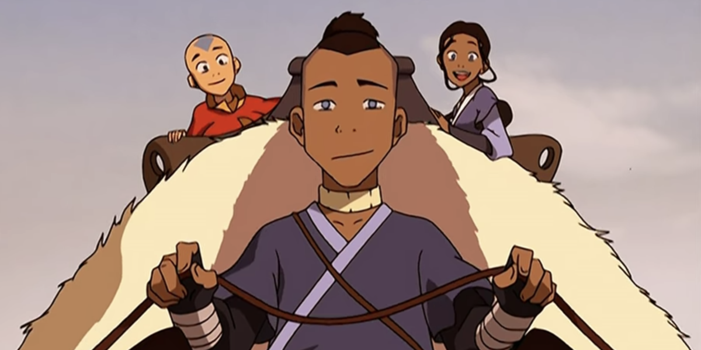

The structural shift from ATLA’s episodic approach to LoK’s serialized format is where many of LoK’s problems begin. ATLA’s episodic nature allowed for patient storytelling. Each episode had room to breathe, offering moments of reflection, world-building, and nuanced character development. LoK’s decision to serialize each season, with a new antagonist and arc every 12-14 episodes, forces the show into a rapid, surface-level exploration of its themes and characters, leaving little room for the show’s ideas to develop.

ATLA was a masterclass in episodic storytelling. Episodes like “The Tales of Ba Sing Se” and “Zuko Alone” were not essential to the central plot, but they enriched the world and deepened the audience’s understanding of the characters. This approach allowed ATLA to explore big ideas—such as war, redemption, and identity—through intimate, character-driven stories. The pacing was deliberate, and the themes unfolded naturally, giving the narrative room to grow and for emotional stakes to rise.

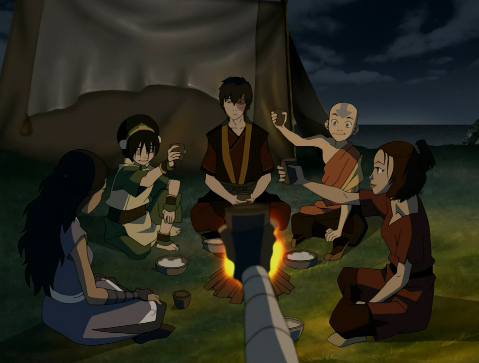

The episodic format also helped ATLA balance lighter, comedic moments with heavier, more philosophical ones. This balance kept the show grounded, ensuring that its weighty themes didn’t overwhelm the narrative or feel contrived.

### Serialized Nature of LoK

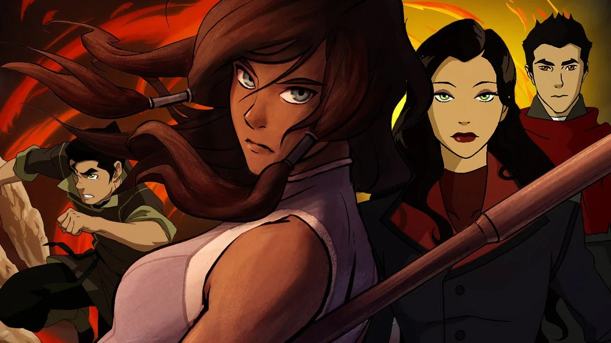

LoK’s serialized format, by contrast, is rushed and often shallow. Each season attempts to introduce a new set of characters and complex political themes, but there simply isn’t enough time to fully explore any of them. Villains are introduced, their motivations vaguely sketched out, and they are quickly defeated before the show moves on to the next arc. This rapid pacing strips the narrative of the depth that ATLA had in spades.

The serialized nature also makes LoK feel disjointed. While each season of ATLA was clearly part of a larger, cohesive narrative, LoK often feels like a collection of disconnected stories. The series is pulled in multiple directions, with each season trying to be its own self-contained story while also contributing to the broader Avatar mythos. As a result, LoK doesn’t manage to do either effectively: its arcs feel rushed and incomplete, and the overarching narrative is fragmented.

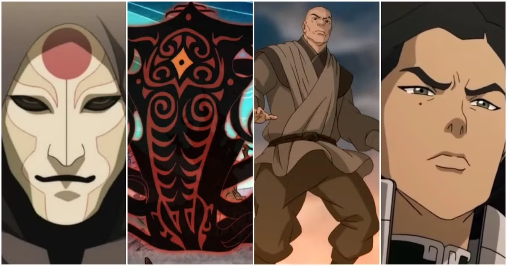

What could have been a bold exploration of complex themes instead comes off as pseudo-intellectual—ideas that are introduced without being fully realized. The show touches on issues like inequality, anarchism, and authoritarianism, but it fails to engage with them in any meaningful way. Instead of offering deep political commentary, LoK presents caricatures of ideologies, reducing real-world struggles to oversimplified plot points.

---

## Failure of Continuity in LoK

### Legacy of the Avatar

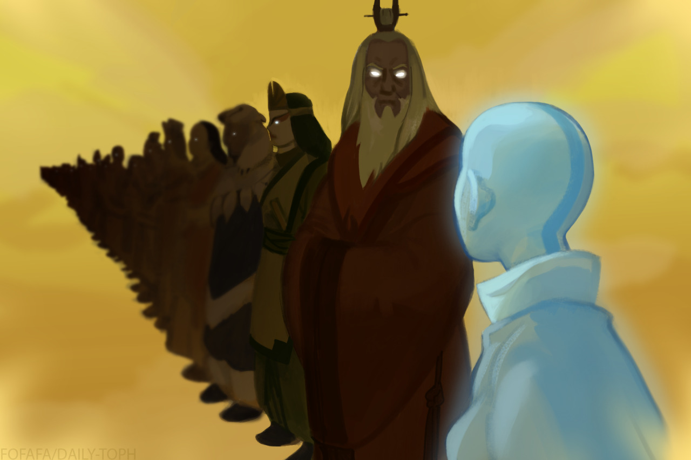
Credit: [Daily-Toph](https://daily-toph.tumblr.com/post/627552236637159424/s2ep1-the-avatar-state-i-just-wanted-to-do-a)

In ATLA, the Avatar’s connection to their past lives was a powerful narrative tool, emphasizing the continuity and weight of the Avatar’s role as the bridge between the physical and spiritual worlds. Aang’s connection to past Avatars like Roku and Kyoshi symbolized the inheritance of wisdom and experience, reinforcing the idea of an ongoing cycle where the past informs the present.

LoK completely fumbles this. Korra’s severed connection to the past Avatars was meant to signal her need to forge her own identity, but in reality, it broke the thematic continuity that made ATLA so compelling. Rather than feeling like a thoughtful narrative shift, this decision felt like an abrupt and unnecessary break from the very core of what makes the Avatar cycle meaningful.

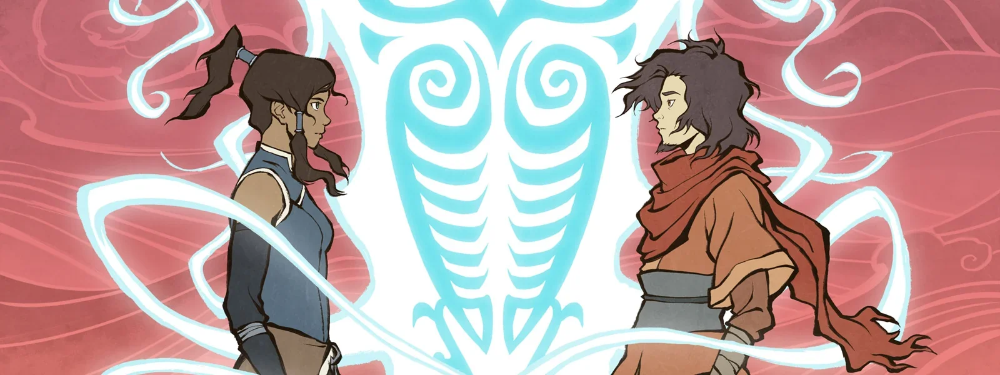

By cutting Korra off from the wisdom of her predecessors, LoK undermines the weight of the Avatar’s legacy. What should have been a series about Korra finding her own path in a changing world instead becomes a series with no anchor to its own mythos. The concept of “heredity” is thrown aside, and Korra’s struggles are divorced from the deeper spiritual and historical context that gave Aang’s journey such resonance.

### Failure to Build on ATLA’s World

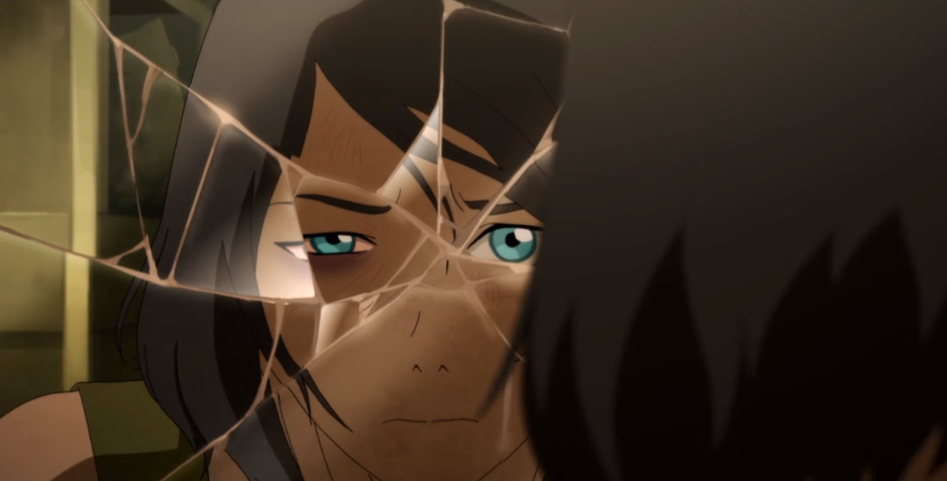

LoK also fails to build on the rich world established in ATLA. While ATLA took its time exploring different cultures, bending philosophies, and histories across the four nations, LoK reduces this intricate world to a backdrop. Republic City, while visually interesting, becomes the primary setting for much of the series, but it lacks the depth or cultural significance that made the various locations in ATLA so memorable.

This limited focus narrows the scope of the Avatar universe. The world feels smaller and less dynamic because LoK does not take the time to explore it. The serialized format exacerbates this issue: with each season introducing new threats and conflicts, there’s no opportunity to organically build the world or the characters’ place in it. The result is a world that feels disconnected from its own history—where characters and cultures from ATLA are mentioned but not meaningfully integrated into the story.

---

## Shallow Political Parallels

### Amon (Anti-bending Movement)

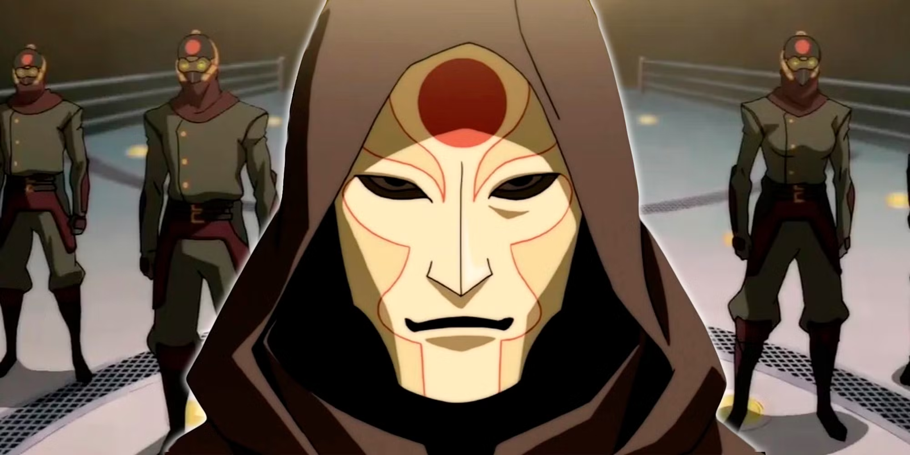

LoK’s greatest failure is in its villains. The show attempts to introduce politically motivated antagonists, each representing a real-world ideology—Amon and anti-bending equality, Unalaq’s spiritual extremism, Zaheer’s anarchism, and Kuvira’s authoritarianism—but none of these characters or their ideologies are explored with any real depth. Instead, they are reduced to shallow caricatures, and their political standpoints are handled in a way that trivializes real-world struggles.

Amon’s Equalist revolution had the potential to be a complex exploration of inequality and power dynamics in a world dominated by benders. But the show undercuts its own message by revealing that Amon is secretly a bloodbender, turning what could have been a legitimate critique of bending privilege into a farce. Instead of addressing the issues of inequality in a meaningful way, Amon’s character is exposed as a hypocrite, and the movement he leads is brushed aside. The message: revolutions against systemic oppression are either hypocritical or doomed to fail.

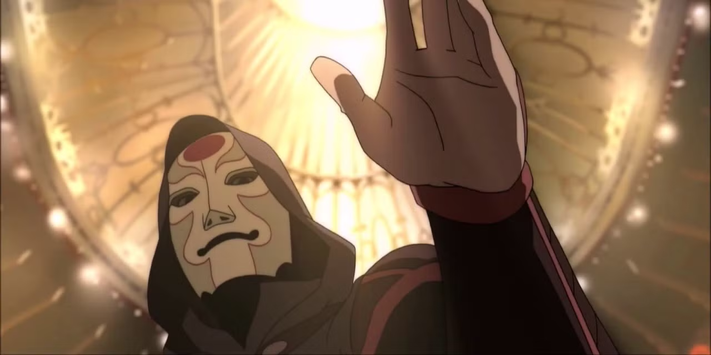

This is not bold writing. It’s lazy. Rather than engaging with the complexities of inequality, LoK dismisses them entirely, reducing the Equalist movement to a temporary plot device with no lasting impact on the world.

### Unalaq (Spiritual Extremism)

Unalaq’s arc suffers from similar issues. Initially, he represents the tension between tradition and modernization, a theme that could have provided rich commentary on the role of spirituality in an increasingly industrialized world. But LoK quickly reduces Unalaq’s character to a power-hungry zealot, more interested in becoming the Dark Avatar than in exploring any meaningful spiritual philosophy.

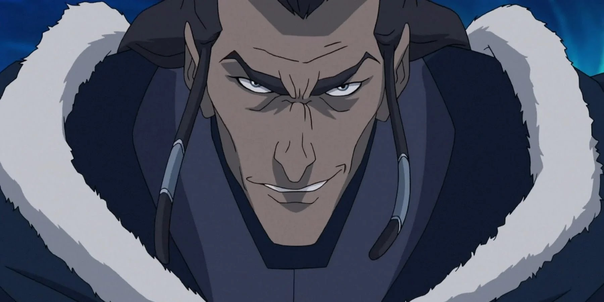

Instead of delving into the complexities of spiritual extremism and the dangers of unchecked religious authority, Unalaq’s motivations are boiled down to a simplistic thirst for power. The potential for exploring the nuance of traditionalism versus progress is thrown away in favor of a generic “evil” plotline.

### Zaheer (Anarchism and Anti-Authority)

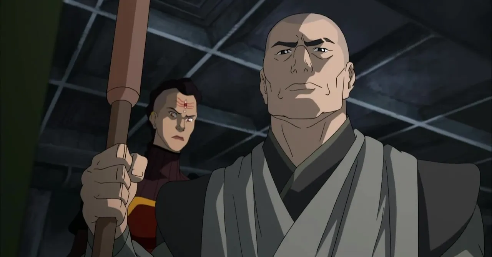

Zaheer’s anarchist philosophy could have been the most intellectually engaging aspect of LoK. He argues for dismantling all authority, challenging the very foundation of the Avatar’s role in maintaining order. However, once again, the show falls into the trap of reducing this complex ideology to chaos for chaos’s sake. Instead of engaging with the merits or dangers of anarchism, Zaheer’s character quickly devolves into violent extremism.

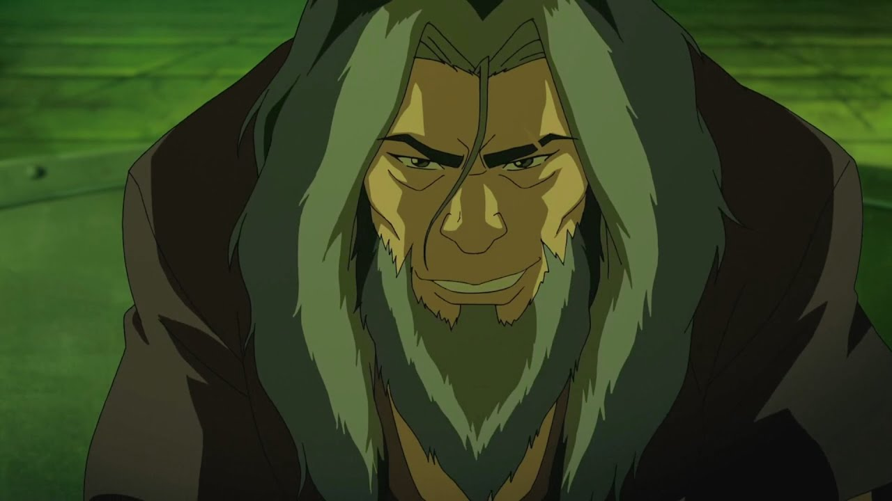

What could have been a thoughtful examination of anti-authoritarian politics instead becomes another shallow villain arc, where the ideological stakes are never fully explored. The show presents anarchism as synonymous with destruction and violence, without giving Zaheer’s philosophy the attention it deserves.

### Kuvira (Fascism and Nationalism)

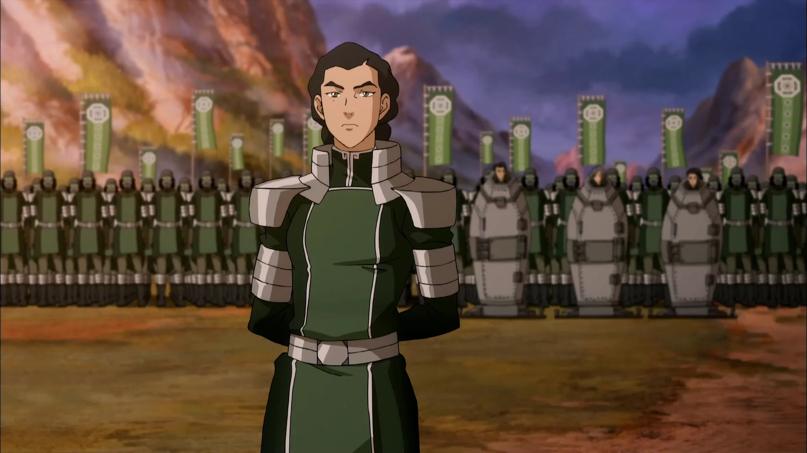

Kuvira’s authoritarian regime is a clear parallel to real-world fascist movements, but like the other villains, her character lacks depth. Kuvira’s rise to power, built on promises of unity and order, mirrors the way authoritarian leaders often gain popular support in times of crisis. But LoK doesn’t explore the psychological or societal reasons people might follow such a leader. Instead, Kuvira’s motivations are reduced to personal ambition, and her authoritarianism is portrayed as nothing more than a desire for control.

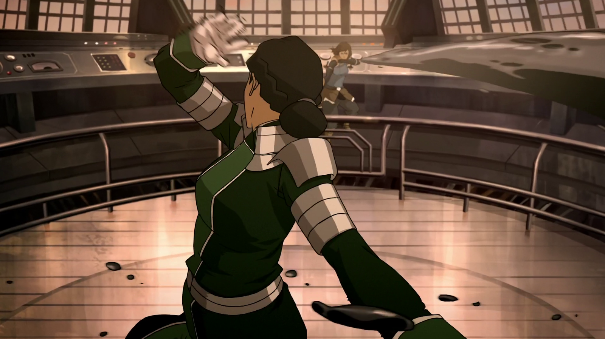

What could have been an exploration of how authoritarianism takes root in society is instead a one-dimensional portrayal of a dictator. Kuvira is simply a villain to be defeated, and the broader implications of her ideology are left unexplored.

---

## The Collapse of Villain Arcs

### Villains in ATLA

ATLA’s villains were complex and multi-layered, with motivations that were explored gradually over time. Zuko’s redemption arc is one of the best examples of long-form character development in animated storytelling. His journey from antagonist to hero wasn’t rushed, and the episodic format allowed the show to explore his struggles with identity, honor, and redemption in depth.

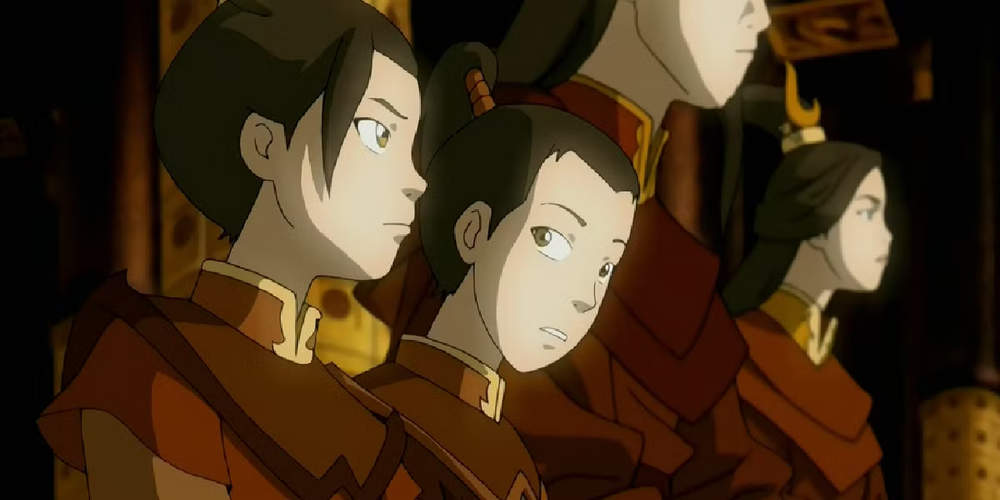

Even Azula, who remained a primary antagonist until the end, was given moments of vulnerability and psychological depth. The episodic format allowed the show to balance her terrifying ruthlessness with glimpses of her insecurities, making her a fully realized character rather than a simple villain.

### Lost Opportunities in LoK

In contrast, LoK’s villains are rushed through their arcs, never given the time or space to develop into complex characters. Each villain is introduced, their ideology sketched out in broad strokes, and they are quickly defeated, leaving little room for nuance. This is the fatal flaw of LoK’s serialized format: it prioritizes efficiency over depth, resulting in villains who are little more than vehicles for shallow political commentary.

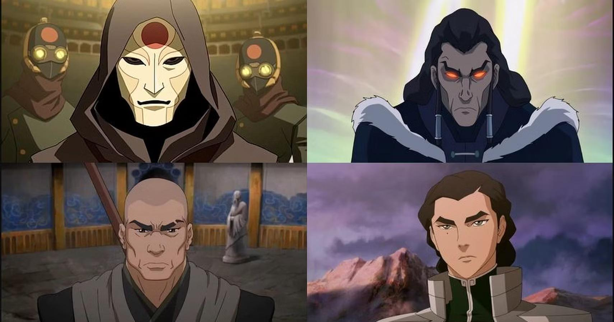

Amon, Unalaq, Zaheer, and Kuvira all represent ideologies that could have been explored with care and complexity, but the show doesn’t give them the time they need. Instead, their defeats often feel anticlimactic, and the consequences of their actions are quickly swept aside. The result is a series that offers only surface-level engagement with the political and philosophical themes it tries to address.

---

## Conclusion: A Failure to Inherit and Innovate

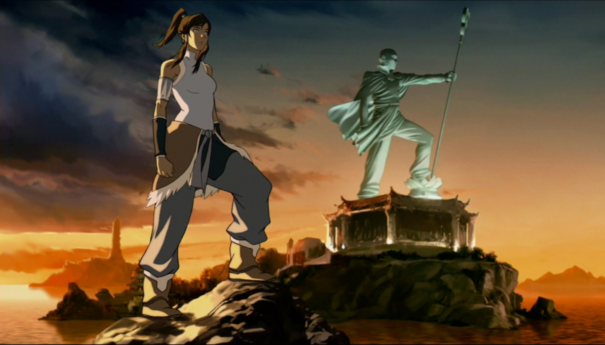

*The Legend of Korra* attempts to be a more mature, politically engaged series than *Avatar: The Last Airbender*, but in doing so, it sacrifices the depth and nuance that made its predecessor so beloved. The serialized format may have offered a more fast-paced, plot-driven approach, but it ultimately undercut the show’s ability to explore its themes and characters with any real depth.

The concept of “heredity”—both within the world of the Avatar and in terms of narrative legacy—is broken in LoK. Korra’s severed connection to her past lives symbolizes the series’ larger failure to inherit the emotional and thematic resonance of ATLA. Instead of building on the rich foundation of its predecessor, LoK opts for pseudo-deep political commentary and rushed character arcs.

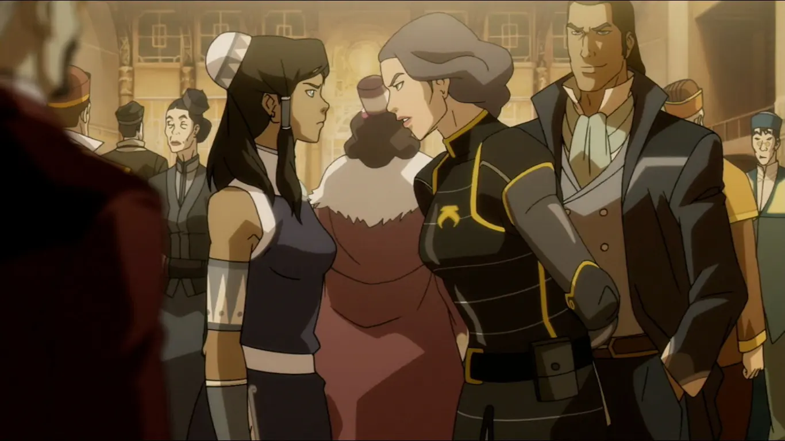

What could have been a bold exploration of modern themes and political ideologies instead comes off as shallow and underdeveloped. The villains are reduced to caricatures, and the serialized format doesn’t allow the series the room it needs to grow. In trying to do too much, LoK ultimately fails to do justice to the world of Avatar or to the ambitious ideas it tries to tackle.
