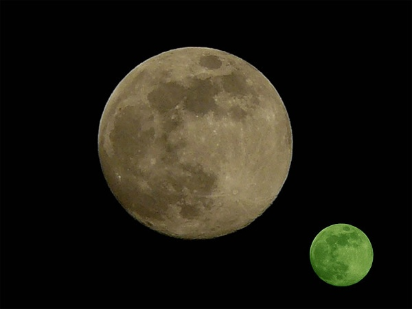
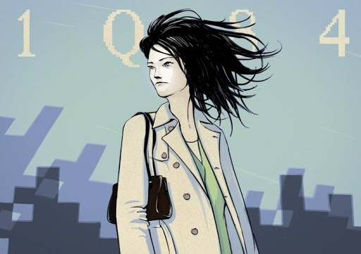
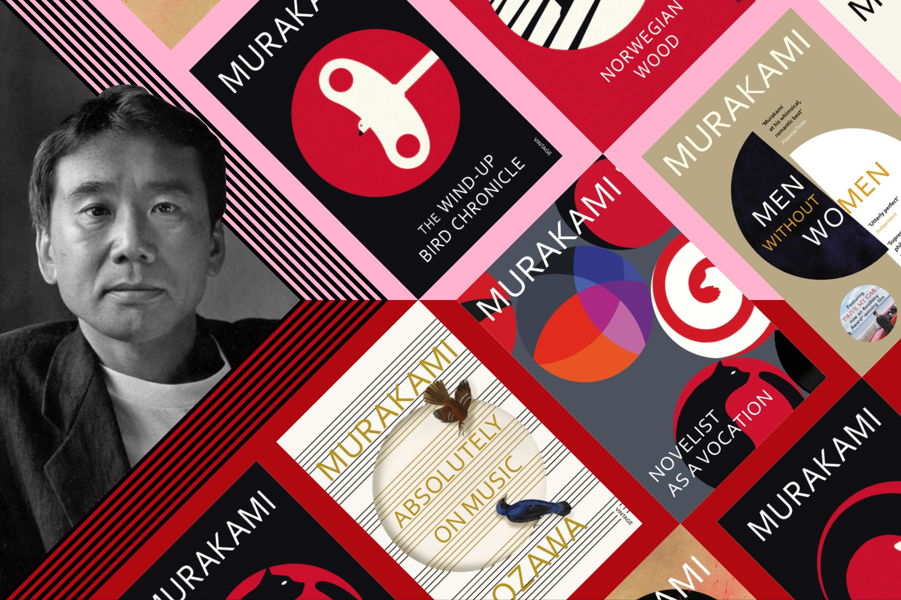
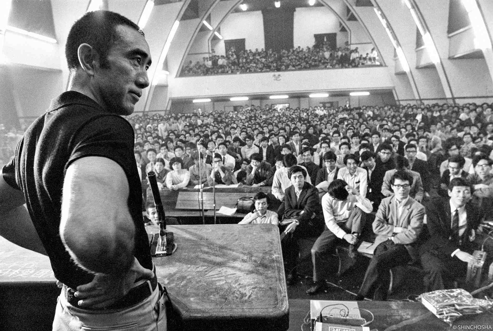
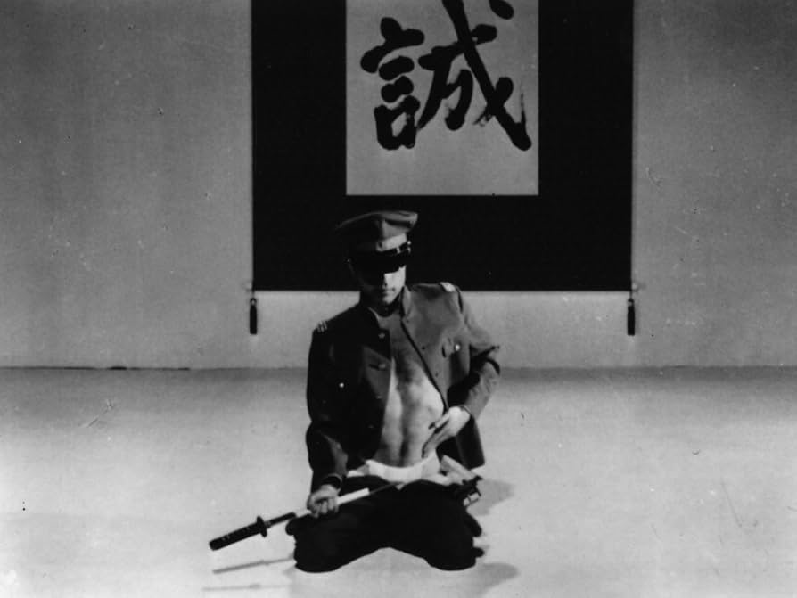
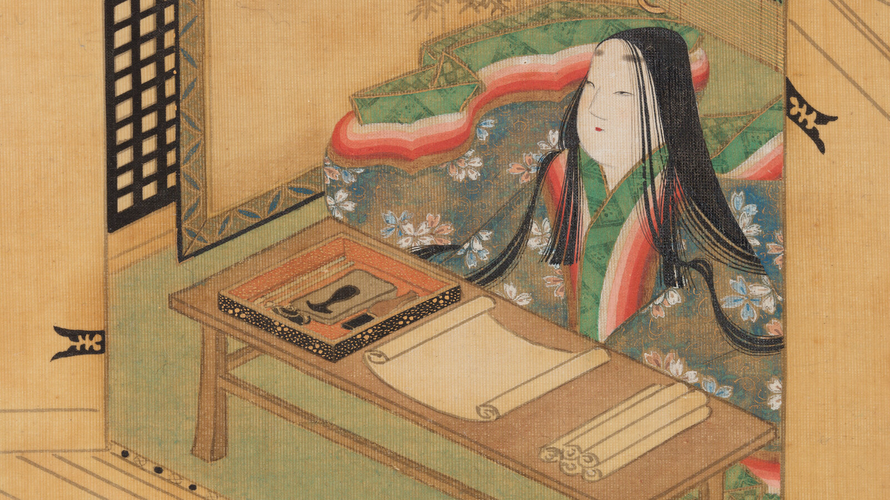
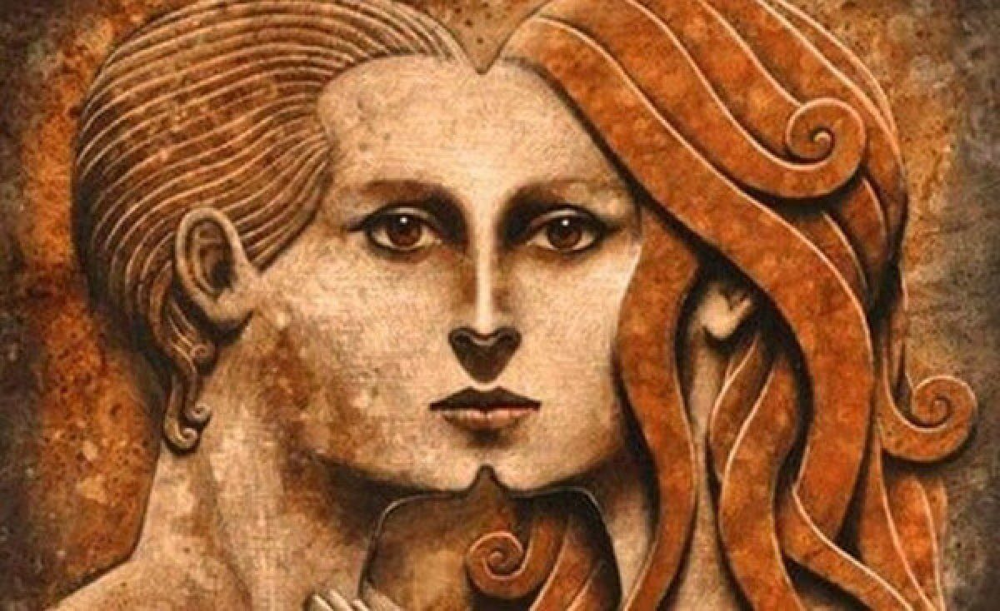
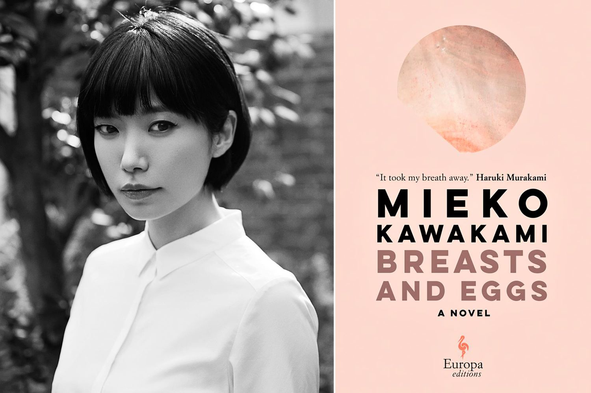

*<small>Deux lunes pendent bas — l'une pour le monde que nous connaissons, l'autre pour celui que nous redoutons. Entre elles, Aomame marche, son corps est une arme, son âme une énigme.</small>*

Aomame tue des hommes dans des chambres d'hôtel. Elle porte leur sang comme un secret, sa vengeance est implacable, ses motifs opaques. Dans *1Q84*, Murakami lui accorde une force redoutable — la précision d’un tireur d’élite, la douceur d’une amante — tout en la réduisant à une créature dont les raisons échappent à une compréhension aisée. Comme l’écrit Murakami :  
> <mark>« Si tu ne peux pas comprendre sans explication, alors tu ne pourras jamais comprendre même avec explication. »</mark>

Son traumatisme est sublimé, sa colère atténuée par le fantasme masculin. Sur la page, Fuka-Eri semble flotter : une jeune femme, silencieuse et éthérée, son ventre se fait métaphore, sa voix se fait écho du vide.

Pendant ce temps, Mishima Yukio évoque le désir d’être anéanti par la beauté, son envie de dissolution encadrée par la puissance féminine. Il réfléchit :  
> <mark>« La véritable beauté est celle qui attaque, subjugue, dépossède et finit par détruire. »</mark>

Les femmes dans la littérature japonaise ne sont guère décrites comme des êtres charnels — elles deviennent des symboles, des symptômes, des ombres. Elles portent le fardeau du désir, de la décadence et de l’identité nationale, tandis que leur vie intérieure se dissout tel de l’encre sous la pluie.

Pourquoi ce canon, si riche en nuances, transforme-t-il les femmes en <mark>symboles sublimes</mark> ?

---

## Les Femmes de Murakami : Entre Pouvoir et Effacement

### Aomame et le Regard Masculin dans *1Q84*

  
Source : [Tabi no Michi](https://tabinomichi.com/?p=602)

Aomame se présente en fragments : assassin, survivante d’un culte, amante. Murakami la pare de contradictions — une vengeresse farouche qui « méprise les femmes », une tueuse qui pleure un enfant disparu. Sa capacité d’agir est indéniable, mais son intériorité demeure sans cesse <mark>voilée par la métaphore</mark>. Lorsqu’elle élimine des hommes violents, son geste ressemble moins à un acte de justice qu’à une symétrie poétique, sa violence étant idéalisée en une fantaisie de revanche masculine.

Fuka-Eri, l’adolescente de 17 ans qui écrit *La Chrysalide de l’Air*, se caractérise par son silence et son symbolisme : un réceptacle du traumatisme, une jeune fille figée dans une innocence précoce. Murakami la présente comme un canal de messages surnaturels, soulignant son rôle de médium plutôt que celui d’une personne à part entière. Son autonomie se dissout dans l’allégorie.

Le *complexe madonne–prostituée* de Freud hante ces personnages. Dans *Contributions à la psychologie de l'amour*, Freud écrit :  
> <mark>« Dans le développement psychologique d’un homme, l’objet d’amour et l’objet sexuel sont d’abord indissociables. L’objet d’amour est une femme ; l’objet sexuel l’est tout autant. »</mark>

Aomame incarne cette dualité : guérisseuse sanctifiée et exécutrice sensuelle. Fuka-Eri se présente comme la muse immaculée, son pouvoir réduit par son silence. Elles existent pour faire avancer les récits masculins — la créativité de Tengo, la décadence du culte — tandis que leur douleur se transforme en un décor ambiant.

### Le Motif de Murakami : Guides énigmatiques et Absence Émotionnelle

De Naoko dans *Les Musiques de l’Âme* (version francisée de *Norwegian Wood*) à Miss Saeki dans *Kafka sur le rivage*, les femmes de Murakami suivent un schéma récurrent. Elles sont, par nature, des mystères ; leurs passés s’effacent en points de suspension, leurs raisons sont oniriques, et surtout, leur souffrance est décrite avec une poésie inégalée — perçue comme belle. Dans *Les Musiques de l’Âme*, la maladie mentale de Naoko est peinte en mélancolie poétique :  
> <mark>« Son esprit était tel un délicat petit oiseau. »</mark>

Leur émancipation sexuelle sert souvent d’analogue à l’illumination masculine. Kumiko dans *Chroniques de l’Oiseau aux Ressorts* est à la fois épouse et énigme, son infidélité agit comme un déclencheur dans la quête de soi du protagoniste. Pourtant, ses désirs restent inexplorés, ses actions se font l’écho du regard de son mari.

Dans une perspective jungienne, elles représentent des figures <mark>anima</mark> — des incarnations de l’inconscient masculin. La dualité d’Aomame (tueuse à la lumière de la lune/figure maternelle) reflète les tensions non résolues de Tengo, tandis que le silence de Fuka-Eri renvoie à l’amnésie culturelle du Japon d’après-guerre.

---

## La Mort Dorée de Mishima : Fétichiser le Pouvoir, Effacer l’Humanité

  
*<small>L’obsession de Mishima : « Se laisser piétiner par la beauté, c’était toucher au divin. »</small>*

Mishima Yukio, l’icône qui oscillait entre fascination pour la pureté extrême et idéaux autoritaires, décrit les femmes comme des paradoxes : dominatrices et déesses, terrifiantes et transcendantes. Dans *Confessions d’un Masque*, le protagoniste se focalise sur les <mark>« jambes robustes et paysannes »</mark> d’une femme — un fétichisme mêlant la sublimation homoérotique à la vénération de la force.

Son désir notoire — <mark>« La véritable beauté est celle qui attaque, subjugue, dépossède et finit par anéantir. »</mark> — révèle une envie d’effacement par le pouvoir féminin. Pourtant, ce « pouvoir » reste abstrait, détaché des femmes réelles. Les personnages féminins de Mishima (comme Uiko dans *Le Pavillon d’Or*) sont à la fois cruels, splendides et vides — des reflets d’un Japon qu’il jugeait avoir perdu sa virilité.

#### **Les Femmes comme Allégorie Nationale**

Pour Mishima, les femmes symbolisaient la « castration » du Japon d’après-guerre. Dans *Patriotisme*, l’épouse d’un soldat suicidé devient une offrande rituelle, sa mort purifiant la honte nationale. Son corps, à l’image de la nation, se trouve <mark>exalté puis réduit en cendres</mark>.

> <mark>« Elle était résolue à suivre son mari jusqu’au bout, sa détermination aussi pure que la lame qu’il brandissait. »</mark>  
> — *Patriotisme*

Kawabata Yasunari, quant à lui, figeait les femmes dans une beauté éphémère — comme Komako dans *Pays de Neige* — ou dans l’innocence prépubère — comme dans *La Maison des Beautés Endormies*. Malgré des visions politiques divergentes, les deux auteurs réduisaient les femmes à de <mark>simples réceptacles de nostalgie</mark> — un Japon révolu, intouché par la modernité.

#### **La Domination comme Sublimation**

L’obsession de Mishima pour la beauté féminine se voulait une forme de sublimation : un désir de puissance, de contrôle et de transcendance. Il écrivait :

<mark>« J’aspirais à être écrasé par quelque chose de plus grand que moi — une femme, une nation, un dieu. »</mark>

Ce désir traduit son ambivalence envers le pouvoir : un besoin de dominer et d’être dominé, d’incarner à la fois le guerrier et l’artiste de cabaret. Dans ses écrits, les femmes deviennent des <mark>reflets de cette ambivalence</mark> — à la fois redoutées et adorées, mais jamais pleinement humaines.

#### **La Cruauté de la Beauté**

Dans *Le Pavillon d’Or*, nous rencontrons Mizoguchi, le protagoniste dont l’enfance est marquée par la conviction, transmise par son père, que le [Pavillon d’Or](https://fr.wikipedia.org/wiki/Kinkaku-ji) de Kyoto est l’édifice le plus sublime du monde, ancré dans son imaginaire. Sa timidité et sa pauvreté le marginalisent. La voisine, Uiko, devient l’objet de sa haine. Il s’obsède sur elle comme le symbole d’une perfection inatteignable :  
> <mark>« La véritable beauté est celle qui attaque, subjugue, dépossède et finit par anéantir. »</mark>

Finalement, Uiko est tuée par son amant déserteur, et Mizoguchi en vient à croire que sa malédiction a porté ses fruits. Elle apparaît comme une beauté qu’il faut détruire pour en préserver la pureté — les femmes de Mishima, à l’instar du Japon idéal qu’il conçoit, sont <mark>trop parfaites pour exister</mark>. Elles doivent être brisées, leur anéantissement devenant une forme de salut.

---

## L’Obsessions Culturelle : Pourquoi les Femmes Portent-elles ce Fardeau ?

### Des Dames de la Cour Heian aux Héroïnes Contemporaines

*<small>Yūgao, Ukifune, Murasaki — des figures féminines de l’ère Heian élevées au rang d’idéal, effacées en tant qu’individus.</small>*

Cette fixation débute très tôt. *Le Dit du Genji* (XIe siècle) — souvent considéré comme le premier roman — présente des femmes définies par leur parfum, leur poésie et leur tragédie. Leur mort sert d’artifice narratif ; leur vie n’est que décor face à l’illumination de Genji.

Avance rapide vers la culture contemporaine « moe » : des héroïnes d’animation possédant une <mark>« force délicate »</mark>, des « fées excentriques » dont la vocation est de panser la solitude masculine. Cet archétype perdure parce qu’il remplit une fonction culturelle : celle de présenter les femmes comme de <mark>conteneurs d’inquiétudes masculines</mark>.

### Le Regard Psychanalytique : L’Anima et le Vide

Jung affirmait que l’*anima* — cette part féminine de l’inconscient masculin — façonnait leur création artistique. Au Japon, cette anima revêt un caractère collectif : les femmes symbolisent la <mark>tension non résolue entre tradition et modernité</mark>.

Chaque auteur contemporain semble habiter ces tensions : Mishima voyait en elles le symbole de la virilité perdue du Japon, Murakami les représentait comme l’amnésie de l’après-guerre, et Kawabata les figeait en beauté éphémère.

Pourtant, cette symbolisation efface souvent la réalité des femmes : Mishima fétichise leur « pouvoir purificateur », Murakami sublime leur souffrance, et Kawabata les enferme dans le temps.

Au cœur de tout cela, une seule question persiste : qu’en est-il des femmes elles-mêmes ?

---

## Conclusion : Partout et Nulle Part

Les femmes dans la littérature japonaise moderne sont omniprésentes : Elles sont les muses silencieuses des univers oniriques de Murakami, les déesses destructrices des fantasmes de Mishima, et les beautés fugitives de la nostalgie de Kawabata. Ce canon, si riche en nuances, révèle un paradoxe : plus on exalte la féminité, moins on ne laisse de place aux femmes réelles. Aomame et Fuka-Eri de Murakami, Uiko de Mishima, et Komako de Kawabata ne sont pas des personnages à part entière — ils sont des miroirs, reflétant les angoisses, les fantasmes et les tensions non résolues des hommes qui les créent. Elles représentent l’<mark>anima</mark>, des réceptacles destinés à l’illumination masculine, des symboles d’un Japon écartelé entre tradition et modernité.

Mais pourquoi ces femmes doivent-elles porter ce fardeau ? Pourquoi leur douleur doit-elle être idéalisée, leur pouvoir fétichisé, leur voix réduite au silence ? La réponse se trouve dans cette obsession culturelle du contrôle — sur les corps, sur les récits, sur l’histoire. Dans ces œuvres, les femmes ne sont pas des individus, mais des <mark>conteneurs</mark> qui abritent les peurs et les désirs d’une société en perdition.

Des auteures contemporains comme Mieko Kawakami ou Yoko Ogawa semblent pourant montrer qu'une autre voie est possible. Dans *Seins et Œufs*, les femmes de Kawakami vomissent et détaillent hardament leurs vie intime, et dans *La Police de la Mémoire*, l’héroïne d’Ogawa est ordinaire, apeurée, et moralement ambiguë. Ces auteures refusent de glorifier ou d’effacer ; elles décrivent les femmes telles qu’elles sont — imparfaites, complexes et vivantes.

Comme l’a écrit Adrienne Rich :  
> <mark>« Jusqu’à ce que nous puissions déchiffrer les hypothèses dans lesquelles nous sommes plongés, nous ne pourrons jamais nous connaître pleinement. »</mark>

Reprendre le récit, c’est rejeter l’énigme sublime pour embrasser l’humain. C’est écrire les femmes non pas comme des symboles ou des reflets d’un idéal, mais comme des personnes — imparfaites, complexes et bien réelles. Dans les écrits de Kawakami et Ogawa, se profile la possibilité d’un nouveau canon, où les femmes ne sont ni omniprésentes ni invisibles, mais simplement <mark>ici</mark>.

> <mark>« Écrire une femme telle qu’elle est — et non comme un symbole, ni comme un symptôme — est la véritable rébellion. »</mark>

<mark>- yaro</mark>
