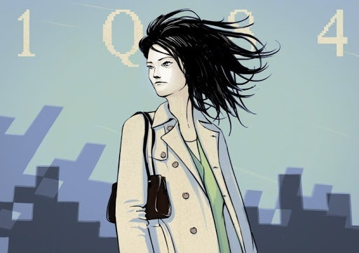
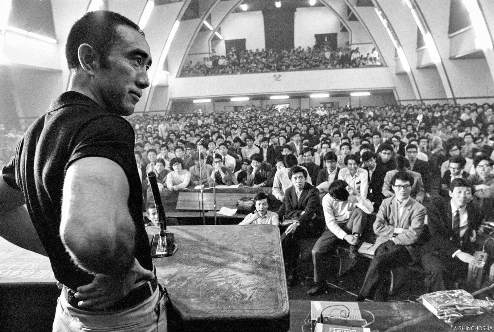

## Murakami’s Women: Between Empowerment and Erasure  

### Aomame and the Male Gaze in *1Q84*  

  
Source: [Tabi no Michi](https://tabinomichi.com/?p=602)  

Aomame exists in fragments: assassin, cult survivor, lover. Murakami dresses her in contradictions—a feminist avenger who “hates women,” a killer who weeps for a lost child. Her agency is undeniable, yet her interiority is perpetually <mark>obscured by metaphor</mark>. When she murders abusive men, the act feels less like justice than poetic symmetry, her violence romanticized into a man’s revenge fantasy.  

Fuka-Eri, the 17-year-old “writer” of *Air Chrysalis*, is all silence and symbolism: a vessel for trauma, a girl frozen in pre-sexual innocence. Murakami frames her as a conduit for otherworldly messages, emphasizing her role as a medium rather than a person. Her autonomy drowns in allegory.  

Freud’s *Madonna-whore complex* haunts these characters. In *Contributions to the Psychology of Love*, Freud writes:  
> <mark>“In a man’s psychological development the love-object and the sexual object are at first identical. The love-object is a woman; the sexual object is a woman too.”</mark>  

Aomame embodies this duality: saintly healer and sensual executioner. Fuka-Eri is the virginal muse, her power neutered by her silence. They exist to propel male narratives—Tengo’s creativity, the cult’s decay—while their pain becomes ambient texture.  

### The Murakami Trope: Cryptic Guides and Emotional Absence  

  

From *Norwegian Wood*’s Naoko to *Kafka on the Shore*’s Miss Saeki, Murakami’s women follow a pattern. They are mysteries by default, their pasts ellipses, their motives dreamlike, and most importantly, their suffering is described with unrivaled lyricism—it's seen as beautiful. In *Norwegian Wood*, Naoko’s mental illness is rendered as poetic melancholy:  
> <mark>“Her mind was like a delicate little bird.”</mark>  

Their sexual liberation often serves as a proxy for male enlightenment. Kumiko in *The Wind-Up Bird Chronicle* is both wife and enigma, her infidelity a catalyst for the protagonist’s self-discovery. Yet her desires remain unexplored, her actions framed through her husband’s gaze.  

In Jungian terms, they are <mark>anima figures</mark>—embodiments of the male psyche’s unconscious. Aomame’s duality (moonlit killer/mother figure) reflects Tengo’s unresolved tensions; Fuka-Eri’s silence mirrors Japan’s postwar cultural amnesia.  

---

## Mishima’s Golden Death: Fetishizing Power, Erasing Humanity  

*<small>Mishima’s obsession: “To be trampled by beauty was to touch the divine.”</small>*  

Mishima Yukio, the queer icon who yearned for fascist purity, wrote women as paradoxes: dominatrixes and deities, terrifying and transcendent. In *Confessions of a Mask*, the protagonist fixates on a woman’s <mark>“muscular, peasant-like legs”</mark>—a fetish merging homoerotic sublimation with worship of strength.  

His infamous desire—<mark>“True beauty is something that attacks, overpowers, robs, and finally destroys.”</mark>—reveals a craving for annihilation through feminine power. Yet this “power” is abstract, untethered from real women. His female characters (e.g., *The Temple of the Golden Pavilion*’s Uiko) are cruel, beautiful, and hollow—avatars of a Japan he believed had lost its virility.  

#### **Women as National Allegory**  

For Mishima, women symbolized Japan’s postwar “emasculation.” In *Patriotism*, the wife of a suicidal soldier becomes a ritual sacrifice, her death a purification of national shame. Her body, like the nation, is something to be <mark>aestheticized, then destroyed</mark>.  

> <mark>“She was determined to follow her husband into death, her resolve as pure as the blade he wielded.”</mark>  
> — *Patriotism*  

Kawabata Yasunari, meanwhile, froze women in ephemeral beauty (*Snow Country*’s Komako) or prepubescent innocence (*House of the Sleeping Beauties*). Both authors, despite divergent politics, reduced women to <mark>vessels of nostalgia</mark>—a lost Japan, uncorrupted by modernity.  

#### **Domination as Sublimation**  

Mishima’s fixation on female beauty was a form of sublimation: a desire for power, control, and transcendence. He wrote:

<mark>“I longed to be crushed by something greater than myself—a woman, a nation, a god.”</mark>  

This longing reflects his ambivalence toward power: a desire to dominate and be dominated, to embody both samurai and geisha. Women, in his work, become <mark>projections of this ambivalence</mark>—both feared and revered, but never fully human.  

#### **The Cruelty of Beauty**  

In *The Temple of the Golden Pavilion*, we are introduced to the protagonist, Mizoguchi. Throughout his childhood, he is assured by his father that the [Golden Pavilion](https://en.wikipedia.org/wiki/Kinkaku-ji) in Kyoto is the most beautiful building in the world, and the idea of the temple becomes a fixture in his imagination. His stammering and poverty cause him to be friendless. A neighbor's girl, Uiko, becomes the target of his hatred. He fixates on her as a symbol of unattainable perfection:  
> <mark>“True beauty is something that attacks, overpowers, robs, and finally destroys.”</mark>  

Eventually, Uiko is killed by her deserter boyfriend, and Mizoguchi becomes convinced that his curse on her has worked. She is seen as a beauty that must be destroyed to preserve its purity—Mishima’s women, like his ideal Japan, are <mark>too perfect to exist</mark>. They must be shattered, their destruction a form of preservation.  

---

## The Cultural Obsession: Why Women Bear the Weight  

### From Heian Court Ladies to Modern Manic Pixies  

*<small>Yūgao, Ukifune, Murasaki—Heian-era women immortalized as ideals, erased as individuals.</small>*  

The fixation begins early. *The Tale of Genji* (11th c.)—often called the world’s first novel—features women defined by fragrance, poetry, and tragedy. Their deaths are plot devices; their lives are backdrop to Genji’s enlightenment.  

Fast-forward to modern *moe* culture: anime girls with <mark>“fragile strength”</mark>, “manic pixie dream girls” who exist to heal lonely men. The archetype persists because it serves a cultural function: women as <mark>containers for male anxiety</mark>.  

### Psychoanalytic Lens: The Anima and the Void  

Jung argued that the *anima*—the unconscious feminine aspect of men—shapes their art. In Japan, this anima is collective: women symbolize the <mark>unresolved tension between tradition and modernity</mark>.  

Every modern author seemed to inhabit these tensions: Mishima saw women as symbols of Japan’s lost virility, Murakami saw them as symbols of Japan’s postwar amnesia, and Kawabata saw them as symbols of Japan’s ephemeral beauty.  

Their execution of these symbols, however, often erases women entirely: Mishima fetishizes their "purifying" power, Murakami romanticizes their suffering, and Kawabata freezes them in time.  

In all this, only one question remains: what of the women themselves?  

---

## Conclusion: Everywhere and Nowhere

Women in modern Japanese literature are omnipresent: they are the silent muses of Murakami's dreamlike worlds, the destructive goddesses of Mishima's fantasies, and the fleeting beauties of Kawabata's nostalgia. This canon, rich in nuances, reveals a paradox: the more femininity is exalted, the less room is left for real women. Aomame and Fuka-Eri from Murakami, Uiko from Mishima, and Komako from Kawabata are not fully realized characters — they are mirrors, reflecting the anxieties, fantasies, and unresolved tensions of the men who create them. They represent the *anima*, vessels destined for masculine illumination, symbols of a Japan torn between tradition and modernity.

But why must these women bear this burden? Why must their pain be idealized, their power fetishized, and their voices silenced? The answer lies in the cultural obsession with control — over bodies, over narratives, over history. In these works, women are not individuals, but *containers* that house the fears and desires of a society in decay.

Contemporaries such as Mieko Kawakami or Yoko Ogawa show us, another path is possible. In *Breasts and Eggs*, Kawakami’s women seem much more in touch with reality. They aren't mere metaphors, they're ordinary women that live through hardships, without all the flowery pretention older japanese authors impose on them. In *The Memory Police*, Ogawa’s protagonist is ordinary, afraid, and morally ambiguous — her survival is not poetic, but painfully real. These authors refuse to glorify or erase; they write women as they are — imperfect, complex, and alive.

As Adrienne Rich wrote:  
> <mark>“Until we can understand the assumptions in which we are drenched, we cannot know ourselves fully.”</mark>

To reclaim the narrative is to reject the sublime cipher and embrace the human. It is to write women not as symbols or reflections of an ideal, but as people — imperfect, complex, and very real. In the works of Kawakami and Ogawa, we glimpse the possibility of a new canon, where women are neither omnipresent nor invisible, but simply <mark>here</mark>.

> <mark>“To write a woman as she is — not as a symbol, not as a symptom — is the true rebellion.”</mark>

<mark>- yaro</mark>
