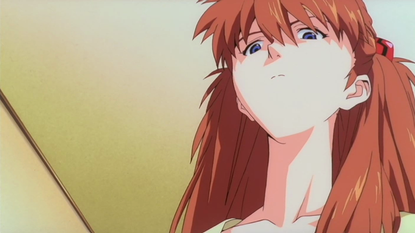

> <mark>"Chaque décision qu'il prend, chaque geste, est dicté par un passé complexe qu'il ne maîtrise pas."</mark>

Le destin de Shinji est marqué par une fatalité qu'il ne peut échapper, une trajectoire prédéfinie qui sous-tend chaque moment de *The End of Evangelion*. Contrairement à la fin introspective de la série *Neon Genesis Evangelion*, le film s'écarte de toute tentative de rédemption symbolique pour présenter un monde où les choix de Shinji sont illusoires. 

C'est cette tension entre le libre-arbitre et la prédétermination qui structure l'intégralité du film.

Dans cette analyse, il ne s'agit pas simplement de comprendre Shinji comme un protagoniste en quête de salut personnel, mais comme une figure inéluctablement liée à des forces qui le dépassent, tant sur le plan psychologique que narratif. *The End of Evangelion* offre ainsi une réflexion plus large sur la confrontation avec l’humanité elle-même : la question n'est pas de savoir si Shinji peut se sauver, mais si l’humanité vaut d’être acceptée telle qu’elle est, avec toutes ses imperfections.

---

## Réduit à Son Pathos

Parmi les nombreuses scènes marquantes de *The End of Evangelion*, celle de l’hôpital est sans doute l’une des plus commentées, et à juste titre. L'acte que Shinji commet envers Asuka, inconsciente sur son lit d’hôpital, n’est pas seulement un moment de choc visuel ; il est l'aboutissement d'un processus de dépersonnalisation que Shinji traverse tout au long de la série.

Dans cette scène, Shinji ne fait pas que blesser Asuka, il se fait violence à lui-même. En se réduisant à cet acte pathétique, il exprime son incapacité à comprendre et à se connecter à la réalité qui l’entoure. Le geste, dépourvu de toute signification morale, cristallise son effondrement intérieur. À ce moment-là, Shinji est complètement déconnecté de ses valeurs et de ses repères émotionnels.

> <mark>"Le dégoût d'Asuka n’est pas seulement dirigé contre Shinji, mais contre leur impuissance commune à transcender leur condition d’isolement."</mark>

Asuka, bien que passive dans cette scène, joue un rôle essentiel dans cette dynamique. Lorsqu'elle prononce les mots "C’est dégoûtant", elle ne condamne pas uniquement l'acte de Shinji, mais elle expose une vérité plus profonde sur leur incapacité à se reconnecter au monde extérieur. Leur isolement mutuel est au cœur de cette scène.

---

## Une Maternité Illusoire

Une erreur fréquente dans l’interprétation de *The End of Evangelion* est la suranalyse des symboles religieux, particulièrement autour de la figure de Lilith. <mark>Le symbole de Lilith est une métaphore du besoin de régression de Shinji</mark>. Rei incarne cette figure maternelle à laquelle Shinji aspire, dans l’espoir de retrouver l'innocence et la protection d’un monde qu'il ne comprend plus.

L’Instrumentalité, cette fusion collective des âmes, est pour Shinji une tentative de fuir la douleur individuelle, de se fondre dans un état d’innocence où tout est effacé. C’est un désir de régression vers un état où la souffrance n’existe plus. Mais cette solution est illusoire. En rejetant l'Instrumentalité, Shinji comprend que la vraie sécurité ne se trouve pas dans la dissolution de l'individualité, mais dans l'acceptation de la souffrance qui fait partie intégrante de l’existence humaine.

> <mark>"L'acceptation de l'Instrumentalité, c’est accepter l'anéantissement de l'individualité."</mark>

---

## Critique du Lore

Le lore dans *The End of Evangelion*, bien que dense et rempli de références religieuses et mythologiques, joue un rôle fonctionnel plutôt que d'être le centre du film. La complexité des éléments tels que le Projet d'Instrumentalité, le Troisième Impact, et l'interaction entre SEELE et la NERV peut sembler écrasante, mais ce n’est pas l’essentiel de la narration. Ces éléments sont là pour établir un cadre permettant d'explorer le voyage psychologique de Shinji et les thèmes existentiels du film.

> <mark>"Le lore fonctionne ainsi comme une pression externe qui pousse Shinji à affronter ses peurs et ses émotions profondes."</mark>

Le réalisateur Hideaki Anno a clairement indiqué que le symbolisme religieux — comme l'utilisation de Lilith, la Lance de Longinus et la fusion des âmes — n’était pas destiné à transmettre des idées religieuses spécifiques, mais à amplifier les enjeux émotionnels et psychologiques des personnages. 

L’histoire réelle est donc le conflit intérieur de Shinji et son choix de rejeter l’effacement de l’individualité via l’Instrumentalité. La complexité du lore soutient cette intrigue, mais sans la dominer.

---

## Le Fatum de Shinji

Tout au long du film, les choix que fait Shinji ne sont qu'une illusion de libre arbitre. Ses décisions sont en réalité conditionnées par ses traumatismes et son passé. 

Sa relation absente avec son père, Gendo, ainsi que son attachement à sa mère Yui, dominent chacun de ses actes. Son besoin constant de réconfort le pousse à se tourner vers Rei, qu'il perçoit comme une figure maternelle de substitution.

Le dilemme central de Shinji n'est pas une question de manipulation extérieure, mais un choix intérieur. *The End of Evangelion* lui pose une question essentielle : 

> <mark>"Peut-il accepter la souffrance, l'imperfection humaine, et continuer à vivre dans un monde imparfait, ou va-t-il fuir dans l'Instrumentalité, où l'individualité disparaît ?"</mark>

Cette lutte se déroule en lui-même, face à la peur de l'intimité, de la solitude, et du rejet.

---

## La Réponse de Hideaki Anno

Il est souvent avancé que *The End of Evangelion* est la réponse de Hideaki Anno à la réaction intense des fans mécontents de la fin de la série TV. Cependant, cette interprétation simplifie excessivement la situation. La relation d’Anno avec la critique des fans, et la manière dont il a abordé le film, est beaucoup plus complexe.

Anno a effectivement été affecté par les critiques virulentes, incluant des menaces de mort et des courriers haineux après la fin de la série. Mais *The End of Evangelion* n’est pas simplement une réaction à ces critiques. Le film découle de ses propres luttes psychologiques. Anno a traversé de graves épisodes de dépression pendant la production, et l’angoisse existentielle de Shinji reflète directement l'état d'esprit du réalisateur. Au lieu de corriger la fin pour satisfaire les fans, Anno a poussé à la fois ses personnages et le public dans des territoires émotionnellement inconfortables, traitant de la souffrance humaine et de l'isolement.

Ce film ne doit donc pas être vu simplement comme un défi lancé aux fans. *The End of Evangelion* poursuit la vision d’Anno, qui refuse de se plier aux normes conventionnelles du récit et de proposer des résolutions simplistes. Anno a profité de cette opportunité pour approfondir les thèmes déjà présents dans la série, offrant une exploration plus brutale et viscérale des mêmes dilemmes psychologiques, tout en maintenant son intégrité artistique et sa vérité émotionnelle.

---

## L'Acceptation de l'Humanité

Dans *The End of Evangelion*, la véritable confrontation de Shinji est une lutte intérieure, une décision de vie ou de mort pour l'âme humaine. L'Instrumentalité, proposée comme une solution à toutes les souffrances humaines, offre la promesse d'un monde sans douleur, sans conflits, mais aussi sans individualité. 
  
> <mark>"L'Instrumentalité rejette les imperfections humaines."</mark>

Elle dissout les barrières entre les individus. Tout ce qui rend l'humanité complexe — les relations, les émotions conflictuelles, la solitude — serait effacé. Face à cette perspective, Shinji est tiraillé. D'un côté, il pourrait fuir ses douleurs et ses peurs, mais en abandonnant ce qui fait de lui un être humain distinct.

> <mark>"Shinji choisit de vivre avec l'imperfection humaine, plutôt que d'accepter une existence sans individualité dans la fusion collective."</mark>

En fin de compte, Shinji décide de rejeter l'Instrumentalité, refusant de sacrifier l'individualité et les imperfections humaines. Il comprend que, même si la vie est pleine de souffrance, de solitude et de peur, ce sont ces éléments qui donnent un sens à l'existence. Le retour à la réalité, marqué par la scène finale avec Asuka, montre que Shinji accepte de vivre dans un monde imparfait, où les relations humaines sont difficiles mais réelles.

Le rejet de l'Instrumentalité n'est pas une quête de rédemption ou un acte héroïque. C'est un choix de survie émotionnelle, l'acceptation d'une vie marquée par la souffrance et les imperfections, mais aussi par le potentiel de connexions humaines authentiques, même si elles sont souvent douloureuses.

---

## Visualisation de la Fin

Dans *The End of Evangelion*, le langage visuel joue un rôle clé pour transmettre les conflits internes des personnages et la désintégration psychologique qu'ils vivent. Le film alterne entre des scènes de destruction massive et des moments d'introspection silencieuse. Cette alternance illustre la séparation entre la réalité extérieure et le monde intérieur des personnages.

### La fragmentation de la réalité

Le film utilise régulièrement des images surréalistes et des ruptures stylistiques, comme les séquences en prise de vue réelle, pour montrer la désintégration mentale de Shinji. Ces choix visuels brouillent la frontière entre la réalité et la perception des personnages, créant un sentiment de dissociation.

> <mark>"Le silence est aussi violent que la destruction."</mark>

### Symbolisme des couleurs : rouge et désolation

Le rouge est récurrent dans les scènes de destruction, symbolisant à la fois la violence et le chaos lié à l'Instrumentalité. En contraste, les scènes plus introspectives utilisent des tons plus froids et ternes, comme dans la scène finale sur la plage, qui montrent le vide émotionnel ressenti par Shinji et les autres personnages.

Ce contraste entre les couleurs représente la tension entre l'effondrement du monde extérieur et la détresse émotionnelle des personnages.

### La désorientation visuelle et la séquence en prise de vue réelle

La séquence en prise de vue réelle, parfois appellée la "scene de l'audience", introduit un décalage stylistique radical. En mêlant animation et images réelles, le film efface encore plus la frontière entre la perception subjective des personnages et la réalité. Ces images incluent des scènes de salles de cinéma et de rues désertes, poussant le spectateur à réfléchir à la nature de la conscience et de la perception.

Ces éléments visuels montrent que la réalité dans *End of Evangelion* est filtrée à travers les pensées exclusives de Shinji, il voit en les autres sa propre reflexion. Les critiques qu'ils s'octroient sont en réalité des critiques qu'il se fait à lui-même.

---

## Conclusion : Une Tragédie Moderne

*The End of Evangelion* ne se contente pas de conclure la série, il élargit la question de l’acceptation humaine dans un cadre où toute rédemption est refusée. En rejetant l’Instrumentalité, Shinji choisit la voie la plus difficile : accepter un monde imparfait, marqué par la souffrance. Le film expose ainsi la tragédie de l’existence humaine : nous sommes condamnés à souffrir, à répéter nos erreurs, mais c’est précisément cette confrontation avec nos propres faiblesses qui définit ce que signifie être humain.

*The End of Evangelion* n’offre aucune résolution douce. Il ne cherche pas à réconcilier Shinji avec le monde, mais à exposer la dure réalité de l’humanité, où l’acceptation de l’imperfection et de la souffrance est la seule voie vers la survie.

<mark>- yaro</mark>
