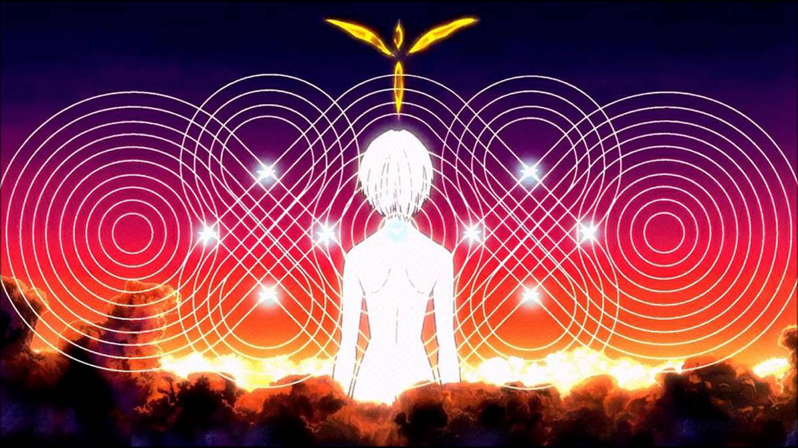
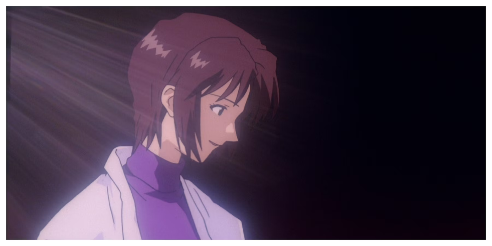

Le destin de Shinji est marqué par une fatalité qu'il ne peut échapper, une trajectoire prédéfinie qui sous-tend chaque moment de *The End of Evangelion*. Contrairement à la fin introspective de la série *Neon Genesis Evangelion*, le film s'écarte de toute tentative de rédemption symbolique pour présenter un monde où les choix de Shinji sont illusoires. <mark>Chaque décision qu'il prend, chaque geste, est dicté par un passé complexe qu'il ne maîtrise pas</mark>. C'est cette tension entre le libre-arbitre et la prédétermination qui structure l'intégralité du film.

Dans cette analyse, il ne s'agit pas simplement de comprendre Shinji comme un protagoniste en quête de salut personnel, mais comme une figure inéluctablement liée à des forces qui le dépassent, tant sur le plan psychologique que narratif. *The End of Evangelion* offre ainsi une réflexion plus large sur la confrontation avec l’humanité elle-même : la question n'est pas de savoir si Shinji peut se sauver, mais si l’humanité vaut d’être acceptée telle qu’elle est, avec toutes ses imperfections.

---

## La Scène de l'Hôpital : Un Point de Non-Retour

Parmi les nombreuses scènes marquantes de *The End of Evangelion*, celle de l’hôpital est sans doute l’une des plus commentées, et à juste titre. L’acte de violence que commet Shinji envers Asuka, inconsciente sur son lit d’hôpital, n’est pas seulement un moment de choc ; il est l’aboutissement d’un processus de dépersonnalisation que l’on observe chez Shinji tout au long de la série.

Dans cette scène, il n’y a plus d’ambiguïté morale. Shinji est détaché de toute forme de valeurs humaines, et ce qui pourrait être perçu comme un acte de rébellion contre l’ordre établi est en réalité une reconnaissance de son impuissance totale. Le geste est dépourvu de sens moral, tout comme le personnage lui-même est vidé de tout repère émotionnel. Ce moment cristallise l’effondrement de son monde intérieur, un monde dans lequel il ne peut plus naviguer sans perdre ses repères.

> <mark>"Le dégoût d'Asuka n’est pas seulement dirigé contre Shinji, mais contre leur impuissance collective à transcender leur condition d’isolement."</mark>

Asuka, bien que passive dans cette scène, n’en est pas moins cruciale dans l’analyse. Lorsqu'elle prononce plus tard les mots "C’est dégoûtant", ce n'est pas simplement une condamnation de l'acte de Shinji. C’est une déclaration de leur condition commune : incapables de se reconnecter au monde extérieur, ils se condamnent mutuellement à une existence où les interactions humaines ne sont plus possibles. La violence de Shinji est une projection de son propre dégoût pour lui-même.

---

## Rei/Lilith : La Maternité comme Illusion de Régression

L’une des erreurs les plus communes dans l’interprétation de *The End of Evangelion* est de suranalyser les symboles religieux, notamment autour de la figure de Lilith. Ce n’est pas la complexité mythologique qui donne sens à cette transformation, mais plutôt l’aspect psychologique de la régression qu’elle représente pour Shinji. 

Rei, ou Lilith dans cette scène, n’est pas seulement une divinité apocalyptique. Elle incarne la figure maternelle, celle vers laquelle Shinji se tourne dans un ultime espoir de retrouver l’innocence et la protection d’un monde qu’il ne comprend plus. L’Instrumentalité, cette fusion collective des âmes, est perçue par Shinji comme un retour à un état d’innocence, où la douleur individuelle est effacée.

Cependant, le film montre rapidement que cette solution est une illusion. En choisissant de rejeter l’Instrumentalité, Shinji rejette également cette sécurité trompeuse. Ce choix marque un tournant crucial dans le film : accepter la souffrance inhérente à l’existence humaine ou fuir dans une régression émotionnelle.

> <mark>"L'acceptation de l'Instrumentalité, c’est choisir l’anéantissement de l'individualité."</mark>

---

## Le Fatum de Shinji : Une Liberté Conditionnée

*The End of Evangelion*, c’est l’illusion du choix. Dès le début, Shinji semble être confronté à une série de décisions qui définiraient son avenir, <mark>mais en réalité, ces choix sont conditionnés par des forces qu’il ne maîtrise pas.</mark> Son passé, ses relations avec ses parents — notamment sa mère — et ses peurs déterminent chacun de ses actes. Ainsi, même lorsqu’il refuse l’Instrumentalité, ce choix n’est pas vraiment libre. Il est dicté par son propre parcours intérieur.

La figure maternelle, omniprésente dans son rapport à Rei et à Yui, est au cœur de ce dilemme. Shinji est à la fois poussé à rechercher la protection et forcé de rejeter cette régression. La tension entre son besoin de sécurité et sa peur du monde adulte est ce qui détermine ses actions dans le film.

> <mark>"Shinji n’a jamais eu de véritable choix. Son destin est déjà scellé par la somme de ses relations et de ses traumatismes."</mark>

Le rôle de SEELE, souvent perçu comme un élément central de l'intrigue, n’est ici qu’un outil narratif servant à précipiter Shinji vers sa confrontation finale. En fin de compte, ce ne sont pas les manigances politiques ou religieuses de SEELE qui importent, mais la question ultime à laquelle Shinji doit répondre : <mark>vaut-il mieux fuir la souffrance ou l’accepter ?</mark>

---

## Confrontation Finale : L’Acceptation de l'Humanité

La confrontation finale de Shinji n’est pas physique, c'est une lutte intérieure pour décider s'il accepte l’humanité avec toutes ses imperfections. C’est l’aboutissement d’une tension qui sous-tend tout le film. L’acceptation de soi, avec toute la souffrance et la solitude que cela implique.

Dans la série, cette question avait encore laissé la place à l’espoir d’une réconciliation douce. Mais dans le film, cette réconciliation est brutalement refusée. Le choix de Shinji de rejeter l’Instrumentalité et d’accepter l’humanité dans sa forme la plus crue est la seule issue possible pour conclure son parcours. <mark>Il ne s'agit plus de rédemption, mais de survie émotionnelle.</mark>

---

## Conclusion : Une Tragédie Moderne

*The End of Evangelion* élargit la question de l’acceptation humaine dans un cadre où toute rédemption est refusée. Shinji, en rejetant l’Instrumentalité, choisit la voie la plus difficile : celle d’accepter un monde imparfait, marqué par la souffrance. Le film, à travers ce choix, expose la tragédie de l’existence humaine : nous sommes tous condamnés à souffrir, à répéter nos erreurs, mais c’est précisément cette confrontation avec notre propre faiblesse qui nous rend humains.

L'oeuvre ne charche pas à offrir de résolution -- Il ne cherche pas à réconcilier Shinji avec le monde, mais à l’exposer dans toute sa brutalité. C’est dans cette acceptation de l’imperfection humaine que se trouve la véritable tragédie du film.

<mark>- yaro</mark>
