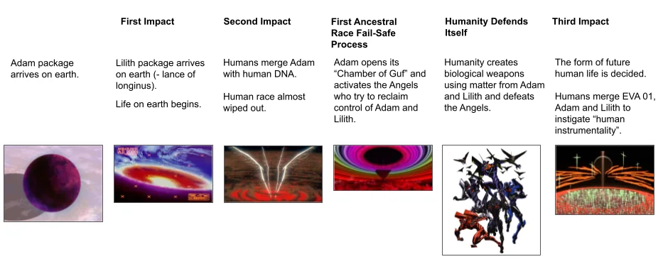
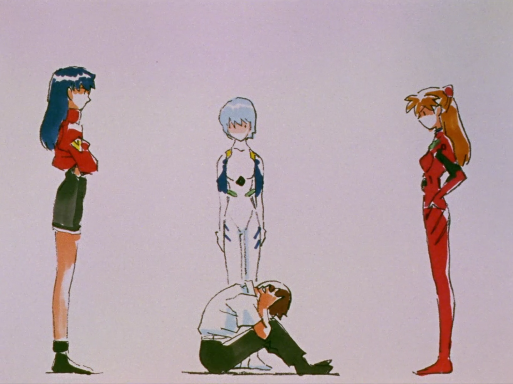

> <mark>"Every decision he makes, every gesture, is dictated by a complex past he cannot control."</mark>

Shinji's fate is marked by an inescapable inevitability, a predetermined trajectory that underpins every moment of *The End of Evangelion*. Unlike the introspective conclusion of *Neon Genesis Evangelion*, the film veers away from any symbolic redemption to present a world where Shinji’s choices are illusions.

It is this tension between free will and predestination that structures the entire film.

In this analysis, it’s not just about understanding Shinji as a protagonist seeking personal salvation, but as a figure inevitably tied to forces beyond his control, both psychologically and narratively. *The End of Evangelion* thus offers a broader reflection on the confrontation with humanity itself: it is no longer a question of whether Shinji can save himself, but whether humanity is worth accepting as it is, with all its flaws.

---

## Reduced to His Pathos

Among the many striking scenes in *The End of Evangelion*, the hospital scene is undoubtedly one of the most discussed. The act Shinji commits against Asuka, unconscious in her hospital bed, is not just a visual shock; it is the culmination of Shinji’s depersonalization throughout the series.

In this scene, Shinji does not just harm Asuka; he harms himself. By reducing himself to this pathetic act, he expresses his inability to understand and connect with the reality around him. The gesture, devoid of any moral significance, crystallizes his inner collapse. At that moment, Shinji is completely disconnected from his values and emotional bearings.

> <mark>"Asuka’s disgust is not only directed at Shinji but at their shared inability to transcend their condition of isolation."</mark>

Though passive in this scene, Asuka plays a key role in this dynamic. When she later utters the words "It’s disgusting," she is not merely condemning Shinji’s act but exposing a deeper truth about their inability to reconnect with the outside world. Their mutual isolation is at the heart of this moment.

---

## An Illusory Maternity

A common misinterpretation of *The End of Evangelion* is overanalyzing the religious symbols, particularly around the figure of Lilith. <mark>Lilith represents Shinji’s need for regression</mark>. Rei embodies this maternal figure to which Shinji clings in the hope of rediscovering the innocence and protection of a world he no longer understands.

Instrumentality, the collective fusion of souls, represents for Shinji an attempt to flee individual pain, to return to a state of innocence where all suffering is erased. This is a desire to regress into a state where suffering no longer exists. However, this solution is illusory. By rejecting Instrumentality, Shinji realizes that true security does not lie in the dissolution of individuality but in the acceptance of suffering as an integral part of human existence.

> <mark>"Accepting Instrumentality is accepting the annihilation of individuality."</mark>

---

## Critiquing the Lore

The lore in *The End of Evangelion*, while dense and filled with religious and mythological references, serves a functional role rather than being the film’s central focus. The complexity of elements like the Instrumentality Project, the Third Impact, and the interaction between SEELE and NERV can seem overwhelming, but it is not the heart of the narrative. These elements are there to set the stage for exploring Shinji’s psychological journey and the film’s existential themes.

> <mark>"The lore acts as external pressure that forces Shinji to confront his fears and deep emotions."</mark>

Director Hideaki Anno has made it clear that the religious symbolism—such as the use of Lilith, the Lance of Longinus, and the fusion of souls—was never meant to convey specific religious ideas but to amplify the emotional and psychological stakes of the characters.

The true story, then, is the internal conflict of Shinji and his choice to reject the erasure of individuality through Instrumentality. The lore’s complexity supports this narrative but never dominates it.

---

## Shinji’s Fatum

Throughout the film, Shinji’s choices are mere illusions of free will. His decisions are, in reality, conditioned by his traumas and past.

His distant relationship with his father, Gendo, as well as his attachment to his mother, Yui, dominate every one of his actions. His constant need for comfort drives him toward Rei, whom he perceives as a surrogate maternal figure.

The central dilemma for Shinji is not about external manipulation but an internal choice. *The End of Evangelion* presents him with an essential question:

> <mark>"Can he accept suffering, human imperfection, and continue living in an imperfect world, or will he flee into Instrumentality, where individuality disappears?"</mark>

This struggle unfolds within himself, confronting his fear of intimacy, solitude, and rejection.

---

## Hideaki Anno’s Response

It is often suggested that *The End of Evangelion* is Hideaki Anno’s response to the intense backlash from fans dissatisfied with the TV series finale. However, this interpretation oversimplifies the situation. Anno’s relationship with fan criticism and how he approached the film is much more complex.

Anno was indeed affected by the virulent criticism, including death threats and hate mail after the series ended. But *The End of Evangelion* is not simply a reaction to those critiques. The film stems from his own psychological struggles. Anno went through severe episodes of depression during production, and Shinji’s existential angst directly reflects the director’s own state of mind. Instead of fixing the ending to appease fans, Anno pushed both his characters and audience into emotionally uncomfortable territories, addressing human suffering and isolation.

Thus, the film should not be seen as merely a challenge to fans. *The End of Evangelion* continues Anno’s vision, refusing to conform to conventional storytelling norms or offer simplistic resolutions. Anno used this opportunity to delve deeper into the themes already present in the series, providing a more brutal and visceral exploration of the same psychological dilemmas while maintaining his artistic integrity and emotional truth.

---

## Acceptance of Humanity

In *The End of Evangelion*, Shinji’s true confrontation is an internal struggle, a life-or-death decision for the human soul. Instrumentality, offered as a solution to all human suffering, promises a world without pain, without conflict, but also without individuality.

> <mark>"Instrumentality rejects human imperfections."</mark>

It dissolves the barriers between individuals. Everything that makes humanity complex—relationships, conflicting emotions, loneliness—would be erased. Faced with this prospect, Shinji is torn. On one hand, he could flee from his pain and fears, but at the cost of abandoning what makes him a distinct human being.

> <mark>"Shinji chooses to live with human imperfection rather than accept an existence without individuality in collective fusion."</mark>

In the end, Shinji decides to reject Instrumentality, refusing to sacrifice individuality and human flaws. He realizes that even though life is filled with suffering, loneliness, and fear, these elements give life meaning. The return to reality, marked by the final scene with Asuka, shows that Shinji accepts living in an imperfect world, where human relationships are difficult but real.

Rejecting Instrumentality is not a quest for redemption or a heroic act. It is an emotional survival choice, accepting a life marked by suffering and imperfections, but also by the potential for authentic human connections, even if they are often painful.

---

## Visualization of the End

In *The End of Evangelion*, the visual language plays a key role in conveying the characters’ internal conflicts and the psychological disintegration they experience. The film alternates between scenes of massive destruction and moments of silent introspection. This alternation illustrates the separation between the external reality and the inner world of the characters.

### The Fragmentation of Reality

The film regularly uses surreal imagery and stylistic ruptures, like live-action sequences, to depict Shinji’s mental breakdown. These visual choices blur the line between reality and the characters' perceptions, creating a sense of dissociation.

> <mark>"Silence is as violent as destruction."</mark>

### Symbolism of Colors: Red and Desolation

Red is recurrent in the destruction scenes, symbolizing both the violence and chaos tied to Instrumentality. In contrast, the more introspective scenes use colder, muted tones, like in the final beach scene, which shows the emotional void felt by Shinji and the other characters.

This contrast between colors represents the tension between the collapse of the external world and the characters' emotional distress.

### Visual Disorientation and the Live-Action Sequence

The live-action sequence, sometimes referred to as the “audience scene,” introduces a radical stylistic shift. By mixing animation and real-life footage, the film further erases the boundary between the characters' subjective perception and reality. These images include scenes of empty movie theaters and deserted streets, pushing the viewer to reflect on the nature of consciousness and perception.

These visual elements show that reality in *The End of Evangelion* is filtered through Shinji’s exclusive thoughts. He sees in others his own reflection. The criticisms they levy against him are, in fact, criticisms he directs at himself.

---

## Conclusion: A Modern Tragedy

*The End of Evangelion* doesn’t just conclude the series; it broadens the question of human acceptance in a setting where redemption is denied. By rejecting Instrumentality, Shinji chooses the harder path: to accept an imperfect world, marked by suffering. The film thus exposes the tragedy of human existence: we are condemned to suffer, to repeat our mistakes, but it is precisely this confrontation with our own weaknesses that defines what it means to be human.

*The End of Evangelion* offers no soft resolution. It doesn’t seek to reconcile Shinji with the world but to expose the harsh reality of humanity, where accepting imperfection and suffering is the only way to survive.

<mark>- yaro</mark>
