Shinji’s fate is marked by a fatality he cannot escape, a predetermined trajectory underlying every moment in *The End of Evangelion*. Unlike the introspective ending of the *Neon Genesis Evangelion* series, the film diverges from any attempt at symbolic redemption to present a world where Shinji’s choices are illusory. <mark>Every decision he makes, every gesture, is dictated by a complex past he cannot control</mark>. This tension between free will and predetermination structures the entire film.

In this analysis, Shinji is not simply understood as a protagonist seeking personal salvation, but as a figure inevitably tied to forces that surpass him, both psychologically and narratively. *The End of Evangelion* offers a broader reflection on the confrontation with humanity itself: the question is not whether Shinji can save himself, but whether humanity is worth accepting as it is, with all its imperfections.

---

## Reduced to His Pathos

Among the many striking scenes in *The End of Evangelion*, the hospital scene is undoubtedly one of the most discussed, and rightly so. The act that Shinji commits against Asuka, unconscious on her hospital bed, is not just a shocking visual moment; it is the culmination of the process of depersonalization that Shinji undergoes throughout the series.

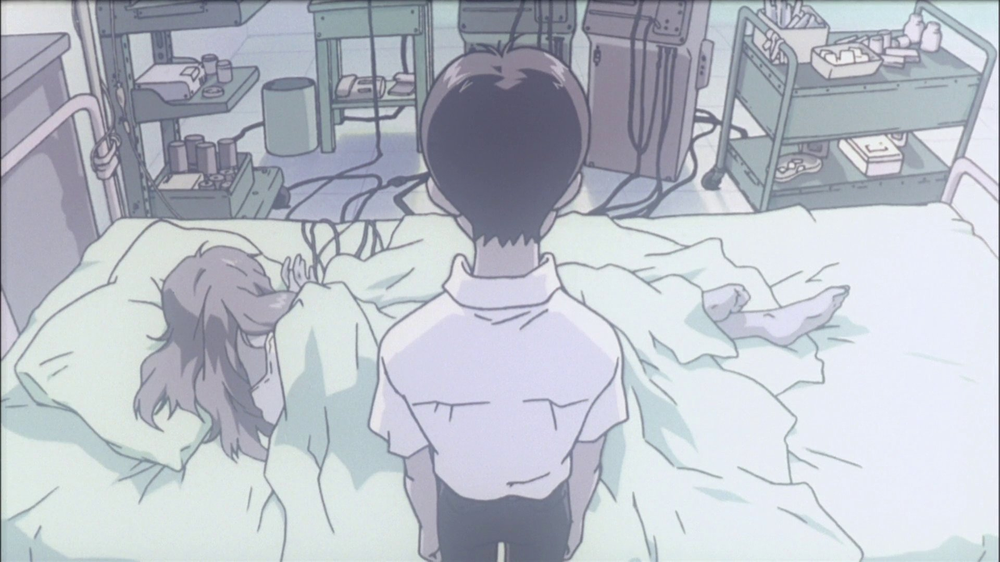

In this scene, Shinji doesn’t just harm Asuka—he is violent towards himself. By reducing himself to this pathetic act, he expresses his inability to understand or connect to the reality around him. The gesture, devoid of any moral significance, crystallizes his inner collapse. At that moment, Shinji is completely disconnected from his values and emotional bearings.

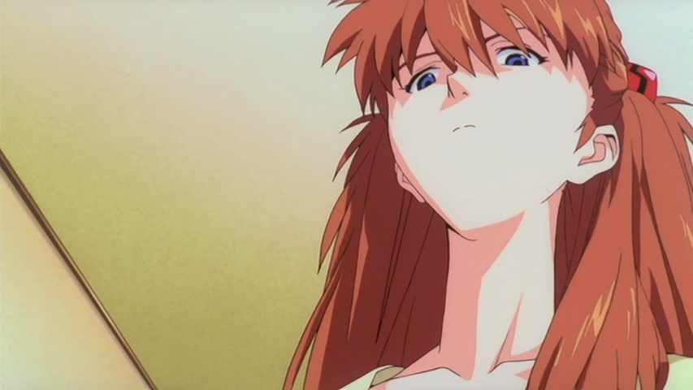

> <mark>"Asuka’s disgust is not only directed at Shinji but at their shared impotence to transcend their condition of isolation."</mark>

Asuka, though passive in this scene, plays an essential role in this dynamic. When she later says, "It’s disgusting," she is not simply condemning Shinji’s act, but she reveals a deeper truth about their inability to reconnect with the outside world. Their mutual isolation is at the core of this scene.

---

## An Illusory Maternity

A common mistake in interpreting *The End of Evangelion* is overanalyzing the religious symbols, particularly around the figure of Lilith. **Lilith’s symbol is a metaphor for Shinji’s need for regression**. Rei embodies this maternal figure to which Shinji aspires, in the hope of finding innocence and protection in a world he no longer understands.

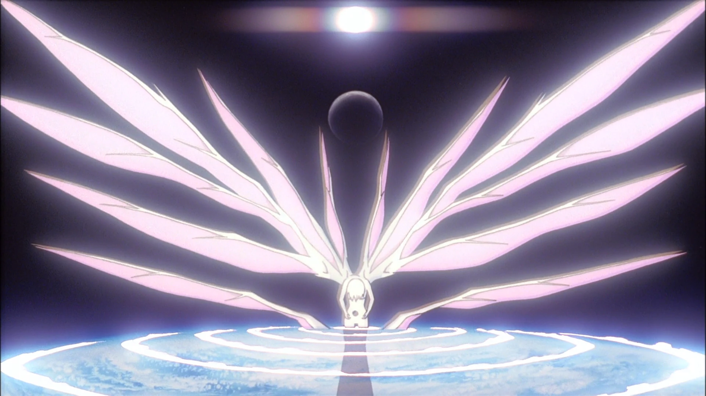

Instrumentality, this collective fusion of souls, is for Shinji an attempt to flee individual pain, to dissolve into a state of innocence where everything is erased. It is a desire to regress to a state where suffering no longer exists. But this solution is illusory. By rejecting Instrumentality, Shinji understands that true security is not found in the dissolution of individuality but in the acceptance of suffering, which is an integral part of human existence.

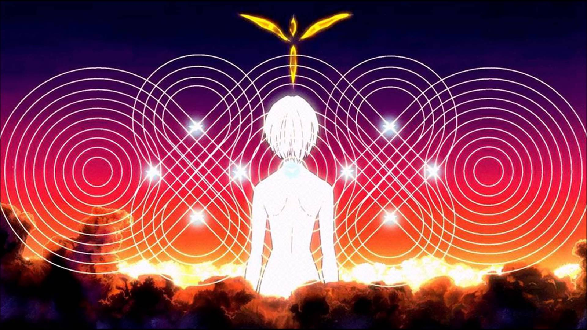

> <mark>"Acceptance of Instrumentality is the acceptance of the annihilation of individuality."</mark>

---

## Shinji’s Fate

Throughout the film, the choices Shinji makes are mere illusions of free will. His decisions are actually conditioned by his trauma and past. **Shinji has never truly had control**. His absent relationship with his father, Gendo, and his attachment to his mother, Yui, dominate every one of his actions. His constant need for comfort drives him to turn to Rei, whom he perceives as a substitute maternal figure.

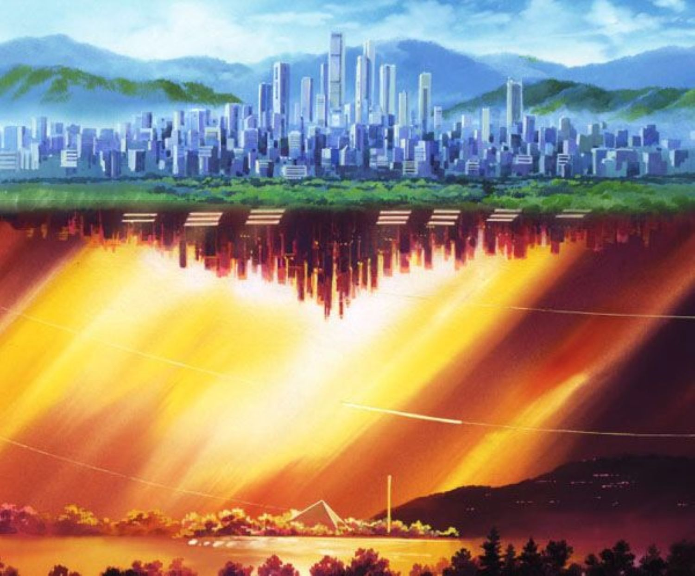

The central dilemma Shinji faces is not an external manipulation but an internal choice. *The End of Evangelion* asks him an essential question: <mark>can he accept human suffering, imperfection, and continue to live in an imperfect world, or will he flee into Instrumentality, where individuality disappears?</mark> The war surrounding NERV and the external events are only the backdrop to a deeper struggle. This struggle is within himself, facing the fear of intimacy, loneliness, and rejection.

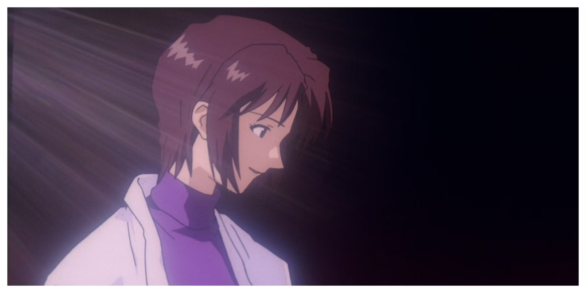

Each decision Shinji makes is only a reaction to his past and pain; this fate guides all his actions and development throughout the film.

---

## Acceptance of Humanity

In *The End of Evangelion*, Shinji’s real confrontation is an internal one, a life-or-death decision for the human soul. Instrumentality, proposed as a solution to all human suffering, promises a world without pain, without conflict, but also without individuality. This process aims to erase all human imperfections by merging souls into a homogeneous whole.

**Instrumentality rejects human imperfections** by dissolving the barriers between individuals. Everything that makes humanity complex—relationships, conflicting emotions, loneliness—would be erased. Faced with this, Shinji is torn. On the one hand, he could escape his pains and fears, but only by abandoning what makes him a distinct human being.

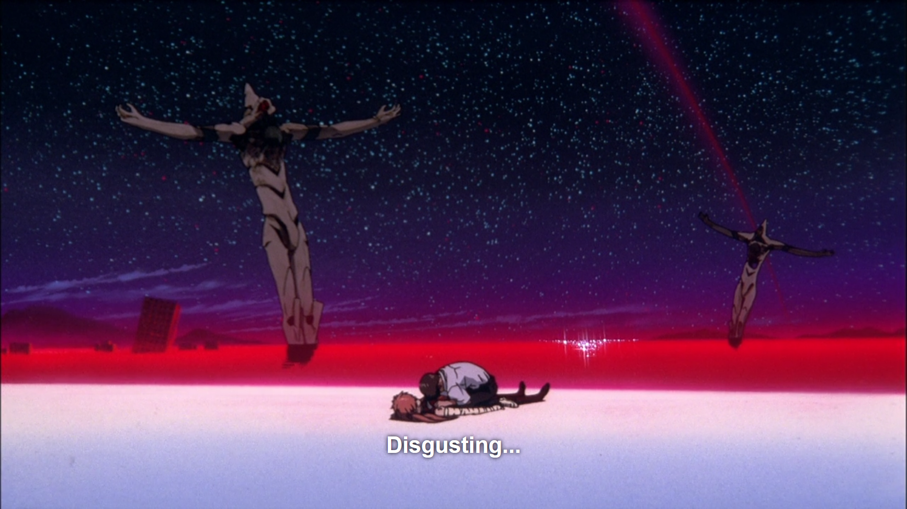

> <mark>"Shinji chooses to live with human imperfection rather than accept an existence without individuality in collective fusion."</mark>

In the end, Shinji decides to reject Instrumentality, refusing to sacrifice individuality and human imperfections. He understands that, even though life is full of suffering, loneliness, and fear, these elements give meaning to existence. The return to reality, marked by the final scene with Asuka, shows that Shinji accepts living in an imperfect world, where human relationships are difficult but real.

The rejection of Instrumentality is not a quest for redemption or a heroic act. It is a choice of emotional survival, an acceptance of a life marked by suffering and imperfections, but also by the potential for authentic human connections, even if they are often painful.

---

## Visualization of the End

In *The End of Evangelion*, visual language plays a key role in conveying the internal conflicts of the characters and the psychological disintegration they experience. The film alternates between scenes of massive destruction and moments of quiet introspection. This alternation illustrates the separation between the external reality and the inner world of the characters.

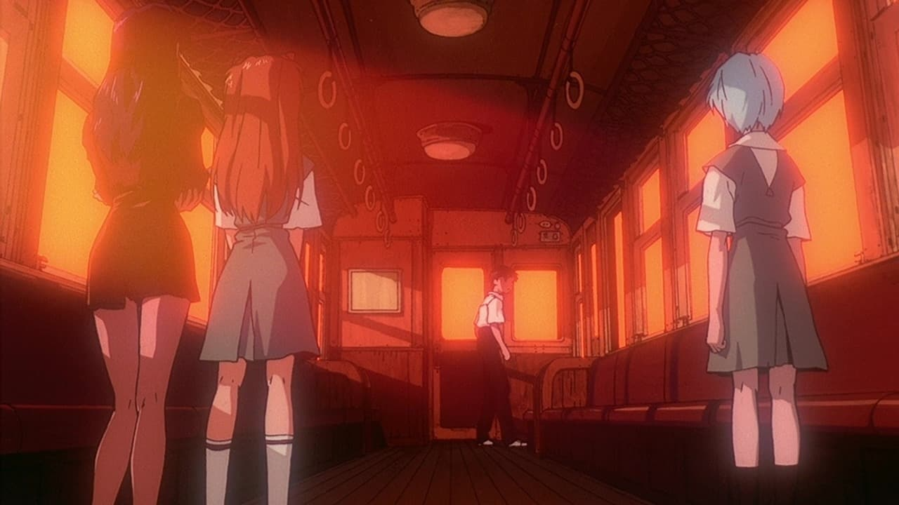

### I. Fragmentation of Reality

The film regularly uses surreal imagery and stylistic shifts, such as live-action sequences, to depict Shinji’s mental disintegration. These visual choices blur the boundary between reality and the characters' perception, creating a sense of dissociation.

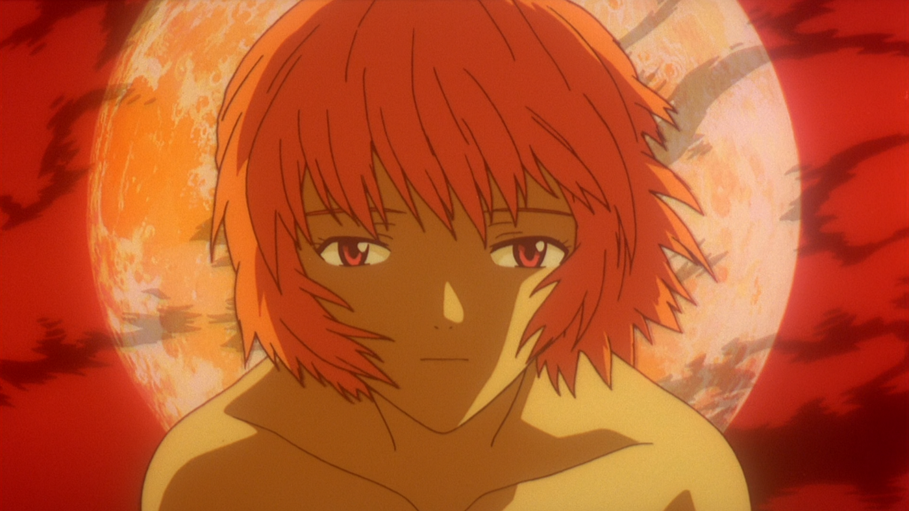

> <mark>"Silence is as violent as destruction."</mark>

### II. Symbolism of Colors: Red and Desolation

Red frequently appears in scenes of destruction, symbolizing both violence and the chaos linked to Instrumentality. In contrast, more introspective scenes use colder, muted tones, such as in the final beach scene, reflecting the emotional void felt by Shinji and the other characters.

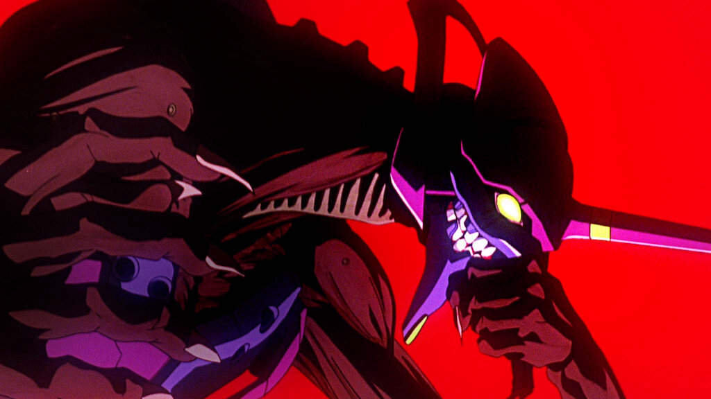

This contrast between colors represents the tension between the collapse of the external world and the emotional distress of the characters.

### III. Visual Disorientation and the Live-Action Sequence

The live-action sequence, sometimes referred to as the "audience scene," introduces a radical stylistic shift. By blending animation and real images, the film further erases the boundary between the subjective perception of the characters and reality. These images include shots of cinema halls and deserted streets, pushing the audience to question the nature of consciousness and perception.

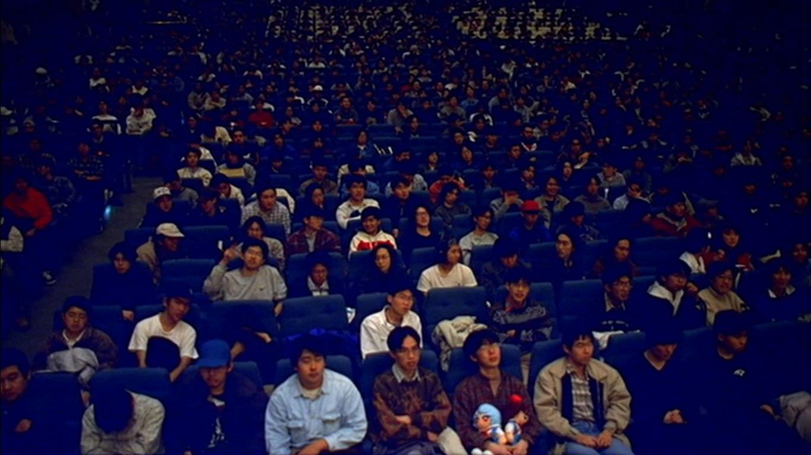

These visual elements show that reality in *End of Evangelion* is filtered through Shinji’s exclusive thoughts, as he projects his reflections onto others. The criticisms they offer are, in reality, criticisms he directs at himself.

---

## Conclusion: A Modern Tragedy

*The End of Evangelion* doesn’t merely conclude the series; it expands the question of human acceptance in a world where redemption is refused. By rejecting Instrumentality, Shinji chooses the more difficult path: accepting an imperfect world, marked by suffering. The film thus exposes the tragedy of human existence: we are condemned to suffer, to repeat our mistakes, but it is precisely this confrontation with our own weaknesses that defines what it means to be human.

*The End of Evangelion* offers no gentle resolution. It doesn’t seek to reconcile Shinji with the world, but to expose the harsh reality of humanity, where the acceptance of imperfection and suffering is the only path to survival.

<mark>- yaro</mark>
