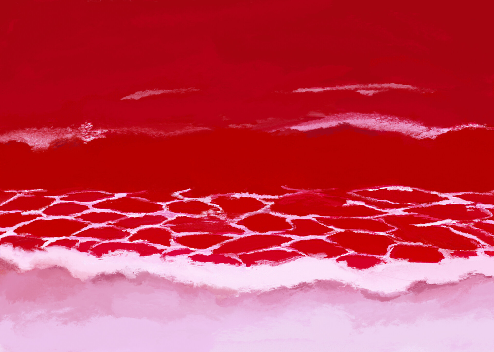

Shinji’s destiny is marked by an inescapable fatality, a predetermined trajectory that underlies every moment of *The End of Evangelion*. Unlike the introspective ending of the series *Neon Genesis Evangelion*, the film steps away from any symbolic redemption to present a world where Shinji’s choices are illusory. <mark>Every decision he makes, every action, is dictated by a complex past that he cannot control.</mark> It is this tension between free will and predetermination that structures the entire film.

In this analysis, we’re not just understanding Shinji as a protagonist seeking personal salvation but as a figure inevitably tied to forces beyond his control, both on a psychological and narrative level. *The End of Evangelion* offers a broader reflection on confronting humanity itself: the question isn’t whether Shinji can save himself, but whether humanity is worth accepting as it is, with all its imperfections.

---

## The Hospital Scene: A Point of No Return

Among the many striking scenes in *The End of Evangelion*, the hospital scene is undoubtedly one of the most discussed, and rightfully so. The act of violence that Shinji commits against Asuka, unconscious on her hospital bed, is not just a moment of shock; it is the culmination of a process of depersonalization that has been unfolding in Shinji throughout the series.

In this scene, there is no longer any moral ambiguity. Shinji is detached from all forms of human values, and what could be perceived as an act of rebellion against the established order is, in reality, an acknowledgment of his total powerlessness. The act is devoid of moral meaning, just as the character himself is stripped of all emotional anchors. This moment crystallizes the collapse of his inner world, a world in which he can no longer navigate without losing his bearings.

> <mark>"Asuka’s disgust is not only directed at Shinji but at their collective impotence to transcend their isolated condition."</mark>

Asuka, though passive in this scene, is nonetheless crucial to the analysis. When she later utters the words "It’s disgusting," it is not merely a condemnation of Shinji’s act. It is a statement of their shared condition: unable to reconnect with the outside world, they mutually condemn themselves to an existence where human interactions are no longer possible. Shinji’s violence is a projection of his own self-disgust.

---

## Rei/Lilith: Maternity as an Illusion of Regression

One of the most common errors in interpreting *The End of Evangelion* is the overanalysis of religious symbols, particularly surrounding the figure of Lilith. It is not the mythological complexity that gives meaning to this transformation, but rather the psychological aspect of regression that it represents for Shinji.

Rei, or Lilith in this scene, is not merely an apocalyptic deity. She embodies the maternal figure, the one toward whom Shinji turns in a final hope of rediscovering the innocence and protection of a world he no longer understands. Instrumentality, this collective fusion of souls, is perceived by Shinji as a return to a state of innocence, where individual pain is erased.

However, the film quickly shows that this solution is an illusion. By choosing to reject Instrumentality, Shinji also rejects this false sense of security. This choice marks a crucial turning point in the film: accepting the inherent suffering of human existence or fleeing into emotional regression.

> <mark>"Accepting Instrumentality is choosing the annihilation of individuality."</mark>

---

## Shinji’s Fatum: A Conditional Freedom

*The End of Evangelion* is about the illusion of choice. From the beginning, Shinji seems confronted with a series of decisions that will define his future, <mark>but in reality, these choices are conditioned by forces beyond his control.</mark> His past, his relationships with his parents — particularly his mother — and his fears dictate each of his actions. Thus, even when he refuses Instrumentality, this choice is not truly free. It is dictated by his internal journey.

The maternal figure, omnipresent in his relationships with Rei and Yui, is at the heart of this dilemma. Shinji is both drawn to seek protection and forced to reject this regression. The tension between his need for security and his fear of the adult world is what drives his actions in the film.

> <mark>"Shinji never truly had a choice. His fate was already sealed by the sum of his relationships and traumas."</mark>

SEELE’s role, often seen as central to the plot, is merely a narrative tool here, pushing Shinji toward his final confrontation. In the end, it’s not the political or religious machinations of SEELE that matter, but the ultimate question Shinji must face: <mark>Is it better to flee from suffering or to accept it?</mark>

---

## Final Confrontation: Accepting Humanity

Shinji’s final confrontation is not physical; it’s an inner struggle to decide whether to accept humanity with all its imperfections. This is the culmination of a tension that runs throughout the film. Accepting oneself, with all the suffering and solitude that entails.

In the series, this question had left room for the hope of a soft reconciliation. But in the film, this reconciliation is brutally denied. Shinji’s choice to reject Instrumentality and accept humanity in its rawest form is the only possible outcome to conclude his journey. <mark>It is no longer about redemption, but emotional survival.</mark>

---

## Conclusion: A Modern Tragedy

*The End of Evangelion* broadens the question of human acceptance in a framework where redemption is refused. By rejecting Instrumentality, Shinji chooses the most difficult path: accepting an imperfect world, marked by suffering. The film, through this choice, exposes the tragedy of human existence: we are all condemned to suffer, to repeat our mistakes, but it is precisely this confrontation with our own weaknesses that makes us human.

It offers no resolution. It doesn’t seek to reconcile Shinji with the world, but rather to expose him in all his brutality. It is in this acceptance of human imperfection that the true tragedy of the film lies.

<mark>- yaro</mark>
