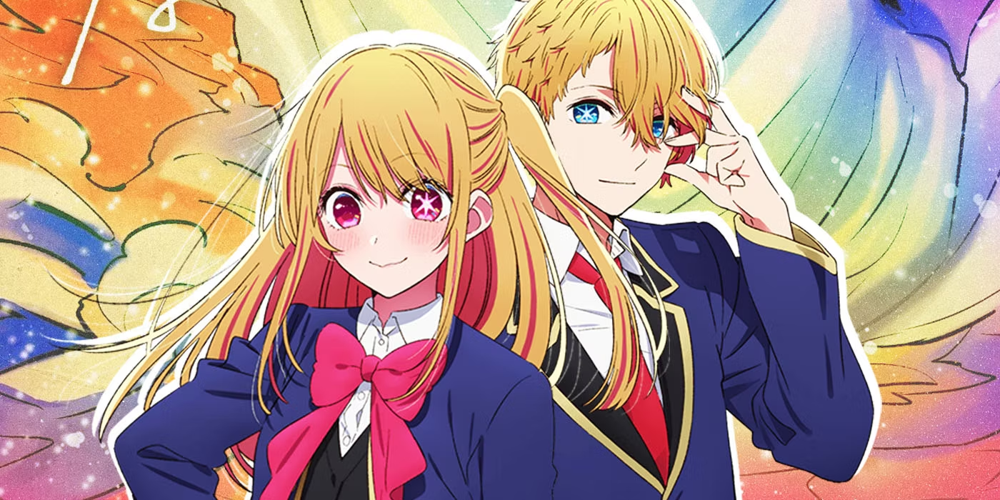

Oshi No Ko était, à première vue, une œuvre au potentiel considérable. Sous la plume d’[Aka Akasaka](https://myanimelist.net/people/2139/Aka_Akasaka), fort du succès de [*Kaguya-sama: Love is War*](https://myanimelist.net/anime/37999/Kaguya-sama_wa_Kokurasetai__Tensai-tachi_no_Renai_Zunousen), et avec le talent visuel de [Mengo Yokoyari](https://myanimelist.net/people/13173/Mengo_Yokoyari) ([*Kuzu no Honkai*](https://myanimelist.net/anime/32949/Kuzu_no_Honkai)), tout semblait réuni pour offrir un drame captivant et une critique acerbe de l’industrie du divertissement japonais. Le premier épisode, véritable choc au niveau DA, Animation et narration, a fasciné le public avec ses twists inattendus et ses réflexions sur le parasocialisme et l’exploitation des célébrités.

Mais cette promesse s’est rapidement évanouie, laissant place à une œuvre qui, au fil des épisodes et des chapitres, s’est empêtrée dans ses propres contradictions. Alors qu’elle se voulait une exploration métaphysique des rouages cruels de l'industrie, Oshi No Ko s’est effondrée sous le poids de son ambition. Ses personnages ont perdu de leur profondeur, son intrigue est devenue répétitive, et la relation ambiguë entre Aqua et Ruby a fini par provoquer plus de malaise que de réflexion.

<mark>Dans cet article, nous chercherons à comprendre pourquoi et comment Oshi No Ko s’est saboté lui-même.</mark> Pourquoi ce qui aurait pu être une critique puissante et nuancée de l’industrie du divertissement s’est-il transformé en une œuvre déroutante, superficielle et finalement décevante ? Entre prétention narrative et échec à délivrer une véritable critique, Oshi No Ko est l’exemple parfait d’une série qui s’est ruinée en chemin.

## Une promesse de profondeur métaphysique ruinée par la superficialité

Oshi No Ko a tenté de se positionner comme une œuvre à la fois critique et métaphysique, explorant des thèmes sombres autour de l’industrie du divertissement. Mais très rapidement, cette ambition s’est effondrée sous le poids d’une narration trop évidente et d’un ton mal maîtrisé.

### Une ambition mal gérée

Dès le premier épisode, Oshi No Ko établit une prémisse captivante : l’histoire de deux enfants réincarnés qui cherchent à percer les mystères de la mort de leur mère, une célèbre idole, tout en dénonçant les coulisses cruelles de l’industrie. Pourtant, ce qui aurait pu être une réflexion profonde sur la célébrité et la nature parasociale des relations entre les stars et leurs fans finit par se perdre dans des répétitions maladroites. <mark>Aqua, le protagoniste, passe le plus clair de son temps à exposer des vérités déjà bien connues sur l’industrie — la fausseté des personnalités publiques, la manipulation des idoles par leurs agences — sans jamais offrir d’éclairage nouveau.</mark>

L'anime prend un ton trop didactique, se contentant de souligner les aspects évidents de l’industrie. Par exemple, lorsque Aqua se lance dans ses monologues sur la fausseté du showbiz, le spectateur est constamment pris par la main, comme si le scénario ne faisait pas confiance à son audience pour saisir les nuances. Loin d’être subversif ou provocateur, Oshi No Ko finit par donner l’impression de répéter des banalités sous couvert de révéler de grandes vérités.

### Le traitement maladroit du ton

<mark>Une des faiblesses majeures de l’œuvre est son incapacité à gérer le ton de manière cohérente.</mark> Le mélange de drame sombre et de comédie légère crée des dissonances qui perturbent l’immersion. Dès le premier épisode, après des scènes de grande intensité émotionnelle, des gags mal placés viennent briser le rythme narratif. L’humour se manifeste dans des moments qui devraient pourtant rester solennels, notamment lorsqu'Aqua fait des blagues ou lorsque des situations triviales sont insérées après des révélations importantes.

Ce décalage tonal persiste tout au long de la série. Par exemple, au lieu d'approfondir les dilemmes moraux ou de renforcer la tension dramatique, des scènes comiques viennent constamment alléger l’atmosphère, réduisant l’impact des thèmes sombres abordés. <mark>En résulte une œuvre qui peine à trouver un juste équilibre entre son côté "critique sociale" et son envie d'être divertissante.</mark>

### Une critique de l’industrie bâclée

Enfin, alors que l’anime promettait une critique incisive des rouages de l'industrie du divertissement, il échoue à développer cette analyse de manière pertinente. <mark>L’histoire ne parvient jamais à dépasser la surface de ce qu’elle dénonce.</mark> Aqua, censé incarner une figure critique de ce système, se retrouve trop invincible, trouvant toujours des solutions à ses problèmes. L'industrie, bien que dépeinte comme un lieu impitoyable, n'est jamais un véritable obstacle pour lui. Les situations difficiles qu’il traverse sont constamment atténuées par sa capacité à tout gérer, ce qui neutralise tout suspense.

L’œuvre parle souvent de la cruauté de l'industrie, mais elle ne la montre jamais vraiment en action de manière crédible ou poignante. Les personnages principaux, comme Aqua et Ruby, sont en quelque sorte protégés de ses véritables dangers en étant connectés à une "bonne compagnie" et en ayant accès aux bonnes personnes, ce qui rend leur parcours moins percutant. <mark>Ce manque d’enjeux rend difficile toute véritable immersion dans le propos critique de la série.</mark>

## Un récit qui s’enlise dans la répétition et l’absence de développement

L’une des grandes faiblesses de Oshi No Ko est son incapacité à maintenir un récit dynamique et engageant. Après l’impact puissant du premier épisode, l’anime tombe rapidement dans une routine narrative où les arcs principaux stagnent et les sous-intrigues se répètent sans apporter de véritable progression ou profondeur à l’histoire. Ce manque de développement touche particulièrement deux aspects : la quête de vengeance d'Aqua et l'utilisation des personnages secondaires.

### L'intrigue de la vengeance d’Aqua : Une course sans tension

La quête d’Aqua pour venger sa mère, Ai, est censée être l’un des moteurs principaux de l’histoire. Cependant, au lieu de générer de la tension ou de l'inquiétude, cet arc devient rapidement répétitif et prévisible. Aqua, présenté comme un personnage omniscient et calculateur, n'est jamais réellement mis en danger. Sa capacité à surmonter chaque obstacle sans difficulté affaiblit le suspense et réduit l'impact émotionnel de sa quête.

### Des arcs narratifs qui stagnent

Outre la quête de vengeance d'Aqua et le sous-développement des personnages secondaires, l'intrigue principale souffre également d’un manque de progression. L’anime s’éparpille dans des sous-intrigues romantiques et des scènes comiques qui ne contribuent pas à l’avancement de l’histoire. Ces moments sont souvent insérés de manière aléatoire, brisant le rythme du récit et donnant l’impression que l’anime cherche à gagner du temps plutôt qu'à faire évoluer ses personnages ou à approfondir ses thèmes.

Au lieu d’un développement narratif soutenu, Oshi No Ko semble constamment revenir sur les mêmes points sans réelle progression. <mark>L’accent est mis sur des dialogues répétitifs où les personnages répètent constamment des évidences sur l’industrie du divertissement, rendant l’ensemble monotone et prévisible.</mark>

## L'Élephant dans la pièce : La relation Aqua/Ruby

L'un des aspects les plus répugnants de Oshi No Ko est la manière dont la relation entre Aqua et Ruby déraille totalement, basculant dans une zone de malaise insoutenable. Ce qui aurait pu être une exploration complexe des traumatismes ou de la dynamique familiale se transforme en une provocation crasse, délibérément conçue pour choquer plutôt que pour approfondir le récit. Dans les chapitres 120 à 150, la situation devient insoutenable, notamment avec le chapitre 143, où Ruby, en proie à une obsession dévorante pour Aqua, va jusqu'à l'embrasser à deux reprises.

Cette séquence de baisers n'a rien d'une analyse fine des relations humaines ou des tensions familiales. C'est une dérive purement sensationnaliste qui exploite l’inceste pour attirer l'attention, mais le résultat est aussi vulgaire qu’inutile. <mark>Loin d'ajouter de la profondeur, cette dynamique toxique détruit l'intégrité des personnages et plonge l'œuvre dans une spirale de provocation vide de sens.</mark> Ce traitement gratuit et non justifié ne fait que renforcer le sentiment que la série, autrefois prometteuse, s'effondre sous le poids de ses propres excès.

La provocation pour la provocation ne fonctionne jamais à long terme. Oshi No Ko a sacrifié son potentiel narratif en jouant la carte de l'inceste ambigu, espérant peut-être choquer son public pour maintenir son intérêt. Mais ce choix scénaristique n'a fait que ruiner l'œuvre en la vidant de toute subtilité. Au lieu de servir une intrigue plus large sur la vengeance et la cruauté de l'industrie du divertissement, cette relation déviante ne fait que détourner l’attention et ralentir le récit. Pire encore, cette quête de choc permanent fait perdre à l’œuvre toute sa vitesse et sa crédibilité.

En fin de compte, cette dynamique entre Aqua et Ruby n'est qu'une provocation mal maîtrisée qui a détruit ce qui restait d'intéressant dans Oshi No Ko. <mark>Ce n’est plus une œuvre qui choque par son intelligence ou sa critique acerbe, mais par son recours grossier à des thématiques incestueuses qui ne mènent à rien.</mark> Le résultat ? Une œuvre qui se détruit de l'intérieur, piégée par ses propres tentatives maladroites de choquer à tout prix.

## Conclusion : Une œuvre détruite de l’intérieur

Oshi No Ko était censé marquer une nouvelle ère pour Aka Akasaka et Mengo Yokoyari, un mélange entre la critique acerbe de l’industrie du divertissement et une exploration des relations parasociales entre les célébrités et leurs fans. Dès son premier épisode, l’anime semblait prêt à déconstruire ces dynamiques, promettant une profondeur émotionnelle et philosophique. Mais au lieu de cela, l’œuvre s’est perdue dans ses propres contradictions.

<mark>La série s’est ruinée en prétendant explorer des thèmes complexes tout en restant incroyablement superficielle.</mark> L’ambition métaphysique initiale s'est effacée derrière une série de répétitions, de dialogues explicatifs et de sous-intrigues comiques mal placées qui ont fini par affaiblir tout l’impact du récit. De plus, l’intrigue principale, centrée sur la quête de vengeance d’Aqua, a manqué de tension à cause d’un protagoniste trop invincible et d’un récit qui stagne, incapable d’évoluer de manière organique. Quant aux personnages secondaires, comme Ruby, Kana, et Akane, ils sont restés sous-exploités, servant davantage à renforcer l’histoire d’Aqua plutôt qu’à offrir leurs propres arcs de développement.

Pire encore, la relation ambiguë et dérangeante entre Aqua et Ruby a fini par détruire toute crédibilité de l’œuvre. Les chapitres où leur lien devient de plus en plus trouble, sans véritable justification narrative, ont non seulement brisé la cohérence de l’histoire, mais ont également ajouté un malaise inutile à l’ensemble. Ces dynamiques, mal maîtrisées, montrent à quel point Oshi No Ko s’est égaré dans une provocation gratuite.

<mark>Au final, Oshi No Ko est l’exemple d’une œuvre qui, bien que visuellement réussie, a échoué à offrir un véritable contenu narratif.</mark> Ce qui devait être une critique puissante de l’industrie du divertissement et une réflexion sur la célébrité s’est transformé en un mélange confus de genres et de thèmes, sans profondeur ni finesse. Oshi No Ko restera probablement dans les mémoires non pas comme une œuvre révolutionnaire, mais comme celle qui s’est détruite en chemin, piégée par ses propres contradictions.
