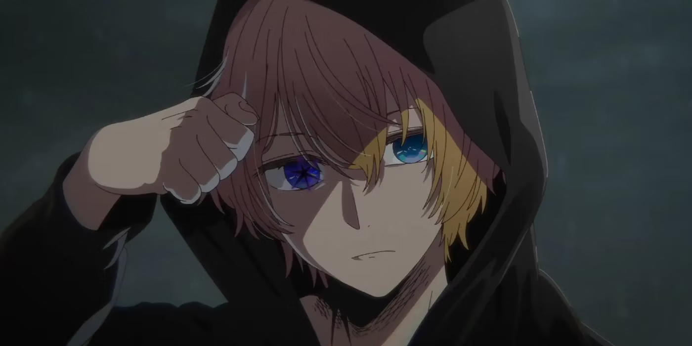
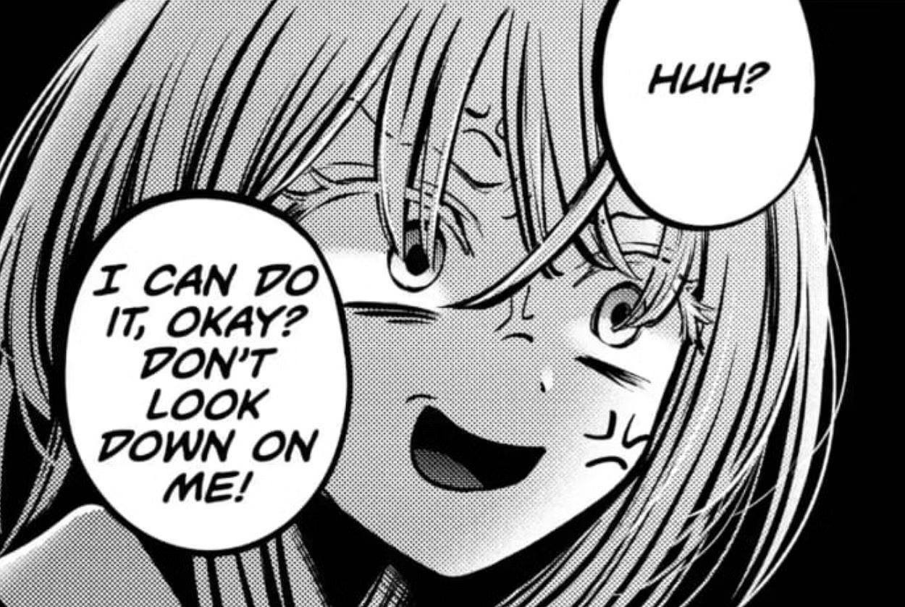
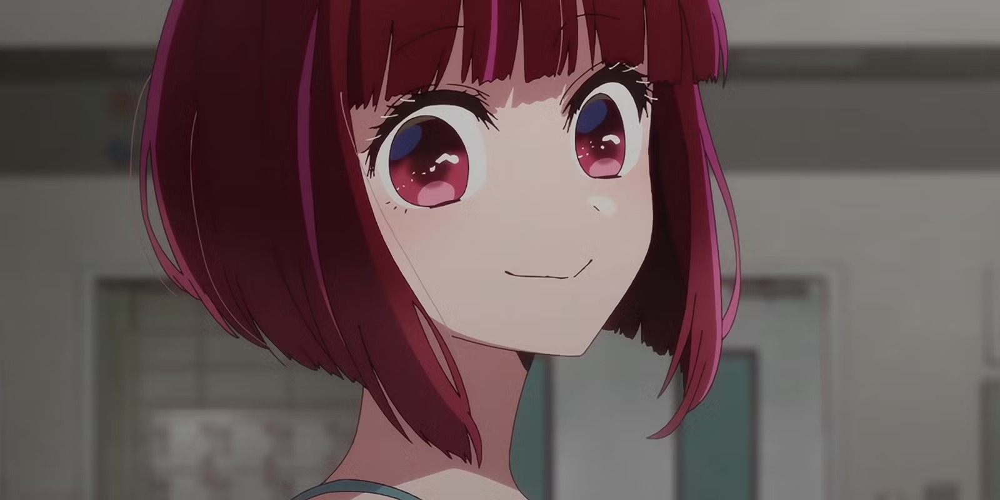
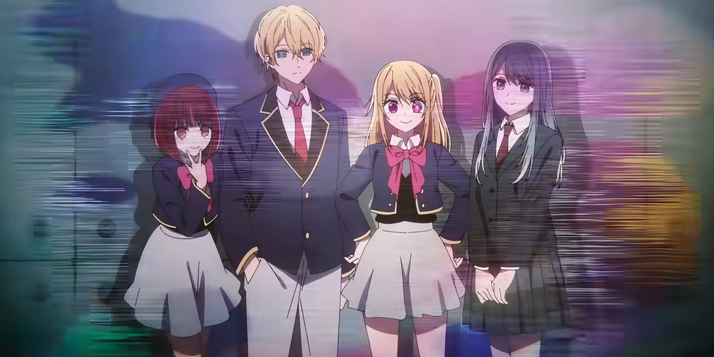

Oshi No Ko was, at first glance, a work with considerable potential. With the pen of [Aka Akasaka](https://myanimelist.net/people/2139/Aka_Akasaka), known for the success of [*Kaguya-sama: Love is War*](https://myanimelist.net/anime/37999/Kaguya-sama_wa_Kokurasetai__Tensai-tachi_no_Renai_Zunousen), and the visual talent of [Mengo Yokoyari](https://myanimelist.net/people/13173/Mengo_Yokoyari) ([*Kuzu no Honkai*](https://myanimelist.net/anime/32949/Kuzu_no_Honkai)), everything seemed set to deliver a captivating drama and a sharp critique of the Japanese entertainment industry. The first episode, a true narrative shock, fascinated the audience with its unexpected twists and reflections on parasocial relationships and the exploitation of celebrities.

But this promise quickly faded, giving way to a work that, over the course of episodes and chapters, became entangled in its own contradictions. While it aspired to be a metaphysical exploration of the industry's cruel mechanics, Oshi No Ko collapsed under the weight of its ambition. Its characters lost their depth, the plot became repetitive, and the ambiguous relationship between Aqua and Ruby ended up causing more discomfort than reflection.

<mark>In this article, we will try to understand why and how Oshi No Ko sabotaged itself.</mark> Why did what could have been a powerful and nuanced critique of the entertainment industry turn into a confusing, superficial, and ultimately disappointing work? Between narrative pretension and failure to deliver a true critique, Oshi No Ko is the perfect example of a series that ruined itself along the way.

## A Promise of Metaphysical Depth Ruined by Superficiality

Oshi No Ko tried to position itself as a work that was both critical and metaphysical, exploring dark themes surrounding the entertainment industry. But very quickly, this ambition crumbled under the weight of overly obvious storytelling and poorly managed tone.

### Poorly Managed Ambition

From the first episode, Oshi No Ko sets up a captivating premise: the story of two reincarnated children seeking to uncover the mysteries behind their mother's death, a famous idol, while denouncing the cruel backstage of the industry. Yet, what could have been a profound reflection on celebrity and the parasocial nature of relationships between stars and their fans ends up getting lost in clumsy repetitions. <mark>Aqua, the protagonist, spends most of his time exposing already well-known truths about the industry — the falseness of public personas, the manipulation of idols by their agencies — without ever offering new insights.</mark>

The anime adopts too didactic a tone, merely highlighting obvious aspects of the industry. For instance, when Aqua launches into his monologues about the falsehood of showbiz, the viewer is constantly spoon-fed, as if the script didn't trust its audience to grasp the nuances. Far from being subversive or provocative, Oshi No Ko ends up sounding like it's repeating clichés under the guise of revealing grand truths.

### Awkward Tone Management

<mark>One of the major weaknesses of the work is its inability to manage its tone consistently.</mark> The mix of dark drama and light comedy creates dissonance that disrupts immersion. From the first episode, after scenes of intense emotional weight, poorly timed gags break the narrative flow. Humor appears in moments that should remain solemn, especially when Aqua makes jokes or when trivial situations are inserted after important revelations.

This tonal mismatch persists throughout the series. For instance, instead of deepening moral dilemmas or heightening dramatic tension, comedic scenes constantly lighten the atmosphere, reducing the impact of the darker themes explored. <mark>The result is a work that struggles to find a balance between its "social critique" side and its desire to be entertaining.</mark>

### A Botched Critique of the Industry

Finally, while the anime promised an incisive critique of the entertainment industry's inner workings, it fails to develop this analysis meaningfully. <mark>The story never manages to go beyond the surface of what it denounces.</mark> Aqua, who is supposed to embody a critical figure of this system, comes across as too invincible, always finding solutions to his problems. The industry, though portrayed as a ruthless place, never poses a real challenge for him. The tough situations he faces are constantly softened by his ability to handle everything, which neutralizes any suspense.

The work often talks about the industry's cruelty but never really shows it in a credible or poignant way. The main characters, like Aqua and Ruby, are somehow shielded from its real dangers by being connected to a "good company" and having access to the right people, making their journey less impactful. <mark>This lack of stakes makes it hard to truly immerse in the series' critical message.</mark>

## A Story Bogged Down by Repetition and Lack of Development

One of Oshi No Ko’s significant weaknesses is its inability to maintain a dynamic and engaging story. After the powerful impact of the first episode, the anime quickly falls into a narrative routine where the main arcs stagnate, and the subplots repeat without bringing any real progression or depth to the story. This lack of development particularly affects two aspects: Aqua’s quest for revenge and the use of secondary characters.

### Aqua's Revenge Plot: A Race Without Tension

Aqua’s quest to avenge his mother, Ai, is supposed to be one of the story’s main drivers. However, instead of generating tension or concern, this arc quickly becomes repetitive and predictable. Aqua, portrayed as an omniscient and calculating character, is never truly put in danger. His ability to overcome every obstacle easily weakens the suspense and reduces the emotional impact of his quest.

### Stagnant Story Arcs

Beyond Aqua’s revenge quest and the underdevelopment of secondary characters, the main storyline also suffers from a lack of progression. The anime gets sidetracked into romantic subplots and comedic scenes that do not contribute to the story's advancement. These moments are often inserted randomly, breaking the story's rhythm and giving the impression that the anime is stalling rather than evolving its characters or deepening its themes.

Instead of sustained narrative development, Oshi No Ko seems to constantly revisit the same points without real progression. <mark>The focus is on repetitive dialogues where characters constantly reiterate obvious truths about the entertainment industry, making the whole thing monotonous and predictable.</mark>

## The Elephant in the Room: The Aqua/Ruby Relationship

One of the most troubling aspects of Oshi No Ko is how the relationship between Aqua and Ruby completely derails, crossing into an insufferably uncomfortable zone. What could have been a complex exploration of trauma or family dynamics turns into a crude provocation, deliberately designed to shock rather than deepen the story. In chapters 120 to 150, the situation becomes unbearable, particularly with chapter 143, where Ruby, consumed by an overwhelming obsession with Aqua, ends up kissing him twice.

This sequence of kisses is not a nuanced analysis of human relationships or familial tensions. It is a purely sensationalist move that exploits incest to draw attention, but the result is as vulgar as it is unnecessary. <mark>Far from adding depth, this toxic dynamic destroys the characters' integrity and sends the work spiraling into a senseless provocation.</mark> This gratuitous and unjustified treatment only reinforces the feeling that the once-promising series is collapsing under the weight of its own excesses.

Provocation for provocation's sake never works in the long run. Oshi No Ko sacrificed its narrative potential by playing the ambiguous incest card, perhaps hoping to shock its audience to keep their interest. But this narrative choice only ruined the work by stripping it of any subtlety. Instead of serving a larger plot about revenge and the industry's cruelty, this deviant relationship merely distracts and slows down the story. Worse still, this constant pursuit of shock value strips the work of its pace and credibility.

In the end, this dynamic between Aqua and Ruby is just a poorly executed provocation that has destroyed what remained interesting in Oshi No Ko. <mark>This is no longer a work that shocks with its intelligence or sharp critique, but with its coarse use of incestuous themes that lead nowhere.</mark> The result? A work that destroys itself from within, trapped by its own clumsy attempts to shock at any cost.

## Conclusion: A Work Destroyed from Within

Oshi No Ko was meant to mark a new era for Aka Akasaka and Mengo Yokoyari, blending a sharp critique of the entertainment industry with an exploration of parasocial relationships between celebrities and their fans. From its first episode, the anime seemed poised to deconstruct these dynamics, promising emotional and philosophical depth. But instead, the work got lost in its own contradictions.

<mark>The series ruined itself by pretending to explore complex themes while remaining incredibly superficial.</mark> The initial metaphysical ambition faded behind a series of repetitions, expository dialogues, and poorly timed comedic subplots that ultimately weakened the story's impact. Moreover, the main plot, centered around Aqua's quest for revenge, lacked tension due to an overly invincible protagonist and a storyline that stagnates, unable to progress organically. As for the secondary characters like Ruby, Kana, and Akane, they remained underutilized, serving more to reinforce Aqua’s story rather than offering their own development arcs.

Worse still, the ambiguous and disturbing relationship between Aqua and Ruby ended up destroying the work’s credibility. The chapters where their bond becomes increasingly troubling, without genuine narrative justification, not only shattered the story’s coherence but also added unnecessary discomfort. These poorly managed dynamics show just how much Oshi No Ko lost its way in gratuitous provocation.

<mark>In the end, Oshi No Ko is an example of a work that, despite its visual success, failed to deliver a truly compelling narrative.</mark> What was supposed to be a powerful critique of the entertainment industry and a reflection on celebrity turned into a confusing blend of genres and themes, lacking depth and subtlety. Oshi No Ko will likely be remembered not as a groundbreaking work, but as one that destroyed itself along the way, trapped by its own contradictions.
