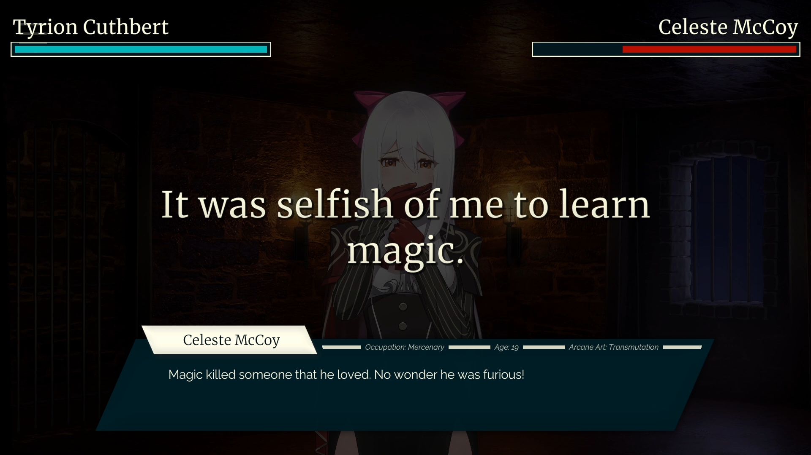
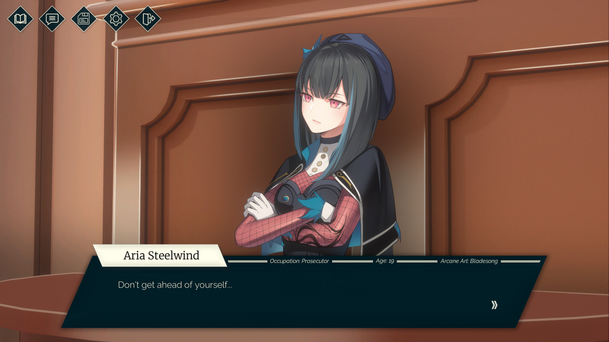
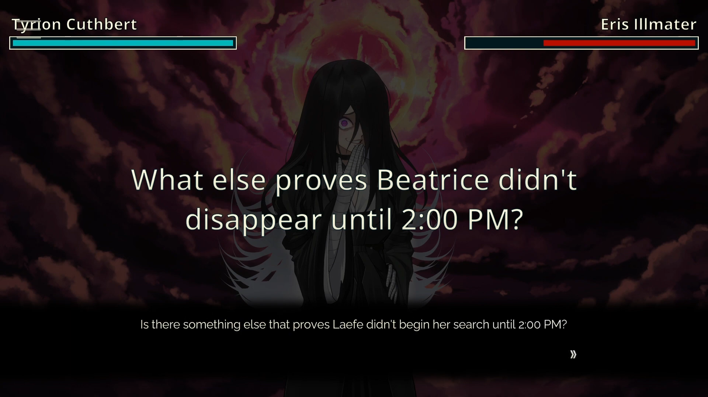
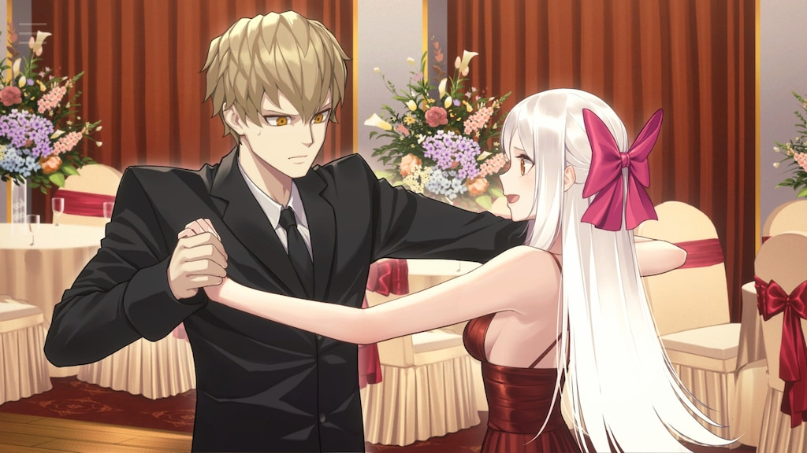
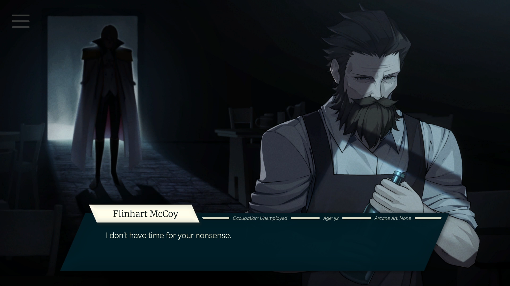
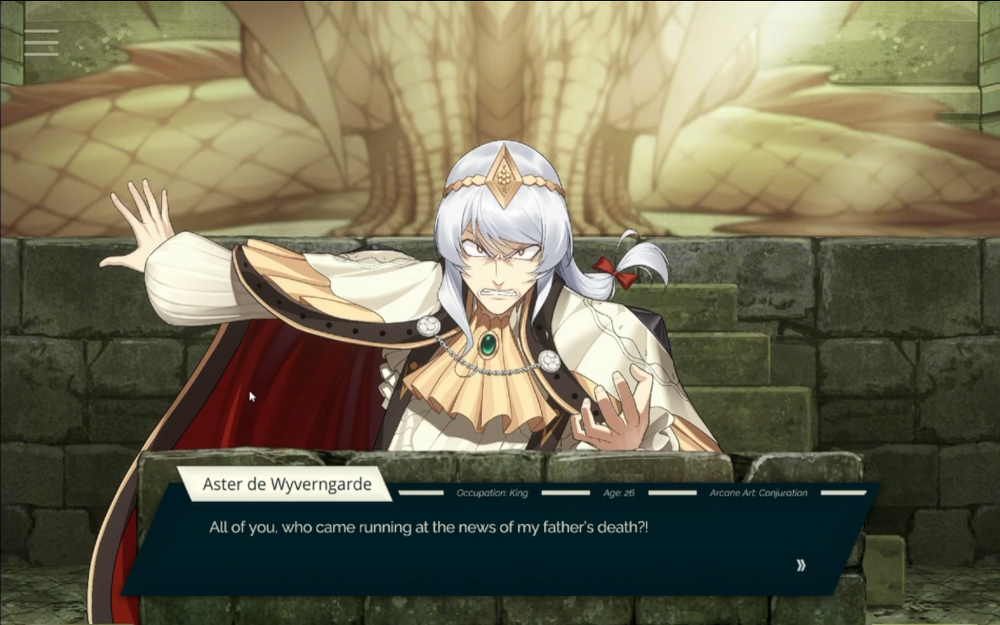

Il est 18h36, un mardi soir et alors que j’étais censé commencer à travailler sur mon prochain examen de mathématiques, je m’apprête à écrire un nième article sur un [Visual Novel](https://fr.wikipedia.org/wiki/Visual_novel) qui m’a marqué. Pourtant aujourd’hui, pas de [Key Studios](https://fr.wikipedia.org/wiki/Key_(entreprise)) ou de [CAPCOM](https://fr.wikipedia.org/wiki/Capcom), on s’en va explorer un jeu indépendant, niché entre l’hommage et l’innovation, [**Tyrion Cuthbert : Attorney of the Arcane**](https://store.steampowered.com/app/1590230/Tyrion_Cuthbert_Attorney_of_the_Arcane/).

## Hommage et Innovation

.png>)

Cela faisait un petit moment qu’il me faisait de l’œil ce [Tyrion Cuthbert](https://attorneyofthearcane.fandom.com/wiki/Tyrion_Cuthbert:_Attorney_of_the_Arcane), je me rappelle avoir participé à son crowdfunding, et puis d’avoir terminé la bêta gratuite sur Steam qui prenait en compte toute une partie de la première affaire du jeu. Développé par le studio **Diamond Henge**, Tyrion Cuthbert se décrit comme un Visual Novel inspiré par la série des [**Ace Attorney**](https://www.ace-attorney.com/), dont j’avais déjà parlé dans [l’article sur **Dai Gyakuten Saiban**](https://skoomaden.me/fr/posts/dai-gyakuten-saiban). Le jeu se veut, peut-être non-officiellement, comme une alternative à la suite très controversée de la trilogie originelle des Ace Attorney : [**Apollo Justice**](https://fr.wikipedia.org/wiki/Apollo_Justice:_Ace_Attorney).

Entre un royaume féodal qui n’hésite pas à avantager la noblesse, et un système judiciaire corrompu jusqu’à la moelle, Tyrion Cuthbert se place directement dans la lignée de l’arc de l’[**Âge Sombre du Système Judiciaire**](https://aceattorney.fandom.com/wiki/Dark_age_of_the_law) de Ace Attorney, tout en posant des raisons concrètes derrière la remise en question dudit système par la population paysanne.

## Une Nouvelle Recette

Tyrion Cuthbert dispose de ce dont [Ace Attorney](https://www.ace-attorney.com/) manque cruellement : un [**fil rouge**](https://www.linternaute.fr/dictionnaire/fr/definition/fil-rouge/). Chaque affaire nous apprend de nouveaux éléments de gameplay tout en servant l’histoire de manière cohérente. On suit un récit qui conclut sur un grand final, chaque nouvelle affaire plus impressionnante et longue que la précédente. Pourtant, si l’on prenait point par point ce qui différencie Tyrion d’Apollo, ce ne sont pas tant les ingrédients que la préparation.

Tyrion, [tout comme Apollo](https://aceattorney.fandom.com/wiki/Bracelet), dispose d’un pouvoir lui permettant de voir le **monologue interne** des personnages avec lesquels il interagit, tant que ces derniers n’ont pas gardé inconsciemment leurs pensées de Tyrion. 

C’est ici que la distinction entre hommage et renouveau est importante. Le jeu nous montre directement qu’il souhaite utiliser les codes de la trilogie originelle pour montrer la possibilité d’une direction alternative à celle qu’a pris Apollo, ou plus tard [**Dai Gyakuten Saiban**](https://skoomaden.me/fr/posts/dai-gyakuten-saiban). Il y a encore des clients pour la recette classique, tant qu’elle est bien exécutée.

## Une Accessibilité Accrue

Que ce soit un argument qui vous touche ou non, force est de constater que l’**interface utilisateur** du jeu et son **charadesign** sont exceptionnels. L’utilisation de modèles de personnages adaptés à la **4K**, l’interface universelle entre la [version mobile et PC](https://vndb.org/v45489), et la cohérence esthétique des lieux et des personnages est un vrai régal pour les yeux. Je me suis vu prendre des captures d’écran une trentaine de fois sur tout mon jeu, partageant à qui voulait l’entendre mes éloges des éléments visuels du jeu.

Peut-être pourtant, que si l’interface a l’avantage d’être accessible, c’est aussi parce que le jeu a été pensé pour pouvoir être sauvegardé n’importe quand sur mobile, permettant des séances de jeu d’une rapidité extrême. Mais cela veut aussi dire que le fil rouge dont nous avons parlé plus tôt doit être parfois rappelé au joueur via le système de log, et que les moments d’intensité durant les combats juridiques se trouvent à frôler une facilité déconcertante et une linéarité. Et si cette critique est bien moins applicable à la fin du jeu, les premières affaires ont ce symptôme du « trop facile ».

## Une Ecriture Fluide

Pour y remédier, [Tyrion Cuthbert](https://attorneyofthearcane.fandom.com/wiki/Tyrion_Cuthbert:_Attorney_of_the_Arcane) prend une décision audacieuse au sein même de son écriture. On ne se concentre plus désormais sur le « **Qui** » mais sur le « **Comment** » de chaque affaire – tellement, par ailleurs, que le jeu continuera d’innover graduellement, nous mettant dans des situations où l’on doit remettre en question notre propre parole et interprétation de la réalité. Le jeu est certes facile, dans le sens où il est aisé de déterminer qui est le coupable, mais en modifiant la structure même du gameplay, Tyrion Cuthbert a trouvé la clé pour faire en sorte que cela n’aie aucune importance.

L’écriture dispose cependant de quelques défauts. Tyrion a en effet un **sens de la justice infaillible**, qui lui fit même renier certains de ses proches à cause de leur corruptibilité, mais la remise en question du status quo est très limitée. On finit par sympathiser avec la noblesse qu’on a jusqu’alors constamment dénigrée. Alors que nous gravissons nous-mêmes les échelons en devenant des [parvenus](https://www.larousse.fr/dictionnaires/francais/parvenu/58417), on ne remet jamais en question nos propres responsabilités – chose qui aurait pu mettre beaucoup de richesse dans l’écriture de Tyrion et ses proches.

## Une Critique Sociale Timide

C’est comme si l’on observait la noblesse de l’extérieur, alors même que nous sommes impliqués dans leur vie, et que nous nous y sommes fait un nom. Entre le sexisme au sein de la **Maison Frega**, le militarisme de la **Maison Steelwind**, le monopole de la **Maison von Sanctus** et l’inaction de la **Maison Sibyl** – on pose ces faits comme des cartes mises sur une table, mais on ne prend jamais le temps de les remettre en question. On ne s’oppose jamais directement aux nobles dans nos interactions avec eux. Nous sommes inclus dans le système, et on fait tout pour gravir les échelons au sein de ce dernier.

Tyrion n’a rien d’un révolutionnaire, d’ailleurs on observe cela plus tard dans son opposition [avec le Roi](https://tyrion-cuthbert-attorney-of-the-arcane.fandom.com/wiki/Aster_de_Wyverngarde) à la fin du jeu. Il va dans le sens contraire de ce qui aurait pu être une rébellion effective – selon Tyrion, le changement doit se faire via l’utilisation du système lui-même, mais il finit par se faire absorber par ce dernier et fait tuer ceux qui auraient pu amener la liberté au peuple « [par tous les moyens nécessaires](https://en.wikipedia.org/wiki/By_any_means_necessary) ». En dehors de considérations politiques personnelles, la non-exploration de ces thèmes de manière plus approfondie rend difficile la différenciation entre Tyrion et ceux qu’il a abandonnés en les considérant comme trop corruptibles.

## Conclusion

Mise à part les quelques points que je reproche à l’histoire, je comprends que le jeu se veut fluide et agréable. Il est linéaire parce qu’il s’adresse à un public de joueurs mobiles qui souhaitent une expérience aussi visuellement alléchante que flexible et satisfaisante. [**Tyrion Cuthbert: Attorney of the Arcane**](https://attorneyofthearcane.fandom.com/wiki/Tyrion_Cuthbert:_Attorney_of_the_Arcane) réussit là où [**Apollo Justice**](https://www.ace-attorney.com/aj-trilogy/) a échoué, il met en place ses propres codes et permet de renouer avec la recette classique des [Ace Attorney](https://www.ace-attorney.com/). L’écriture est bien meilleure que toute la trilogie par ailleurs, mais en tentant d’aller dans une critique sociale trop ambitieuse et en forçant un Happy End, le jeu finit par se mordre la queue, apportant un élément de résolution peu satisfaisant au fil rouge dont il était si fier.

Malgré tout cela, je considère que [Tyrion Cuthbert](https://attorneyofthearcane.fandom.com/wiki/Tyrion_Cuthbert:_Attorney_of_the_Arcane) est probablement mon Visual Novel préféré de l’année, et je préfère volontiers y jouer que de faire la trilogie d’[**Apollo Justice**](https://www.ace-attorney.com/aj-trilogy/).

<mark>- yaro</mark>