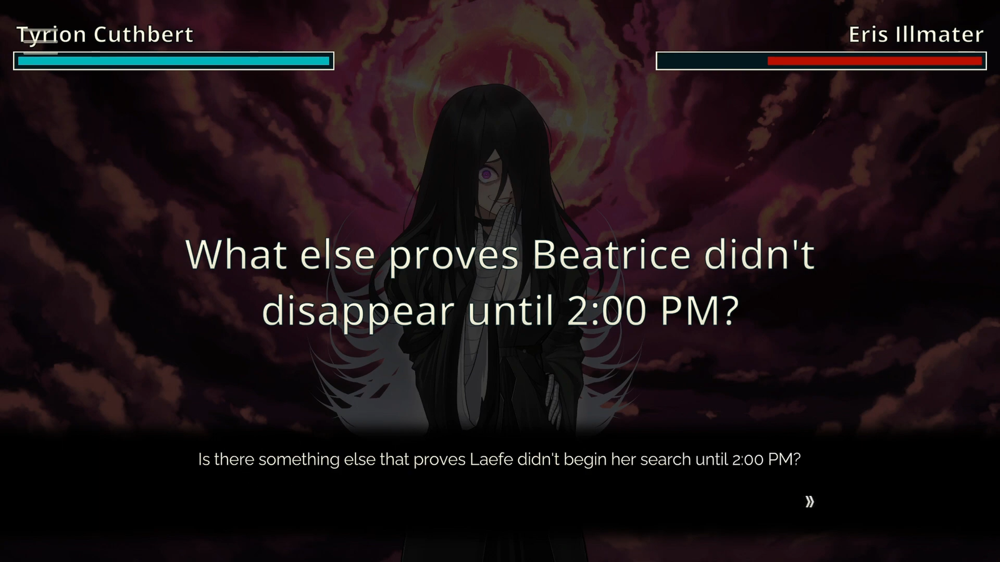
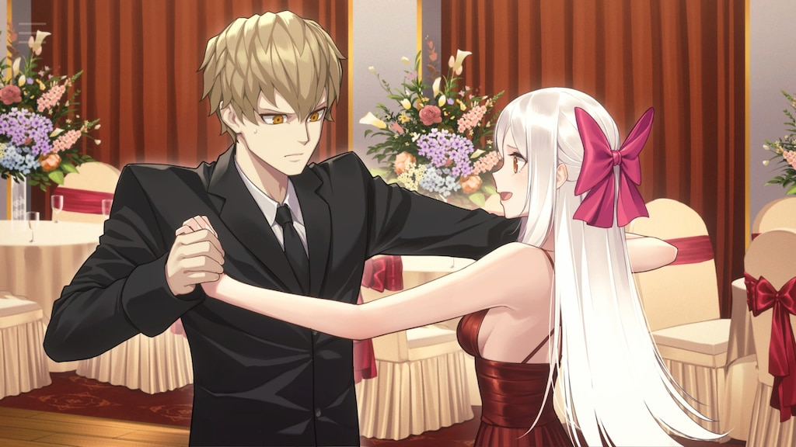
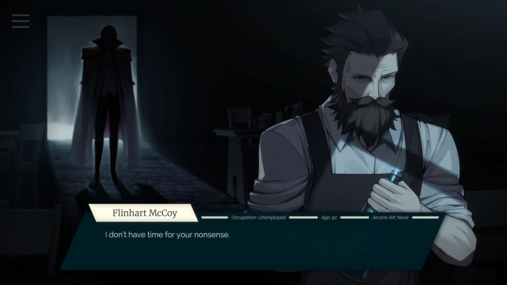

It's 6:36 PM on a Tuesday evening, and while I was supposed to start studying for my next math exam, I'm about to write yet another article about a [Visual Novel](https://en.wikipedia.org/wiki/Visual_novel) that made a mark on me. But today, no [Key Studios](https://en.wikipedia.org/wiki/Key_(company)) or [CAPCOM](https://en.wikipedia.org/wiki/Capcom), we’re diving into an independent game nestled between homage and innovation, [**Tyrion Cuthbert: Attorney of the Arcane**](https://store.steampowered.com/app/1590230/Tyrion_Cuthbert_Attorney_of_the_Arcane/).

## Homage and Innovation

.png>)

It had been a while since [Tyrion Cuthbert](https://attorneyofthearcane.fandom.com/wiki/Tyrion_Cuthbert:_Attorney_of_the_Arcane) caught my eye. I remember participating in its crowdfunding and playing the free beta on Steam, which covered a good chunk of the first case. Developed by the studio **Diamond Henge**, Tyrion Cuthbert is described as a Visual Novel inspired by the [**Ace Attorney**](https://www.ace-attorney.com/) series, which I had already discussed in [my article on **Dai Gyakuten Saiban**](https://skoomaden.me/en/posts/dai-gyakuten-saiban). The game aims to serve as an alternative, perhaps unofficially, to the highly controversial follow-up to the original Ace Attorney trilogy: [**Apollo Justice**](https://en.wikipedia.org/wiki/Apollo_Justice:_Ace_Attorney).

Set in a feudal kingdom that doesn't hesitate to favor the nobility and a judicial system corrupted to the core, Tyrion Cuthbert directly follows the narrative arc of the [**Dark Age of the Law**](https://aceattorney.fandom.com/wiki/Dark_age_of_the_law) from Ace Attorney, while offering concrete reasons for the peasant population's disillusionment with the system.

## A New Recipe

Tyrion Cuthbert offers what [Ace Attorney](https://www.ace-attorney.com/) severely lacks: a [**red thread**](https://www.linternaute.fr/dictionnaire/fr/definition/fil-rouge/). Every case introduces new gameplay elements while coherently serving the story. We follow a narrative that concludes in a grand finale, each new case more impressive and longer than the last. Yet, if we break down the differences between Tyrion and Apollo, it's not so much the ingredients but the preparation.

Like Apollo, Tyrion has the power to see the **inner monologue** of the characters he interacts with, as long as they haven’t subconsciously blocked their thoughts from Tyrion.

This is where the distinction between homage and innovation becomes crucial. The game clearly shows it wants to use the original trilogy’s framework to demonstrate an alternative direction to the one taken by Apollo, or later [**Dai Gyakuten Saiban**](https://skoomaden.me/en/posts/dai-gyakuten-saiban). There are still fans of the classic recipe, as long as it’s well-executed.

## Enhanced Accessibility

Whether this argument resonates with you or not, it’s undeniable that the game’s **user interface** and **character design** are exceptional. The use of character sprites suited to **4K**, the universal interface between the [mobile and PC versions](https://vndb.org/v45489), and the aesthetic coherence of the locations and characters are a true visual treat. I found myself taking screenshots about thirty times throughout my playthrough, sharing my praises for the game’s visual elements with anyone who would listen.

Perhaps the interface’s accessibility is due to the game being designed to allow saving at any time on mobile, enabling quick play sessions. But this also means that the red thread mentioned earlier sometimes needs to be reminded to the player via the log system, and the intensity of the courtroom battles often teeters on disconcerting ease and linearity. While this criticism becomes less relevant towards the end of the game, the early cases suffer from this “too easy” symptom.

## Fluid Writing

To remedy this, [Tyrion Cuthbert](https://attorneyofthearcane.fandom.com/wiki/Tyrion_Cuthbert:_Attorney_of_the_Arcane) makes a bold decision within its writing. The focus is no longer on the “**Who**” but on the “**How**” of each case – so much so that the game continues to innovate gradually, placing us in situations where we must question our own words and interpretation of reality. The game is easy, in the sense that it’s simple to identify the culprit, but by modifying the very structure of the gameplay, Tyrion Cuthbert found the key to making it irrelevant.

That said, the writing has a few flaws. Tyrion possesses an **infallible sense of justice**, which even leads him to renounce some of his close associates due to their corruptibility. But the questioning of the status quo is quite limited. We end up sympathizing with the nobility that we’ve constantly disparaged up until that point. As we ourselves climb the social ladder, becoming **parvenus**, we never question our own responsibilities – something that could have added much depth to Tyrion and his companions’ writing.

## A Timid Social Critique

It’s as if we observe the nobility from the outside, even as we’re involved in their lives and have made a name for ourselves. Between the sexism in **House Frega**, the militarism of **House Steelwind**, the monopoly of **House von Sanctus**, and the inaction of **House Sibyl** – these facts are laid out like cards on a table, but we never take the time to question them. We never directly oppose the nobles in our interactions with them. We’re included in the system and do everything we can to climb its ranks.

Tyrion is not a revolutionary, and we see this later in his opposition [to the King](https://tyrion-cuthbert-attorney-of-the-arcane.fandom.com/wiki/Aster_de_Wyverngarde) at the end of the game. He takes a stance against what could have been an effective rebellion – according to Tyrion, change must happen through the system itself. Yet, he ends up being absorbed by it, and causes the death of those who could have brought freedom to the people “**by any means necessary**”. Outside of personal political considerations, the lack of deeper exploration of these themes makes it difficult to differentiate Tyrion from those he abandoned for being too corrupt.

## Conclusion

Aside from the few points I criticize about the story, I understand that the game aims to be fluid and enjoyable. It’s linear because it’s meant for a mobile audience that seeks an experience as visually enticing as it is flexible and satisfying. [**Tyrion Cuthbert: Attorney of the Arcane**](https://attorneyofthearcane.fandom.com/wiki/Tyrion_Cuthbert:_Attorney_of_the_Arcane) succeeds where [**Apollo Justice**](https://www.ace-attorney.com/aj-trilogy/) failed. It sets its own standards and renews the classic [Ace Attorney](https://www.ace-attorney.com/) recipe. The writing is far better than the entire Apollo trilogy, but by attempting an overly ambitious social critique and forcing a Happy End, the game ends up biting its own tail, delivering an unsatisfying resolution to the red thread it was so proud of.

Despite all of this, I consider [Tyrion Cuthbert](https://attorneyofthearcane.fandom.com/wiki/Tyrion_Cuthbert:_Attorney_of_the_Arcane) to be my favorite Visual Novel of the year, and I’d rather play it again than go through the **Apollo Justice** trilogy.

<mark>- yaro</mark>