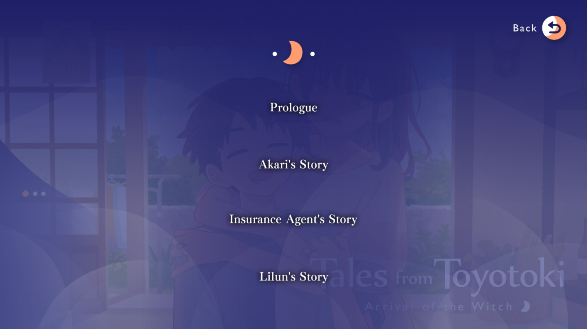

Le lointain murmure des vagues se brisant sur les rivages de Toyotoki se mêle aux voix faibles et persistantes des générations passées. Il y a une certaine mystique autour de cette petite île au large d'Okinawa, une essence profondément ancrée dans la tradition japonaise, mais encore préservée de la modernité. C'est comme si la terre elle-même avait des histoires à raconter, témoin silencieux des vies de ceux qui parcourent ses chemins, perdus mais en quête de sens. Hikaru Nishime arrive ici de manière inattendue, désorienté par le bouleversement soudain de sa vie. Quelques jours auparavant, il s'apprêtait à commencer le lycée à Tokyo, seulement pour se retrouver envoyé vivre avec un grand-père qui a mystérieusement disparu. Échoué sur un sol inconnu, il rencontre Lilun, une fille énigmatique qui prétend être une sorcière en mission, et tous deux tissent un lien improbable — survivant, grandissant et découvrant les vérités cachées que Toyotoki dissimule.

Dans *Tales from Toyotoki : Arrivée de la Sorcière*, [Fragaria](https://fragaria.info/) propose une histoire de passage à l'âge adulte où l'adolescence rencontre l'isolement et la connexion, explorant la découverte de soi et la culture okinawaïenne. Ce qui commence comme un récit tranquille de tranche de vie évolue en un voyage émotionnel — une aventure dans l'identité, la résilience et les liens qui transcendent la vie quotidienne.

## Structure Narrative

*Tales from Toyotoki* nous plonge dans un rythme quotidien paisible sur cette île, où le fantastique se mêle à l'ordinaire dès le départ. Hikaru et Lilun, tous deux outsiders de cette société insulaire, s'intègrent progressivement en trouvant du travail, en rencontrant des habitants et en apprenant leurs particularités. Leurs interactions, teintées d'humour discret et de chaleur, posent les bases d'une cadence naturelle, créant une atmosphère de « la vie continue » qui imprègne les deux premiers tiers de l'histoire.

Là où *Toyotoki* brille, c'est dans la profondeur émotionnelle introduite par les arcs des personnages secondaires. À mesure qu'Hikaru et Lilun interagissent avec leurs amis, ils affrontent des moments de solitude, de résilience et d'amitié. Sous des échanges simples se cache une île pleine de contrastes, à la fois refuge et énigme. Le ton du jeu change radicalement dans son dernier tiers, où l'atmosphère se densifie et les enjeux émotionnels atteignent leur paroxysme. Les interactions légères de tranche de vie laissent place à des révélations inattendues, soulignant que grandir signifie souvent faire face aux questions les plus difficiles de la vie.

Une caractéristique notable de *Toyotoki* est son accessibilité pour les joueurs internationaux. À travers de petits détails, il introduit des aspects de la culture okinawaïenne sans submerger les néophytes. Cependant, parfois, la retenue glisse : une scène explicative pour un jeu de cartes local s'étire sur dix minutes, frôlant la tediousité. En équilibrant ces moments culturels avec soin, le jeu crée un espace où chacun, qu'il soit local ou étranger, peut ressentir la profondeur de Toyotoki.

## Personnages et Structure des Chapitres

*Tales from Toyotoki* est structuré en quatre parties, chaque chapitre étant dédié à un personnage central, explorant des dilemmes personnels et des luttes intérieures. Contrairement à de nombreux visual novels qui entrelacent les récits, *Toyotoki* adopte une approche simple, offrant un objectif clair et une progression structurée dans chaque chapitre.

- **Prologue** : L'histoire nous ancre dans la vie quotidienne de [Hikaru Nishime](https://www.aksysgames.com/toyotoki/characters/) à son arrivée à Toyotoki. Ce chapitre capture la désorientation de Hikaru et son adaptation progressive, établissant un ton réflexif.

- **L'Histoire d'Akari** : La narration se déplace vers [Akari Akatsumi](https://www.aksysgames.com/toyotoki/characters/), l'une des jeunes femmes choisies pour devenir prêtresse dans la religion locale. Ce chapitre explore la tension entre le devoir culturel et le désir personnel, alors qu'Akari rêve de quitter Toyotoki pour poursuivre une carrière d'actrice, incarnant le conflit entre modernité et tradition.

- **L'Histoire de l'Agent d'Assurance** : [Tsumugi Higa](https://www.aksysgames.com/toyotoki/characters/), une agente d'assurance, réfléchit à ses luttes avec son passé et ses souvenirs. Son chapitre, teinté de mélancolie et de liens familiaux, explore des thèmes de perte et de guérison. Certaines incohérences concernant sa relation avec sa grand-mère floutent légèrement l'aspect surnaturel, bien qu'elles n'enlèvent rien à l'arc émotionnel global.

- **L'Histoire de Lilun** : Ce dernier chapitre, centré sur [Lilun Jaminthida](https://www.aksysgames.com/toyotoki/characters/), est peut-être le plus intense. Sa mission mystérieuse et sa connexion avec Hikaru culminent dans une fin tragique, mêlant des éléments de tranche de vie à une romance douce-amère.

Chaque chapitre explore un chemin narratif unique, immergeant les joueurs dans les subtilités de Toyotoki. Cette approche en couches améliore la cohérence de l'histoire, permettant des parcours divers tout en maintenant une structure harmonieuse.

## Limitations Visuelles

Visuellement, *Toyotoki* offre un monde simple mais charmant. Les arrière-plans, des photos éditées dans un style cartoon, capturent l'essence intemporelle de Toyotoki, soutenant l'esthétique de tranche de vie. L'utilisation de la lumière et de l'ombre ajoute chaleur et mystère, créant une qualité onirique qui complète le ton du jeu.

Cependant, les limitations visuelles deviennent rapidement apparentes. Avec seulement une douzaine de CGs pour une durée de 35 heures et des variations de sprites limitées, certaines scènes manquent d'impact visuel. Les expressions des personnages manquent également de diversité, rendant certains moments émotionnels parfois répétitifs. Comparé à *Tyrion Cuthbert*, que j'ai précédemment [critiqué](https://skoomaden.me/en/posts/innovation-through-hommage-tyrion-cuthbert), *Toyotoki* semble statique, perdant certaines nuances narratives. Des détails comme le salon rempli de figurines d'Akari passent inaperçus en raison d'une insuffisance de mises à jour visuelles.

## Bande-Son

La bande sonore se compose principalement de pièces de piano douces, bien adaptées à l'atmosphère de l'île. Cependant, elle souffre d'un manque de variété. Après plusieurs heures, la répétitivité atténue l'impact émotionnel, manquant de thèmes adaptés à chaque moment significatif du jeu.

    <iframe 
        src="https://www.youtube.com/embed/AY9ZSd2NVD8?si=XAVeSFzZ7YHRBbMh" 
        title="YouTube video player" 
        frameborder="0" 
        allow="accelerometer; autoplay; clipboard-write; encrypted-media; gyroscope; picture-in-picture; web-share" 
        referrerpolicy="strict-origin-when-cross-origin" 
        allowfullscreen 
        style="position: absolute; top: 0; left: 0; width: 100%; height: 100%; border: none;">
    </iframe>

Néanmoins, les effets sonores tels que le bruissement des feuilles et les pas résonnants ajoutent une couche cruciale de réalisme. Le doublage japonais lors des scènes clés apporte de la profondeur, rendant les personnages plus vivants.

## Contexte Historique

Contrairement aux visual novels japonais des années 2000, connus pour leurs multiples chemins et fins alternatives (voir le célèbre organigramme de Clannad ci-dessous), *Tales from Toyotoki* adopte une approche narrative unique et linéaire. Mes amis traducteurs m'ont encouragé à explorer ce titre, non seulement pour son originalité mais aussi pour son récit distinctif : il ne cherche pas à diviser le joueur, mais plutôt à l'immerger dans la profondeur d'une culture.

## Conclusion

*Tales from Toyotoki* offre une expérience narrative inoubliable, alliant la simplicité des tranches de vie à la profondeur des luttes humaines. À travers la lentille de l'isolement et des relations, Fragaria nous rappelle que chaque vie, même dans ses aspects les plus ordinaires, est remplie de richesse. La profondeur émotionnelle, les personnages attachants et l'exploration délicate de la culture okinawaïenne en font une aventure qui transcende le simple jeu vidéo.

Les paysages paisibles et les échos du passé de Toyotoki résonnent encore en moi, un témoignage que même dans l'isolement, les connexions peuvent surgir des endroits les plus inattendus. *Tales from Toyotoki* ne se contente pas de raconter une histoire; il nous invite à plonger dans un monde vibrant où chaque instant compte, et chaque voix, même la plus douce, laisse une empreinte indélébile.

 <mark>- yaro</mark>