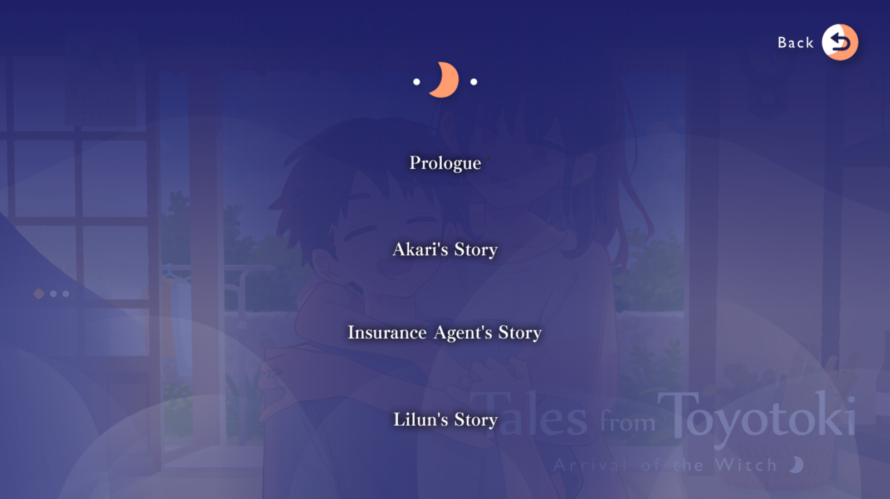
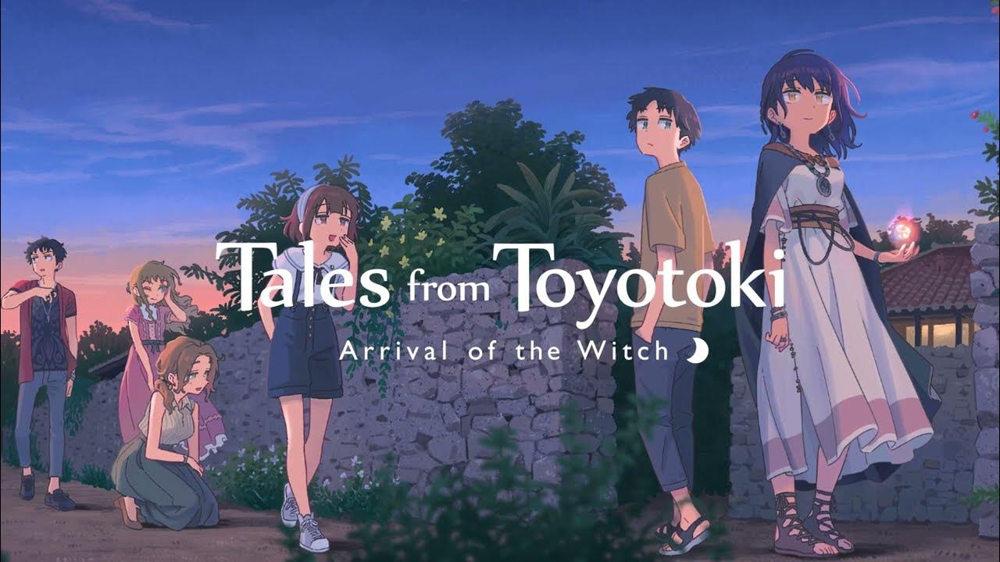

The distant hum of waves breaking along Toyotoki’s shores mingles with the faint, lingering voices of past generations. There’s a certain mystery to this small island off Okinawa, a sense of place deeply embedded in Japanese tradition, yet untouched by modernity. It’s as if the land itself has tales to tell, its silent witness to the lives of those who wander its paths, lost but seeking meaning. Hikaru Nishime arrives here unexpectedly, disoriented by the sudden upheaval of his life. Just days before, he was set to start high school in Tokyo, only to find himself sent to live with a grandfather who has mysteriously vanished. Stranded on unfamiliar ground, he meets Lilun, an enigmatic girl who claims to be a witch on a mission, and the two form an unlikely bond—surviving, growing, and discovering the hidden truths that Toyotoki conceals.

In *Tales from Toyotoki: Arrival of the Witch*, [Fragaria](https://fragaria.info/) delivers a coming-of-age story where adolescence meets isolation and connection, exploring self-discovery and Okinawan culture. What begins as a calm slice-of-life narrative evolves into an emotional journey—a venture into identity, resilience, and the ties that transcend everyday life.

## Narrative Structure

*Tales from Toyotoki* immerses us in a peaceful daily rhythm on this island, where the fantastic mingles with the ordinary from the outset. Hikaru and Lilun, both outsiders to this insular society, gradually integrate by finding work, meeting locals, and learning their quirks. Their interactions, tinged with quiet humor and warmth, lay the groundwork for a natural cadence, creating a “life goes on” atmosphere that permeates the first two-thirds of the story.

Where *Toyotoki* shines is in the emotional depth introduced through secondary character arcs. As Hikaru and Lilun interact with their friends, they confront moments of solitude, resilience, and friendship. Beneath simple exchanges lies an island full of contrasts, both a refuge and an enigma. The tone of the game shifts dramatically in its final third, where the atmosphere grows denser and the emotional stakes reach a climax. The lighthearted slice-of-life interactions give way to unexpected revelations, underscoring that growing up often means facing life’s hardest questions.

One notable feature of *Toyotoki* is its accessibility to international players. Through small details, it introduces aspects of Okinawan culture without overwhelming newcomers. However, at times, the restraint slips: an explanatory scene for a local card game stretches over ten minutes, bordering on tediousness. By balancing these cultural moments with care, the game creates a space where everyone, whether local or foreign, can feel the depth of Toyotoki.

## Characters and Chapter Structure

*Tales from Toyotoki* is structured into four parts, each chapter dedicated to a central character, exploring personal dilemmas and internal struggles. Unlike many visual novels that intertwine narratives, *Toyotoki* takes a straightforward approach, providing a clear purpose and structured progression in each chapter.

- **Prologue**: The story roots us in [Hikaru Nishime](https://www.aksysgames.com/toyotoki/characters/)’s everyday life as he arrives in Toyotoki. This chapter captures Hikaru’s disorientation and gradual adaptation, setting a reflective tone.

- **Akari's Story**: The narrative shifts to [Akari Akatsumi](https://www.aksysgames.com/toyotoki/characters/), one of the young women chosen to become a priestess in the local religion. This chapter explores the tension between cultural duty and personal desire, as Akari dreams of leaving Toyotoki to pursue acting, embodying the conflict between modernity and tradition.

- **The Insurance Agent's Story**: [Tsumugi Higa](https://www.aksysgames.com/toyotoki/characters/), an insurance agent, reflects on her struggles with her past and memories. Her chapter, tinged with melancholy and familial connections, delves into themes of loss and healing. Some inconsistencies regarding her relationship with her grandmother slightly blur the supernatural aspect, though they do not detract from the overall emotional arc.

- **Lilun's Story**: This final chapter, centered on [Lilun Jaminthida](https://www.aksysgames.com/toyotoki/characters/), is perhaps the most intense. Her mysterious mission and connection with Hikaru culminate in a tragic ending, blending slice-of-life elements with bittersweet romance.

Each chapter explores a unique narrative path, immersing players in Toyotoki’s subtleties. This layered approach enhances the story’s coherence, allowing for diverse journeys while maintaining a harmonious structure.

## Visual Limitations

Visually, *Toyotoki* offers a simple yet charming world. The backgrounds, edited photos in a cartoon style, capture Toyotoki’s timeless essence, supporting the slice-of-life aesthetic. The use of light and shadow adds warmth and mystery, creating a dreamlike quality that complements the game’s tone.

The visual limitations, however, quickly become apparent. With only about a dozen CGs for a 35-hour duration and limited sprite variations, certain scenes lack visual impact. Character expressions also lack diversity, making emotional moments occasionally repetitive. Compared to *Tyrion Cuthbert*, which I previously [critiqued](https://skoomaden.me/en/posts/innovation-through-hommage-tyrion-cuthbert), *Toyotoki* feels static, losing some narrative nuances. Details like Akari’s figure-filled living room go unnoticed due to insufficient visual updates.

## Soundtrack

The soundtrack primarily consists of gentle piano pieces, well-suited to the island’s atmosphere. However, it suffers from a lack of variety. After several hours, the repetitiveness dampens the emotional impact, lacking themes tailored to each significant moment in the game.

    <iframe 
        src="https://www.youtube.com/embed/AY9ZSd2NVD8?si=XAVeSFzZ7YHRBbMh" 
        title="YouTube video player" 
        frameborder="0" 
        allow="accelerometer; autoplay; clipboard-write; encrypted-media; gyroscope; picture-in-picture; web-share" 
        referrerpolicy="strict-origin-when-cross-origin" 
        allowfullscreen 
        style="position: absolute; top: 0; left: 0; width: 100%; height: 100%; border: none;">
    </iframe>

Nevertheless, sound effects like rustling leaves and echoing footsteps add a crucial layer of realism. Japanese voice acting during key scenes adds depth, making the characters feel more alive.

## Historical Context

Unlike Japanese visual novels from the 2000s, known for their multiple routes and alternative endings (see the famous Clannad Flowchart below), *Tales from Toyotoki* takes a unique and linear narrative approach. My translator friends encouraged me to explore this title, not only for its novelty but for its distinctive storytelling: it does not, like many others, try to stand out by getting lost in a non-linear narrative; instead, it asserts itself with a single, carefully structured path, designed to tell an initiatory story imbued with a sense of fate, reminiscent of classic romantic tragedies.

Credit: [Morlok8k](https://ks.fhs.sh/viewtopic.php?t=8352)

This choice of a single narrative path lends *Toyotoki* a sense of inevitability, where each step in Hikaru and Lilun’s journey feels predestined. Through this fixed narrative, *Toyotoki* achieves a sense of inescapable fate, reducing interactivity in favor of a more intense, emotionally-driven built-up experience—a trend in some contemporary VNs aiming for greater narrative depth and a more profound tragic impact.

## Conclusion

*Tales from Toyotoki* stands out in the visual novel landscape, blending the familiarity of a coming-of-age story with the subtlety of Okinawan culture and a supernatural mystery. [Fragaria](https://fragaria.info/) captures a slice-of-life atmosphere that gradually transforms into something richer, laden with emotional tension and significant character development. The game’s linear narrative and low interactivity may feel restrictive for players seeking deeper gameplay, but for those who appreciate character-driven narratives, *Toyotoki* offers an experience that is both captivating and introspective.

Despite its visual and auditory limitations, *Tales from Toyotoki* succeeds in providing a memorable journey rooted in a strong sense of place and cultural identity. [Fragaria](https://fragaria.info/) has crafted a story that resonates, both as a coming-of-age tale and a quiet tribute to the timeless spirit of an isolated island.

 <mark>- yaro</mark>