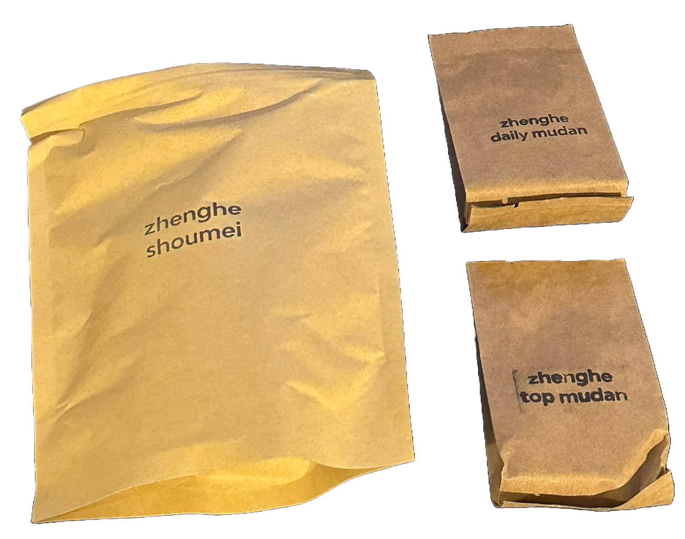

Just received the July 2024 Tea Club in the mail!

Here's what Paul wrote:

"We took a trip to the tea mountains of Fujian a couple of weeks ago and this club will explore some of the teas from our trip, namely white teas from the lesser-known white tea producing region called Zhenghe. Why visit during this rainy season? Well, as many of you may know, the time during early spring is fairly well monopolized with tea productions. Every year we try to divide our time between different regions, but despite our best efforts, we can’t be everywhere at once. This spring, we were mostly in Sichuan and Yunnan, so we decided to make a trip to Fujian to visit tea producers in and around Fuding and Zhenghe. Fujian’s most famous white tea producing region is called Fuding, a coastal city with several tea mountains. Zhenghe, a several hour drive inland to the West is a region that also produces white tea, many of which were unknown to us until recent years. Zhenghe city, which is nestled along a river in between the mountains, has tea producing areas all around it. We drove out into the mountains, amidst torrential downpour, to take a look at tea fields in the rain. (It was nice to get punishment from the rain gods for visiting off season.) Despite the inclement weather, which caused and continues to cause flooding in Southern China this year, we were able to see some beautiful natural scenery and to try many of the fresh teas from 2024 spring.

White tea is traditionally sold using a grading system, with the bud heavy pickings fetching the highest prices. This is because making a bud heavy baimudan (also called white peony, the literal translation from Mandarin) white tea takes exponentially more work. Picking small buds is labor intensive and requires skill, with batches yielding far fewer dried tea per hectare of tea bush, larger leaf pickings like shoumei. The names of these grades vary from producer to producer, with no official regulation, so you may see many people or shops using "baihao" to describe their top grade. We gave these teas slightly less lofty names, with "top" and "daily" being the highest and "daily" being a more economic option with fewer buds. If you’d like to try both of these two side-by-side, you might find that paying a lot of extra money for a few more buds is often a foolish choice. In fact, you might even find that you prefer a less bud heavy picking like shoumei, which is a "lower grade of tea" in a system invented by people who apparently have a bud fetish. These larger leaves and stems are not inherently worse in any way – we find it to be a lovely tea in its own right. If you enjoy these teas, we recommend you try some of our other white teas on the site, including aged white teas like our 2014 Shoumei (from Fuding, not Zhenghe) that boasts a lovely fruity/aged profile after a decade of age.

## Brewing Instructions

Boiling water. Controversial in some circles, we prefer boiling water for these white teas (feel free to use a lower temp if you like, it’s your tea after all!) Use gongfu style brewing if you can. We recommend no rinse on these teas, take the first rinse/steep and set it aside to drink after the session. It’ll give you a lovely window into where the tea will end and will likely have cooled down to a deliciously sweet steep with a light hue that’ll taste like springtime. For the shoumei, you can steep longer and with a heavier hand, as the older leaves and stems will take more time to release their sweetness than the younger buds of the baimudan(s).

Our website tea club update will be on the way soon, using Shopify instead of Paypal. This will theoretically mean that you can receive automatic tracking through your white2tea.com account and update your address via your account too. Hoorah! We will have a fresh Yunnan white tea made in a Fujian style on the way in August with an exclusive pressing. It will be a lovely comparison to these white teas. See you on social media, hashtag us #white2tea"

Alright alright, let's see what the package is all about this month:

## Zhenghe Shoumei

This tea offers a robust flavor with a lovely balance of sweet and vegetal notes. Perfect for longer steeps, it reveals a complexity that is both refreshing and grounding.

## Zhenghe Daily Mudan

An economical option with fewer buds but still delivers a delightful tea experience. It’s a great daily drinker that provides a consistent and enjoyable flavor profile.

## Zhenghe Top Mudan

The highest grade in this selection, offering a more refined and delicate taste. Perfect for those special occasions or when you want to indulge in a superior tea experience.

We’re excited to dive into these teas and explore the unique flavors they offer. Stay tuned for more detailed reviews!

*- yaro*
