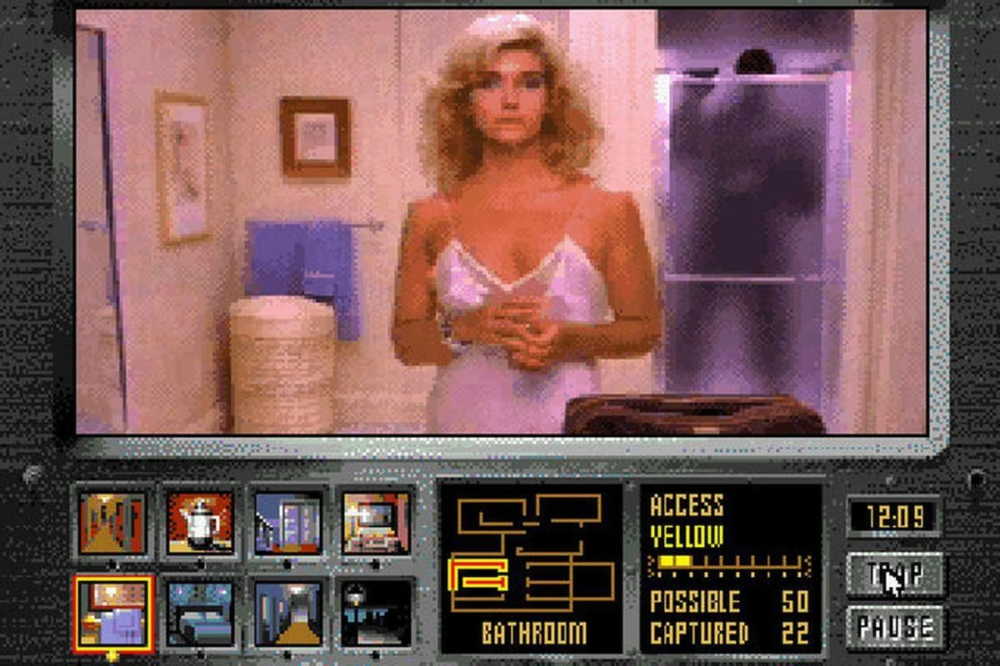
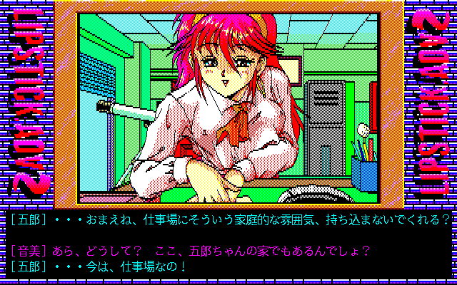

La dernière fois que j’ai entendu parler des jeux en Full-Motion Video (FMV), c’était il y a une dizaine d’années. À l’époque, je faisais tourner Windows Vista sur un HP Slim équipé d’un processeur Athlon x64, l'un des rares capables de supporter cet OS capricieux. Je me souviens avoir passé des heures à chercher une liste bien précise : celle des jeux Sega CD disponibles en torrent. 

Mon objectif était clair : graver autant de titres que possible sur des disques vierges fraîchement acquis. *Night Trap*, *Double Switch*, *Road Avenger* -- Ces jeux mélangeaient des mécaniques de tir sur rails parfois soporifiques avec des cinématiques pré-enregistrées empreintes d’un charme désuet. La qualité vidéo du Sega CD, bien que rudimentaire selon nos standards actuels, évoquait en moi une nostalgie étrange — celle d’une époque que je n’avais jamais vraiment connue.

Pour moi, le genre FMV a toujours été lié à cette bulle temporelle : un phénomène né dans le contexte particulier d’un add-on de console vendu à seulement [2,2 millions d’exemplaires](https://www.videogamehistory.com/sega-cd-sales). Et pourtant, ce genre n’a pas disparu. Bien au contraire, il a survécu et s’est même réinventé grâce aux technologies modernes. Aujourd’hui, les FMVs connaissent un véritable renouveau, notamment dans une forme florissante venue d’Asie de l’Est : Corée du Sud, Japon, [Chine](https://www.tap.io/article/fmv-games-in-china)… Une industrie portée par des amateurs comme des professionnels s’est spécialisée dans ce genre qu’on croyait désuet, mais qui, paradoxalement, n’a jamais autant prospéré.

## **Un essor moderne dans un marché de niche**

Le marché des jeux vidéo alternatifs connaît un essor remarquable depuis le début des années 2010. De plus en plus de joueurs recherchent des expériences alternatives aux blockbusters AAA, privilégiant des œuvres qui explorent des mécaniques ou des narrations innovantes. Les [FMVs répondent à cette demande](https://www.gamasutra.com/view/news/284736/The_Resurgence_of_FMV_Games.php) en combinant l’interactivité des jeux vidéo avec l’esthétique cinématographique. Cette redécouverte s’inscrit également dans une tendance plus large de réhabilitation des médias rétros : des genres comme les visual novels ou les point-and-click connaissent eux aussi une renaissance, alimentés par la nostalgie et la curiosité des joueurs modernes

Les chiffres illustrent cet engouement croissant. Par exemple, *Her Story* (2015), développé par Sam Barlow, a été salué par la critique pour son approche narrative fragmentée et interactive, dépassant les [**400 000 exemplaires**](https://www.polygon.com/2015/6/24/8837445/her-story-review).  vendus en quelques mois. De même, *[Five Dates* (2020)](https://www.eurogamer.net/articles/2020-11-five-dates-review), malgré son budget modeste, a attiré l’attention grâce à son utilisation d’acteurs réels et de séquences filmées pendant le confinement lié à la pandémie de COVID-19.

Cet essor contraste nettement avec les productions classiques des années 1990, où les FMVs étaient souvent perçus comme des curiosités technologiques maladroites. À l’époque, des titres comme *Night Trap* ou *Sewer Shark* souffraient de séquences pré-enregistrées rigides et d’une interactivité limitée, ce qui nuisait à leur immersion. Aujourd’hui, les FMVs bénéficient de technologies modernes (compression vidéo haute définition, streaming fluide) et d’un public plus tolérant aux imperfections narratives, permettant au genre de se [renouveler](https://www.gamesradar.com/fmv-games-history/).

## **Une boucle de gameplay unique**

Les FMVs reposent sur une interaction minimale mais stratégique. Contrairement aux jeux vidéo traditionnels, où le joueur contrôle directement l’action, les FMVs proposent une expérience passive ponctuée de choix narratifs. Ces choix, souvent présentés sous forme de Quick Time Events (QTE) — des actions contextuelles nécessitant une réponse rapide du joueur — influencent légèrement ou fortement l’intrigue, selon l’ambition du jeu.

Par exemple, dans *Her Story*, la boucle consiste à naviguer dans une base de données vidéo pour reconstituer une intrigue fragmentée. Chaque clip visionné révèle des indices qui guident le joueur vers de nouvelles pistes, créant une dynamique d’exploration narrative unique. Dans des titres plus linéaires comme [*The Shapeshifting Detective*](https://www.metacritic.com/game/pc/the-shapeshifting-detective), les choix du joueur affectent principalement les relations entre personnages, mais rarement l’issue finale, sauf pour débloquer des fins alternatives .

Les FMVs sont intrinsèquement limités par leur nature pré-enregistrée. Toute action ou décision potentielle doit être anticipée et filmée à l’avance, ce qui impose des contraintes importantes sur la narration et la mise en scène. Par exemple, [*The Shapeshifting Detective*](https://www.gamespot.com/articles/shapeshifting-detective-interview/) nécessite plusieurs versions d’une même scène pour refléter les différentes transformations possibles du protagoniste, augmentant ainsi les coûts de production.

Malgré ces limitations, les développeurs transforment souvent ces contraintes en opportunités créatives. Dans *Five Dates*, l’humour léger et les dialogues naturels compensent le manque d’interactivité profonde, transformant ses séquences pré-enregistrées en moments de comédie romantique. De même, [*Immortality* (2022)](https://www.ign.com/articles/immortality-review) utilise des techniques de montage cinématographique pour brouiller les attentes du joueur, introduisant des mécaniques de recherche visuelle qui renouvellent constamment l’expérience.

## **Une audience diversifiée**

Le public des FMVs est varié, allant des nostalgiques des années 1990 aux amateurs de contenu adulte. Certains joueurs recherchent une expérience immersive proche du cinéma, tandis que d’autres privilégient les interactions ludiques ou les contenus matures. Cette diversité complique la création de FMVs capables de plaire à tous.

Si certains FMVs flirtent avec des thèmes adultes, ils évitent souvent le contenu explicite. Par exemple, *Five Dates* utilise des sous-entendus humoristiques pour contourner toute nudité ou scène suggestive, transformant le trope du harem en une comédie légère qui s’éloigne de la sensualité. Cela contraste avec des tentatives plus audacieuses, comme *Who Pressed Mute on Uncle Marcus?*, qui peinent à trouver leur public en raison de leur ton irrévérencieux ou de leur contenu controversé.

Les choix narratifs influencent directement la réception critique et commerciale des FMVs. Les jeux qui optent pour des suggestions subtiles bénéficient souvent d’une meilleure reconnaissance critique, car ils préservent une certaine élégance narrative. En revanche, ceux qui misent sur des contenus explicites risquent de tomber dans le ridicule ou l’inconfortable, nuisant ainsi à leur immersion.
## **Le trope du harem et la production amateur vs professionnelle**

Le trope du harem dans le jeu vidéo trouve ses racines dans les [visual novels japonais des années 1980](https://www.visualnoveldatabase.com/history), où les relations multiples et les quêtes romantiques étaient des thèmes récurrents. Introduit dans les FMVs en occident via des titres comme *Night Trap*, ce trope est devenu progressivement un pillier du genre.

Bien que populaire, ce trope reste souvent critiqué pour sa prévisibilité. Des jeux comme *Five Hearts Under One Roof* parviennent à subvertir ces attentes grâce à l’humour et à des personnages stéréotypés mais attachants. À l’inverse, *Immortality* tente de s’en éloigner en explorant des relations désorganisées et androgynes, offrant une perspective plus nuancée sur les dynamiques amoureuses.

La différence entre amateurs et professionnels se manifeste principalement par des budgets et des ressources disparates. Alors que les studios professionnels peuvent investir jusqu’à **500 000 €** dans un FMV ambitieux, les amateurs se contentent souvent de budgets modestes, financés via [Kickstarter](https://www.kickstarter.com/discover/categories/games) ou des économies personnelles.

Malgré leurs moyens limités, les amateurs parviennent souvent à innover grâce à des idées originales. Par exemple, *The Shapeshifting Detective* utilise des mécaniques de répétition temporelle pour créer une expérience narrative unique. En revanche, les productions professionnelles adoptent parfois des formules conservatrices pour maximiser leurs chances de succès commercial.

---

## **Conclusion : Un genre en pleine transformation**

Les FMVs, loin d’être un vestige du passé, continuent d’évoluer et de captiver une nouvelle génération de joueurs. Grâce à des innovations technologiques et narratives, ce genre autrefois marginalisé s’est réinventé, mêlant habilement cinéma et interactivité. Que ce soit à travers des productions indépendantes audacieuses ou des projets professionnels ambitieux, les FMVs prouvent qu’il est possible de repousser les limites d’un format apparemment restrictif.

Alors que l’industrie vidéoludique continue de se diversifier, les FMVs occupent une place unique, offrant des expériences à la fois intimes et expérimentales. Peut-être verrons-nous demain des jeux FMVs encore plus audacieux, s'extirpant peu à peu du marché adulte de niche ?

<mark> - yaro </mark>