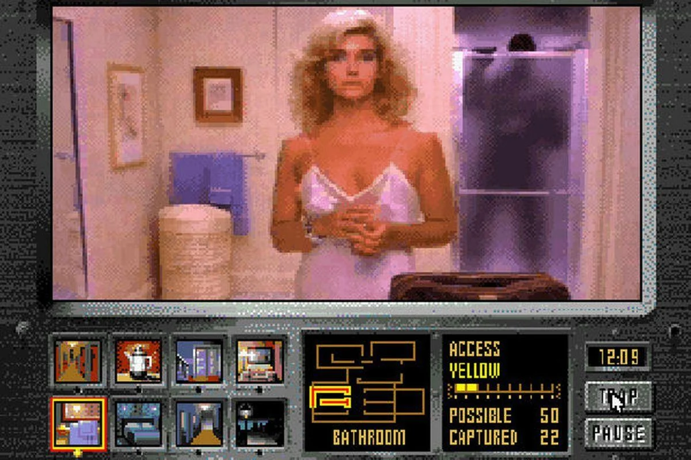
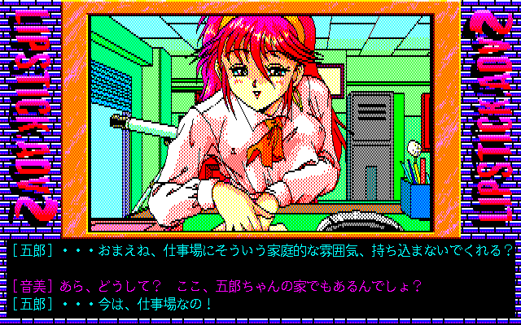

The last time I heard about Full-Motion Video (FMV) games was about a decade ago. Back then, I was running Windows Vista on an HP Slim equipped with an Athlon x64 processor, one of the few capable of supporting this finicky OS. I remember spending hours searching for a very specific list: that of Sega CD games available via torrent.

My goal was clear: burn as many titles as possible onto freshly acquired blank discs. *Night Trap*, *Double Switch*, *Road Avenger* — These games mixed sometimes soporific rail shooting mechanics with pre-recorded cinematics that exuded a quaint charm. The video quality of the Sega CD, although rudimentary by today's standards, evoked in me a strange nostalgia — that of an era I had never truly known.

For me, the FMV genre has always been tied to that temporal bubble: a phenomenon born in the particular context of a console add-on sold in only [2.2 million copies](https://www.videogamehistory.com/sega-cd-sales). Yet, this genre didn’t disappear. On the contrary, it survived and even reinvented itself thanks to modern technologies. Today, FMVs are experiencing a true revival, particularly in a flourishing form emerging from East Asia: South Korea, Japan, [China](https://www.tap.io/article/fmv-games-in-china)… An industry driven by both amateurs and professionals has specialized in this genre once thought outdated, but paradoxically, it has never prospered as much as it does now.

## **A Modern Boom in a Niche Market**

The alternative video game market has seen remarkable growth since the early 2010s. More and more players are seeking experiences outside of AAA blockbusters, favoring works that explore innovative mechanics or narratives. [FMVs meet this demand](https://www.gamasutra.com/view/news/284736/The_Resurgence_of_FMV_Games.php) by combining the interactivity of video games with cinematic aesthetics. This rediscovery also fits into a broader trend of retro media rehabilitation: genres like visual novels or point-and-click games are also experiencing a renaissance, fueled by nostalgia and curiosity among modern players.

The numbers illustrate this growing enthusiasm. For instance, *Her Story* (2015), developed by Sam Barlow, was praised by critics for its fragmented and interactive narrative approach, surpassing [**400,000 copies**](https://www.polygon.com/2015/6/24/8837445/her-story-review) sold in just a few months. Similarly, *[Five Dates* (2020)](https://www.eurogamer.net/articles/2020-11-five-dates-review), despite its modest budget, attracted attention thanks to its use of real actors and footage filmed during the COVID-19 lockdown.

This boom contrasts sharply with the classic productions of the 1990s, where FMVs were often seen as awkward technological curiosities. At the time, titles like *Night Trap* or *Sewer Shark* suffered from rigid pre-recorded sequences and limited interactivity, which hindered their immersion. Today, FMVs benefit from modern technologies (high-definition video compression, smooth streaming) and a more forgiving audience when it comes to narrative imperfections, allowing the genre to [renew itself](https://www.gamesradar.com/fmv-games-history/).

## **A Unique Gameplay Loop**

FMVs rely on minimal but strategic interaction. Unlike traditional video games, where the player directly controls the action, FMVs offer a passive experience punctuated by narrative choices. These choices, often presented in the form of Quick Time Events (QTEs) — contextual actions requiring a quick response from the player — slightly or strongly influence the plot, depending on the game’s ambition.

For example, in *Her Story*, the loop consists of navigating a video database to reconstruct a fragmented plot. Each clip watched reveals clues that guide the player toward new leads, creating a unique narrative exploration dynamic. In more linear titles like [*The Shapeshifting Detective*](https://www.metacritic.com/game/pc/the-shapeshifting-detective), the player's choices mainly affect character relationships, but rarely the final outcome, except to unlock alternative endings.

FMVs are intrinsically limited by their pre-recorded nature. Any potential action or decision must be anticipated and filmed in advance, which imposes significant constraints on narrative and staging. For instance, [*The Shapeshifting Detective*](https://www.gamespot.com/articles/shapeshifting-detective-interview/) requires multiple versions of the same scene to reflect the protagonist’s different transformations, thus increasing production costs.

Despite these limitations, developers often turn these constraints into creative opportunities. In *Five Dates*, light humor and natural dialogue compensate for the lack of deep interactivity, turning its pre-recorded sequences into romantic comedy moments. Similarly, [*Immortality* (2022)](https://www.ign.com/articles/immortality-review) uses cinematic editing techniques to blur the player’s expectations, introducing visual search mechanics that constantly renew the experience.

## **A Diverse Audience**

The FMV audience is varied, ranging from 1990s nostalgics to adult content enthusiasts. Some players seek an immersive experience close to cinema, while others prioritize playful interactions or mature content. This diversity complicates the creation of FMVs that can appeal to everyone.

While some FMVs flirt with adult themes, they often avoid explicit content. For example, *Five Dates* uses humorous innuendos to avoid nudity or suggestive scenes, turning the harem trope into a light comedy that moves away from sensuality. This contrasts with bolder attempts like *Who Pressed Mute on Uncle Marcus?*, which struggles to find its audience due to its irreverent tone or controversial content.

Narrative choices directly influence the critical and commercial reception of FMVs. Games that opt for subtle suggestions often receive better critical recognition, as they maintain a certain narrative elegance. In contrast, those that focus on explicit content risk becoming ridiculous or uncomfortable, thus harming their immersion.

## **The Harem Trope and Amateur vs Professional Production**

The harem trope in video games has its roots in the [1980s Japanese visual novels](https://www.visualnoveldatabase.com/history), where multiple relationships and romantic quests were recurring themes. Introduced to FMVs in the West through titles like *Night Trap*, this trope gradually became a cornerstone of the genre.

Although popular, this trope is often criticized for its predictability. Games like *Five Hearts Under One Roof* manage to subvert these expectations with humor and stereotypical but lovable characters. On the other hand, *Immortality* tries to distance itself by exploring disorganized and androgynous relationships, offering a more nuanced perspective on romantic dynamics.

The difference between amateurs and professionals mainly manifests in budgets and resources. While professional studios may invest up to **€500,000** in an ambitious FMV, amateurs often work with modest budgets, funded through [Kickstarter](https://www.kickstarter.com/discover/categories/games) or personal savings.

Despite their limited means, amateurs often manage to innovate through original ideas. For example, *The Shapeshifting Detective* uses time-loop mechanics to create a unique narrative experience. In contrast, professional productions sometimes adopt conservative formulas to maximize their chances of commercial success.

---

## **Conclusion: A Genre in Transformation**

FMVs, far from being a relic of the past, continue to evolve and captivate a new generation of players. Thanks to technological and narrative innovations, this once marginalized genre has reinvented itself, skillfully blending cinema and interactivity. Whether through bold independent productions or ambitious professional projects, FMVs prove that it’s possible to push the boundaries of an apparently restrictive format.

As the video game industry continues to diversify, FMVs occupy a unique place, offering both intimate and experimental experiences. Perhaps we will see even bolder FMVs in the future, gradually emerging from the niche adult market?

<mark> - yaro </mark>
