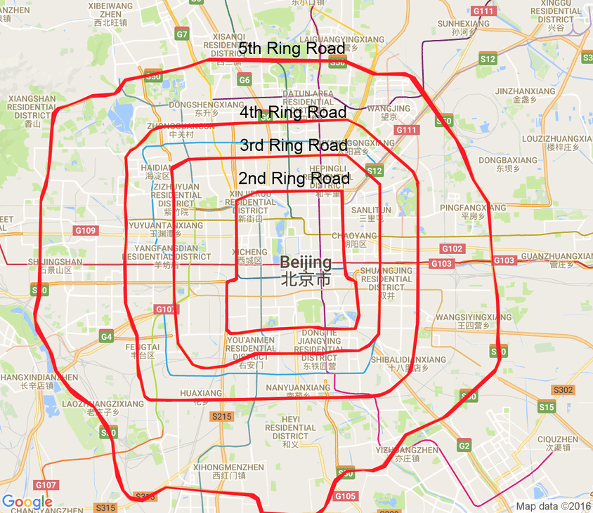
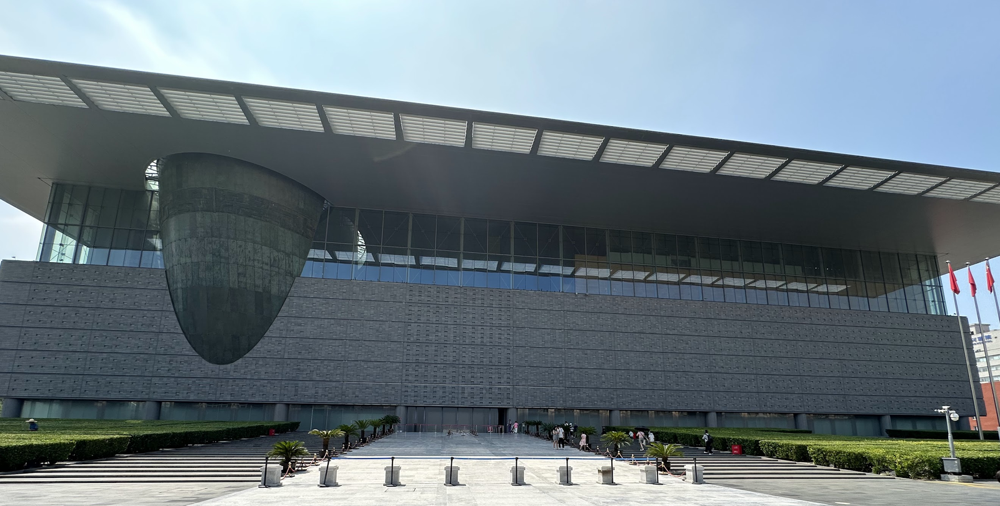
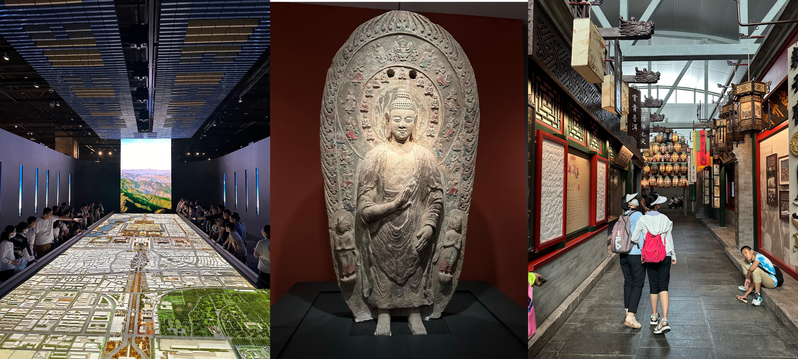
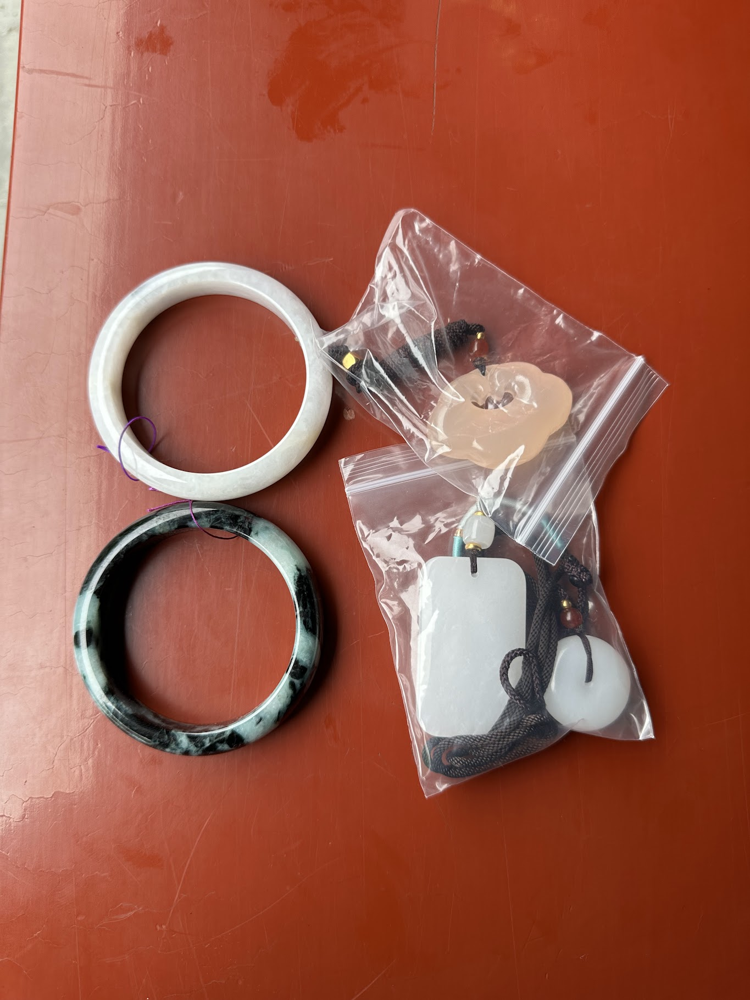
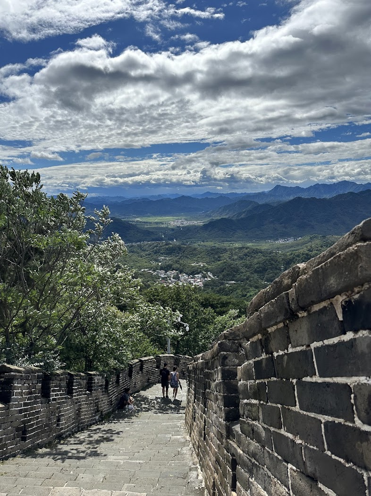
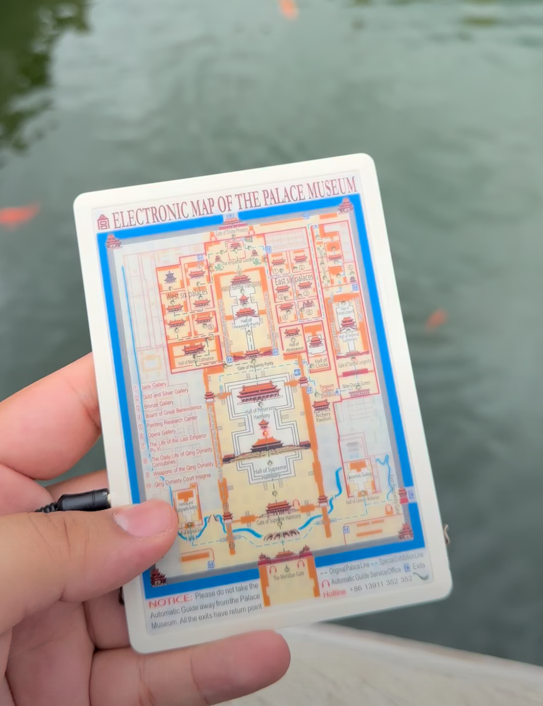

## Day 1: Arrival in Beijing

This wasn't my first time in Beijing, and I hope it won't be my last. I vividly recall my first voyage to the Imperial City; my high school Mandarin teacher organized yearly school trips to Beijing, and that year we had a very different plan than the previous ones.

In an attempt to revisit what I had seen during my first time in Beijing, explore my newfound passion for tea, and get my Mandarin back to work, I decided to come back for a 10-day trip.

After my arrival, I met a friendly English teacher who was headed in the same direction as I was in Beijing, so we shared our taxi fare.

I decided to book a capsule hostel of sorts, though it was much more traditional in nature. Three beds were orthogonally arranged in a single room, with enough space in both the bed and the closets to handle any storage necessities.

It was definitely a surprising experience at first, but as the trip went on, I came to love this dorm-like atmosphere. The daily interactions with people in my room and at the reception made me feel at home. And while people in Beijing make a significant effort to accommodate tourists, they also tend to speak Mandarin first (for which I am very grateful) and then try their best to speak some English if they can.

At 3 am, I was finally able to get some well-deserved shut-eye, the jet lag having gotten the best of me.
  
## Day 2: 您好北京!
### Hello Beijing!

After waking up, I immediately headed outside to see what the city looked like. A few minutes of walking led me to the 马草河 (Mǎcǎo River) that led to a metro station.

Multiple signs around the neighborhood gave directions to the Line 4 马家堡 (Mǎjiāpu) metro station, between the 3rd and the 4th rings.

**_N.B: Perhaps this deserves some explanation; Beijing is often divided into (now) 6 rings. Do not be fooled by online maps—the city is absolutely massive. It's home to over 21 million citizens. Anything beyond the 6th Ring is pretty much outside Beijing._**

Majiapu was my first direct encounter with the city's public transportation system, and it certainly exceeded my expectations for such a large city's system. Beijingers are organized. 5元 [_(yuán)_](https://en.wikipedia.org/wiki/Yuan_(currency)) will get you anywhere around the city, that's 70¢ in [freedom units](https://en.wiktionary.org/wiki/freedom_units).

First stop was 永定门 (Yǒngdìngmén), or so I thought.
Rather quickly, I realized the [Gate of Perpetual Peace](https://en.wikipedia.org/wiki/Yongdingmen) was going to stay closed for a while. An hour of Chinese heat atop my head was enough to make me stop making rounds around the park surrounding the gate and determine that no one was present.

I happened to arrive at one of the very rare moments when the park was unfortunately closed.

Nevertheless, I walked all the way to a nearby market where I ordered a DiDi taxi. They're very convenient as well as very cheap, making them the best tool a tourist has to go around the city. I decided, once in the car, that my next stop would be [马连道](https://english.visitbeijing.com.cn/article/47ONH2QkjVX) _(Mǎliándào)_.

This is the tea avenue of Beijing, and if I'm being perfectly honest, it's one of the main reasons I went back to China.

I had some great tea with lots of merchants, most of them being incredibly friendly and understanding of my poor level of Mandarin, and we had great discussions overall.

Some tea cakes were 25+ years old! Or so the merchants said... I admit, for most of the tea I've tried, I found their whites too subtle and their greens too bitter, but the Pu'Erhs? Absolutely mind-blowing.

I didn't want most of my travel budget to disappear, however; this *was* the first day of my voyage after all. So I contained myself, bought a total of 200g of tea, and decided that the tea market wasn't enough for me. I needed a [show](http://laosheteahouse.com/article/221.html)!

And a show I got, friends, at the 老舍 Teahouse! I would love to show you some footage of what the show is like, but out of respect for the incredible late-night show's artists, I would much rather you explore this if you ever go to Beijing. Trust me, the almost magical jasmine tea mixed with the theatrical shows is absolutely worth your money (don't forget to buy some jasmine tea from the gift shop!).
  
## Day 3: Tiananmen and Pandas 🐼!

Getting into the historic [Gate of Heavenly Peace](https://en.wikipedia.org/wiki/Tiananmen_Square) (天安门广场) now requires reservations at least a day prior. Thankfully, before midnight, in bed, my brain suddenly remembered that, and I booked for the very next day.

After arriving at the square, I walked into the [Meridian Gate](https://en.wikipedia.org/wiki/Meridian_Gate) and realized that to get into the famed [Forbidden City](https://en.wikipedia.org/wiki/Forbidden_City) I, **again**, needed to get a reservation, and the only one available was on the 10th and last day of my trip.

I kept walking to the left of the [Meridian Gate](https://en.wikipedia.org/wiki/Meridian_Gate) and exited through 东华门 _(Dōnghuámén)_, literally the Eastern Chinese Gate, and went outside to get a taxi.

#### _N.B: Interestingly, I knew 华 (huá) as meaning glorious or magnificent, as well as, due to its similarity to the character 花 (huā), flower. It seems, however, that it also refers to China (ex: 华人 | Chinese People，中华 | Chinese Nation)._

I arrived at the entrance of the Beijing Zoo. This was part of my previous trip with my Mandarin class as well, and I recalled rather well where everything was.

  
## Day 4: Beihai Park and Performing Arts!

We're headed for the 北海北 (Běihǎi Běi) station, literally Northern Lake (North), where we'll access the 北海 Park.

After standing outside for a bit, due to my ticket starting at noon (I got there at 9 am), I finally got into the famous Northern Park. At its center is an island, atop of which lies the [White Pagoda](https://en.wikipedia.org/wiki/Miaoying_Temple).

The walk took some time; I can't even explain how big the park itself is. Access to the island is possible via both a ferry and land. Walking along the Beihai Lake, I seemed to have missed the Ferry, and I thus had to walk about 1.5km to be able to access the "Round City" Gate.

I had the chance to look at many landmarks before getting there, thankfully: the miniature Western Paradise, the Gardens of Economic Plants, and the Wanfo Tower.

My arrival at the island was via the Yong'an Bridge (永安), literally "Bridge of Eternal Peace." Getting to the Pagoda was a matter of walking up the long stairs that brought you to the top of the island. Before that, however, my attention was drawn to a little humble shop that just said "茶" (cha, tea). I entered what I expected to be a shop, only to find a teahouse. I saw an elderly man making his tea grandpa style: it was the owner.

Seeing the menu first scared me due to how expensive the propositions were, but truly, after thinking about it, it was reasonable. About 40元 got me a delicious "Jasmine and Peach" Tea. I was shocked to see grandpa style being the common technique around Beijing. I suppose I overestimated how common Gongfu style was.

I was now ready to get to the top of this island. After much walking, I finally saw the Pagoda itself.

Paying a 20元 fee allowed me to see both the monument itself and the neighboring structures that were proof of the historic rule of the Qing over the Imperial City.

The architecture was somewhat obviously different from what the Han were used to making. The Qing seemed to have taken much pride in the idea of a multicultural Chinese rule, and their art showed as much.

It was now time for me to go back through the very bridge I came from. Walking back, I stopped by a 回 (Hui) ethnic restaurant where I got some noodles, and then I decided to head towards Jingshan Park (景山).

This was formerly a private Imperial Garden attached to the Forbidden City. It had bonsais everywhere; it felt more akin to a botanical garden than a simple park. That little escapade made me think about what I should do next. I remembered going to a Chinese Opera show when I was younger, so I thought I should head towards the [National Center for the Performing Arts](https://en.chncpa.org).

This place was huge! I couldn't find any translated Chinese Opera shows, but I decided to see the monthly NCPA choir's show! This was a magical experience to say the least: lots of different languages and cultural songs, a touch of fun at the end with some cartoon openings being sung (which wasn't specified in the planning, so it was extra cool!), and just overall incredible range and talent from everyone involved. The atmosphere was definitely very classy, but not in a bourgeois kind of way. It was more of somewhere you came to well-dressed, which surely was not my case at the time.

Getting home was a matter of taking the metro connected to the NCPA and stopping at Majiapu!
  
## Day 5: Capital Museum!

On the 5th day, I decided to take a much freer approach to my day by exploring a place I had seen before but that would still be an entire day's worth of entertainment.

So my thoughts directly went to Beijing's [Capital Museum](https://en.wikipedia.org/wiki/Capital_Museum). This place is ridiculously big. The picture you're seeing is a [Fisheye](https://en.wikipedia.org/wiki/Fisheye_lens) I've taken from as far as I possibly could without getting on the nearby highway.
Needless to say, if the exterior is any indication of the contents of the edifice, I will most definitely get my day's worth.

The building itself is 6 stories tall and contains a basement, with both temporary exhibition areas and a permanent one.

Of course, exploring every single one of the levels here would be counterproductive. Instead—making this day quite short in writing—I will give you a selection of pictures I took from the museum!

There's lots to say about the Museum's structure and scale. It starts at the birth of the [Chinese civilization](https://en.wikipedia.org/wiki/History_of_China) and goes up until the [Cultural Revolution](https://en.wikipedia.org/wiki/Cultural_Revolution). It covers everything in between with much detail, with of course a more nuanced account of the Qing's arrival to power. The Museum provides audio guides for 20元 in both English and Mandarin, though I suppose other languages are perhaps available? This is one of the more accessible museums in the Capital, as it doesn't require any reservations, and if any **are** somehow required, there would be same-day availability.

This is definitely a must-see for any Chinese history fan! I of course took many more pictures, but in an attempt to keep enough surprises for you in case you wish to visit, I have only shown what I found most interesting.
  
## Day 6: Jade Market and Temple of Heaven!

The first order of business that day was trying to buy jade for my friends and family. While the stone may not seem that valuable to outsiders, I thought that getting something this culturally significant for my relatives was an absolute must.

It was also an amazing way of honing my Mandarin skills, looking at prices and whispering 太贵了 at any occasion to make the sellers go for less.

I ended up going to the [Panjiayuan](https://www.panjiayuan.com/html/en.html) (潘家园) Antique Market and got some 88 CNY C-Grade jade bracelets along with what were very obviously quartz necklaces.

After a little shopping, it was time for me to head to the [Temple of Heaven](https://en.wikipedia.org/wiki/Temple_of_Heaven).

Walking along the main entrance led me to a large park and an [Exhibition of Cultural Relics](https://whc.unesco.org/en/list/881/).

After getting lost for a bit, I was finally atop a large structure that was the western gate to the [Temple](https://en.wikipedia.org/wiki/Temple_of_Heaven) itself.

As I was going around the edifice, rain started pouring in. The echo of the rain within the chambers resembled a rain drum singing—it was truly beautiful.

The park itself is gigantic, and the [Temple of Heaven](https://en.wikipedia.org/wiki/Temple_of_Heaven) is only a small part of it.

These photos are only a fraction of all of the intricate art and design contained within the Imperial walls. And even at that time, I understood that the [Forbidden City](https://en.wikipedia.org/wiki/Forbidden_City) had significantly more curiosities to share with us later on.
  
## Day 7: 798 and CapitaMall!

Of all the places I went to when I first came to Beijing, the [798 Art Zone](https://en.wikipedia.org/wiki/798_Art_Zone) was most definitely the most memorable of the bunch. I specifically remember thinking about how peaceful the artists seemed, painting in their workshops surrounded by the winter air.

The first thing I saw was a large board on which was written "本国宝级", National Level Treasure ?!

Indeed, the full text translated to "日本国宝级经典动画," "Japan's National Treasure-Level Classic Anime." I thus paid 35元 and got into the building. It was an exhibition of [cels](https://en.wikipedia.org/wiki/Cel) from every manga classic you can think of. 

Along the walls, many had drawn some of their favorite characters and spoke about their love for the medium!
Included with the price of the ticket was an exhibition of [Inoue Naohisa](https://en.wikipedia.org/wiki/Naohisa_Inoue)'s art, a very influential fantasy artist who created much of the references and background art for Studio Ghibli's ["Whisper of the Heart"](https://en.wikipedia.org/wiki/Whisper_of_the_Heart).

Besides the art exhibition was a little pottery shop that sold absolutely beautiful teaware. Here are some of the pieces I got.

A small bookshop nearby also sold some rather interesting books at a good price. I got the latest Ghibli storybook and Xi Jinping's ["The Governance of China"](https://en.wikipedia.org/wiki/The_Governance_of_China), which I have used, in part, to write my article ["A Contrasted China: Power, Policy, and the Western Narratives."](https://skoomaden.me/posts/contrasting_china_brown_economy/).

Another nearby shop was a teashop that specialized in aged teas from Yiwu, Zhejiang. I had the chance to chat a bit with a young teashop owner who explained to me some concepts of [Cha Qi](https://rishi-tea.com/blogs/journal/cha-qi-tea-drunk?srsltid=AfmBOordGI7hG6-Rp609KZAC74vmxVXLXCcPEiC0WQahHTFrlSEaCCKo) (茶气), which I had trouble understanding as a foreigner. It was a very interesting experience drinking tea with someone with such knowledge of the art.

While I was on the road to go back home, my eyes glanced upon a nearby mall I hadn't noticed yet. It didn't seem large or impressive in any way from the outside, but one step inside completely changed my perspective. This mall was a 凯德MALL, or [CapitaMall](https://en.wikipedia.org/wiki/CapitaLand) in English—part of a larger Singaporean mall chain.

What I saw there would be tough to compile, but let's just say my [WeChat Pay](https://en.wikipedia.org/wiki/WeChat_Pay) really suffered through my expedition there. 

After having some spicy beef noodles and getting some gifts for my friends, I went back home for the day!

  
## Day 8: Parkview Green and Zhongguancun!

Being as impressed as I was by the CapitaMall, I looked up the best malls in Beijing, and a common name was [Parkview Green](https://parkviewgreen.com/en/). I also wanted to get myself a cheap phone, and for that, no looking up was needed—I knew exactly where I had to go.

And that place is [Zhongguancun](https://zh.wikipedia.org/zh-hans/%E4%B8%AD%E5%85%B3%E6%9D%91) (中关村). Right by the metro station with the same name on Line 4 is a massive mall filled with small electronics shops. I ended up getting myself a 500元 burner android phone.

Nearby was ["The Place"](https://www.theplacebeijing.com/), an impressive both outdoors and indoors mall, across from which was [Parkview Green](https://parkviewgreen.com/en/)!

I walked quite a bit, but the mall was huge in scale. I hope the pictures capture this as efficiently as my eyes perceived it. The entire mall was built by what seems to be a rich fan of the arts—I mean, there are literal [Dalí](https://en.wikipedia.org/wiki/Salvador_Dal%C3%AD) pieces here. I spent quite some time there before taking a DiDi back home!

  
## Day 9: The Great Wall of China!

As I got out of my hostel room, I only had one thing in mind: The Great Wall. I wanted to go to the Great Wall.
I called a DiDi, and off we went to [MuTianYu](https://en.mutianyugreatwall.com/)'s Great Wall. Little did I know that a two-hour ride was what awaited me.

At my arrival, lots of greenery greeted me. This was the furthest the DiDi would take me; I had to take a shuttle bus and a cable car up the mountain to get to this part of the Great Wall.

I don't think anything could've prepared me for both how beautiful the scenery was going to be and how tough it was to walk around the wall. Not bringing any water was **not** a good idea on my part, I admit.

After 3 hours of exhaustion and feeling a bit faint, I thought it was wiser for me to get back to Majiapu.

  
## Last Day: Donghuamen Subdistrict and Forbidden City!

This is it, the last day.
Nothing more fitting than to spend it at the city's main event, the [Forbidden City](https://en.wikipedia.org/wiki/Forbidden_City).

Upon arrival, I was given a tour guide which, for some reason, was set to French. Since that **is** my native language, I admit it was somewhat of a pleasant surprise. Not sure how I would've reacted if I was from another nationality though, haha!

I wouldn't do the affront of trying to explain the entirety of the [Forbidden City](https://en.wikipedia.org/wiki/Forbidden_City) to you. It's massive, both in size and significance. I truly hope you will one day visit it, so to avoid spoiling any impressive details, I'll just say this: you **must** go see it yourself one day.

Walking past the Eastern Gate (lit. Donghuamen), I stumbled upon a place I had seen on no tourist guide so far, which was surprising because it is the most impressively modern place I went to so far.

There were many malls around the Donghuamen Eastern Gate, a main boulevard connecting them all together. I would enter the smallest of entrances to be led into giant underground malls, filled with passionate Beijingers who seemed to have an innate knowledge of the intricate passageways connecting the malls, like a thin thread of well-held-together fabric.

One such underground mall is connected to the easternmost metro station!
This specific mall was filled with anime merch and shops, and cosplayers filming themselves doing [Douyin](https://zh.wikipedia.org/zh-hans/%E6%8A%96%E9%9F%B3) dance moves! It was very fun!

This was my last stop before a rather sad final trip to my hostel, and then to the [Beijing Daxing International Airport](https://en.wikipedia.org/wiki/Beijing_Daxing_International_Airport)... I truly did not want to leave, but I had to. 

  
# Conclusion

My 10-day adventure in China was an incredible journey filled with cultural immersion, new friendships, and unforgettable experiences. From the historic sites of Beijing to the vibrant markets and peaceful teahouses, every day brought something new to discover. This trip not only rekindled my love for Mandarin but also deepened my appreciation for Chinese culture. Whether it was sipping tea with merchants, walking along the Great Wall, or exploring the hidden gems of the city, each moment added a new story to my logbook. I leave China with a heart full of memories and a strong desire to return, and trust me: I will return ! And this time with much more stories to tell you guys on skoomaDen ! 

**Thank you all for reading me, I love you all and wish you a good day, no matter where you all are <3 !**