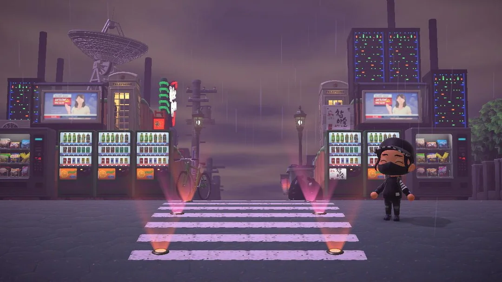

S'il y a bien une chose dont ma copine adore se plaindre, c'est ce à quel point *Animal Crossing: New Horizons* est loin de valoir [New Leaf](https://en.wikipedia.org/wiki/Animal_Crossing:_New_Leaf) . Alors que beaucoup voyaient [New Horizons](https://en.wikipedia.org/wiki/Animal_Crossing:_New_Horizons) comme l'avenir de la franchise, elle est persuadée qu'il lui manque l'âme qui rendait [New Leaf](https://en.wikipedia.org/wiki/Animal_Crossing:_New_Leaf)  si inoubliable. Entre les changements de design et les fonctionnalités manquantes, voici pourquoi elle pense que [New Horizons](https://en.wikipedia.org/wiki/Animal_Crossing:_New_Horizons) est plus une occasion manquée qu'une révolution.

## Mobilier et Personnalisation

Bien que [New Horizons](https://en.wikipedia.org/wiki/Animal_Crossing:_New_Horizons) permette aux joueurs de placer du mobilier à l'extérieur—une fonctionnalité que les fans réclamaient depuis longtemps—il manque quelque chose. [New Leaf](https://en.wikipedia.org/wiki/Animal_Crossing:_New_Leaf)  offrait une plus grande variété de collections de meubles, beaucoup plus cohérentes et soigneusement conçues. <mark>C’est surprenant, mais [New Leaf](https://en.wikipedia.org/wiki/Animal_Crossing:_New_Leaf)  avait tout simplement de meilleures options de mobilier.</mark> Et pour couronner le tout, [New Leaf](https://en.wikipedia.org/wiki/Animal_Crossing:_New_Leaf)  proposait des pièces plus grandes, offrant aux joueurs plus de liberté pour décorer l’intérieur. Dans [New Horizons](https://en.wikipedia.org/wiki/Animal_Crossing:_New_Horizons), on a l'impression qu'ils ont ajouté des objets au hasard, sans la même attention aux détails. Le mobilier extérieur est agréable, mais pourquoi sacrifier la qualité des ensembles intérieurs ?

Oui, [New Horizons](https://en.wikipedia.org/wiki/Animal_Crossing:_New_Horizons) facilite la personnalisation avec des outils comme la terraformation et la création de falaises, mais pour elle, l'expérience est vide comparée au charme authentique qu’offrait [New Leaf](https://en.wikipedia.org/wiki/Animal_Crossing:_New_Leaf) . <mark>Ce n'est pas juste une question de rendre une île jolie ; il s'agit de créer quelque chose de personnel et vivant, et [New Horizons](https://en.wikipedia.org/wiki/Animal_Crossing:_New_Horizons) rate ce coche.</mark>

## De la Personnalité au Néant

L'une des différences les plus frappantes réside dans la manière dont les habitants interagissent avec le joueur. Dans [New Leaf](https://en.wikipedia.org/wiki/Animal_Crossing:_New_Leaf) , les conversations semblaient plus spontanées, avec des habitants qui exprimaient une gamme d'émotions—parfois brutales, parfois affectueuses. Dans [New Horizons](https://en.wikipedia.org/wiki/Animal_Crossing:_New_Horizons), tous les habitants semblent avoir adopté le même ton enjoué et répétitif, et leurs bizarreries ont disparu. L'unicité qui rendait chaque personnage spécial dans [New Leaf](https://en.wikipedia.org/wiki/Animal_Crossing:_New_Leaf)  a été diluée.

<mark>La tendance des "échanges d'habitants" dans [New Horizons](https://en.wikipedia.org/wiki/Animal_Crossing:_New_Horizons) a dévalorisé toute l'expérience.</mark> Échanger des habitants comme des objets de collection juste pour obtenir le plus mignon ? Cela enlève le cœur du jeu. Les habitants ne font plus partie d'une communauté riche ; ils sont devenus des trophées. Cette dynamique prive le jeu de son essence émotionnelle.

## De Maire à Gestionnaire de Tâches

Dans [New Leaf](https://en.wikipedia.org/wiki/Animal_Crossing:_New_Leaf) , être maire n'était pas qu'un titre—cela vous donnait une importance. Vous aviez un bureau, un sentiment de responsabilité, et chaque décision semblait avoir un impact. Dans [New Horizons](https://en.wikipedia.org/wiki/Animal_Crossing:_New_Horizons), on fait semblant que vous êtes un simple habitant, mais en réalité, vous contrôlez toujours tout. Cela semble juste moins significatif. <mark>[New Horizons](https://en.wikipedia.org/wiki/Animal_Crossing:_New_Horizons) a transformé ce qui était un rôle significatif en une simple liste de tâches.</mark> Fini le sentiment de diriger votre ville ; vous gérez désormais un projet.

## Commerces et Progression

Le quartier commerçant de [New Leaf](https://en.wikipedia.org/wiki/Animal_Crossing:_New_Leaf)  était vibrant, évoluant avec le temps. Les boutiques se modernisaient, les interactions s'enrichissaient, et la progression était gratifiante. [New Horizons](https://en.wikipedia.org/wiki/Animal_Crossing:_New_Horizons) est tout le contraire. Vous êtes coincé avec seulement trois magasins, et il n'y a aucun sentiment de croissance.

Où est le sens de la communauté ? Pas de club, pas de discothèque—rien ne semble vivant. <mark>L'expérience d'achat est statique et sans vie, bien loin de la ville dynamique que [New Leaf](https://en.wikipedia.org/wiki/Animal_Crossing:_New_Leaf)  nous offrait.</mark> Vous pouviez même faire des dons avant—maintenant, vous êtes laissé avec un sentiment de futilité. Et sans système d'amélioration, les boutiques semblent être un simple ajout, sans réelle importance.

## Les Sons de la Stagnation

Bien que [New Horizons](https://en.wikipedia.org/wiki/Animal_Crossing:_New_Horizons) ait introduit quelques nouvelles pistes correctes de KK Slider, la musique horaire que vous entendez tout au long de la journée semble sans inspiration. Dans [New Leaf](https://en.wikipedia.org/wiki/Animal_Crossing:_New_Leaf) , chaque morceau ajoutait au charme de la ville. [New Horizons](https://en.wikipedia.org/wiki/Animal_Crossing:_New_Horizons) essaie de créer une ambiance insulaire, mais cela ne prend pas. Seuls quelques morceaux se démarquent, le reste est oubliable.

La sortie du jeu a également semblé incomplète. Des fonctionnalités comme Kap’n et Katrina ont été ajoutées des mois après le lancement, et ce flux de contenu au compte-gouttes donnait l'impression que le jeu était toujours en retard. <mark>On avait l'impression qu'ils réagissaient aux plaintes plutôt que d'offrir une expérience complète dès le début.</mark>

<iframe width="560" height="315" src="https://www.youtube.com/embed/Q-INScb0vxM?si=D6tDPUxQtrSDkUfO" title="YouTube video player" frameborder="0" allow="accelerometer; autoplay; clipboard-write; encrypted-media; gyroscope; picture-in-picture; web-share" referrerpolicy="strict-origin-when-cross-origin" style="width: 100%; height: 472.5px" allowfullscreen></iframe>

## Multijoueur et Mini-jeux

Dans [New Leaf](https://en.wikipedia.org/wiki/Animal_Crossing:_New_Leaf) , le multijoueur était engageant grâce aux mini-jeux sur l’île de Tortimer. [New Horizons](https://en.wikipedia.org/wiki/Animal_Crossing:_New_Horizons) ? Le multijoueur semble inutile. Il n'y a pas de réelle interaction, pas d'expériences partagées—juste des vagabondages sur d'autres îles sans but réel. Les mini-jeux étaient une énorme perte, et sans eux, le multijoueur semble creux.

## Des Points Positifs Parmi les Défauts

Le système de fabrication, bien que n'étant pas partie intégrante de la formule originale d’*Animal Crossing*, ajoute une couche d’engagement. Et le musée ? Absolument magnifique. <mark>C’est un domaine où [New Horizons](https://en.wikipedia.org/wiki/Animal_Crossing:_New_Horizons) brille véritablement.</mark> Le design du musée est époustouflant, et l'ajout de Céleste, avec ses recettes d'étoiles et ses soirées d'observation des étoiles, lui donne un véritable rôle, contrairement aux jeux précédents.

## Le Bac à Sable : Trop de Liberté, Pas Assez de Connexion

Au fond, [New Horizons](https://en.wikipedia.org/wiki/Animal_Crossing:_New_Horizons) ressemble plus à un jeu bac à sable qu'à une expérience authentique d’*Animal Crossing*. Il est devenu un jeu axé sur les tâches où vous devez créer vos propres objectifs. Dans [New Leaf](https://en.wikipedia.org/wiki/Animal_Crossing:_New_Leaf) , la connexion avec votre ville était naturelle. Vous aviez l’impression de faire partie de quelque chose de vivant et en pleine croissance. <mark>[New Horizons](https://en.wikipedia.org/wiki/Animal_Crossing:_New_Horizons) transforme cela en un jeu de gestion de projet où vous êtes le gestionnaire capitaliste.</mark>

## Qu'est-il arrivé à l'Âme d’Animal Crossing ?

[New Horizons](https://en.wikipedia.org/wiki/Animal_Crossing:_New_Horizons) a perdu quelque chose d’important : son esprit. [New Leaf](https://en.wikipedia.org/wiki/Animal_Crossing:_New_Leaf)  avait du cœur—des lettres de votre père, l’arbre de la ville grandissant comme symbole de vos progrès. Maintenant, ces petites touches ont disparu. Il n’y a plus d'ancre émotionnelle. <mark>Là où [New Leaf](https://en.wikipedia.org/wiki/Animal_Crossing:_New_Leaf)  ressemblait à une communauté vivante et vibrante, [New Horizons](https://en.wikipedia.org/wiki/Animal_Crossing:_New_Horizons) ressemble à une liste de tâches à accomplir.</mark> L'arbre, les lettres, ces petites choses qui comptaient, manquent à l'appel. Ce qui nous reste est une belle mais creuse coquille.

En fin de compte, [New Horizons](https://en.wikipedia.org/wiki/Animal_Crossing:_New_Horizons) est parfait pour ceux qui aiment concevoir des îles, mais pour des fans comme ma copine qui cherchent cette connexion plus profonde avec leur ville et leurs habitants, il échoue. C’est un jeu pour les bâtisseurs et les gestionnaires, pas pour ceux qui veulent se perdre dans le charme et la chaleur d’une ville vivante. Et c’est pourquoi [New Leaf](https://en.wikipedia.org/wiki/Animal_Crossing:_New_Leaf)  reste en tête dans son cœur.
