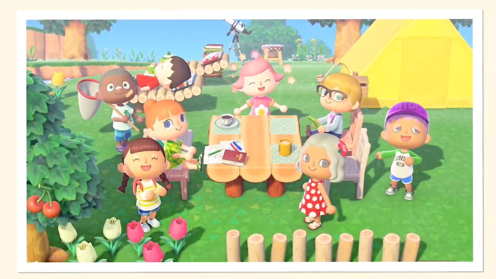

S'il y a bien une chose dont ma copine adore se plaindre, c'est à quel point *Animal Crossing: New Horizons* fait pâle figure face à [New Leaf](https://fr.wikipedia.org/wiki/Animal_Crossing:_New_Leaf). Alors que beaucoup voyaient [New Horizons](https://fr.wikipedia.org/wiki/Animal_Crossing:_New_Horizons) comme l'avenir de la franchise, elle est convaincue qu'il manque l'âme qui faisait de [New Leaf](https://fr.wikipedia.org/wiki/Animal_Crossing:_New_Leaf) une expérience inoubliable. Des changements de conception aux fonctionnalités clés absentes, voici pourquoi elle estime que [New Horizons](https://fr.wikipedia.org/wiki/Animal_Crossing:_New_Horizons) est plus une occasion manquée qu'une révolution.

## Meubles et personnalisation

Bien que [New Horizons](https://fr.wikipedia.org/wiki/Animal_Crossing:_New_Horizons) permette aux joueurs de placer des meubles à l'extérieur – une fonctionnalité tant attendue par les fans – il manque quelque chose. [New Leaf](https://fr.wikipedia.org/wiki/Animal_Crossing:_New_Leaf) offrait une plus grande variété d'ensembles de meubles, beaucoup plus cohérents et bien pensés. <mark>C'est surprenant, mais [New Leaf](https://fr.wikipedia.org/wiki/Animal_Crossing:_New_Leaf) avait tout simplement de meilleures options de meubles.</mark> En plus, [New Leaf](https://fr.wikipedia.org/wiki/Animal_Crossing:_New_Leaf) avait des pièces plus grandes, offrant aux joueurs plus de liberté pour décorer l'intérieur. Dans [New Horizons](https://fr.wikipedia.org/wiki/Animal_Crossing:_New_Horizons), on a l'impression qu'ils ont ajouté des objets au hasard, sans la même attention. Les meubles extérieurs sont agréables, mais pourquoi perdre la qualité des ensembles d'intérieur ?

Certes, [New Horizons](https://fr.wikipedia.org/wiki/Animal_Crossing:_New_Horizons) facilite la personnalisation avec des outils comme la terraformation et la création de falaises, mais pour elle, c'est une expérience vide comparée au charme authentique que proposait [New Leaf](https://fr.wikipedia.org/wiki/Animal_Crossing:_New_Leaf). <mark>Il ne s'agit pas seulement de rendre une île jolie ; c'est la sensation de construire quelque chose de personnel et vivant, et [New Horizons](https://fr.wikipedia.org/wiki/Animal_Crossing:_New_Horizons) rate cet objectif.</mark>

## De la personnalité à la répétition

L'une des différences les plus flagrantes réside dans la manière dont les villageois interagissent avec le joueur. Dans [New Leaf](https://fr.wikipedia.org/wiki/Animal_Crossing:_New_Leaf), les conversations semblaient plus spontanées, avec des villageois exprimant une gamme d'émotions – parfois directs, parfois affectueux. Dans [New Horizons](https://fr.wikipedia.org/wiki/Animal_Crossing:_New_Horizons), tous les villageois semblent adopter le même ton ensoleillé et répétitif, et leurs bizarreries ont disparu. L'unicité qui rendait chaque personnage spécial dans [New Leaf](https://fr.wikipedia.org/wiki/Animal_Crossing:_New_Leaf) a été diluée.

<mark>La tendance du "commerce de villageois" dans [New Horizons](https://fr.wikipedia.org/wiki/Animal_Crossing:_New_Horizons) a dévalorisé toute l'expérience.</mark> Échanger des villageois comme des objets de collection pour obtenir le plus mignon ? Cela retire tout le cœur du jeu. Les villageois ne font plus partie d'une communauté riche ; ils sont devenus des trophées. Cette dynamique prive le jeu de son noyau émotionnel.

## De maire à gestionnaire de tâches

Dans [New Leaf](https://fr.wikipedia.org/wiki/Animal_Crossing:_New_Leaf), être maire n'était pas qu'un titre – cela vous faisait vous sentir important. Vous aviez un bureau, un sentiment de but, et chaque décision semblait avoir de l'importance. Dans [New Horizons](https://fr.wikipedia.org/wiki/Animal_Crossing:_New_Horizons), on fait semblant que vous n'êtes qu'un autre villageois, mais la réalité est que vous contrôlez toujours tout. Cela semble simplement moins significatif. <mark>[New Horizons](https://fr.wikipedia.org/wiki/Animal_Crossing:_New_Horizons) a transformé ce qui était un rôle significatif en une liste de tâches à cocher.</mark> Fini le sentiment de diriger votre ville ; maintenant, vous gérez un projet.

## De villes vibrantes à îles sans vie

Le quartier commerçant de [New Leaf](https://fr.wikipedia.org/wiki/Animal_Crossing:_New_Leaf) était vibrant, évoluant avec le temps. Les boutiques se modernisaient, les interactions devenaient plus profondes, et la progression était gratifiante. [New Horizons](https://fr.wikipedia.org/wiki/Animal_Crossing:_New_Horizons), c'est tout le contraire. Vous êtes coincé avec seulement trois magasins, et il n'y a aucun sens de la croissance.

Où est le sens de la communauté ? Pas de club, pas de discothèque – rien ne semble vivant. <mark>L'expérience d'achat est statique et sans vie, loin de la ville florissante que [New Leaf](https://fr.wikipedia.org/wiki/Animal_Crossing:_New_Leaf) nous offrait.</mark> Vous pouviez même faire des dons avant – maintenant, vous avez l'impression que tout est inutile. Et sans système de mise à niveau, les magasins semblent être une réflexion après coup.

## Les sons de la stagnation

Alors que [New Horizons](https://fr.wikipedia.org/wiki/Animal_Crossing:_New_Horizons) a introduit quelques nouvelles pistes décentes de KK Slider, la musique horaire que vous entendez tout au long de la journée manque d'inspiration. Dans [New Leaf](https://fr.wikipedia.org/wiki/Animal_Crossing:_New_Leaf), chaque piste ajoutait au charme de la ville. [New Horizons](https://fr.wikipedia.org/wiki/Animal_Crossing:_New_Horizons) tente de créer une ambiance insulaire, mais ça ne fonctionne pas. Seules quelques pistes se démarquent, et le reste est oubliable.

La sortie du jeu semblait également incomplète. Des fonctionnalités comme Kap’n et Katrina ont été ajoutées des mois après le lancement, et ce flux de contenu a donné l'impression que le jeu n'était jamais fini, toujours en train de rattraper. <mark>On avait l'impression qu'ils réagissaient aux plaintes plutôt que de proposer une expérience complète dès le départ.</mark>

## Multijoueur et mini-jeux

Dans [New Leaf](https://fr.wikipedia.org/wiki/Animal_Crossing:_New_Leaf), le multijoueur était captivant grâce aux mini-jeux de l'île Tortimer. [New Horizons](https://fr.wikipedia.org/wiki/Animal_Crossing:_New_Horizons) ? Le multijoueur semble inutile. Il n'y a pas de véritable interaction, pas d'expériences partagées – juste une errance sur les autres îles sans but réel. Les mini-jeux étaient une grande perte, et sans eux, le multijoueur semble creux.

Même si beaucoup plus de joueurs peuvent maintenant jouer ensemble, l'expérience est moins connectée. Les excursions sur les îles étaient un moyen amusant de créer des liens avec des amis, et leur absence est cruellement ressentie. <mark>C'est dommage que [New Horizons](https://fr.wikipedia.org/wiki/Animal_Crossing:_New_Horizons) ait raté l'essentiel de ce qui rendait le multijoueur de [New Leaf](https://fr.wikipedia.org/wiki/Animal_Crossing:_New_Leaf) si spécial.</mark>   

## Points positifs malgré les défauts

Le système d'artisanat, bien qu'il ne fasse pas partie de la formule originale d'*Animal Crossing*, ajoute une couche d'engagement. Et le musée ? Absolument magnifique. <mark>C'est un domaine où [New Horizons](https://fr.wikipedia.org/wiki/Animal_Crossing:_New_Horizons) brille vraiment.</mark> La conception du musée est à couper le souffle, et l'ajout de Céleste, avec ses recettes d'étoiles et l'observation des étoiles, lui donne un véritable but, contrairement aux jeux précédents.

## Le problème du bac à sable : liberté sans connexion

Au fond, [New Horizons](https://fr.wikipedia.org/wiki/Animal_Crossing:_New_Horizons) ressemble plus à un jeu de type bac à sable qu'à une véritable expérience *Animal Crossing*. Il est devenu un jeu axé sur les tâches où vous devez créer vos propres objectifs. Dans [New Leaf](https://fr.wikipedia.org/wiki/Animal_Crossing:_New_Leaf), le lien avec votre ville était naturel. Vous aviez l'impression de faire partie de quelque chose de vivant et en pleine croissance. <mark>[New Horizons](https://fr.wikipedia.org/wiki/Animal_Crossing:_New_Horizons) transforme cela en un jeu de gestion de projet où vous êtes le gestionnaire capitaliste.</mark>  

## Qu'est-il arrivé au cœur d'Animal Crossing ?

[New Horizons](https://fr.wikipedia.org/wiki/Animal_Crossing:_New_Horizons) a perdu quelque chose d'important : son esprit. [New Leaf](https://fr.wikipedia.org/wiki/Animal_Crossing:_New_Leaf) avait du cœur – des lettres de votre père, l'arbre de la ville qui grandissait comme symbole de vos progrès. Maintenant, ces petites touches ont disparu. Il n'y a plus d'ancre émotionnelle. <mark>Là où [New Leaf](https://fr.wikipedia.org/wiki/Animal_Crossing:_New_Leaf) ressemblait à une communauté vivante, [New Horizons](https://fr.wikipedia.org/wiki/Animal_Crossing:_New_Horizons) ressemble à une liste de tâches à accomplir.</mark> L'arbre, les lettres, les petites choses qui comptaient ont disparu. Ce qu'il reste est une coquille belle mais sans âme.

En fin de compte, [New Horizons](https://fr.wikipedia.org/wiki/Animal_Crossing:_New_Horizons) est idéal pour ceux qui aiment concevoir des îles, mais pour les fans comme ma copine qui recherchent cette connexion plus profonde avec leur ville et leurs villageois, il ne fait pas le poids. C'est un jeu pour les constructeurs et les gestionnaires, pas pour ceux qui veulent se perdre dans le charme et la chaleur d'une ville vivante. Bien sûr, si vous n'avez pas joué à New Leaf, il serait difficile de comparer sans point de référence, les nouveaux joueurs auraient été perdus. Et c'est pourquoi [New Leaf](https://fr.wikipedia.org/wiki/Animal_Crossing:_New_Leaf) reste le maître incontesté à ses yeux.

<mark>- yaro</mark>
