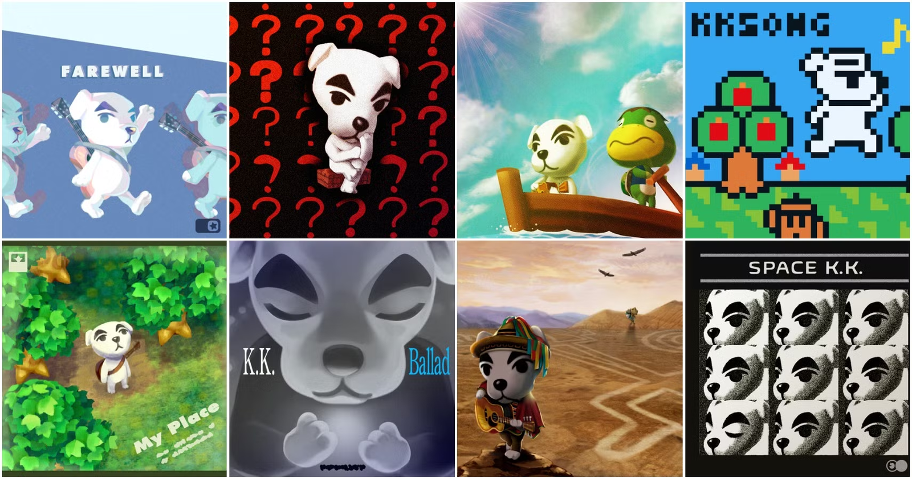

S'il y a bien une chose dont ma copine adore se plaindre, c'est à quel point *Animal Crossing: New Horizons* est en deçà de [New Leaf](https://en.wikipedia.org/wiki/Animal_Crossing:_New_Leaf). Alors que beaucoup ont salué [New Horizons](https://en.wikipedia.org/wiki/Animal_Crossing:_New_Horizons) comme l'avenir de la franchise, elle est convaincue qu'il manque l'âme qui rendait [New Leaf](https://en.wikipedia.org/wiki/Animal_Crossing:_New_Leaf) si inoubliable. Des changements de design aux fonctionnalités clés absentes, voici pourquoi elle pense que [New Horizons](https://en.wikipedia.org/wiki/Animal_Crossing:_New_Horizons) est plus une occasion manquée qu'une révolution.

## Meubles et Personnalisation

Même si [New Horizons](https://en.wikipedia.org/wiki/Animal_Crossing:_New_Horizons) permet aux joueurs de placer des meubles à l'extérieur – une fonctionnalité que les fans réclamaient depuis longtemps – il manque quelque chose. [New Leaf](https://en.wikipedia.org/wiki/Animal_Crossing:_New_Leaf) proposait une plus grande variété de sets de meubles, beaucoup plus cohérents et réfléchis dans leur conception. <mark>Étonnamment, mais [New Leaf](https://en.wikipedia.org/wiki/Animal_Crossing:_New_Leaf) avait simplement de meilleures options de mobilier.</mark> De plus, [New Leaf](https://en.wikipedia.org/wiki/Animal_Crossing:_New_Leaf) avait des pièces plus grandes, offrant ainsi plus de liberté aux joueurs pour décorer l'intérieur.

Certes, [New Horizons](https://en.wikipedia.org/wiki/Animal_Crossing:_New_Horizons) facilite la personnalisation avec des outils comme la terraformation et la création de falaises, mais pour elle, cela reste une expérience vide comparée au charme authentique qu'offrait [New Leaf](https://en.wikipedia.org/wiki/Animal_Crossing:_New_Leaf). <mark>Il ne s'agit pas seulement de rendre une île jolie; il s'agit de ressentir que l'on construit quelque chose de personnel et vivant, et [New Horizons](https://en.wikipedia.org/wiki/Animal_Crossing:_New_Horizons) passe à côté de cet aspect.</mark>

<mark>La tendance à "échanger des villageois" dans [New Horizons](https://en.wikipedia.org/wiki/Animal_Crossing:_New_Horizons) a dévalué toute l'expérience.</mark> Échanger des villageois comme des objets de collection dans le seul but d'obtenir le plus mignon ? Cela enlève tout le cœur du jeu. Les villageois ne font plus partie d'une communauté riche ; ils sont devenus des trophées. Cette dynamique prive le jeu de son essence émotionnelle.

## La dynamique des villageois : de la personnalité à la répétition

L'une des pertes les plus déchirantes dans [New Horizons](https://en.wikipedia.org/wiki/Animal_Crossing:_New_Horizons) est non seulement la façon dont les villageois vous parlent, mais *combien vous pouvez faire avec eux*. Dans [New Leaf](https://en.wikipedia.org/wiki/Animal_Crossing:_New_Leaf), les villageois faisaient partie de votre quotidien de manière plus profonde – vous pouviez jouer à des mini-jeux comme cache-cache, leur demander des services, et même avoir des moments interactifs comme les inviter chez vous. Aujourd'hui, bien que les villageois dans [New Horizons](https://en.wikipedia.org/wiki/Animal_Crossing:_New_Horizons) puissent s'asseoir, lire et faire des exercices, toutes ces interactions semblent superficielles.

<mark>Les activités dynamiques qui donnaient vie aux villageois dans [New Leaf](https://en.wikipedia.org/wiki/Animal_Crossing:_New_Leaf) ont disparu.</mark> Au lieu de participer à des événements uniques, les villageois semblent enfermés dans les mêmes comportements répétitifs, avec peu de variation dans leur routine. Ce manque d'interactions profondes nuit à l'essence même de ce qui rendait *Animal Crossing* spécial – ces moments inattendus et joyeux avec vos villageois qui vous faisaient vous sentir connecté au monde. Maintenant, les interactions ressemblent davantage à des mises en scène qu'à des parties organiques de la vie quotidienne.

<mark>Cet absence de variété dans les conversations prive le jeu de sa profondeur émotionnelle.</mark> Vous ne ressentez plus que vous interagissez avec des personnalités distinctes ayant leurs propres désirs, mais plutôt que vous gérez une population de flatteries programmées. Ce n'est pas qu'une simple régression mineure ; cela altère fondamentalement l'esprit du jeu. Dans une série où la communauté et l'interaction devaient être au cœur de l'expérience, ce changement ressemble à un vidage de ce qui rendait *Animal Crossing* vraiment magique.

## De maire à gestionnaire de tâches

Dans [New Leaf](https://en.wikipedia.org/wiki/Animal_Crossing:_New_Leaf), être le maire n'était pas qu'un titre – cela vous donnait une véritable importance. Vous aviez un bureau, un espace pour planifier, et chaque décision que vous preniez influençait la croissance de votre ville. Vous pouviez lancer des projets d'infrastructures, construire des ponts, et influencer la disposition de votre ville de manière significative. <mark>Le rôle de maire vous faisait sentir essentiel au développement de votre ville, donnant un véritable sens de progression et de but.</mark>

Dans [New Horizons](https://en.wikipedia.org/wiki/Animal_Crossing:_New_Horizons), ils essaient de vous faire sentir comme un autre villageois, mais vous contrôlez toujours tout. Cependant, c'est moins satisfaisant. Vous prenez des décisions, mais il n'y a pas de bureau, pas de projets officiels – juste une liste interminable de tâches. <mark>[New Horizons](https://en.wikipedia.org/wiki/Animal_Crossing:_New_Horizons) a transformé ce qui était autrefois un rôle significatif en une liste de corvées</mark>, donnant l'impression que vous gérez un projet plutôt que de diriger une ville. L'autorité du joueur semble diluée, transformant ce qui devrait être des responsabilités gratifiantes en corvées répétitives.

## Des villes vibrantes aux îles sans vie

Le quartier commerçant de [New Leaf](https://en.wikipedia.org/wiki/Animal_Crossing:_New_Leaf) était vibrant, évoluant avec le temps. Les magasins se modernisaient, les interactions s'intensifiaient, et la progression semblait gratifiante. [New Horizons](https://en.wikipedia.org/wiki/Animal_Crossing:_New_Horizons) est l'opposé. Vous êtes coincé avec seulement trois magasins, et il n'y a aucun sentiment de croissance.

Où est le sens de la communauté ? Pas de club, pas de discothèque – rien ne semble vivant. <mark>L'expérience de shopping est statique et sans vie, un contraste saisissant avec la ville florissante que [New Leaf](https://en.wikipedia.org/wiki/Animal_Crossing:_New_Leaf) nous offrait.</mark> Avant, vous pouviez même faire des dons de vos objets – maintenant, il ne reste qu'un sentiment de vacuité. Et sans système de mise à jour, les magasins semblent être une réflexion après coup.

## Les sons de la stagnation

Bien que [*New Horizons*](https://en.wikipedia.org/wiki/Animal_Crossing:_New_Horizons) ait introduit quelques nouvelles pistes de KK Slider assez décentes, la musique horaire tout au long de la journée paraît sans inspiration. Dans [*New Leaf*](https://en.wikipedia.org/wiki/Animal_Crossing:_New_Leaf), chaque heure avait sa propre bande-son qui contribuait au rythme de la journée et à la connexion émotionnelle. <mark>Dans les deux jeux, la musique façonnait l'atmosphère, mais [New Leaf](https://en.wikipedia.org/wiki/Animal_Crossing:_New_Leaf) donnait à chaque heure une ambiance distincte, ajoutant de la profondeur à votre expérience.</mark>

[*New Horizons*](https://en.wikipedia.org/wiki/Animal_Crossing:_New_Horizons) tente de créer une ambiance décontractée d'île, mais cela ne fonctionne pas. La plupart des morceaux sont oubliables, et seuls quelques-uns ressortent. La sortie du jeu semblait également incomplète. Des fonctionnalités comme Kap’n et Katrina ont été ajoutées des mois après le lancement, ce qui donnait l'impression que le jeu essayait toujours de rattraper son retard. <mark>On avait l'impression qu'ils réagissaient aux plaintes plutôt que de livrer une expérience complète dès le départ.</mark>

## Multijoueur et mini-jeux

Dans [*New Leaf*](https://en.wikipedia.org/wiki/Animal_Crossing:_New_Leaf), le mode multijoueur était engageant grâce aux mini-jeux sur l'île de Tortimer. Ces visites permettaient aux joueurs de participer à des activités amusantes comme des concours de pêche, des chasses aux insectes et même des jeux de labyrinthe, créant ainsi un sentiment d'expérience partagée. <mark>L'interactivité rapprochait les amis, et chaque visite semblait avoir un but.</mark>

[*New Horizons*](https://en.wikipedia.org/wiki/Animal_Crossing:_New_Horizons) ? Le multijoueur semble sans intérêt. Même si davantage de joueurs peuvent désormais rejoindre, il n'y a pas de véritable interaction ou d'activités engageantes à faire ensemble – juste errer sur les îles. L'absence de mini-jeux rend le multijoueur creux. <mark>C'est une occasion manquée de créer des liens significatifs, rendant le multijoueur de *New Horizons* bien moins connecté que celui de [New Leaf](https://en.wikipedia.org/wiki/Animal_Crossing:_New_Leaf).</mark>

## Des points forts malgré les défauts

Le système d'artisanat, bien que nouveau dans la formule *Animal Crossing*, ajoute une couche d'engagement. Cependant, pour les joueurs nostalgiques, l'artisanat semblait inutile – ce n'était pas une partie du charme original. C'est agréable, mais cela ne s'intègre pas toujours avec la simplicité douillette que les fans de longue date adorent.

Quant au musée ? Absolument magnifique. <mark>C'est là que [*New Horizons*](https://en.wikipedia.org/wiki/Animal_Crossing:_New_Horizons) brille vraiment.</mark> Le design est époustouflant, et Céleste a désormais un véritable rôle, offrant des recettes d'étoiles et des opportunités d'observer les étoiles qui n'existaient pas auparavant. Cela lui donnait un rôle plus profond, contrairement aux opus précédents.

## Le problème du bac à sable : Liberté sans connexion

Au fond, [*New Horizons*](https://en.wikipedia.org/wiki/Animal_Crossing:_New_Horizons) ressemble plus à un jeu de type bac à sable qu'à une véritable expérience *Animal Crossing*. La liberté de concevoir votre île est impressionnante, mais cela enlève également le lien que les joueurs avaient avec leurs villes. <mark>Dans [New Leaf](https://en.wikipedia.org/wiki/Animal_Crossing:_New_Leaf), vous aviez l'impression de faire partie de quelque chose de vivant et en pleine croissance, mais *New Horizons* transforme cela en un jeu de gestion axé sur les tâches et les objectifs.</mark>

[*New Horizons*](https://en.wikipedia.org/wiki/Animal_Crossing:_New_Horizons) introduit une dimension capitaliste, où chaque action vise l'efficacité plutôt que de favoriser des liens émotionnels avec votre ville.

## Qu'est-il arrivé à l'esprit d'Animal Crossing ?

[New Horizons](https://en.wikipedia.org/wiki/Animal_Crossing:_New_Horizons) a perdu quelque chose d'important : son esprit. [New Leaf](https://en.wikipedia.org/wiki/Animal_Crossing:_New_Leaf) avait du cœur – des lettres de vos parents, l'arbre de la ville qui grandissait comme symbole de votre progression. Maintenant, ces petites touches ont disparu. Il n'y a plus d'ancre émotionnelle. <mark>Là où [New Leaf](https://en.wikipedia.org/wiki/Animal_Crossing:_New_Leaf) ressemblait à une communauté vivante et vibrante, [New Horizons](https://en.wikipedia.org/wiki/Animal_Crossing:_New_Horizons) ressemble à une liste de tâches à accomplir.</mark> Les jeux avec les villageois, les conversations piquantes, ces petites choses qui comptaient sont absentes. Ce qu'il reste, c'est une belle coquille sans âme.

En fin de compte, [New Horizons](https://en.wikipedia.org/wiki/Animal_Crossing:_New_Horizons) est idéal pour ceux qui aiment concevoir des îles, mais pour les fans comme ma copine qui recherchent une connexion plus profonde avec leur ville et leurs villageois, le jeu manque de quelque chose. C'est un jeu pour les constructeurs et les gestionnaires, pas pour ceux qui veulent se perdre dans le charme et la chaleur d'une ville vivante. Bien sûr, si vous n'avez jamais joué à New Leaf, il serait difficile de comparer sans point de référence, et les nouveaux joueurs seraient perdus. Et c'est pourquoi [New Leaf](https://en.wikipedia.org/wiki/Animal_Crossing:_New_Leaf) reste encore aujourd'hui au sommet à ses yeux.

<mark>- yaro</mark>
