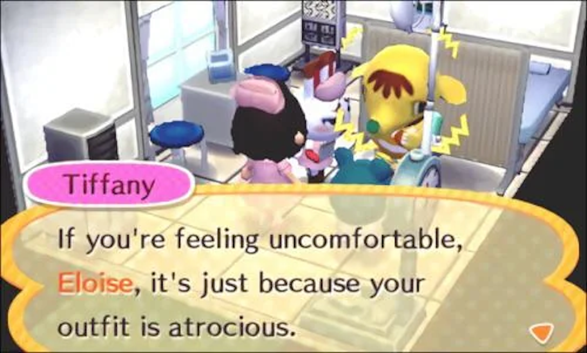
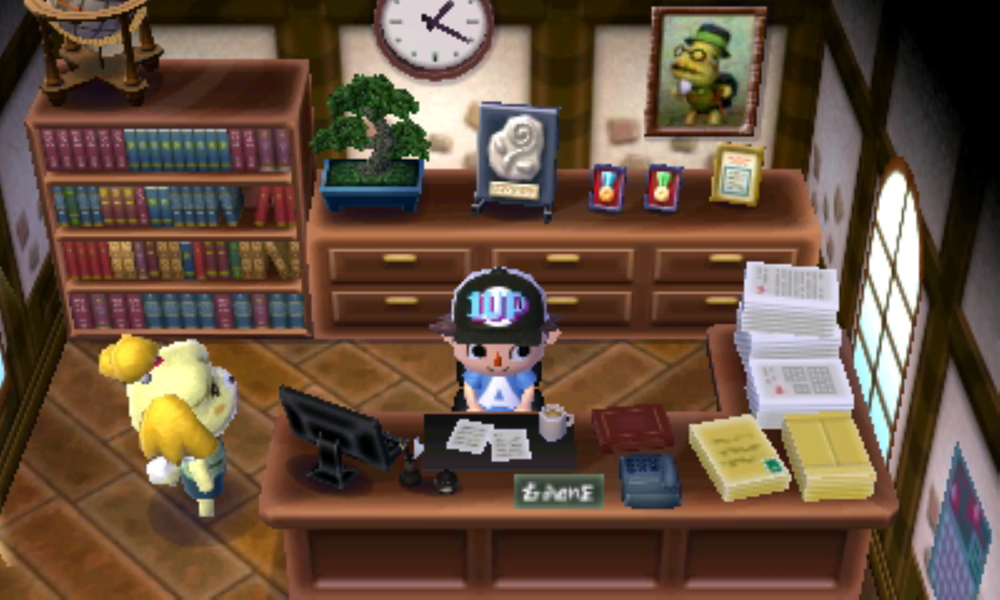
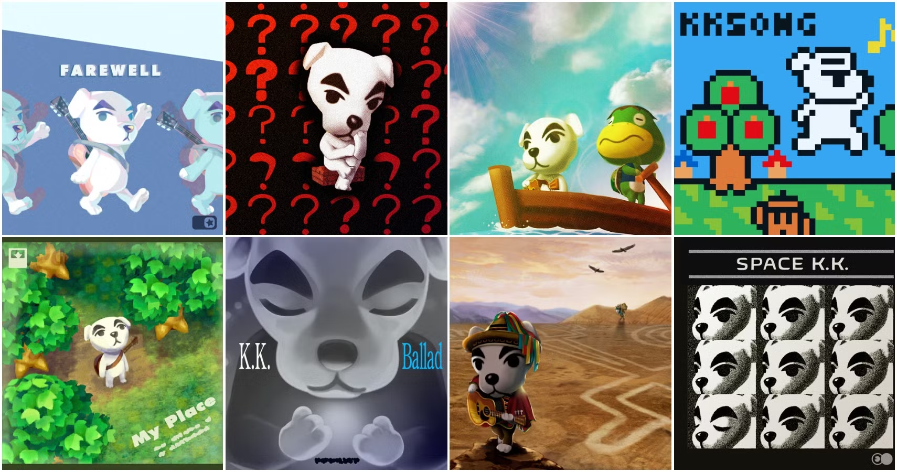
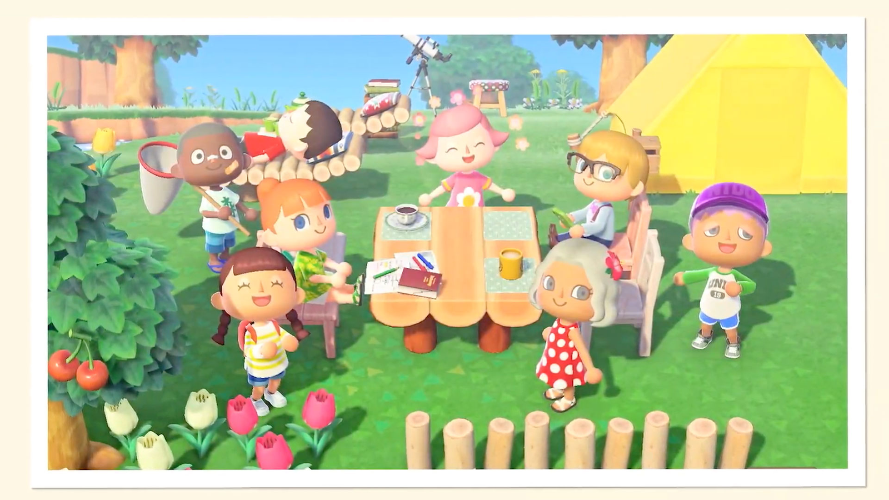
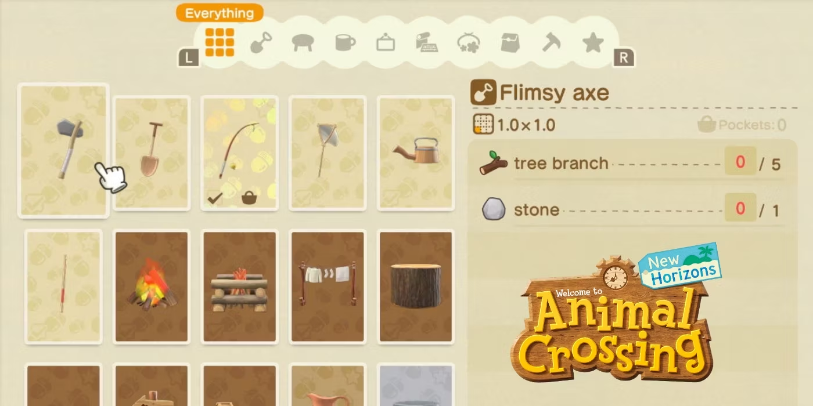
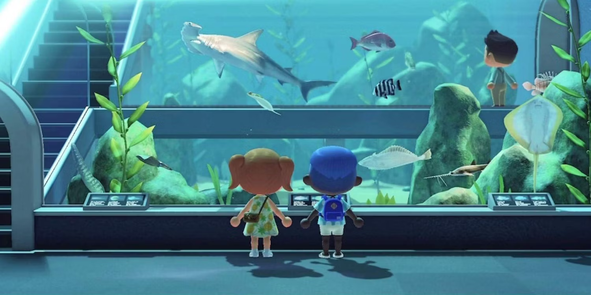
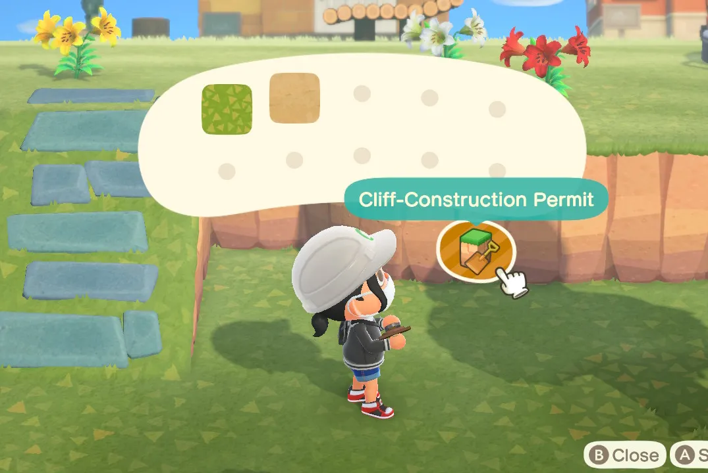
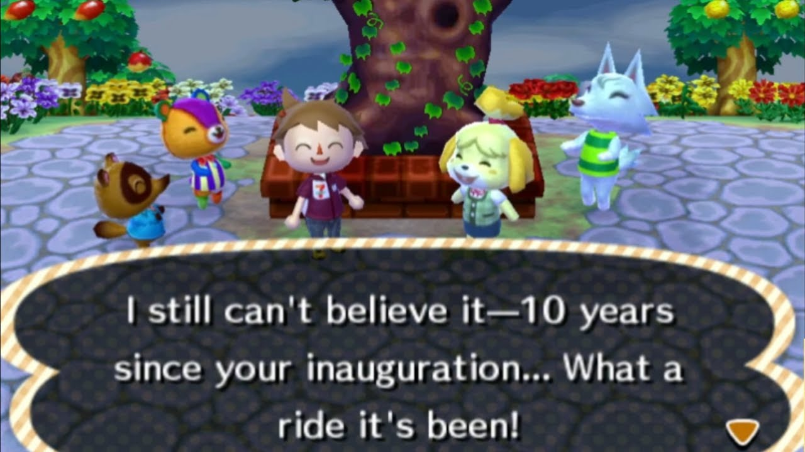

If there’s one thing my girlfriend loves to rant about, it’s how *Animal Crossing: New Horizons* pales in comparison to [New Leaf](https://en.wikipedia.org/wiki/Animal_Crossing:_New_Leaf). While many hailed [New Horizons](https://en.wikipedia.org/wiki/Animal_Crossing:_New_Horizons) as the future of the franchise, she’s convinced it lacks the soul that made [New Leaf](https://en.wikipedia.org/wiki/Animal_Crossing:_New_Leaf) such an unforgettable experience. From design changes to missing key features, here’s why she believes [New Horizons](https://en.wikipedia.org/wiki/Animal_Crossing:_New_Horizons) is more of a missed opportunity than a revolution.

## Furniture and Customization

Despite [New Horizons](https://en.wikipedia.org/wiki/Animal_Crossing:_New_Horizons) allowing players to place furniture outdoors—a feature fans had long clamored for—there’s something missing. [New Leaf](https://en.wikipedia.org/wiki/Animal_Crossing:_New_Leaf) had a wider variety of furniture sets, many of which were more cohesive and thoughtfully designed. <mark>It’s surprising, but [New Leaf](https://en.wikipedia.org/wiki/Animal_Crossing:_New_Leaf) simply had better furniture options.</mark> And to top it off, [New Leaf](https://en.wikipedia.org/wiki/Animal_Crossing:_New_Leaf) had larger rooms, offering players more freedom to decorate inside.

Yes, [New Horizons](https://en.wikipedia.org/wiki/Animal_Crossing:_New_Horizons) makes customization easier with tools like terraforming and cliff creation, but for her, it’s an empty experience compared to the authentic charm [New Leaf](https://en.wikipedia.org/wiki/Animal_Crossing:_New_Leaf) offered. <mark>It’s not just about making an island look pretty; it’s about the feeling of building something personal and alive, and [New Horizons](https://en.wikipedia.org/wiki/Animal_Crossing:_New_Horizons) misses that mark.</mark>

<mark>The "villager-trading" trend in [New Horizons](https://en.wikipedia.org/wiki/Animal_Crossing:_New_Horizons) cheapened the entire experience.</mark> Trading villagers like collectibles for the sake of getting the cutest one? That takes away from the heart of the game. Villagers are no longer part of a rich community; they’ve become trophies. This dynamic robs the game of its emotional core.

### Villager Dynamics: From Personality to Repetition

One of the most heartbreaking losses in *New Horizons* is not just how villagers talk to you but *how little you can do with them*. In *New Leaf*, villagers felt like they were part of your daily life in a deeper way—you could play mini-games like hide and seek, ask them for favors, and even have more interactive moments like inviting them to hang out at your house. Now, while villagers in *New Horizons* can sit, read, and do aerobics -- but all these interactions feel surface-level.

<mark>Gone are the dynamic activities that made the villagers feel truly alive and autonomous in *New Leaf*.</mark> Instead of engaging in unique events, villagers seem locked into the same repetitive behaviors, with little variation in their routines. This lack of deeper interaction hurts the core of what made *Animal Crossing* special—those unexpected, joyful moments with your villagers that made you feel connected to the world. Now, the interactions feel more like staged sets rather than organic parts of a daily life.

<mark>This lack of variety in conversations strips the game of its emotional depth.</mark> You no longer feel like you're connecting with distinct personalities -- that made decisions they wanted to do -- but rather managing a population of programmed pleasers. It’s not just a minor downgrade; it fundamentally alters the spirit of the game. In a series where community and interaction were supposed to be at the heart of the experience, this change feels like a hollowing out of what once made *Animal Crossing* truly magical.

## From Mayor to Taskmaster

In [New Leaf](https://en.wikipedia.org/wiki/Animal_Crossing:_New_Leaf), being the mayor wasn’t just a title—it made you feel important. You had an office, a sense of purpose, and every decision felt like it mattered. In [New Horizons](https://en.wikipedia.org/wiki/Animal_Crossing:_New_Horizons), they pretend you’re just another villager, but the reality is you’re still in control of everything. It just feels less significant. <mark>[New Horizons](https://en.wikipedia.org/wiki/Animal_Crossing:_New_Horizons) turned what was a meaningful role into a checklist of tasks.</mark> Gone is the feeling of leading your town; instead, you're managing a project.

## From Vibrant Towns to Lifeless Islands

[New Leaf](https://en.wikipedia.org/wiki/Animal_Crossing:_New_Leaf)’s shopping district was vibrant, evolving with time. Shops upgraded, interactions deepened, and the progression felt rewarding. [New Horizons](https://en.wikipedia.org/wiki/Animal_Crossing:_New_Horizons) is the opposite. You’re stuck with only three stores, and there’s no sense of growth. 

Where is the sense of community? No club, no disco—nothing feels alive. <mark>The shopping experience is static and lifeless, a far cry from the thriving town that [New Leaf](https://en.wikipedia.org/wiki/Animal_Crossing:_New_Leaf) gave us.</mark> You could even donate your items before—now, you’re left with a feeling of pointlessness. And without an upgrade system, the shops feel like an afterthought.

## The Sounds of Stagnation

While [New Horizons](https://en.wikipedia.org/wiki/Animal_Crossing:_New_Horizons) introduced some decent new KK Slider tracks, the hourly music you hear throughout the day feels uninspired. In [New Leaf](https://en.wikipedia.org/wiki/Animal_Crossing:_New_Leaf), each track added to the charm of the town. [New Horizons](https://en.wikipedia.org/wiki/Animal_Crossing:_New_Horizons) tries to create an island vibe, but it doesn’t hit the mark. Only a few tracks stand out, and the rest are forgettable. 

The game’s release also felt incomplete. Features like Kap’n and Katrina were added months after launch, and this trickle of content made the game feel unfinished, like it was always playing catch-up. <mark>It felt like they were reacting to complaints rather than delivering a full experience from the start.</mark>

## Multiplayer and Mini-Games

In [New Leaf](https://en.wikipedia.org/wiki/Animal_Crossing:_New_Leaf), multiplayer was engaging thanks to the mini-games on Tortimer Island. [New Horizons](https://en.wikipedia.org/wiki/Animal_Crossing:_New_Horizons)? Multiplayer feels pointless. There’s no real interaction, no shared experiences—just wandering around other islands with little purpose. The mini-games were a huge loss, and without them, multiplayer feels hollow.

Even though a lot more players can now play together, the experience feels less connected. The island tours were a fun way to bond with friends, and their absence is sorely felt. <mark>It’s a shame that [New Horizons](https://en.wikipedia.org/wiki/Animal_Crossing:_New_Horizons) missed the mark on what made multiplayer in [New Leaf](https://en.wikipedia.org/wiki/Animal_Crossing:_New_Leaf) so special.</mark>   

## Bright Spots Amidst the Flaws

The crafting system, while not part of the original *Animal Crossing* formula, does add a layer of engagement. And the museum? Absolutely stunning. <mark>This is one area where [New Horizons](https://en.wikipedia.org/wiki/Animal_Crossing:_New_Horizons) truly shines.</mark> The museum’s design is breathtaking, and Celeste’s addition, with star recipes and stargazing, gives her a real purpose, unlike in previous games.

## The Sandbox Problem: Freedom and No Connection

At its core, [New Horizons](https://en.wikipedia.org/wiki/Animal_Crossing:_New_Horizons) feels more like a sandbox game than an authentic *Animal Crossing* experience. It’s become a task-driven game where you have to create your own objectives. In [New Leaf](https://en.wikipedia.org/wiki/Animal_Crossing:_New_Leaf), the connection to your town was natural. You felt like you were part of something growing and alive. <mark>[New Horizons](https://en.wikipedia.org/wiki/Animal_Crossing:_New_Horizons) turns that into a project-management game where you’re the capitalist overseer.</mark>  

## What Happened to the Heart of Animal Crossing?

[New Horizons](https://en.wikipedia.org/wiki/Animal_Crossing:_New_Horizons) lost something important: its spirit. [New Leaf](https://en.wikipedia.org/wiki/Animal_Crossing:_New_Leaf) had heart—letters from your dad, the town tree growing as a symbol of your progress. Now, those small touches are gone. There’s no emotional anchor. <mark>Where [New Leaf](https://en.wikipedia.org/wiki/Animal_Crossing:_New_Leaf) felt like a living, breathing community, [New Horizons](https://en.wikipedia.org/wiki/Animal_Crossing:_New_Horizons) feels like a checklist of tasks to complete.</mark> The growing tree, the snappy conversations, the little things that mattered are missing. What we’re left with is a beautiful but soulless shell.

In the end, [New Horizons](https://en.wikipedia.org/wiki/Animal_Crossing:_New_Horizons) is great for those who love designing islands, but for fans like my girlfriend who are seeking that deeper connection with their town and villagers, it falls short. It’s a game for builders and managers, not for those who want to lose themselves in the charm and warmth of a living town. Sure, if you haven't played New Leaf, it would be difficult to compare without a reference point, new players would've been lost. And that’s why [New Leaf](https://en.wikipedia.org/wiki/Animal_Crossing:_New_Leaf) still reigns supreme in her eyes. 

<mark>- yaro</mark>