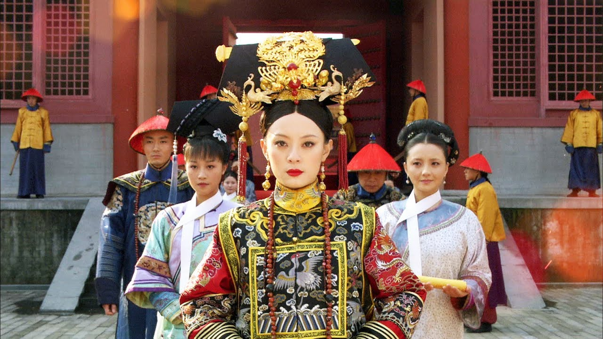

Lorsque l’on parle de dramas asiatiques, l’ampleur du sujet peut même confondre les spectateurs les plus assidus. Les services de VOD ont largement popularisé ces œuvres en Occident, et les films et séries de la péninsule coréenne ont envahi nos écrans ainsi que les hautes sphères de reconnaissance internationale. La "barrière d’un pouce des sous-titres", comme l’a si bien dit [Bong Joon-Ho](https://en.wikipedia.org/wiki/Bong_Joon-ho), a été brisée.

Le Japon, pour sa part, domine largement le monde de l’animation, grâce à des années de "[Cool Japan](https://www.cao.go.jp/cool_japan/english/pdf/published_document3.pdf)" : une initiative gouvernementale débutée dans les années 2000 visant à promouvoir la culture populaire japonaise à l’échelle mondiale, notamment dans les secteurs de l’anime, du manga et des jeux vidéo. En Asie, deux autres mastodontes du divertissement se démarquent : l’Inde, avec sa gigantesque machine bollywoodienne, et la Chine continentale, enrichie par l’apport des réalisateurs hongkongais ayant rejoint le pays après la rétrocession de la [Région Administrative Spéciale](https://fr.wikipedia.org/wiki/Région_administrative_spéciale_(Chine)) par les Britanniques, il y a un peu plus de 25 ans.

Cette Chine, immense par sa population, sa taille et son talent, adopte une approche protectionniste qui réduit l’intérêt d’exporter sa production culturelle. Son marché domestique est largement suffisant, et de nombreux réalisateurs hongkongais et taïwanais, désillusionnés par un rêve américain où ils se retrouvent cantonnés à de simples exécutants, se tournent vers l’énorme marché national. La collaboration entre les budgets continentaux et le savoir-faire hongkongais a donné naissance à des chefs-d’œuvre comme [Farewell My Concubine](https://mydramalist.com/3646-farewell-my-concubine) et [Shanghai Triad](https://mydramalist.com/9858-shanghai-triad). Le début des années 2000 promettait un âge d’or réunissant les talents chinois en un bloc homogène. Pourtant, cette promesse n’a jamais été pleinement réalisée.

Aujourd’hui, l’Empire du Milieu concentre principalement ses efforts sur ses séries télévisées, les C-Dramas, souvent plus longs et complexes que leurs équivalents coréens, avec des budgets tout aussi impressionnants. Ces séries explorent tous les genres : moderne, science-fiction, historique, mais surtout le favori de beaucoup : le harem.

Le genre du harem est souvent mal compris. Il est profondément ancré dans la culture chinoise, héritée de l’opéra. [*Empress in the Palace*](https://mydramalist.com/4474-legend-of-concubine-zhen-huan) est peut-être le C-Drama le plus populaire de son époque, et pour de bonnes raisons : il suit un schéma classique. Dans la Cité interdite, concubines et impératrices se battent bec et ongles pour dominer le harem.

Intrigues, meurtres, luttes pour le pouvoir, larmes et argent composent ce genre par excellence. Plus récemment, [*Story of Yanxi Palace*](https://mydramalist.com/28565-the-tale-of-yanxi-palace) a connu un succès retentissant avant d’être critiqué et partiellement retiré en raison des lois sur la bienséance, bien que les raisons exactes soient sujettes à débat.

Contrairement à l’idée d’une censure purement répressive, ces lois s’inscrivent dans une logique d’orientation économique et culturelle. En réglementant le contenu des productions, la Chine cherche à promouvoir des valeurs compatibles avec ses objectifs sociaux et économiques. Plutôt que d’étouffer la créativité, cette approche favorise la consolidation de grandes entreprises capables de produire des œuvres conformes aux attentes gouvernementales tout en réduisant les risques financiers. Les studios qui survivent à cette écrémage deviennent des acteurs majeurs de l’industrie, attirant des investissements internes stables et répondant à une demande domestique massive.

Un exemple marquant de cette stratégie est [*The Longest Day in Chang’an*](https://mydramalist.com/28435-the-longest-day-in-chang-an), une web-série financée par des dizaines d’investisseurs privés et distribuée par des plateformes comme Youku. Ce modèle illustre l’émergence d’un marché où la qualité et l’ampleur des productions peuvent rivaliser avec Hollywood, tout en restant ancrées dans une dynamique économique proprement chinoise.

La concentration de la Chine sur son marché domestique et sa volonté de réduire les risques tout en augmentant la confiance dans cette industrie renaissante visent à créer des empires économiques stables capables de résister aux pressions externes. Ces mastodontes, tout en étant modelés par les directives économiques et culturelles du Parti, incarnent une méthode chinoise distincte, différente de celle pratiquée en Occident. Ce modèle repose sur une vision stratégique à long terme : renforcer une industrie cinématographique autonome, orientée vers la consommation interne mais capable de rayonner mondialement lorsque cela sert ses intérêts.

Ainsi, les lois sur la bienséance, loin d’être de simples outils de censure, fonctionnent comme des instruments de politique industrielle. Elles redéfinissent les limites de la créativité tout en assurant une compétitivité économique et culturelle qui s’inscrit dans une dynamique nationale, où le cinéma devient un vecteur d’identité et de puissance.

<mark>- yaro</mark>