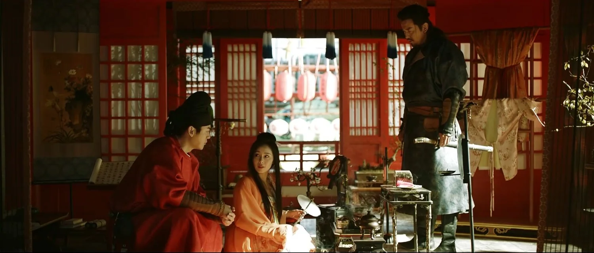

Lorsque l’on parle des drames asiatiques, l’ampleur du sujet peut même déstabiliser les spectateurs les plus dévoués. Les plateformes de vidéo à la demande (VOD) ont grandement popularisé ces œuvres en Occident, et les films et séries en provenance de la péninsule coréenne ont envahi nos écrans ainsi que les cercles de reconnaissance prestigieux. La barrière de l’un pouce des sous-titres, comme l’a justement exprimé [Bong Joon-ho](https://en.wikipedia.org/wiki/Bong_Joon-ho), a été franchie.

Le Japon, pour sa part, domine largement le monde de l’animation, grâce aux années de l’initiative [Cool Japan](https://www.cao.go.jp/cool_japan/english/pdf/published_document3.pdf) : une initiative gouvernementale lancée dans les années 2000 pour promouvoir la culture pop japonaise à l'échelle mondiale, notamment dans les domaines de l’anime, du manga et des jeux vidéo. En Asie, deux autres géants du divertissement se distinguent : l’Inde, avec sa gigantesque machine Bollywood, et la Chine continentale, enrichie par les contributions des cinéastes de Hong Kong ayant rejoint le pays après la rétrocession de la [Région administrative spéciale](https://en.wikipedia.org/wiki/Special_administrative_regions_of_China) par les Britanniques il y a un peu plus de 25 ans.

### **L'Ascension d'une Puissance Protectionniste**

La Chine, vaste par sa population, sa taille et son talent, adopte une approche protectionniste qui réduit la nécessité d’exporter sa production culturelle. Son marché intérieur est largement suffisant, et de nombreux cinéastes de Hong Kong et de Taïwan, désillusionnés par un rêve américain où ils se retrouvent relégués à de simples exécutants, se tournent vers le gigantesque marché national de la Chine. La collaboration entre les budgets continentaux et l’expertise de Hong Kong a donné naissance à des chefs-d’œuvre comme *Adieu ma concubine* et *Shanghai Triad*. Les années 2000 promettaient un âge d’or unissant les talents chinois en un bloc cohérent. Pourtant, cette promesse n’a jamais été pleinement réalisée.

Au lieu de cela, l’industrie cinématographique chinoise a subi une transformation conduite par des politiques étatiques, des incitations économiques et l’évolution des préférences du public. Le gouvernement a mis en place des quotas pour les films étrangers, garantissant que les productions locales dominent les écrans de cinéma. Simultanément, des subventions et des réductions fiscales ont encouragé les cinéastes locaux à produire des contenus de haute qualité. Ces mesures ont non seulement protégé l’industrie, mais ont également favorisé l’innovation dans les limites du contrôle réglementaire.

> "Les politiques protectionnistes de la Chine ont créé un écosystème autonome, protégeant ses industries créatives tout en favorisant une croissance sans précédent."

### **L'Âge d'Or des C-Dramas**

Aujourd’hui, la Chine concentre principalement ses énergies créatives sur les séries télévisées, connues sous le nom de C-Dramas. Ces productions dépassent souvent leurs homologues coréens en termes de durée et de complexité, avec des budgets tout aussi impressionnants. Allant des romances modernes aux récits de science-fiction et aux épopées historiques, les C-Dramas répondent à des goûts divers. Parmi ceux-ci, le drame de harem se distingue comme un favori éternel. Racine dans l’opéra traditionnel chinois, ce genre explore des thèmes d’intrigue, de trahison et de luttes de pouvoir au sein des cours impériales. *L’Impératrice du Palais* incarne parfaitement cet archétype, retraçant les machinations impitoyables des concubines en quête de suprématie dans la Cité Interdite. Plus récemment, *L’Histoire du Palais Yanxi* a captivé des millions de spectateurs avant de faire face à des critiques et à un retrait partiel en raison des lois sur la décence — un reflet de l’équilibre délicat entre la liberté artistique et le contrôle réglementaire.

Ce qui distingue les C-Dramas, c’est leur capacité à mêler authenticité historique et sensibilités modernes. Des productions comme *Le Longest Day in Chang’an* témoignent d’une attention minutieuse aux détails, recréant les anciennes villes avec une précision époustouflante tout en utilisant des effets spéciaux de pointe. Cette fusion de tradition et de technologie a élevé les drames chinois à de nouveaux sommets, attirant à la fois les audiences nationales et internationales.

<mark>Les C-Dramas ne sont pas simplement du divertissement ; ce sont des artefacts culturels qui reflètent l’identité en évolution de la Chine.</mark>

### **Les Lois sur la Décence comme Politique Industrielle**

Contrairement à l’idée d’une censure purement répressive, les lois sur la décence s’inscrivent dans une logique d’orientation économique et culturelle. En réglementant le contenu de la production, la Chine cherche à promouvoir des valeurs compatibles avec ses objectifs sociaux et économiques. Plutôt que d’étouffer la créativité, cette approche encourage la consolidation de grandes entreprises capables de produire des œuvres qui répondent aux attentes du gouvernement tout en réduisant les risques financiers. Les studios qui survivent à ce processus de sélection deviennent des acteurs majeurs de l’industrie, attirant des investissements stables à l’échelle nationale et répondant à une demande locale massive.

Cependant, ces réglementations ne sont pas sans controverse. Certains créateurs affirment que les lois sur la décence étouffent les récits audacieux, forçant les scénaristes et réalisateurs à s’auto-censurer. D’autres pointent les conséquences involontaires des mesures trop restrictives, comme le retrait abrupt de séries à succès comme *L’Histoire du Palais Yanxi*. Malgré ces défis, le système a indéniablement produit une industrie robuste et compétitive capable de rivaliser avec Hollywood en termes d’échelle et d’ambition.

> "Les lois sur la décence ne sont pas seulement des outils de contrôle, mais des instruments de stratégie industrielle, façonnant l’avenir de l’économie créative de la Chine."

### **Technologie et Innovation**

L'essor des plateformes de streaming telles que iQIYI, Tencent Video et Youku a révolutionné la manière dont les spectateurs consomment les C-Dramas. Ces plateformes exploitent les mégadonnées et l’intelligence artificielle pour analyser les préférences des spectateurs, ajustant le contenu à des démographies spécifiques. Par exemple, les algorithmes pourraient recommander des drames historiques aux spectateurs plus âgés tout en suggérant des comédies romantiques aux jeunes publics. Cette approche basée sur les données garantit des taux d'engagement plus élevés et maximise le potentiel de revenus.

De plus, les progrès des effets visuels et des techniques de production virtuelle ont permis aux studios chinois de créer des mondes visuellement époustouflants à une fraction du coût de leurs homologues occidentaux. Des séries comme *The Untamed* et *Word of Honor* montrent comment la CGI peut améliorer la narration sans l’écraser. Alors que la Chine continue d’investir dans son infrastructure technologique, son industrie du divertissement est prête à mener la charge mondiale en matière d’innovation numérique.

<mark>L’adoption par la Chine de l’IA et de la CGI reflète un engagement plus large à mêler tradition et technologie de pointe.</mark>

### **Ambitions et Défis Internationaux**

Bien que la Chine reste fermement concentrée sur son marché intérieur, des signes d’ambition croissante pour s’étendre à l’international apparaissent. Des plateformes de streaming comme iQIYI ont lancé des versions à l’étranger, visant le Sud-Est asiatique, l’Europe et l’Amérique du Nord. De même, des coproductions avec des studios étrangers — comme l’adaptation de *Le Problème à trois corps* par Netflix — signalent une volonté de collaborer à l’échelle mondiale.

Cependant, réussir à l’international présente des défis considérables. Les différences culturelles, les barrières linguistiques et les tensions géopolitiques entravent souvent les efforts de la Chine pour exporter son soft power. De plus, les perceptions du contrôle étatique sur les médias peuvent aliéner les audiences occidentales, habituées à des environnements créatifs plus libéraux. Pour surmonter ces obstacles, la Chine doit trouver un équilibre délicat entre promouvoir son identité culturelle et toucher des thèmes universels.

> "Les ambitions mondiales de la Chine sont autant une question de diplomatie culturelle que de domination économique."

### **L'Avenir du Divertissement Chinois**

En regardant vers l’avenir, l’industrie cinématographique et télévisuelle de la Chine fait face à la fois à des opportunités et à des incertitudes. D’une part, l’investissement continu dans la technologie, le développement des talents et les infrastructures produira probablement des projets encore plus ambitieux. D’autre part, l’évolution des réglementations et les comportements changeants des consommateurs pourraient perturber les modèles commerciaux établis. Une tendance potentielle est l’essor du contenu généré par les utilisateurs, soutenu par des plateformes comme Douyin (la version chinoise de TikTok). Les vidéos courtes et les formats interactifs pourraient redéfinir ce qui constitue le « divertissement » dans les années à venir.

En fin de compte, l’approche de la Chine de son industrie cinématographique et télévisuelle reflète une stratégie plus large d’autosuffisance culturelle et économique. En privilégiant la consommation intérieure, en favorisant l’innovation et en naviguant dans des complexités mondiales, le Royaume du Milieu vise à bâtir un empire du divertissement qui reflète son statut de superpuissance montante.

Ainsi, les lois sur la décence, loin d’être de simples outils de censure, fonctionnent comme des instruments de politique industrielle. Elles redéfinissent les limites de la créativité tout en garantissant la compétitivité économique et culturelle au sein d’un cadre national où le cinéma devient un véhicule d’identité et de pouvoir.

<mark>- yaro</mark>
