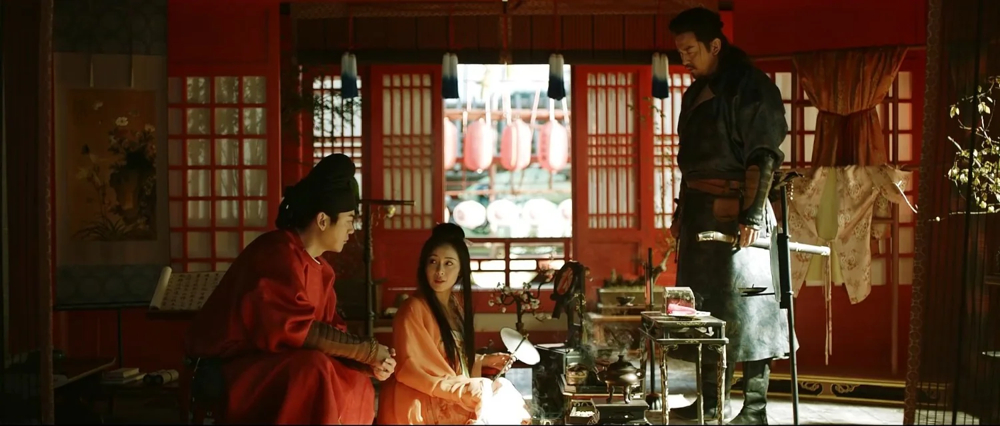
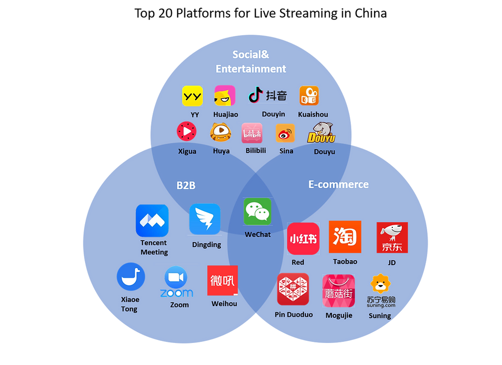

When discussing Asian dramas, the sheer scope of the subject can even confuse the most devoted viewers. Video-on-demand (VOD) platforms have significantly popularized these works in the West, and films and series from the Korean peninsula have invaded our screens as well as prestigious recognition circles. The one-inch barrier of subtitles, as [Bong Joon-ho](https://en.wikipedia.org/wiki/Bong_Joon-ho) aptly put it, has been broken.

Japan, for its part, overwhelmingly dominates the world of animation, thanks to years of [Cool Japan](https://www.cao.go.jp/cool_japan/english/pdf/published_document3.pdf): a government initiative launched in the 2000s to promote Japanese pop culture globally, particularly in anime, manga, and video games. In Asia, two other entertainment giants stand out: India, with its colossal Bollywood machine, and mainland China, enriched by the contributions of Hong Kong filmmakers who joined the country after the handover of the [Special Administrative Region](https://en.wikipedia.org/wiki/Special_administrative_regions_of_China) by the British a little over 25 years ago.

### **The Rise of a Protectionist Powerhouse**

China, vast in population, size, and talent, adopts a protectionist approach that reduces the need to export its cultural production. Its domestic market is more than sufficient, and many Hong Kong and Taiwanese filmmakers, disillusioned by an American dream where they find themselves relegated to mere executors, turn to China’s enormous national market. The collaboration between mainland budgets and Hong Kong expertise has given birth to masterpieces such as *Farewell My Concubine* and *Shanghai Triad*. The early 2000s promised a golden age uniting Chinese talents into a cohesive bloc. Yet, this promise was never fully realized.

Instead, China’s film industry underwent a transformation driven by state policies, economic incentives, and shifting audience preferences. The government introduced quotas on foreign films, ensuring that domestic productions dominated cinema screens. Simultaneously, subsidies and tax breaks encouraged local filmmakers to produce high-quality content. These measures not only protected the industry but also fostered innovation within the constraints of regulatory oversight.

> "China’s protectionist policies created a self-sustaining ecosystem, shielding its creative industries while fostering unparalleled growth."

### **The Golden Age of C-Dramas**

Today, China primarily channels its creative energies into television series, known colloquially as C-Dramas. These productions often surpass their Korean counterparts in length and complexity, boasting equally impressive budgets. Spanning genres from modern romance to science fiction and historical epics, C-Dramas cater to diverse tastes. Among these, the harem drama stands out as a perennial favorite. Rooted in traditional Chinese opera, this genre explores themes of intrigue, betrayal, and power struggles within imperial courts. *Empress in the Palace* epitomizes this archetype, chronicling the ruthless machinations of concubines vying for supremacy in the Forbidden City. More recently, *Story of Yanxi Palace* captivated millions before facing criticism and partial withdrawal due to decency laws—a reflection of the delicate balance between artistic freedom and regulatory oversight.

What sets C-Dramas apart is their ability to blend historical authenticity with modern sensibilities. Productions like *The Longest Day in Chang’an* showcase meticulous attention to detail, recreating ancient cities with stunning accuracy while employing cutting-edge special effects. This fusion of tradition and technology has elevated Chinese dramas to new heights, attracting both domestic and international audiences.

<mark>C-Dramas are not just entertainment; they are cultural artifacts that reflect China’s evolving identity.</mark>

### **Decency Laws as Industrial Policy**

Contrary to the notion of purely repressive censorship, decency laws align with a logic of economic and cultural orientation. By regulating production content, China seeks to promote values compatible with its social and economic objectives. Rather than stifling creativity, this approach encourages the consolidation of large companies capable of producing works that meet government expectations while reducing financial risks. Studios that survive this selection process become major industry players, attracting stable domestic investments and catering to massive local demand.

However, these regulations are not without controversy. Some creators argue that decency laws stifle bold storytelling, forcing writers and directors to self-censor. Others point to the unintended consequences of overly restrictive measures, such as the abrupt removal of successful shows like *Story of Yanxi Palace*. Despite these challenges, the system has undeniably produced a robust and competitive industry capable of rivaling Hollywood in scale and ambition.

> "Decency laws are not just tools of control but instruments of industrial strategy, shaping the future of China’s creative economy."

### **Technology and Innovation**

The rise of streaming platforms like iQIYI, Tencent Video, and Youku has revolutionized how audiences consume C-Dramas. These platforms leverage big data and artificial intelligence to analyze viewer preferences, tailoring content to specific demographics. For example, algorithms might recommend historical dramas to older viewers while suggesting romantic comedies to younger audiences. This data-driven approach ensures higher engagement rates and maximizes revenue potential.

Moreover, advancements in visual effects and virtual production techniques have enabled Chinese studios to create visually stunning worlds at a fraction of the cost of their Western counterparts. Shows like *The Untamed* and *Word of Honor* demonstrate how CGI can enhance storytelling without overwhelming it. As China continues to invest in technological infrastructure, its entertainment industry is poised to lead the global charge in digital innovation.

<mark>China’s embrace of AI and CGI reflects a broader commitment to blending tradition with cutting-edge technology.</mark>

### **Global Ambitions and Challenges**

While China’s focus remains firmly on its domestic market, there are signs of growing ambition to expand internationally. Streaming platforms like iQIYI have launched overseas versions, targeting Southeast Asia, Europe, and North America. Similarly, co-productions with foreign studios—such as Netflix’s adaptation of *The Three-Body Problem*—signal a willingness to collaborate on a global scale.

However, achieving international success presents significant challenges. Cultural differences, language barriers, and geopolitical tensions often hinder China’s efforts to export its soft power. Additionally, perceptions of state control over media can alienate Western audiences accustomed to more liberal creative environments. To overcome these obstacles, China must strike a delicate balance between promoting its cultural identity and appealing to universal themes.

> "China’s global ambitions are as much about cultural diplomacy as they are about economic dominance."

### **The Future of Chinese Entertainment**

Looking ahead, China’s film and TV industry faces both opportunities and uncertainties. On one hand, continued investment in technology, talent development, and infrastructure will likely yield even more ambitious projects. On the other hand, evolving regulations and shifting consumer behaviors could disrupt established business models. One potential trend is the rise of user-generated content, fueled by platforms like Douyin (the Chinese version of TikTok). Short-form videos and interactive storytelling formats may redefine what constitutes “entertainment” in the coming years.

Ultimately, China’s approach to its film and TV industry reflects a broader strategy of cultural and economic self-reliance. By prioritizing domestic consumption, fostering innovation, and navigating global complexities, the Middle Kingdom aims to build an entertainment empire that mirrors its status as a rising superpower.

Thus, decency laws, far from being mere tools of censorship, function as instruments of industrial policy. They redefine the boundaries of creativity while ensuring economic and cultural competitiveness within a national framework where cinema becomes a vehicle for identity and power.

<mark>- yaro</mark>