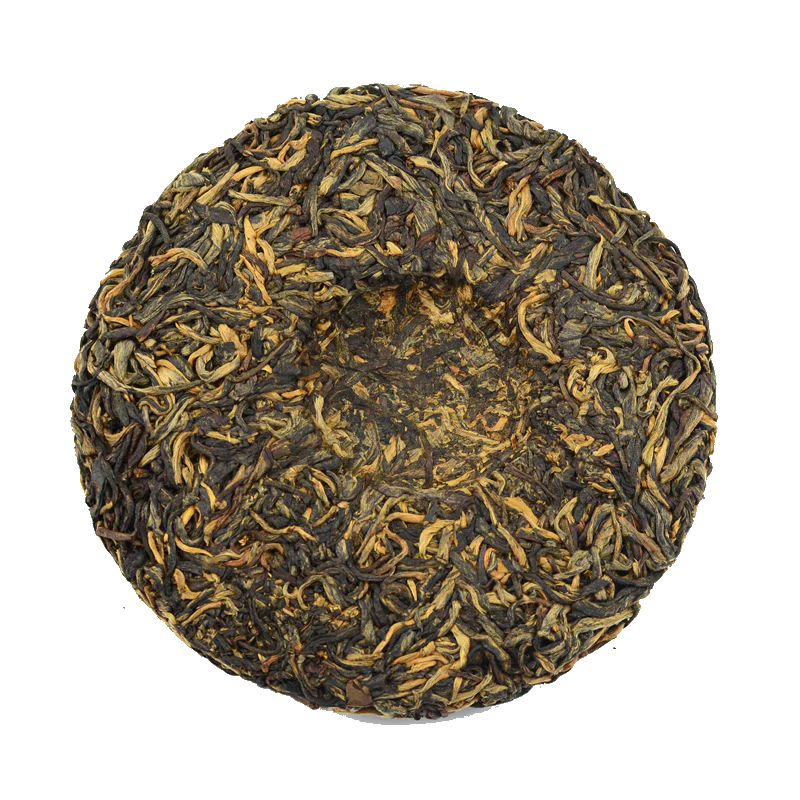

Today, I’m reviewing the 2021 Sunskate by white2tea. I got this tea in a mini form from w2t with the [2018 Hot Brandy](https://white2tea.com/products/2018-hot-brandy) I got [this month](https://skoomaden.me/posts/teas-that-arrived-in-june/). 

.png>)

Preparation:

- **Temperature:** 200°F / 93°C initially, then up to 212°F / 100°C
- **Time:** 20s rinse, followed by increasing steep times
- **Tea Amount:** 7 g
- **Water Volume:** 4 oz / 120 mL

## Tasting Notes

**Rinse (20s):** The rinse was quite tight, which is expected given the tea's compression.

**1st Steep (20s):** The first steep yielded a very faint flavor, likely due to the tight compression even after a 20-second rinse at 95°C. The flavors were barely detectable.

**2nd Steep (20s):** Despite opening up slightly, the tea remained incredibly light, making it hard to distinguish any clear notes. There was a mild sweetness, with a detectable sweet toasted brioche aroma.

**3rd Steep (50s at 100°C):** Even with a significantly longer and hotter steep, the tea failed to deliver any substantial flavors. It felt akin to drinking hot water rather than experiencing the lightness typical of white tea. The steep was disappointingly bland, more akin to oversteeped black tea.

**4th Steep (1 min 20s at 95°C):** The fourth steep was purely a formality. The tea continued to present a washed-out profile, resembling an oversteeped black tea. This was particularly disappointing given my high expectations for a white2tea black tea.

## Thoughts

The 2021 Sunskate by white2tea was underwhelming and fell short of my expectations. Despite various adjustments in steeping times and temperatures, the tea failed to develop any significant flavor profile. The experience was frustrating, as each infusion seemed to promise potential that it never delivered. The tea's tight compression may have contributed to its inability to fully express its character, but even accounting for this, the results were disappointing.

#### My recommendation: This tea does not meet the standards of other white2tea offerings and may not be worth the effort and time required to coax out its flavors.

## Rating:

- **Flavor Complexity:** 0/30 - Virtually no discernible flavors despite multiple attempts.
- **Brewing Forgiveness:** 20/20 - Surprisingly, the tea did not become bitter, even with aggressive steeping.
- **Consistency Across Infusions:** 20/20 - The tea was consistently weak and underwhelming.
- **Overall Enjoyment:** 8/30 - A disappointing experience with little enjoyment.

# 48/100

*- yaro*
