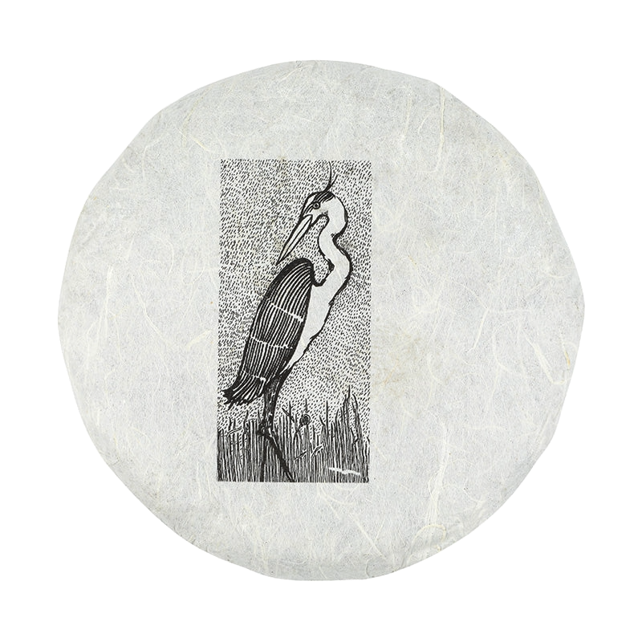

I recently tried the 2024 Great Blue Heron by white2tea. Here's my detailed review of the experience:

Preparation:

- **Temperature:** 194°F / 90°C
- **Time:** 2-3s, 5s, 10s
- **Tea Amount:** 7 g
- **Water Volume:** 6 oz / 180 mL

## Nota Bene

I brewed this tea using my new Yixing  "小西施" (Small Xishi) teapot.

### First Infusion (2-3s)

Smoked goodness, very pronounced smoked taste already.

### Second Infusion (5s)

Anise, biltong, algae, and most importantly, charcoal. No astringency whatsoever, incredibly balanced tea.

### Third Infusion (10s)

New astringency, but it’s not predominant yet. What an incredible personality this tea has, it’s very complex, and it constantly evolves. I don’t see the point in going any further, this is great.

## Overall Impression 

### Flavor Complexity: 30/30
This tea is consistently great, with a diverse profile that dares to go rather far. This young sheng puer impresses by its ability to be as interesting as its older brothers.

### Brewing Forgiveness: 15/20
I have not tested the brewing forgiveness thoroughly, as per my small sample size, however I am going to assume this is a high quality tea that can be pretty forgiving. I’d still stay around 90-95°C.

### Quality Across Infusions: 20/20
The flavors evolve constantly but maintain a coherent profile, perfect mix of evolution and stability.

### Overall Enjoyment: 25/30
Incredibly enjoyable tea, with lots of personality and complexity. I cannot recommend it further, I truly was impressed by it and will certainly be buying a cake, it tastes even better than the 2024 Spring Old Arbor Raw Puer by white2tea I tried recently.

### My recommendation: Ooooh get this one, perhaps one one of the only teas I will get in a cake form soon! 

## Rating: 90/100

### Flavors: Algae, Anise, Charcoal, Smoked, Tobacco

*- yaro*
