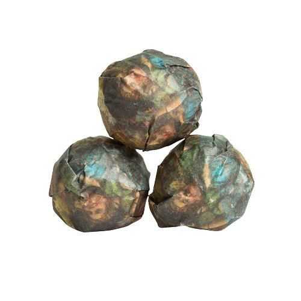
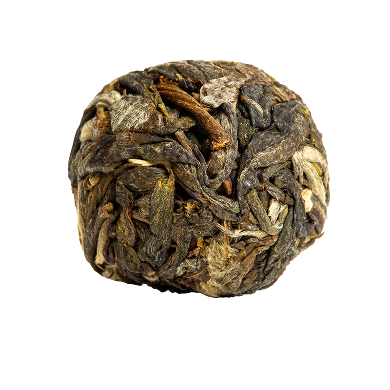

I got this mini as part of a giant purchase of samples from white2tea’s newly released teas! [Teas arriving in July](https://skoomaden.me/posts/teas-arriving-in-july/).

I actually got two of this mini by mistake lol, nice to note I also got a free 2024 nightlife mini! (yay)

## Preparation

- **Temperature:** 205°F / 96°C
- **Time:** 15s, 20s, 10s
- **Tea Amount:** 7 g
- **Water Volume:** 3 oz / 100 mL

## Overview

This tea, unfortunately, did not meet my expectations. It started bland and vegetal, and gradually evolved into a bitter, boring experience.

### Steepings

#### 1st Steep (205°F / 96°C, 15s)

Very bland vegetal green tea for now, nothing noteworthy, no bitterness for now.

#### 2nd Steep (205°F / 96°C, 20s)

Boring, bitter green tea that I know is going to inevitably evolve into a bitter mess of vegetal astringency. I can’t feel the “blend” part for sure. Not great.

#### 3rd Steep (189°F / 87°C, 10s)

I don’t see where this is going at all. I’m sure a bigger fan of green teas could probably explain to me what’s going on, but to me, this is just not pleasant. While I admit it’s far from the worst green blend I’ve ever had, this is simply not good. Bitter, boring, vegetal, the same traits we find in bad Japanese greens. I didn’t like this one.

## Overall Impression

The 2024 Philtre Minis by white2tea was a disappointing experience overall. It lacked complexity and was consistently boring across infusions.

## Rating:

- **Flavor Complexity:** 10/30 – No complexity I could find at least.
- **Brewing Forgiveness:** 12/20 – Probably okay forgiveness overall.
- **Quality Across Infusions:** 10/20 – It’s just boring throughout, and it got worse with time.
- **Overall Enjoyment:** 12/30 – Boring (zzz).

# 44/100

*- yaro*
