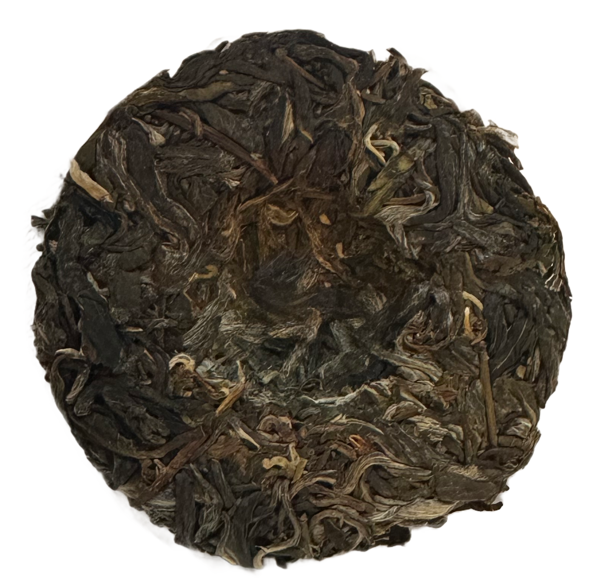

This 2024 Spring Old Arbor Raw Puer recently arrived in my mail for the May Tea Club (w2t) ! 
Here’s my review of this young puer:



Preparation:

- **Temperature:** 212°F / 100°C initially, adjusting to 194-203°F / 90-95°C in later infusions
- **Time:** 2-3s, 5s, 10s, 15s
- **Tea Amount:** 5 g 
- **Water Volume:** 4 oz / 120 mL 

## Letter from white2tea, May Tea Club 2024

```
white2tea

Welcome to the May tea club. We're still grinding away in the tea mountains of Menghai, but we hurried along this lovely little spring tea cake just for you. Picked, processed, pressed and sent along the way before May 1st, quite a feat if we do say so ourselves.

By the time this tea arrives at your door, it'll likely only be about one month or so old. Why so late this year? Drought continues to be an issue in another undeniably hot and dry spring. Climate change is being felt clearly in the mountains of Yunnan. A stark contrast from weather I experienced nearly 20 years ago in Yunnan, or even a decade ago in Menghai. The temperatures continue to rise and the rainy season seems to be shifting as well, both in timing and volume of rain. Just the anecdotal worries of this here tea fellow, but it's been a few years since weather seemed "normal".

Alright, enough of the climate dread; this is a lovely tea. If you'd like spoilers, continue reading. Otherwise, you may want to break into your cake and form a few untainted opinions before knowing any backstory.

2024 Spring Old Arbor Raw Puer - 50g - This year's Yunnan raw Puer teas were somewhat of a mixed bag of good and bad. This dry weather for the some areas meant that their growth size was small and stunted, the resulting leaf uneven and some sites light (if you notice this very fun recurring theme!) and some locations had precious little gushu [old arbor]. This particular cake is sticky sweet, with a heavy sugar and sweet as a recurring [sic returning sweetness]. The aromas will be a little muted because it was recently pressed, but given six months or so the fragrances will also tighten up into bright florals and honey to be enjoyed for months to come. We recommend trying a little now and saving the rest as a Christmas gift to yourself, but who really wants to wait until Christmas for presents?

Brewing Instructions- Boiling water, even for very fresh raw Puer, is our preference. Use gongfu style brewing if you can; we have new articles on how to brew gongfu and Puer tea on our blog, check those out for extended advice and explanations more thorough than we can provide in a mere one page letter. If you'd like a softer experience that limits bitterness and astringency drop the temp to 85C - 95C, this will lessen the harsher notes of the tea.

One last quick note; we are ambitiously planning to update our tea club payments to be through Shopify in the coming months. This will mean that you can receive automatic tracking and edit your address directly through your white2tea.com account. However, as we are currently swamped with spring tea, there's no clear set release date - but keep an eye out in the future, we will make an official announcement when its possible!

We couldn't do it without you and you've got our most sincere thanks for being in the club. We've got a lot of exciting clubs planned for the coming months, so stick around and share your experiences with us online #white2tea
```


## Tasting Notes

**1st Infusion (2-3s):**  
Oh so light and incredibly sweet, this is a really nice young puer. Slight vegetal notes that are very pleasant, very light. This might be the tea to reconcile me with young puers! Pleasant earthiness, although I sense some bitterness coming.

**2nd Infusion (5s, 90°C):**  
Some astringency on the front that will cause me to probably let my water cool down to 90°C. For now, however, it is still an excellent young puer. I'm getting tobacco and smoked meat.

**3rd Infusion (10s, 90°C):**  
The astringency doesn't evolve as badly as I thought. We're getting more of that delicious smoked meat and tobacco.

**4th Infusion (15s, 95°C):**  
Going to 95°C with this one. A bit more woody. Overall the same flavors, and I expect this to be a generous tea, giving us probably about 11-12 very good steeps.

## Thoughts

2024 Spring Old Arbor Raw Puer by white2tea offers a delightful and complex flavor profile. The initial lightness and sweetness evolve into more robust notes of tobacco and smoked meat, with a consistent performance across multiple infusions. Adjusting the temperature helps manage astringency and brings out different nuances in flavor.

#### My recommendation: This young puer is worth trying, especially for those exploring the diverse profiles of raw puer teas. Adjust the brewing temperature to find your preferred balance of sweetness and astringency.

## Rating:

- **Flavor Complexity:** 25/30 - Great complexity, a very full tea with a lot to offer!
- **Brewing Forgiveness:** 13/20 - Definitely forgiving, though I wouldn't expect it to hold well to anything other than gong fu style and near-boiling temperatures.
- **Consistency Across Infusions:** 20/20 - This is a very consistent tea!
- **Overall Enjoyment:** 22/30 - A very enjoyable young puer. I didn't think I would enjoy it as much as I did. I definitely recommend it. Got 50g in the 2024 w2t tea club!

# 80/100

<mark>- yaro</mark>
