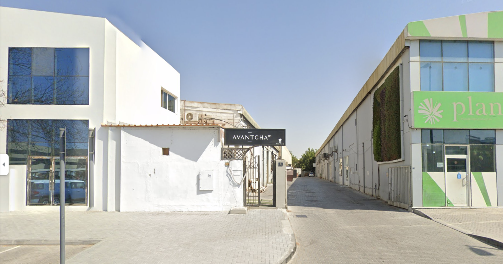

Nichée entre le dynamique **Mall of the Emirates** et **Alserkal Avenue**, la maison de thé [Avantcha](https://avantcha.com/) passe facilement inaperçue. Son entrée modeste ne donne guère d’indication sur l’expérience qui vous attend à l’intérieur — un oasis calme et méticuleusement conçu pour ceux qui cherchent un répit au milieu de la surcharge sensorielle des espaces commerciaux de Dubaï. Si les premières impressions reposent souvent sur des visuels tapageurs ou des promesses exagérées, [Avantcha](https://avantcha.com/) n’en fait rien. Ce qu’elle offre, cependant, c’est une invitation discrète à ceux qui sont sensibles aux subtilités, à ceux qui valorisent l’artisanat plutôt que les artifices. Mais ce lieu mérite-t-il vraiment la vénération qu’il semble accumuler en silence ?

## Le Langage du Minimalisme

L’espace de [Avantcha](https://avantcha.com/) semble délibérément choisi. La palette de couleurs noir et blanc évoque immédiatement la simplicité et la clarté, ce qui, en tant que développeur et designer moi-même, me séduit particulièrement. L'utilisation réfléchie de l'espace — pas de désordre, pas de bruit — offre un répit face aux boutiques de thé trop décorées que l'on trouve couramment à Dubaï. **Eldos**, notre guide tout au long de cette expérience, nous a offert une expérience informelle mais informée, nous guidant à travers les sélections sans aucune prétention ni précipitation.

Il semble que [Avantcha](https://avantcha.com/) reflète certaines de mes propres idéaux esthétiques. Ses lignes épurées et l’absence de désordre offrent clarté et concentration, à l'image de ma propre philosophie du design. Cependant, pour une maison de thé qui semble construite autour de l'idée de refuge et de pleine conscience, il y a un risque que cela devienne trop calme. Le lieu oscille entre un espace de réflexion et une ambiance quelque peu clinique. Pourtant, pour quelqu'un qui préfère le design intentionnel et le minimalisme, [Avantcha](https://avantcha.com/) est un contraste rafraîchissant avec les environnements plus bruyants et commerciaux.

## Brève Histoire de [Avantcha](https://avantcha.com/)

[Avantcha](https://avantcha.com/) a été fondée en 2014 par Markus Zbinden et Marina Rabei, une sommelière certifiée en thé. Basée à Dubaï, [Avantcha](https://avantcha.com/) propose une gamme premium de thés entiers, d'infusions et d'accessoires de thé de luxe. Le nom combine le mot français "avant" (qui signifie en avant) avec le mot chinois "cha" (thé), reflétant la mission de la marque de moderniser l'expérience traditionnelle du thé.

[Avantcha](https://avantcha.com/) source des thés de haute qualité provenant de diverses régions du monde, qu'elle mélange dans ses installations à Dubaï. La marque met l'accent sur la durabilité, utilisant des ingrédients biologiques et des emballages biodégradables. Au fil des ans, [Avantcha](https://avantcha.com/) s'est développée à l'international, avec des bureaux à Londres, en Suisse et à Bangkok. Elle fournit des hôtels de luxe comme le Four Seasons et des marques telles que Cartier et Gucci. Leur collection de thés comprend plus de 100 types de thés en vrac, et ils sont réputés pour leurs ensembles de thé magnifiquement conçus qui améliorent l'expérience de dégustation.

## Une Étude en Contraste

Chaque thé — [Milk Oolong](https://avantcha.com/product/milk-oolong/), [Bai Mu Dan](https://avantcha.com/product/organic-white-peony-bai-mu-dan/), [Tie Guan Yin](https://avantcha.com/product/tie-guan-yin/), et l'intrigant [Caramel Salé](https://avantcha.com/product/velvet-salted-caramel/) — a été introduit avec précision. La présentation formelle complétait magnifiquement l'expérience, mettant en valeur une esthétique minimaliste que j'ai trouvée rafraîchissante et captivante.

La dégustation, réalisée à l'aide de théières transparentes et élégantes et servie sur des ardoises noires minimalistes, créait une atmosphère d'élégance que j'ai véritablement appréciée. Cette présentation réfléchie ajoutait à l'expérience globale, renforçant l'identité d'Avantcha comme un espace qui privilégie la clarté et l'intention plutôt que les sensations fortes. C’est cette approche disciplinée et soigneusement étudiée qui distingue [Avantcha](https://avantcha.com/) des autres espaces de thé, et je l'ai trouvée à la fois inspirante et satisfaisante.

## Design Minimaliste, Saveurs Maximalistes ?

Pour un lieu qui met l'accent sur le design sobre, les thés chez [Avantcha](https://avantcha.com/) révèlent des couches de complexité. Chacun semble porter sa propre histoire, bien que je me sois souvent retrouvé à vouloir en apprendre davantage au-delà du simple goût.

• **[Milk Oolong](https://avantcha.com/product/milk-oolong/)**, par exemple, arrive dans une teinte jaune vibrante, offrant un parfum crémeux qui laisse entrevoir une richesse. La saveur, ronde et bien définie, est l'un des meilleurs exemples d'oolong que j'ai rencontrés dans cette région — sa crème est pure, sans l'amertume typique du thé vert que l'on retrouve souvent dans les [Milk Oolong](https://avantcha.com/product/milk-oolong/) mal préparés en raison d'une mauvaise eau ou d'une mauvaise température/temps d'infusion.

• **[Date & Sandalwood](https://avantcha.com/product/dates-sandalwood-tin/)** offrait l'opposé — un mélange sauvage, presque erratique de saveurs qui ne devraient pas se marier, mais qui, étrangement, fonctionnent. La douceur des dattes juxtapose avec le boisé du santal, laissant une impression durable. C'est l'offre la plus unique et l'un de mes thés préférés que j'ai découvert là-bas. Cela raconte vraiment une histoire, un profil de ce qui aurait pu être un thé arabe traditionnel dans un univers parallèle. J'ai absolument adoré celui-ci.

• **[Bai Mu Dan](https://avantcha.com/product/organic-white-peony-bai-mu-dan/)** présente un arôme végétal surprenant, distinct du profil typique de ce thé. L'odeur rappelle les épinards frais, suggérant un thé jeune. L'équilibre est parfait, avec juste assez de douceur pour le rendre agréable sans amertume ; les notes de noisette émergent magnifiquement.

• **[Tie Guan Yin](https://avantcha.com/product/tie-guan-yin/)**, présenté sous forme d'une infusion vert foncé, offrait une expérience plus traditionnelle, s'appuyant sur la terre et l'umami que l'on attend d'un oolong bien infusé. Il y avait un sens indéniable de l'artisanat ici.

• **[Caramel Salé](https://avantcha.com/product/velvet-salted-caramel/)** est le thé qui s'est distingué comme étant à la fois le plus expérimental et le plus satisfaisant. L'arôme audacieux qui m'a frappé avant même la première gorgée était inattendu — réglisse, chocolat menthe, et une touche de douceur velours rouge se mêlant pour créer quelque chose de bien plus grand que la somme de ses parties. Contrairement au [Milk Oolong](https://avantcha.com/product/milk-oolong/), qui semblait trop bien maîtrisé, ce thé était résolument indulgent. Son arrière-goût de [Caramel Salé](https://avantcha.com/product/velvet-salted-caramel/) perdurait, offrant une profondeur que d'autres thés aromatisés n'ont souvent pas.

 

Est-ce significatif que mon thé le plus mémorable ici ait été le moins traditionnel ? Dans un lieu construit sur une base de pureté et de forme, mon palais s'est tourné vers quelque chose de résolument moderne et, honnêtement, presque scientifique.

J'ai visité plus d'une maison de thé, de **[TWG](https://twgtea.com/)** à **[Tania's Teahouse](https://www.taniasteahouse.com/)**, et le service de thé minimaliste, à l'européenne, d'[Avantcha](https://avantcha.com/) se distingue nettement. **[TWG](https://twgtea.com/)**, malgré toute sa grandeur et sa présentation raffinée, manque souvent de subtilité dans le goût, de cette "complétude" qu'[Avantcha](https://avantcha.com/) peut revendiquer. Mais encore une fois, [TWG](https://twgtea.com/) ne prétend jamais être subtil ; c'est autant un spectacle qu'une expérience de thé. En ce sens, [Avantcha](https://avantcha.com/) semble plus ancrée, plus engagée dans son art.

[Avantcha](https://avantcha.com/) se distingue par son focus à 75% sur les thés chinois, ce qui lui donne un avantage distinct, mettant l'accent sur des sources et une préparation de qualité.

## Prix et Valeur : L'Art de la Vaisselle à Thé, Mais à Quel Prix

[Avantcha](https://avantcha.com/) est tarifée comme une expérience haut de gamme, et pour la plupart, cela se justifie — en particulier dans la qualité des thés eux-mêmes. À 24 $ pour une collection de sachets et avec du thé préparé sur place à partir de 5 $, cette maison de thé offre une valeur incroyable. Le design minimaliste, la présentation soignée, et l'espace lui-même contribuent au prix.

Et puis, il y a la vaisselle à thé. Élégamment conçue, sans aucun doute, mais peut-être un peu trop ambitieuse en termes de prix. Bien que la vaisselle s'intègre parfaitement à l'espace et ajoute à l'atmosphère globale, le coût semble un peu élevé — surtout pour ceux qui cherchent quelque chose de pratique à ramener chez eux.

Je semble déjà avoir la réponse : c'est définitivement pour moi. Aussi impartial que je souhaite être dans cette critique, je ne peux m'empêcher d'admettre que j'ai trouvé que cette boutique résonne trop avec mon esthétique et mes objectifs en matière de thé pour ne pas dire à haute voix qu'[Avantcha](https://avantcha.com/) est sans aucun doute le meilleur créateur de thé de la région.

## Impressions Personnelles

Visiter [Avantcha](https://avantcha.com/) avec ma copine m'a permis de voir comment quelqu'un de moins immergé dans le monde du thé pourrait percevoir l'espace. Alors que j'étais attiré par les lignes épurées et les détails précis, elle a trouvé que l'expérience manquait de chaleur.

[Avantcha](https://avantcha.com/) est une maison de thé qui excelle dans la précision, le minimalisme, et l'art du thé. Pour ceux qui apprécient la pureté de la forme et de la fonction, et qui veulent que leur expérience du thé soit aussi raffinée que leur environnement, c'est un incontournable.

## Conclusion

[Avantcha](https://avantcha.com/) établit une norme élevée et nécessaire pour le thé à Dubaï. Que vous soyez puriste ou que vous prospériez dans des espaces calmes et des expériences raffinées, [Avantcha](https://avantcha.com/) sera certainement un changement rafraîchissant face aux thés plus classiques, parfois trop chers et insipides, qui nous viennent de l'étranger.

<mark>- yaro</mark>
