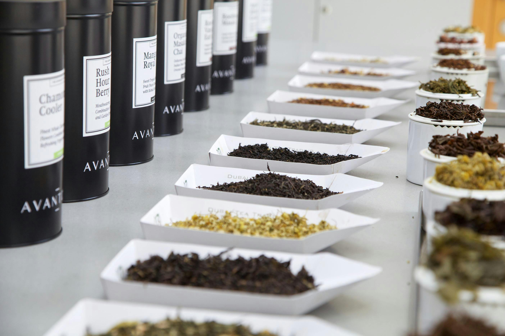
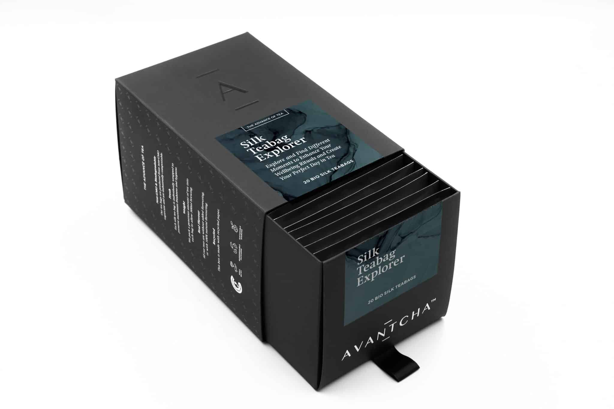
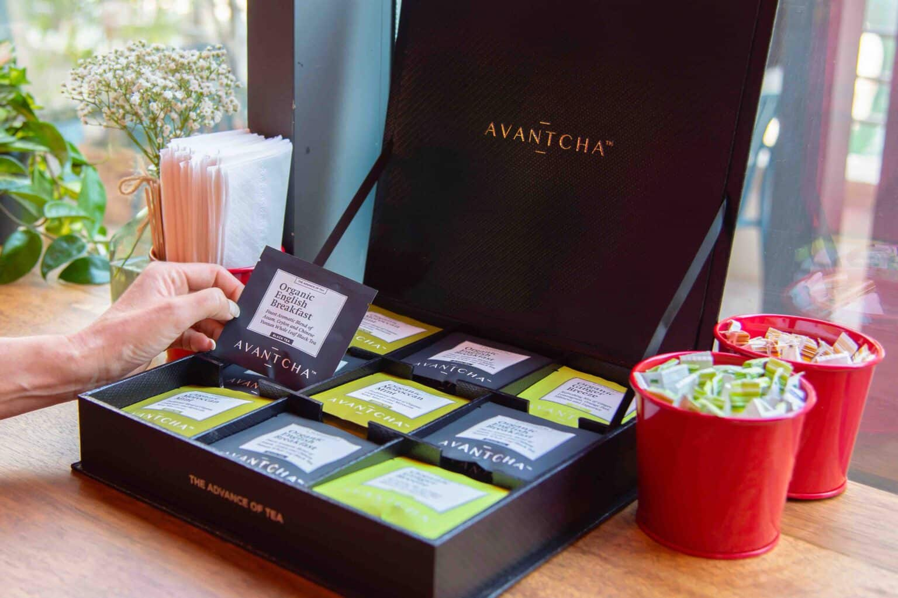

Tucked between the bustling **Mall of the Emirates** and **Alserkal Avenue**, [Avantcha](https://avantcha.com/)’s teahouse is easily overlooked. Its modest entrance gives little indication of the experience that lies within—a calm, meticulously designed oasis for those seeking respite from the sensory overload of Dubai’s commercial spaces. If first impressions rely on flashy visuals or exaggerated promises, [Avantcha](https://avantcha.com/) does neither. What it does, however, is offer a quiet invitation to those attuned to the subtle, those who value craft over gimmick. But does this place truly warrant the reverence it seems to be quietly accumulating?

## Speaking in Minimalism

[Avantcha](https://avantcha.com/)’s space feels deliberately curated. The black-and-white color palette immediately evokes simplicity and clarity, which, as an developer and designer myself, I find strikingly appealing. The careful use of space—no clutter, no noise—offers a respite from the over-designed tea shops typically found around Dubai. **Eldos**, our guide through this journey, offered us an informal yet informed experience, navigating us through the selections without any pretense or rush.

There’s a sense that [Avantcha](https://avantcha.com/) mirrors some of my own aesthetic ideals. Its clean lines and lack of clutter offer clarity and focus, much like my own design philosophy. However, for a teahouse that seems built around the idea of refuge and mindfulness, there is a risk of it feeling too quiet. It walks a fine line between being a space for reflection and one that feels somewhat clinical. Yet for someone who prefers intentional design and minimalism, [Avantcha](https://avantcha.com/) is a refreshing contrast to louder, more commercial environments.

## A Brief History of [Avantcha](https://avantcha.com/)

[Avantcha](https://avantcha.com/) was founded in 2014 by Markus Zbinden and Marina Rabei, a certified Tea Sommelier. Based in Dubai, [Avantcha](https://avantcha.com/) offers a premium range of whole-leaf teas, herbal infusions, and luxury teaware. The name combines the French word "avant" (meaning ahead or forward) with the Chinese word "cha" (tea), reflecting the brand's mission to modernize the traditional tea experience. 

[Avantcha](https://avantcha.com/) sources high-quality teas from various regions around the world, blending them in its Dubai facility. The brand emphasizes sustainability, using organic ingredients and biodegradable packaging. Over the years, [Avantcha](https://avantcha.com/) has expanded globally, with offices in London, Switzerland, and Bangkok. It caters to luxury hotels like the Four Seasons and brands such as Cartier and Gucci. Their tea collection includes over 100 types of loose-leaf teas, and they are known for beautifully crafted tea sets that enhance the tea-drinking experience.

## A Study in Contrast

Each tea—[Milk Oolong](https://avantcha.com/product/milk-oolong/), [Bai Mu Dan](https://avantcha.com/product/organic-white-peony-bai-mu-dan/), [Tie Guan Yin](https://avantcha.com/product/tie-guan-yin/), and the intriguing [Salted Caramel](https://avantcha.com/product/velvet-salted-caramel/)—was introduced with precision. The formal setup beautifully complemented the experience, showcasing a minimalist aesthetic that I found refreshing and engaging.

The tasting, conducted through sleek, clear teapots and served on minimalist black slate, created an atmosphere of elegance that I genuinely appreciated. This thoughtful presentation added to the overall experience, reinforcing Avantcha's identity as a space that prioritizes clarity and intention over emotional highs. It’s this curated, disciplined approach that sets [Avantcha](https://avantcha.com/) apart from other tea spaces, and I found it both inspiring and satisfying. 

## Minimalist Design, Maximalist Flavors?

For a place that emphasizes understated design, the teas at [Avantcha](https://avantcha.com/) reveal layers of complexity. Each one seems to carry its own story, though I often found myself wanting more engagement with those stories beyond taste alone.
   

• **[Milk Oolong](https://[Avantcha](https://avantcha.com/).com/product/milk-oolong/)**, for instance, arrives in a vibrant yellow hue, offering a creamy fragrance that hints at richness. The flavor, round and well-defined, is one of the best examples of oolong I’ve encountered in this region -- its creaminess is pure, it completely lacks the typical green tea-like bitterness [Milk Oolongs](https://[Avantcha](https://avantcha.com/).com/product/milk-oolong/) often fall into due to low quality water or wrong temperatures/timings. 

• **[Date & Sandalwood](https://[Avantcha](https://avantcha.com/).com/product/dates-sandalwood-tin/)** offered the opposite—a wild, almost erratic mix of flavors that should clash but somehow don’t. The sweetness of dates juxtaposed with the woodiness of sandalwood leaves an impression. This is the most unique offering and one of my favorite teas I've experienced then -- it truly presents a story, a profile of what could've been a traditional arabic tea in an alternate universe. I absolutely adored this one.

• **[Bai Mu Dan](https://[Avantcha](https://avantcha.com/).com/product/organic-white-peony-bai-mu-dan/)** presents a surprising vegetal aroma, distinct from the typical profile of this tea. The scent is reminiscent of fresh spinach, suggesting a youthful tea. The balance is perfect, with just enough sweetness to make it enjoyable without bitterness; hazelnut notes emerging beautifully.

• **[Tie Guan Yin](https://[Avantcha](https://avantcha.com/).com/product/tie-guan-yin/)**, presented as a deep green infusion, was a more traditional experience, leaning into the earthiness and umami you’d expect from a well-brewed oolong. There was an undeniable sense of craftsmanship here.

• **[Salted Caramel](https://[Avantcha](https://avantcha.com/).com/product/velvet-salted-caramel/)** is the tea that stood out as both the most experimental and the most satisfying. The bold aroma that hit me even before the first sip was unexpected—licorice, chocolate mint, and a punch of red velvet sweetness blending into something far more than the sum of its parts. Unlike the [Milk Oolong](https://[Avantcha](https://avantcha.com/).com/product/milk-oolong/), which felt too well-mannered, this tea was unapologetically indulgent. Its aftertaste of [Salted Caramel](https://[Avantcha](https://avantcha.com/).com/product/velvet-salted-caramel/) lingered, offering a depth that other flavored teas I’ve encountered often lack.
 
Yet, does it say something that my most memorable tea here was the least traditional? In a place built on a foundation of purity and form, my palate gravitated towards something decidedly modern and, frankly, almost scientific.

I’ve been to more than a few teahouses, from **[TWG](https://twgtea.com/)** to **[Tania's Teahouse](https://www.taniasteahouse.com/)**, and [Avantcha](https://avantcha.com/)’s minimalist, European-style tea service stands in stark contrast to them. **[TWG](https://twgtea.com/)**, for all its grandeur and polished presentation, often lacks the subtlety in taste, the "wholeness" that [Avantcha](https://avantcha.com/) can claim. But then again, [TWG](https://twgtea.com/) never pretends to be about subtlety; it’s a spectacle as much as it is a tea experience. In that sense, [Avantcha](https://avantcha.com/) feels more grounded, more committed to its craft.

[Avantcha](https://avantcha.com/)’s 75% focus on Chinese teas gives it a distinct edge, emphasizing quality sourcing and preparation. And yet, it’s impossible not to notice the stark difference in emotional engagement between [Avantcha](https://avantcha.com/) and other teahouses like **[Tania's](https://www.taniasteahouse.com/)**, which, while lighter and more whimsical, offer an experience that feels less restrictive -- if less qualitative in a stricter sense.

## Pricing and Value: The Art of Teaware, But at a Price

[Avantcha](https://avantcha.com/) is priced like a high-end experience, and for the most part, it justifies that—especially in the quality of the teas themselves. At $24 for an entire teabag collection and in-house, very well prepared tea starting at $5, this teahouse is of incredible value. The minimalist design, the thoughtful presentation, and the space itself contribute to the price point.

And then, there’s the teaware. Elegantly designed, no doubt, but perhaps a touch too ambitious in terms of price. While the teaware fits beautifully into the space and adds to the overall atmosphere, the cost seemed a bit out there—especially for those looking for something practical to take home. It’s a lovely addition for those who value quality equipement, but knowing that tea-lovers usually enjoy intricate handmade designs I have to ask: who is this shop's target audience.

I seem to already have the answer, certainly me. As unbiased as I wish to be during this review, I cannot fail to admit I have found this shop to hit a string within my heart. This all resembles my own aesthetics and goals in tea too much not to say out loud that [Avantcha](https://avantcha.com/) is the region's finest tea maker without a doubt.

## Personal Impressions

Visiting [Avantcha](https://avantcha.com/) with my girlfriend gave me the added perspective of seeing how someone less entrenched in tea might view the space. While I found myself drawn to the sleek lines and precise details, she felt that the experience was lacking in warmth. The space succeeds in being a visually appealing, expertly curated tea space.

[Avantcha](https://avantcha.com/) is a teahouse that excels in precision, minimalism, and tea craftsmanship. For those who value the purity of form and function—who want their tea experience to be as refined as their surroundings—this is a must-visit. However, for those seeking a more emotional or whimsical connection to tea may find themselves more at home at **[Tania's](https://www.taniasteahouse.com/)** or paying an overpriced tea at **[TWG](https://twgtea.com/)**.

## Conclusion
[Avantcha](https://avantcha.com/) sets a much needed high standard for tea in Dubai. Whether you’re a purist or someone who thrives on quiet spaces and refined experiences, [Avantcha](https://avantcha.com/) will certainly be a refreshing change from the more classical somewhat overpriced and flavorless teas that come to us from overseas. Value-wise, [Avantcha](https://avantcha.com/) is a no-brainer, and if you're currently in the city, it is a stop you simply cannot miss.

